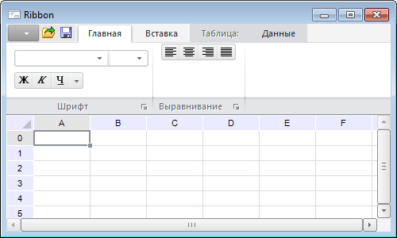

# Ribbon: Компонент

Ribbon: Компонент
-

# Ribbon

## Иерархия наследования

           [IComponent](ModForms.chm::/Interface/IComponent/IComponent.htm)

           [IControl](ModForms.chm::/Interface/IControl/IControl.htm)

           [IRibbon](ModForms.chm::/Interface/IRibbon/IRibbon.htm)

           [Ribbon](ModForms.chm::/Class/Ribbon/Ribbon.htm)

## Описание

Компонент Ribbon предназначен
 для создания ленты приложения.

## Работа с компонентом

Лента приложения является современным интерфейсным решением, в котором
 объединены главное меню и панели инструментов приложения. Лента состоит
 из отдельных вкладок, панели
 быстрого доступа, кнопки приложения
 и общих элементов управления ленты.

На вкладках располагаются панели, которые содержат различные
 элементы управления, сгруппированные по функциональной зависимости. Вкладки
 бывают двух видов: обычные и контекстные. Обычные
 вкладки отображаются в приложении постоянно. Контекстные
 вкладки отображаются при выполнении определенных условий, например, когда
 выделен какой-либо объект.

На панели быстрого доступа могут
 быть продублированы часто используемые команды приложения. Кнопка
 приложения используется для вызова главного меню. Общие
 элементы управления располагаются с правой стороны на уровне заголовков
 вкладок ленты и могут использоваться для выполнения второстепенных действий,
 например, для вызова справки.

## Настройка компонента

После добавления компонента на форму будет выдан запрос на выбор объекта
 «[Ресурсы](UiNav.chm::/Multilanguage/Resources.htm)»,
 в котором будут храниться изображения ленты. Данный объект также можно
 указать в свойстве [Resources](ModForms.chm::/Interface/IRibbon/IRibbon.Resources.htm)
 в инспекторе объектов. В верхней части формы будет выделена специальная
 область, в которой в дальнейшем будет отображена лента. Для настройки
 ленты выполните для компонента команду контекстного меню «Редактировать».
 При этом будет открыт [редактор ленты](Ribbon_Designer.htm).
 В редакторе создайте необходимые вкладки, на вкладках создайте панели
 и наполните их элементами управления. При изменении различных параметров
 в редакторе лента будет динамически изменяться на форме.

При необходимости структуру ленты можно хранить в XML-формате. Для сохранения
 и загрузки используйте соответствующие команды контекстного меню компонента
 Ribbon.

## Обработка событий элементов управления

При использовании какого-либо элемента управления для него генерируется
 событие [OnChange](ModForms.chm::/Interface/IBaseRibbonElement/IBaseRibbonElement.OnChange.htm).
 При этом также будет сгенерировано событие [OnChange](ModForms.chm::/Class/Ribbon/Ribbon.OnChange.htm)
 для самого компонента Ribbon. В событии компонента, используя свойство
 аргумента [Element](ModForms.chm::/Interface/IRibbonChangeEventArgs/IRibbonChangeEventArgs.Element.htm),
 можно получить соответствующий элемент управления. Все элементы имеют
 уникальный идентификатор. Организовав в обработчике события проверку данного
 идентификатора, можно связать конкретные элементы управления с выполнением
 заданного кода приложения.

## Особенности использования

При самостоятельном формировании файла и последующей его загрузке с
 помощью метода LoadFromXML не
 следует использовать системные идентификаторы элементов (например, ID_APP_EXIT). Такие идентификаторы
 будут заменены на автоматически сгенерированные.

## Пример

## Свойства компонента Ribbon

		 Имя свойства
		 Краткое описание

		 
		 [ActiveCategory](ModForms.chm::/Interface/IRibbon/IRibbon.ActiveCategory.htm)
		 Свойство ActiveCategory
		 определяет активную вкладку ленты.

		 
		 [Align](ModForms.chm::/Interface/IControl/IControl.Align.htm)
		 Свойство Align определяет,
		 как поведет себя компонент при изменении размеров содержащего
		 его родительского компонента.

		 
		 [AllowDrag](ModForms.chm::/Interface/IControl/IControl.AllowDrag.htm)
		 Свойство AllowDrag
		 определяет возможность взять у компонента перетаскиваемый
		 объект.

		 
		 [AllowDrop](ModForms.chm::/Interface/IControl/IControl.AllowDrop.htm)
		 Свойство AllowDrop
		 определяет, будет ли возможность у компонента принять перетаскиваемый
		 объект.

		 
		 [Anchors](ModForms.chm::/Interface/IControl/IControl.Anchors.htm)
		 Свойство Anchors возвращает
		 настройки, определяющие в процентном соотношении изменение размеров
		 текущего компонента при изменении размеров родительского компонента.

		 
		 [Brush](ModForms.chm::/Interface/IControl/IControl.Brush.htm)
		 Свойство Brush определяет
		 кисть, используемую для заливки области компонента.

		 
		 [Categories](ModForms.chm::/Interface/IRibbon/IRibbon.Categories.htm)
		 Свойство Categories
		 возвращает коллекцию вкладок, доступных на ленте.

		 
		 [ClientHeight](modforms.chm::/Interface/IControl/IControl.ClientHeight.htm)
		 Свойство ClientHeight
		 используется для получения или задания высоты клиентской области
		 компонента.

		 
		 [ClientWidth](ModForms.chm::/Interface/IControl/IControl.ClientWidth.htm)
		 Свойство ClientWidth
		 используется для получения или задания ширины клиентской области
		 компонента.

		 
		 [Color](ModForms.chm::/Interface/IControl/IControl.Color.htm)
		 Свойство Color определяет
		 цвет фона компонента.

		 
		 [ComponentCount](ModForms.chm::/Interface/IComponent/IComponent.ComponentCount.htm)
		 Свойство ComponentCount
		 возвращает количество дочерних компонентов.

		 
		 [Components](ModForms.chm::/Interface/IComponent/IComponent.Components.htm)
		 Свойство Components
		 возвращает дочерний компонент.

		 
		 [Contexts](ModForms.chm::/Interface/IRibbon/IRibbon.Contexts.htm)
		 Свойство Contexts возвращает
		 коллекцию контекстных вкладок.

		 
		 [Cursor](ModForms.chm::/Interface/IControl/IControl.Cursor.htm)
		 Свойство Cursor определяет
		 вид курсора над компонентом.

		 
		 [Data](ModForms.chm::/Interface/IComponent/IComponent.Data.htm)
		 Свойство Data предназначено
		 для хранения любых пользовательских данных.

		 
		 [Elements](ModForms.chm::/Interface/IRibbon/IRibbon.Elements.htm)
		 Свойство Elements возвращает
		 коллекцию элементов управления, расположенных на всех вкладках
		 ленты.

		 
		 [Enabled](ModForms.chm::/Interface/IControl/IControl.Enabled.htm)
		 Свойство Enabled определяет
		 доступность компонента для пользователя.

		 
		 [Focused](ModForms.chm::/Interface/IControl/IControl.Focused.htm)
		 Свойство Focused возвращает
		 True, если фокус установлен
		 на данном компоненте.

		 
		 [Font](ModForms.chm::/Interface/IControl/IControl.Font.htm)
		 Свойство Font определяет
		 множество характеристик, описывающих шрифт, используемый при отображении
		 текста.

		 
		 [Height](ModForms.chm::/Interface/IControl/IControl.Height.htm)
		 Свойство Height определяет
		 высоту компонента.

		 
		 [HelpContext](ModForms.chm::/Interface/IControl/IControl.HelpContext.htm)
		 Свойство HelpContext
		 определяет уникальный индекс раздела контекстно-зависимой справки
		 для данного компонента.

		 
		 [Hidden](ModForms.chm::/Interface/IRibbon/IRibbon.Hidden.htm)
		 Свойство Hidden определяет
		 признак скрытости ленты.

		 
		 [Hint](ModForms.chm::/Interface/IControl/IControl.Hint.htm)
		 Свойство Hint определяет
		 текст подсказки для компонента.

		 
		 [Images](ModForms.chm::/Interface/IRibbon/IRibbon.Images.htm)
		 Свойство Images определяет
		 компонент, содержащий изображения, которые будут использоваться
		 на ленте.

		 
		 [Left](ModForms.chm::/Interface/IControl/IControl.Left.htm)
		 Свойство Left определяет
		 координату левого края компонента.

		 
		 [MainButton](ModForms.chm::/Interface/IRibbon/IRibbon.MainButton.htm)
		 Свойство MainButton
		 возвращает параметры кнопки приложения.

		 
		 [MainCategory](ModForms.chm::/Interface/IRibbon/IRibbon.MainCategory.htm)
		 Свойство MainCategory
		 возвращает параметры главного меню ленты.

		 
		 [Name](ModForms.chm::/Interface/IComponent/IComponent.Name.htm)
		 Свойство Name определяет
		 наименование компонента.

		 
		 [Parent](ModForms.chm::/Interface/IControl/IControl.Parent.htm)
		 Свойство Parent определяет
		 родительский компонент.

		 
		 [ParentColor](ModForms.chm::/Interface/IControl/IControl.ParentColor.htm)
		 Свойство ParentColor
		 определяет, будет ли для компонента заимствован цвет родительского
		 компонента.

		 
		 [ParentFont](ModForms.chm::/Interface/IControl/IControl.ParentFont.htm)
		 Свойство ParentFont
		 определяет, будет ли для компонента использоваться шрифт родительского
		 компонента.

		 
		 [ParentShowHint](ModForms.chm::/Interface/IControl/IControl.ParentShowHint.htm)
		 Свойство ParentShowHint
		 определяет условие отображения всплывающей подсказки.

		 
		 [PopupMenu](ModForms.chm::/Interface/IControl/IControl.PopupMenu.htm)
		 Свойство PopupMenu
		 определяет контекстное меню, которое будет появляться по щелчку
		 дополнительной кнопки мыши на компоненте.

		 
		 [QuickAccessToolbar](ModForms.chm::/Interface/IRibbon/IRibbon.QuickAccessToolbar.htm)
		 Свойство QuickAccessToolbar
		 возвращает параметры панели быстрого доступа.

		 
		 [Resources](ModForms.chm::/Interface/IRibbon/IRibbon.Resources.htm)
		 Свойство Resources
		 определяет объект репозитория - Ресурсы, изображения которого
		 будут использоваться в элементах управления ленты.

		 
		 [Scrolls](ModForms.chm::/Interface/IControl/IControl.Scrolls.htm)
		 Свойство Scrolls возвращает
		 параметры полос прокрутки компонента.

		 
		 [ShowHint](ModForms.chm::/Interface/IControl/IControl.ShowHint.htm)
		 Свойство ShowHint включает
		 и выключает показ всплывающего окна подсказки для компонента.

		 
		 [TabElements](ModForms.chm::/Interface/IRibbon/IRibbon.TabElements.htm)
		 Свойство TabElements
		 возвращает коллекцию общих элементов управления ленты.

		 
		 [TabOrder](ModForms.chm::/Interface/IControl/IControl.TabOrder.htm)
		 Свойство TabOrder определяет
		 позицию компонента в последовательности табуляции.

		 
		 [TabStop](ModForms.chm::/Interface/IControl/IControl.TabStop.htm)
		 Свойство TabStop определяет
		 признак необходимости компоненту получать фокус при нажатии кнопки
		 «Tab».

		 
		 [Tag](ModForms.chm::/Interface/IComponent/IComponent.Tag.htm)
		 Свойство Tag не используется
		 компилятором. Пользователь может изменить значение свойства Tag и использовать его по своему
		 усмотрению.

		 
		 [Text](ModForms.chm::/Interface/IControl/IControl.Text.htm)
		 Свойство Text определяет
		 строку, идентифицирующую компонент для пользователя.

		 
		 [Top](ModForms.chm::/Interface/IControl/IControl.Top.htm)
		 Свойство Top определяет
		 координату верхнего края компонента.

		 
		 [Visible](ModForms.chm::/Interface/IControl/IControl.Visible.htm)
		 Свойство Visible определяет
		 видимость компонента во время выполнения.

		 
		 [Width](ModForms.chm::/Interface/IControl/IControl.Width.htm)
		 Свойство Width определяет
		 ширину компонента.

## Методы компонента Ribbon

		 Имя метода
		 Краткое описание

		 
		 [BringToFront](ModForms.chm::/Interface/IControl/IControl.BringToFront.htm)
		 Метод BringToFront
		 располагает компонент на передний план.

		 
		 [ClientToScreen](ModForms.chm::/Interface/IControl/IControl.ClientToScreen.htm)
		 Метод ClientToScreen
		 преобразовывает координаты точки, указанные относительно системы
		 координат компонента, в экранные координаты.

		 
		 [DoDragDrop](ModForms.chm::/Interface/IControl/IControl.DoDragDrop.htm)
		 Метод DoDragDrop позволяет
		 начать операцию перетаскивания.

		 
		 [FindById](ModForms.chm::/Interface/IRibbon/IRibbon.FindById.htm)
		 Метод FindById осуществляет
		 поиск элемента управления по числовому идентификатору.

		 
		 [GetImage](ModForms.chm::/Interface/IControl/IControl.GetImage.htm)
		 Метод GetImage возвращает
		 изображение компонента со всеми дочерними компонентами.

		 
		 [LoadFromXML](ModForms.chm::/Interface/IRibbon/IRibbon.LoadFromXML.htm)
		 Метод LoadFromXML осуществляет
		 загрузку и создает визуальную ленту.

		 
		 [SaveToXML](ModForms.chm::/Interface/IRibbon/IRibbon.SaveToXML.htm)
		 Метод SaveToXML сохраняет
		 структуру ленты в XML-формате и возвращает полученную XML-строку.

		 
		 [ScreenToClient](ModForms.chm::/Interface/IControl/IControl.ScreenToClient.htm)
		 Метод ScreenToClient
		 преобразовывает экранные координаты точки в координаты, указываемые
		 относительно системы координат компонента.

		 
		 [SendToBack](ModForms.chm::/Interface/IControl/IControl.SendToBack.htm)
		 Метод SendToBack располагает
		 компонент на задний план.

		 
		 [SetFocus](ModForms.chm::/Interface/IControl/IControl.SetFocus.htm)
		 Метод SetFocus устанавливает
		 фокус на данный компонент.

## События компонента Ribbon

		 Имя события
		 Краткое описание

		 
		 [OnBeginDrag](ModForms.chm::/Interface/IControl/IControl.OnBeginDrag.htm)
		 Событие OnBeginDrag
		 для компонента наступает, когда пользователь начинает перетаскивать
		 объект от компонента.

		 
		 [OnChange](ModForms.chm::/Class/Ribbon/Ribbon.OnChange.htm)
		 Событие OnChange наступает
		 при использовании каких-либо элементов управления ленты.

		 
		 [OnClick](ModForms.chm::/Interface/IControl/IControl.OnClick.htm)
		 Событие OnClick наступает,
		 если пользователь щёлкнул в области компонента.

		 
		 [OnDblClick](ModForms.chm::/Interface/IControl/IControl.OnDblClick.htm)
		 Событие OnDblClick
		 наступает, если пользователь дважды щёлкнул в области компонента.

		 
		 [OnDragDrop](ModForms.chm::/Interface/IControl/IControl.OnDragDrop.htm)
		 Событие OnDragDrop
		 для компонента наступает, когда пользователь отпускает над ним
		 перетаскиваемый объект.

		 
		 [OnDragEnter](ModForms.chm::/Interface/IControl/IControl.OnDragEnter.htm)
		 Событие OnDragEnter
		 наступает, когда перетаскиваемый объект входит в границы данного
		 компонента.

		 
		 [OnDragLeave](ModForms.chm::/Interface/IControl/IControl.OnDragLeave.htm)
		 Событие OnDragLeave
		 наступает, когда перетаскиваемый объект выходит за границы данного
		 компонента.

		 
		 [OnDragOver](ModForms.chm::/Interface/IControl/IControl.OnDragOver.htm)
		 Событие OnDragOver
		 для компонента наступает, когда пользователь протаскивает над
		 ним перетаскиваемый объект.

		 
		 [OnEnter](ModForms.chm::/Interface/IControl/IControl.OnEnter.htm)
		 Событие OnEnter наступает
		 в момент получения фокуса компонентом.

		 
		 [OnExit](ModForms.chm::/Interface/IControl/IControl.OnExit.htm)
		 Событие OnExit наступает
		 в момент потери фокуса компонентом.

		 
		 [OnHScroll](ModForms.chm::/Interface/IControl/IControl.OnHScroll.htm)
		 Событие OnHScroll наступает
		 при изменении положения ползунка горизонтальной полосы прокрутки.

		 
		 [OnKeyDown](ModForms.chm::/Interface/IControl/IControl.OnKeyDown.htm)
		 Событие OnKeyDown наступает,
		 если компонент находится в фокусе и производится нажатие на клавиатуру.

		 
		 [OnKeyPress](ModForms.chm::/Interface/IControl/IControl.OnKeyPress.htm)
		 Событие OnKeyPress
		 наступает, если компонент находится в фокусе, при нажатии пользователем
		 символьной клавиши.

		 
		 [OnKeyUp](ModForms.chm::/Interface/IControl/IControl.OnKeyUp.htm)
		 Событие OnKeyUp наступает,
		 если компонент находится в фокусе, при отпускании пользователем
		 любой, ранее нажатой клавиши.

		 
		 [OnMouseDown](ModForms.chm::/Interface/IControl/IControl.OnMouseDown.htm)
		 Событие OnMouseDown
		 наступает, если указатель находится в области компонента и была
		 нажата любая кнопка мыши.

		 
		 [OnMouseEnter](ModForms.chm::/Interface/IControl/IControl.OnMouseEnter.htm)
		 Событие OnMouseEnter
		 наступает в момент входа курсора мыши в область компонента.

		 
		 [OnMouseHover](ModForms.chm::/Interface/IControl/IControl.OnMouseHover.htm)
		 Событие OnMouseHover
		 наступает при задержке курсора мыши в области компонента.

		 
		 [OnMouseLeave](ModForms.chm::/Interface/IControl/IControl.OnMouseLeave.htm)
		 Событие OnMouseLeave
		 наступает в момент выхода курсора мыши за пределы области компонента.

		 
		 [OnMouseMove](ModForms.chm::/Interface/IControl/IControl.OnMouseMove.htm)
		 Событие OnMouseMove
		 наступает при перемещении курсора мыши над компонентом.

		 
		 [OnMouseUp](ModForms.chm::/Interface/IControl/IControl.OnMouseUp.htm)
		 Событие OnMouseUp наступает
		 при отпускании кнопки мыши, когда указатель находится в области
		 компонента.

		 
		 [OnMouseWheel](ModForms.chm::/Interface/IControl/IControl.OnMouseWheel.htm)
		 Событие OnMouseWheel
		 наступает, если компонент находится в фокусе при вращении колеса
		 мыши.

		 
		 [OnUpdate](ModForms.chm::/Class/Ribbon/Ribbon.OnUpdate.htm)
		 Событие OnUpdate наступает
		 при обновлении ленты.

		 
		 [OnVScroll](ModForms.chm::/Interface/IControl/IControl.OnVScroll.htm)
		 Событие OnVScroll наступает
		 при изменении положения ползунка вертикальной полосы прокрутки.

См. также:

[Дополнительные компоненты](Additional_components.htm)

		Справочная
		 система на версию 10.9
		 от 18/08/2025,
		 © ООО «ФОРСАЙТ»,
