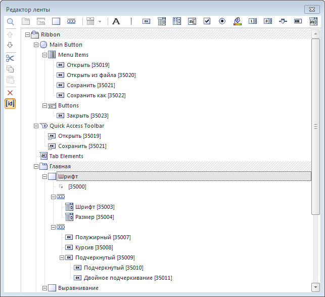
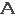
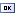
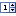
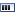

# Редактор ленты

Редактор ленты
-

# Редактор ленты

После выполнения для компонента [Ribbon](Ribbon.htm) команды
 контекстного меню «Редактировать»
 будет открыт редактор ленты:

В редакторе структура ленты отображается в виде дерева. По умолчанию
 в дереве отображен ряд элементов, представляющих собой ключевые области
 ленты:

	- Ribbon. Верхний уровень ленты, на котором создаются вкладки
	 и контекстные вкладки.

	- Main Button. Элемент для настройки кнопки приложения.

	-

		- Menu Items. Элемент, используемый для настройки команд главного
		 меню.

		- Buttons. Элемент, используемый для настройки дополнительных
		 кнопок главного меню.

	- Quick Access
	 Toolbar. Элемент для настройки панели
	 быстрого доступа.

	- Tab Elements. Элемент для настройки общих элементов управления.

[Общие
 принципы работы в редакторе](javascript:TextPopup(this))

	Для построения ленты в редакторе используются кнопки меню или команды
	 контекстного меню. Меню редактора состоит из двух частей. В верхней
	 части расположены кнопки для создания элементов управления. В левой
	 части - кнопки для редактирования существующей структуры ленты. Доступность
	 кнопок меняется автоматически, в зависимости от того, какой элемент
	 ленты выделен в текущий момент. Кнопка  позволяет
	 скрыть/отобразить уникальный идентификатор, который генерируется для
	 каждого элемента управления. Данный идентификатор может быть использован
	 при настройке обработчика события [OnChange](ModForms.chm::/Class/Ribbon/Ribbon.OnChange.htm)
	 компонента Ribbon. Кнопка 
	 управляет отображением строки поиска. Поиск производится по
	 тексту элементов управления. Для поиска укажите текст и нажмите клавишу
	 ENTER либо кнопку «Найти». Найденный элемент будет выделен в дереве
	 ленты, его свойства будут отображены в [инспекторе
	 объектов](../../01_Development_Environment/03_Windows_of_Development_Environment/Object_Inspector.htm).

	Кнопки  и 
	 позволяют перемещать элемент управления в рамках его родительского
	 элемента. Также созданные элементы в дереве можно перемещать с использованием
	 технологии Drag&Drop. В зависимости от перетаскиваемого элемента
	 автоматически определяются доступные места, куда он может быть перемещен.
	 Если при перемещении удерживать клавишу CTRL, то элемент управления
	 будет скопирован.

	Настройка всех параметров элементов управления производится в [инспекторе
	 объектов](../../01_Development_Environment/03_Windows_of_Development_Environment/Object_Inspector.htm).

[Создание вкладок
 и контекстных вкладок](javascript:TextPopup(this))

	Контекстные вкладки создаются
	 на верхнем уровне ленты. Обычные
	 вкладки создаются на верхнем уровне ленты, либо в рамках контекстных
	 вкладок.

	Для создания контекстной вкладки необходимо:

		- Выделить элемент Ribbon
		 либо одну из ранее созданных вкладок или контекстных вкладок.

		- Нажать кнопку  (Выполнить
		 команду контекстного меню «Добавить Context Category»).

	Контекстная вкладка будет создана на верхнем уровне ленты.

	Для создания вкладки необходимо:

		- Выделить элемент Ribbon
		 либо одну из ранее созданных вкладок или контекстных вкладок.

		- Нажать кнопку  (Выполнить команду контекстного
		 меню «Добавить Category»).

	Если была выделена контекстная вкладка, то новая вкладка будет создана
	 в рамках нее. Если была выделена обычная вкладка, либо элемент Ribbon, то новая вкладка будет создана
	 на верхнем уровне ленты.

	Для вкладок в инспекторе объектов в свойствах [LargeImages](ModForms.chm::/Interface/IRibbonCategory/IRibbonCategory.LargeImages.htm)
	 и [SmallImages](ModForms.chm::/Interface/IRibbonCategory/IRibbonCategory.SmallImages.htm)
	 определите большие и маленькие пиктограммы, которые в дальнейшем будут
	 использоваться элементами управления.

[Создание панелей](javascript:TextPopup(this))

	Панели создаются в рамках вкладок. Для создания панели необходимо:

		- Выделить какую-либо вкладку.

		- Нажать кнопку  (Выполнить команду контекстного
		 меню «Добавить Panel»).

	На панелях могут быть расположены различные элементы управления.
	 При добавлении элементов организация расположения ведется сверху вниз,
	 слева направо.

[Создание элементов
 управления](javascript:TextPopup(this))

	Элементы управления могут быть созданы на панелях, либо являться
	 составными частями других элементов. Для использования на ленте доступны
	 следующие элементы управления:

		-  - статический
		 текст.

		-  - разделитель.

		-  - кнопка.

		-  - комбинированный
		 список.

		-  - кнопка для
		 вызова палитры компонентов.

		-  - редактор текста.

		-  - флажок.

		-  - переключатель.

		-  - кнопка для
		 выбора цвета.

		-  - редактор целочисленных
		 значений.

		-  - ползунок.

		-  - индикатор процесса.

	Для вставки элемента управления выделите какую-либо панель и нажмите
	 одну из указанных выше кнопок в меню редактора (Выполните команду
	 контекстного меню «Добавить...»).

	Если элемент управления может иметь какие-либо подэлементы, то в
	 меню редактора ленты для выбора будет доступна кнопка ,
	 а также в контекстном меню будет доступна группа команд «Добавить
	 подэлемент...» .

	Примечание.
	 Для различных элементов управления список доступных подэлементов отличается.

### Группы элементов

	Группа предназначена для объединения элементов управления и расположения
	 их горизонтально в один ряд. Для добавления группы нажмите кнопку
	  (Выполните команду контекстного
	 меню «Добавить Group»). В рамках группы могут использоваться следующие
	 элементы управления:

		- Кнопки.

		- Комбинированные списки.

		- Кнопки для вызова комбинированного меню.

		- Редакторы текста.

		- Кнопки для выбора цвета.

		- Редакторы целочисленных значений.

[Настройка главной
 кнопки приложения](javascript:TextPopup(this))

	Для настройки главной кнопки приложения выделите элемент «Main Button». В инспекторе объектов
	 в свойстве [Image](ModForms.chm::/Interface/IRibbonMainButton/IRibbonMainButton.Image.htm)
	 определите изображение, которое будет отображено на главной кнопке.

	Для формирования пунктов главного меню выделите элемент «Menu
	 Items» и создайте подэлементы. В качестве подэлементов могут
	 использоваться кнопки и разделители. Для элемента «Menu
	 Items» в инспекторе объектов в свойствах [LargeImages](ModForms.chm::/Interface/IRibbonCategory/IRibbonCategory.LargeImages.htm)
	 и [SmallImages](ModForms.chm::/Interface/IRibbonCategory/IRibbonCategory.SmallImages.htm)
	 определите большие и маленькие пиктограммы, которые будут использоваться
	 подэлементами, из которых формируется главное меню. В качестве больших
	 пиктограмм используются изображения размером 32*32 пикселей, в качестве
	 маленьких - 16*16 пикселей.

	В главном меню ленты ниже всех пунктов может отображаться дополнительная
	 группа команд. Данная группа может содержать максимум три элемента
	 управления. Для настройки дополнительной группы выделите элемент «Buttons» и создайте подэлементы.
	 В качестве подэлементов могут использоваться только кнопки.

	Примечание.
	 В виду особенностей реализации дополнительные кнопки, созданные в
	 группе «Buttons», после запуска
	 формы будут расположены в обратном порядке. Необходимо учитывать данную
	 особенность при формировании ленты с помощью редактора.

[Настройка панели
 быстрого доступа](javascript:TextPopup(this))

	На панели быстрого доступа могут быть продублированы часто используемые
	 элементы управления. Для добавления элемента на панель быстрого доступа
	 в редакторе ленты выделите необходимый элемент управления и переместите
	 его в область подэлементов элемента «Quick
	 Access Toolbar». При этом визуально будет создан ярлык для
	 элемента управления.

	На панели быстрого доступа могут быть вынесены следующие элементы:

		- Панели.

		- Кнопки.

		- Комбинированные списки.

		- Кнопки для вызова палитры компонентов.

		- Редакторы текста.

		- Флажки.

		- Переключатели.

		- Кнопки для выбора цвета.

		- Редакторы целочисленных значений.

		- Ползунки.

		- Индикаторы процессов.

[Настройка общих
 элементов управления](javascript:TextPopup(this))

	Общие элементы управления могут использоваться для выполнения второстепенных
	 действий. Для настройки общих элементов управления выделите элемент
	 «Tab Elements» и создайте
	 для него подэлементы. В качестве общих элементов управления могут
	 использоваться следующие элементы:

		- Кнопки.

		- Комбинированные списки.

		- Кнопки для вызова палитры компонентов.

		- Редакторы текста.

		- Кнопки для выбора цвета.

		- Редакторы целочисленных значений.

См.также:

[Ribbon](Ribbon.htm)

		Справочная
		 система на версию 10.9
		 от 18/08/2025,
		 © ООО «ФОРСАЙТ»,
