# Компоненты доступа к данным

Компоненты доступа к данным
-

# Компоненты доступа к данным

К компонентам доступа к данным относятся:

		 Значок компонента
		 Наименование компонента

		 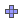
		 [UiDimension](UiDimension.htm)

		 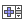
		 [DimensionTree](DimensionTree.htm)

		 
		 [DimensionCombo](DimensionCombo.htm)

		 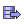
		 [UiDataSource](UiDataSource.htm)

		 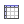
		 [UiTable](UiTable.htm)

		 
		 [UiQuery](UiQuery.htm)

		 
		 [UiMemoryTable](UiMemoryTable.htm)

		 
		 [DataGrid](DataGrid.htm)

		 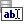
		 [DBEditBox](DBEditBox.htm)

		 
		 [DBMemo](DBMemo.htm)

		 
		 [DBComboBox](DBComboBox.htm)

		 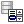
		 [DBListBox](DBListBox.htm)

		 
		 [DBLookupComboBox](DBLookupComboBox.htm)

		 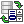
		 [DBLookupListBox](DBLookupListBox.htm)

		 
		 [UiMetabaseObjectParams](UiMetabaseObjectParams.htm)

		 
		 [UiReport](UiReport.htm)

		 
		 [ReportBox](ReportBox.htm)

		 
		 [UiErAnalyzer](UiErAnalyzer.htm)

		 
		 [UiChart](UiChart.htm)

		 
		 [ChartBox](ChartBox.htm)

		 
		 [UiTabSheet](UiTabSheet.htm)

		 
		 [TabSheetBox](TabSheetBox.htm)

		 
		 [TabFootnotesBox](TabFootnotesBox.htm)

		 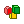
		 [UiWorkspace](UiWorkspace.htm)

		 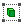
		 [UiWorkspaceObject](UiWorkspaceObject.htm)

		 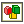
		 [WorkspaceBox](WorkspaceBox.htm)

		 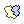
		 [UiMap](UiMap.htm)

		 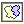
		 [MapBox](MapBox.htm)

		 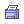
		 [DocumentPrinter](DocumentPrinter.htm)

		 
		 [ErAnalyzerDimPanel](ErAnalyzerDimPanel.htm)

		 
		 [ReportControlPanel](ReportControlPanel.htm)

		 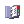
		 [UiRdsDictionary](UiRdsDictionary.htm)

		 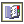
		 [RdsDictionaryBox](RdsDictionaryBox.htm)

		 
		 [UiMetabaseDataset](UiMetabaseDataset.htm)

		 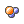
		 [UiModel](UiModel.htm)

		 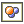
		 [ModelBox](ModelBox.htm)

		 
		 [ErAnalyzerTitle](ErAnalyzerTitle.htm)

		 
		 [MetaAttributesBreadcrumb](MetaAttributesBreadcrumb.htm)

		 
		 [MetaAttributesTreeList](MetaAttributesTreeList.htm)

		 
		 [DescStatsBox](DescStatsBox.htm)

		 
		 [PCABox](PCABox.htm)

		 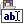
		 [MetaAttributesEdit](MetaAttributesEdit.htm)

		 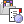
		 [LanerBox](LanerBox.htm)

		 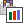
		 [LanerResultsBox](LanerResultsBox.htm)

		 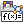
		 [MsExpressionEdit](MsExpressionEdit.htm)

		 
		 [UiEaxMap](UiEaxMap.htm)

		 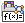
		 [EaxMapBox](EaxMapBox.htm)

		 
		 [UiEaxBubbleChart](UiEaxBubbleChart.htm)

		 
		 [EaxBubbleChartBox](EaxBubbleChartBox.htm)

		 
		 [MetabaseObjectParamsBox](MetabaseObjectParamsBox.htm)

		 
		 [EaxConfigurationPanel](EaxConfigurationPanel.htm)

		 
		 [WorkbookConfigurationPanel](WorkbookConfigurationPanel.htm)

		 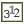
		 [WorkbookStatisticsPanel](WorkbookStatisticsPanel.htm)

		 
		 [EaxDocumentViewerBox](EaxDocumentViewerBox.htm)

		 
		 [WorkbookDocumentViewerBox](WorkbookDocumentViewerBox.htm)

		 
		 [TableWidget](TableWidget.htm)

		 
		 [ReportFormulaBar](ReportFormulaBar.htm)

		 
		 [ValidationLegendBox](ValidationLegendBox.htm)

		 
		 [UiDashboard](UiDashboard.htm)

		 
		 [DashboardDocumentViewerBox](DashboardDocumentViewerBox.htm)

		 
		 [UiEtlObject](UiEtlObject.htm)

		 
		 [EtlBox](EtlBox.htm)

		 
		 [EtlObjectPanelBox](EtlObjectPanelBox.htm)

См. также:

[Стандартные
 компоненты](../01_Standart_Components/Standart_Components.htm) | [Дополнительные
 компоненты](../02_Additional_components/Additional_components.htm) | [Компоненты
 платформы](../04_PPControls/04_components_pp7.htm)

		Справочная
		 система на версию 10.9
		 от 18/08/2025,
		 © ООО «ФОРСАЙТ»,
