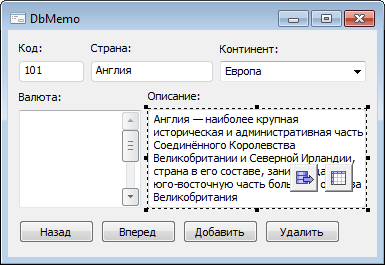
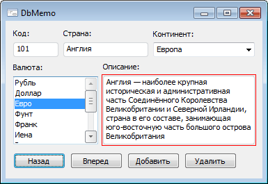

# DBMemo: Компонент

DBMemo: Компонент
-

# DBMemo

## Иерархия наследования

           [IComponent](modforms.chm::/Interface/IComponent/IComponent.htm)

           [IControl](ModForms.chm::/Interface/IControl/IControl.htm)

           [ICustomEdit](ModForms.chm::/Interface/ICustomEdit/ICustomEdit.htm)

           [IMemo](ModForms.chm::/Interface/IMemo/IMemo.htm)

           [IDBMemo](KeExtCtrls.chm::/Interface/IDBMemo/IDBMemo.htm)

           [DBMemo](KeExtCtrls.chm::/Class/DBMemo/DBMemo.htm)

## Описание

Компонент DBMemo представляет
 собой многострочный текстовый редактор, позволяющий редактировать текст
 окна, в которое можно вводить множество строк, связанных с полем источника
 данных.

## Пример

В режиме дизайнера формы:

После запуска формы:

## Свойства компонента DBMemo

		 Имя свойства
		 Краткое описание

		 
		 [Align](ModForms.chm::/Interface/IControl/IControl.Align.htm)

		 Свойство Align определяет,
		 как поведет себя компонент при изменении размеров содержащего
		 его родительского компонента.

		 
		 [Alignment](ModForms.chm::/Interface/IMemo/IMemo.Alignment.htm)

		 Свойство Alignment
		 определяет выравнивание текста надписи внутри поля компонента.

		 
		 [AllowDrag](ModForms.chm::/Interface/IControl/IControl.AllowDrag.htm)

		 Свойство AllowDrag
		 определяет возможность взять у компонента перетаскиваемый объект.

		 
		 [AllowDrop](ModForms.chm::/Interface/IControl/IControl.AllowDrop.htm)

		 Свойство AllowDrop
		 определяет, будет ли возможность у компонента принять перетаскиваемый
		 объект.

		 
		 [Anchors](ModForms.chm::/Interface/IControl/IControl.Anchors.htm)

		 Свойство Anchors возвращает
		 настройки, определяющие в процентном соотношении изменение размеров
		 текущего компонента при изменении размеров родительского компонента.

		 
		 [AutoSelect](ModForms.chm::/Interface/ICustomEdit/ICustomEdit.AutoSelect.htm)

		 Свойство AutoSelect
		 определяет, будет ли выделяться текст компонента, при получении
		 компонентом фокуса.

		 
		 [BorderStyle](KeExtCtrls.chm::/Interface/IDimensionViewer/IDimensionViewer.BorderStyle.htm)

		 Свойство BorderStyle
		 определяет стиль границы компонента.

		 
		 [Brush](ModForms.chm::/Interface/IControl/IControl.Brush.htm)

		 Свойство Brush определяет
		 кисть, используемую для заливки области компонента.

		 
		 [CanUndo](ModForms.chm::/Interface/ICustomEdit/ICustomEdit.CanUndo.htm)

		 Свойство CanUndo возвращает
		 True, если существует
		 возможность отменить изменения текста в компоненте.

		 
		 [CharacterCasing](ModForms.chm::/Interface/ICustomEdit/ICustomEdit.CharacterCasing.htm)

		 Свойство CharacterCasing
		 определяет регистр вводимых символов компонента.

		 
		 [ClientHeight](ModForms.chm::/Interface/IControl/IControl.ClientHeight.htm)

		 Свойство ClientHeight
		 используется для получения или задания высоты клиентской области
		 компонента.

		 
		 [ClientWidth](ModForms.chm::/Interface/IControl/IControl.ClientWidth.htm)

		 Свойство ClientWidth
		 используется для получения или задания ширины клиентской области
		 компонента.

		 
		 [Color](ModForms.chm::/Interface/IControl/IControl.Color.htm)

		 Свойство Color определяет
		 цвет фона компонента.

		 
		 [ComponentCount](ModForms.chm::/Interface/IComponent/IComponent.ComponentCount.htm)

		 Свойство ComponentCount
		 возвращает количество дочерних компонентов.

		 
		 [Components](ModForms.chm::/Interface/IComponent/IComponent.Components.htm)

		 Свойство Components
		 возвращает дочерний компонент.

		 
		 [Cursor](ModForms.chm::/Interface/IControl/IControl.Cursor.htm)

		 Свойство Cursor определяет
		 вид курсора над компонентом.

		 
		 [Data](ModForms.chm::/Interface/IComponent/IComponent.Data.htm)

		 Свойство Data предназначено
		 для хранения любых пользовательских данных.

		 
		 [DataField](KeExtCtrls.chm::/Interface/IDBEditBox/IDBEditBox.DataField.htm)

		 Свойство DataField
		 определяет имя поля источника данных, с которым связан компонент.

		 
		 [DataSource](KeExtCtrls.chm::/Interface/IDataGrid/IDataGrid.DataSource.htm)

		 Свойство DataSource
		 указывает источник данных, с которым связан компонент.

		 
		 [Enabled](ModForms.chm::/Interface/IControl/IControl.Enabled.htm)

		 Свойство Enabled определяет
		 доступность компонента для пользователя.

		 
		 [Field](KeExtCtrls.chm::/Interface/IDBEditBox/IDBEditBox.Field.htm)

		 Свойство Field возвращает
		 параметры поля, с которым связан компонент.

		 
		 [Focused](ModForms.chm::/Interface/IControl/IControl.Focused.htm)

		 Свойство Focused возвращает
		 True, если фокус установлен
		 на данном компоненте.

		 
		 [Font](ModForms.chm::/Interface/IControl/IControl.Font.htm)

		 Свойство Font определяет
		 множество характеристик, описывающих шрифт, используемый при отображении
		 текста.

		 
		 [Height](ModForms.chm::/Interface/IControl/IControl.Height.htm)

		 Свойство Height определяет
		 высоту компонента.

		 
		 [HelpContext](ModForms.chm::/Interface/IControl/IControl.HelpContext.htm)

		 Свойство HelpContext
		 определяет уникальный индекс раздела контекстно-зависимой справки
		 для данного компонента.

		 
		 [HideSelection](KeExtCtrls.chm::/Interface/IDimensionViewer/IDimensionViewer.HideSelection.htm)

		 Свойство HideSelection
		 определяет, будет ли выделенный текст компонента оставаться таковым,
		 при передаче фокуса другому компоненту.

		 
		 [Hint](ModForms.chm::/Interface/IControl/IControl.Hint.htm)

		 Свойство Hint определяет
		 текст подсказки для компонента.

		 
		 [Left](ModForms.chm::/Interface/IControl/IControl.Left.htm)

		 Свойство Left определяет
		 координату левого края компонента.

		 
		 [Lines](ModForms.chm::/Interface/IMemo/IMemo.Lines.htm)

		 Свойство Lines определяет
		 коллекцию строк компонента.

		 
		 [MaxLength](ModForms.chm::/Interface/ICustomEdit/ICustomEdit.MaxLength.htm)

		 Свойство MaxLength
		 определяет максимальную длину вводимого текста.

		 
		 [Modified](ModForms.chm::/Interface/ICustomEdit/ICustomEdit.Modified.htm)

		 Свойство Modified возвращает
		 True, если производилось
		 изменение текста компонента.

		 
		 [Name](ModForms.chm::/Interface/IComponent/IComponent.Name.htm)

		 Свойство Name определяет
		 наименование компонента.

		 
		 [Parent](ModForms.chm::/Interface/IControl/IControl.Parent.htm)

		 Свойство Parent определяет
		 родительский компонент.

		 
		 [ParentColor](ModForms.chm::/Interface/IControl/IControl.ParentColor.htm)

		 Свойство ParentColor
		 определяет, будет ли для компонента заимствован цвет родительского
		 компонента.

		 
		 [ParentFont](ModForms.chm::/Interface/IControl/IControl.ParentFont.htm)

		 Свойство ParentFont
		 определяет, будет ли для компонента использоваться шрифт родительского
		 компонента.

		 
		 [ParentShowHint](ModForms.chm::/Interface/IControl/IControl.ParentShowHint.htm)

		 Свойство ParentShowHint
		 определяет условие отображения всплывающей подсказки.

		 
		 [PopupMenu](ModForms.chm::/Interface/IControl/IControl.PopupMenu.htm)

		 Свойство PopupMenu
		 определяет контекстное меню, которое будет появляться по щелчку
		 дополнительной кнопки мыши на компоненте.

		 
		 [ReadOnly](ModForms.chm::/Interface/ICustomEdit/ICustomEdit.ReadOnly.htm)

		 Свойство ReadOnly определяет,
		 может ли пользователь изменять текст компонента.

		 
		 [ScrollBars](ModForms.chm::/Interface/IMemo/IMemo.ScrollBars.htm)

		 Свойство ScrollBars
		 определяет наличие полос прокрутки текста в поле компонента.

		 
		 [Scrolls](ModForms.chm::/Interface/IControl/IControl.Scrolls.htm)

		 Свойство Scrolls возвращает
		 параметры полос прокрутки компонента.

		 
		 [SelLength](ModForms.chm::/Interface/ICustomEdit/ICustomEdit.SelLength.htm)

		 Свойство SelLength
		 определяет количество символов, выделенных в тексте компонента.

		 
		 [SelStart](ModForms.chm::/Interface/ICustomEdit/ICustomEdit.SelStart.htm)

		 Свойство SelStart определяет
		 позицию, в которой расположен курсор и начинается выделение текста
		 в компоненте.

		 
		 [SelText](ModForms.chm::/Interface/ICustomEdit/ICustomEdit.SelText.htm)

		 Свойство SelText определяет
		 текст, выделенный в компоненте.

		 
		 [ShowHint](ModForms.chm::/Interface/IControl/IControl.ShowHint.htm)

		 Свойство ShowHint включает
		 и выключает показ всплывающего окна подсказки для компонента.

		 
		 [TabOrder](ModForms.chm::/Interface/IControl/IControl.TabOrder.htm)

		 Свойство TabOrder определяет
		 позицию компонента в последовательности табуляции.

		 
		 [TabStop](ModForms.chm::/Interface/IControl/IControl.TabStop.htm)

		 Свойство TabStop определяет
		 признак необходимости компоненту получать фокус при нажатии кнопки
		 «TAB».

		 
		 [Tag](ModForms.chm::/Interface/IComponent/IComponent.Tag.htm)

		 Свойство Tag не используется
		 компилятором. Пользователь может изменить значение свойства Tag и использовать его по своему
		 усмотрению.

		 
		 [Text](ModForms.chm::/Interface/IControl/IControl.Text.htm)

		 Свойство Text определяет
		 строку, идентифицирующую компонент для пользователя.

		 
		 [Top](ModForms.chm::/Interface/IControl/IControl.Top.htm)

		 Свойство Top определяет
		 координату верхнего края компонента.

		 
		 [Visible](ModForms.chm::/Interface/IControl/IControl.Visible.htm)

		 Свойство Visible определяет
		 видимость компонента во время выполнения.

		 
		 [WantReturns](ModForms.chm::/Interface/IMemo/IMemo.WantReturns.htm)

		 Свойство WantReturns
		 определяет, возможность вставки в редактируемый текст символа
		 возврата каретки.

		 
		 [WantTabs](ModForms.chm::/Interface/IMemo/IMemo.WantTabs.htm)

		 Свойство WantTabs определяет
		 возможность вставки в редактируемый текст символа табуляции.

		 
		 [Width](ModForms.chm::/Interface/IControl/IControl.Width.htm)

		 Свойство Width определяет
		 ширину компонента.

		 
		 [WordWrap](ModForms.chm::/Interface/IMemo/IMemo.WordWrap.htm)

		 Свойство WordWrap определяет,
		 будут ли переноситься слова превышающие длину компонента, на новую
		 строку.

## Методы компонента DBMemo

		 Имя метода
		 Краткое описание

		 
		 [Clear](ModForms.chm::/Interface/ICustomEdit/ICustomEdit.Clear.htm)

		 Метод Clear удаляет
		 весь текст, содержащийся в компоненте.

		 
		 [ClearSelection](ModForms.chm::/Interface/ICustomEdit/ICustomEdit.ClearSelection.htm)

		 Метод ClearSelection
		 удаляет весь текст, который был выделен в компоненте.

		 
		 [ClearUndo](ModForms.chm::/Interface/ICustomEdit/ICustomEdit.CanUndo.htm)

		 Метод ClearUndo используется
		 для фиксации изменений свойства Text.

		 
		 [ClientToScreen](ModForms.chm::/Interface/IControl/IControl.ClientToScreen.htm)

		 Метод ClientToScreen
		 преобразовывает координаты точки, указанные относительно системы
		 координат компонента, в экранные координаты.

		 
		 [CopyToClipboard](ModForms.chm::/Interface/ICustomEdit/ICustomEdit.CopyToClipboard.htm)

		 Метод CopyToClipboard
		 осуществляет копирование выделенных данных в буфер обмена.

		 
		 [CutToClipboard](ModForms.chm::/Interface/ICustomEdit/ICustomEdit.CutToClipboard.htm)

		 Метод CutToClipboard
		 осуществляет вырезание выделенных данных и помещает их в буфер
		 обмена.

		 
		 [DoDragDrop](ModForms.chm::/Interface/IControl/IControl.DoDragDrop.htm)

		 Метод DoDragDrop позволяет
		 начать операцию перетаскивания.

		 
		 [GetCharPos](ModForms.chm::/Interface/IMemo/IMemo.GetCharPos.htm)

		 Метод GetCharPos возвращает
		 номер позицию курсора в строке.

		 
		 [GetImage](ModForms.chm::/Interface/IControl/IControl.GetImage.htm)

		 Метод GetImage возвращает
		 изображение компонента со всеми дочерними компонентами.

		 
		 [GetLinePos](ModForms.chm::/Interface/IMemo/IMemo.GetLinePos.htm)

		 Метод GetLinePos возвращает
		 номер строки, в которой находится курсор.

		 
		 [PasteFromClipboard](ModForms.chm::/Interface/ICustomEdit/ICustomEdit.PasteFromClipboard.htm)

		 Метод PasteFormClipboard
		 осуществляет вставку данных из буфера обмена.

		 
		 [ScreenToClient](ModForms.chm::/Interface/IControl/IControl.ScreenToClient.htm)

		 Метод ScreenToClient
		 преобразовывает экранные координаты точки в координаты, указываемые
		 относительно системы координат компонента.

		 
		 [SelectAll](ModForms.chm::/Interface/ICustomEdit/ICustomEdit.SelectAll.htm)

		 Метод SelectAll позволяет
		 выделить все элементы управления.

		 
		 [SetFocus](ModForms.chm::/Interface/IControl/IControl.SetFocus.htm)

		 Метод SetFocus устанавливает
		 фокус на данный компонент.

		 
		 [Undo](ModForms.chm::/Interface/ICustomEdit/ICustomEdit.Undo.htm)

		 Метод Undo осуществляет
		 отмену последнего изменения текста в компоненте.

## События компонента DBMemo

		 Имя события
		 Краткое описание

		 
		 [OnBeginDrag](ModForms.chm::/Interface/IControl/IControl.OnBeginDrag.htm)

		 Событие OnBeginDrag
		 для компонента наступает, когда пользователь начинает перетаскивать
		 объект от компонента.

		 
		 [OnChange](ModForms.chm::/Interface/ICustomEdit/ICustomEdit.OnChange.htm)

		 Событие OnChange наступает
		 после изменений свойства Text компонента редактирования.

		 
		 [OnClick](ModForms.chm::/Interface/IControl/IControl.OnClick.htm)

		 Событие OnClick наступает,
		 если пользователь щёлкнул в области компонента.

		 
		 [OnDblClick](ModForms.chm::/Interface/IControl/IControl.OnDblClick.htm)

		 Событие OnDblClick
		 наступает, если пользователь дважды щёлкнул в области компонента.

		 
		 [OnDragDrop](ModForms.chm::/Interface/IControl/IControl.OnDragDrop.htm)

		 Событие OnDragDrop
		 для компонента наступает, когда пользователь отпускает над ним
		 перетаскиваемый объект.

		 
		 [OnDragEnter](ModForms.chm::/Interface/IControl/IControl.OnDragEnter.htm)

		 Событие OnDragEnter
		 наступает, когда перетаскиваемый объект входит в границы данного
		 компонента.

		 
		 [OnDragLeave](ModForms.chm::/Interface/IControl/IControl.OnDragLeave.htm)

		 Событие OnDragLeave
		 наступает, когда перетаскиваемый объект выходит за границы данного
		 компонента.

		 
		 [OnDragOver](ModForms.chm::/Interface/IControl/IControl.OnDragOver.htm)

		 Событие OnDragOver
		 для компонента наступает, когда пользователь протаскивает над
		 ним перетаскиваемый объект.

		 
		 [OnEnter](ModForms.chm::/Interface/IControl/IControl.OnEnter.htm)

		 Событие OnEnter наступает
		 в момент получения фокуса компонентом.

		 
		 [OnExit](ModForms.chm::/Interface/IControl/IControl.OnExit.htm)

		 Событие OnExit наступает
		 в момент потери фокуса компонентом.

		 
		 [OnHScroll](ModForms.chm::/Interface/IControl/IControl.OnHScroll.htm)

		 Событие OnHScroll наступает
		 при изменении положения ползунка горизонтальной полосы прокрутки.

		 
		 [OnKeyDown](ModForms.chm::/Interface/IControl/IControl.OnKeyDown.htm)

		 Событие OnKeyDown наступает,
		 если компонент находится в фокусе и производится нажатие на клавиатуру.

		 
		 [OnKeyPress](ModForms.chm::/Interface/IControl/IControl.OnKeyPress.htm)

		 Событие OnKeyPress
		 наступает, если компонент находится в фокусе, при нажатии пользователем
		 символьной клавиши.

		 
		 [OnKeyPreview](ModForms.chm::/Interface/IControl/IControl.OnKeyPreview.htm)

		 Событие OnKeyPreview
		 наступает перед каждым событием, связанным с нажатием клавиш.

		 
		 [OnKeyUp](ModForms.chm::/Interface/IControl/IControl.OnKeyUp.htm)

		 Событие OnKeyUp наступает,
		 если компонент находится в фокусе, при отпускании пользователем
		 любой, ранее нажатой клавиши.

		 
		 [OnMouseDown](ModForms.chm::/Interface/IControl/IControl.OnMouseDown.htm)

		 Событие OnMouseDown
		 наступает, если компонент находится в фокусе, и на компоненте
		 произведено нажатие любой из кнопок мыши.

		 
		 [OnMouseMove](ModForms.chm::/Interface/IControl/IControl.OnMouseMove.htm)

		 Событие OnMouseMove
		 наступает при перемещении пользователем курсора мыши над компонентом.

		 
		 [OnMouseUp](ModForms.chm::/Interface/IControl/IControl.OnMouseUp.htm)

		 Событие OnMouseUp наступает,
		 если компонент находится в фокусе и на компоненте была отпущена
		 любая из ранее нажатых кнопок мыши.

		 
		 [OnMouseWheel](ModForms.chm::/Interface/IControl/IControl.OnMouseWheel.htm)

		 Событие OnMouseWheel
		 наступает, если компонент находится в фокусе при вращении колеса
		 мыши.

		 
		 [OnVScroll](ModForms.chm::/Interface/IControl/IControl.OnVScroll.htm)

		 Событие OnVScroll наступает
		 при изменении положения ползунка вертикальной полосы прокрутки.

См. также:

[Компоненты доступа
 к данным](03_components_of_the_access_to_data.htm)

		Справочная
		 система на версию 10.9
		 от 18/08/2025,
		 © ООО «ФОРСАЙТ»,
