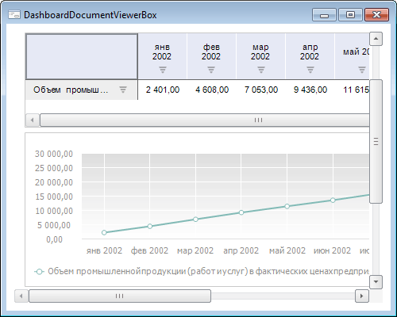

# DashboardDocumentViewerBox: Компонент

DashboardDocumentViewerBox: Компонент
-

# DashboardDocumentViewerBox

## Иерархия наследования

           [IComponent](ModForms.chm::/Interface/IComponent/IComponent.htm)

           [IControl](ModForms.chm::/Interface/IControl/IControl.htm)

           [IDashboardDocumentViewerBox](KeAdhoc.chm::/Interface/IDashboardDocumentViewerBox/IDashboardDocumentViewerBox.htm)

           [DashboardDocumentViewerBox](KeAdhoc.chm::/Class/DashboardDocumentViewerBox/DashboardDocumentViewerBox.htm)

## Описание

Компонент DashboardDocumentViewerBox
 предназначен для работы с аналитической панелью репозитория.

## Работа с компонентом

Для работы компонента необходимо в свойстве [Dashboard](KeAdhoc.chm::/Interface/IDashboardDocumentViewerBox/IDashboardDocumentViewerBox.Dashboard.htm) указать
 компонент [UiDashboard](UiDashboard.htm),
 который связан с аналитической панелью репозитория. При работе формы в
 компоненте для различных визуализаторов будет доступно системное контекстное
 меню.

## Пример

## Свойства компонента DashboardDocumentViewerBox

		 Имя свойства
		 Краткое описание

		 
		 [Align](ModForms.chm::/Interface/IControl/IControl.Align.htm)

		 Свойство Align определяет,
		 как поведет себя компонент при изменении размеров содержащего
		 его родительского компонента.

		 
		 [AllowDrag](ModForms.chm::/Interface/IControl/IControl.AllowDrag.htm)

		 Свойство AllowDrag
		 определяет возможность взять у компонента перетаскиваемый объект.

		 
		 [AllowDrop](ModForms.chm::/Interface/IControl/IControl.AllowDrop.htm)

		 Свойство AllowDrop
		 определяет, будет ли возможность у компонента принять перетаскиваемый
		 объект.

		 
		 [Anchors](ModForms.chm::/Interface/IControl/IControl.Anchors.htm)

		 Свойство Anchors возвращает
		 настройки, определяющие в процентном соотношении изменение размеров
		 текущего компонента при изменении размеров родительского компонента.

		 
		 [Brush](ModForms.chm::/Interface/IControl/IControl.Brush.htm)
		 Свойство Brush определяет
		 кисть, используемую для заливки области компонента.

		 
		 [ClientHeight](ModForms.chm::/Interface/IControl/IControl.ClientHeight.htm)

		 Свойство ClientHeight
		 используется для получения или задания высоты клиентской области
		 компонента.

		 
		 [ClientWidth](ModForms.chm::/Interface/IControl/IControl.ClientWidth.htm)

		 Свойство ClientWidth
		 используется для получения или задания ширины клиентской области
		 компонента.

		 
		 [Color](ModForms.chm::/Interface/IControl/IControl.Color.htm)

		 Свойство Color определяет
		 цвет фона компонента.

		 
		 [ComponentCount](ModForms.chm::/Interface/IComponent/IComponent.ComponentCount.htm)

		 Свойство ComponentCount
		 возвращает количество дочерних компонентов.

		 
		 [Components](ModForms.chm::/Interface/IComponent/IComponent.Components.htm)

		 Свойство Components
		 возвращает дочерний компонент.

		 
		 [Cursor](ModForms.chm::/Interface/IControl/IControl.Cursor.htm)

		 Свойство Cursor определяет
		 вид курсора над компонентом.

		 
		 [Dashboard](KeAdhoc.chm::/Interface/IDashboardDocumentViewerBox/IDashboardDocumentViewerBox.Dashboard.htm)

		 Свойство Dashboard
		 определяет источник данных для компонента.

		 
		 [Data](ModForms.chm::/Interface/IComponent/IComponent.Data.htm)

		 Свойство Data предназначено
		 для хранения любых пользовательских данных.

		 
		 [Enabled](ModForms.chm::/Interface/IControl/IControl.Enabled.htm)

		 Свойство Enabled определяет
		 доступность компонента для пользователя.

		 
		 [Focused](ModForms.chm::/Interface/IControl/IControl.Focused.htm)

		 Свойство Focused возвращает
		 True, если фокус установлен
		 на данном компоненте.

		 
		 [Font](ModForms.chm::/Interface/IControl/IControl.Font.htm)

		 Свойство Font определяет
		 множество характеристик, описывающих шрифт, используемый при отображении
		 текста.

		 
		 [Height](ModForms.chm::/Interface/IControl/IControl.Height.htm)

		 Свойство Height определяет
		 высоту компонента.

		 
		 [HelpContext](ModForms.chm::/Interface/IControl/IControl.HelpContext.htm)
		 Свойство HelpContext
		 определяет уникальный индекс раздела контекстно-зависимой справки
		 для данного компонента.

		 
		 [Hint](ModForms.chm::/Interface/IControl/IControl.Hint.htm)
		 Свойство Hint определяет
		 текст подсказки для компонента.

		 
		 [Left](ModForms.chm::/Interface/IControl/IControl.Left.htm)

		 Свойство Left определяет
		 координату левого края компонента.

		 
		 [ModelSpace](KeMs.chm::/Interface/IDescStatsBox/IDescStatsBox.ModelSpace.htm)
		 Свойство ModelSpace
		 определяет контейнер моделирования, к которому подключен компонент.

		 
		 [Name](ModForms.chm::/Interface/IComponent/IComponent.Name.htm)
		 Свойство Name определяет
		 наименование компонента.

		 
		 [Pads](KeMs.chm::/Interface/IDescStatsBox/IDescStatsBox.Pads.htm)
		 Свойство Pads возвращает
		 коллекцию панелей компонента.

		 
		 [Parent](ModForms.chm::/Interface/IControl/IControl.Parent.htm)
		 Свойство Parent определяет
		 родительский компонент.

		 
		 [ParentColor](ModForms.chm::/Interface/IControl/IControl.ParentColor.htm)

		 Свойство ParentColor
		 определяет, будет ли для компонента заимствован цвет родительского
		 компонента.

		 
		 [ParentFont](ModForms.chm::/Interface/IControl/IControl.ParentFont.htm)

		 Свойство ParentFont
		 определяет, будет ли для компонента использоваться шрифт родительского
		 компонента.

		 
		 [ParentShowHint](ModForms.chm::/Interface/IControl/IControl.ParentShowHint.htm)

		 Свойство ParentShowHint
		 определяет условие отображения всплывающей подсказки.

		 
		 [PopupMenu](ModForms.chm::/Interface/IControl/IControl.PopupMenu.htm)

		 Свойство PopupMenu
		 определяет контекстное меню, которое будет появляться по щелчку
		 дополнительной кнопки мыши на компоненте.

		 
		 [Scrolls](ModForms.chm::/Interface/IControl/IControl.Scrolls.htm)
		 Свойство Scrolls возвращает
		 параметры полос прокрутки компонента.

		 
		 [ShowHint](ModForms.chm::/Interface/IControl/IControl.ShowHint.htm)

		 Свойство ShowHint включает
		 и выключает показ всплывающего окна подсказки для компонента.

		 
		 [TabOrder](ModForms.chm::/Interface/IControl/IControl.TabOrder.htm)

		 Свойство TabOrder определяет
		 позицию компонента в последовательности табуляции.

		 
		 [TabStop](ModForms.chm::/Interface/IControl/IControl.TabStop.htm)

		 Свойство TabStop определяет
		 признак необходимости компоненту получать фокус при нажатии кнопки
		 «Tab».

		 
		 [Tag](ModForms.chm::/Interface/IComponent/IComponent.Tag.htm)
		 Свойство Tag не используется
		 компилятором. Пользователь может изменить значение свойства Tag и использовать его по своему
		 усмотрению.

		 
		 [Text](ModForms.chm::/Interface/IControl/IControl.Text.htm)
		 Свойство Text определяет
		 строку, идентифицирующую компонент для пользователя.

		 
		 [Top](ModForms.chm::/Interface/IControl/IControl.Top.htm)
		 Свойство Top определяет
		 координату верхнего края компонента.

		 
		 [VariablesCount](KeMs.chm::/Interface/IDescStatsBox/IDescStatsBox.VariablesCount.htm)
		 Свойство VariablesCount
		 возвращает количество переменных, загруженных в список компонента.

		 
		 [Visible](ModForms.chm::/Interface/IControl/IControl.Visible.htm)
		 Свойство Visible определяет
		 видимость компонента во время выполнения.

		 
		 [Width](ModForms.chm::/Interface/IControl/IControl.Width.htm)
		 Свойство Width определяет
		 ширину компонента.

## Методы компонента DashboardDocumentViewerBox

		 Имя метода
		 Краткое описание

		 
		 [ClientToScreen](ModForms.chm::/Interface/IControl/IControl.ClientToScreen.htm)

		 Метод ClientToScreen
		 преобразовывает координаты точки, указанные относительно системы
		 координат компонента, в экранные координаты.

		 
		 [DoDragDrop](ModForms.chm::/Interface/IControl/IControl.DoDragDrop.htm)

		 Метод DoDragDrop позволяет
		 начать операцию перетаскивания.

		 
		 [GetImage](ModForms.chm::/Interface/IControl/IControl.GetImage.htm)

		 Метод GetImage возвращает
		 изображение компонента со всеми дочерними компонентами.

		 
		 [ScreenToClient](ModForms.chm::/Interface/IControl/IControl.ScreenToClient.htm)

		 Метод ScreenToClient
		 преобразовывает экранные координаты точки в координаты, указываемые
		 относительно системы координат компонента.

		 
		 [SetFocus](ModForms.chm::/Interface/IControl/IControl.SetFocus.htm)

		 Метод SetFocus устанавливает
		 фокус на данный компонент.

См. также:

[Компоненты
 доступа к данным](03_components_of_the_access_to_data.htm)

		Справочная
		 система на версию 10.9
		 от 18/08/2025,
		 © ООО «ФОРСАЙТ»,
