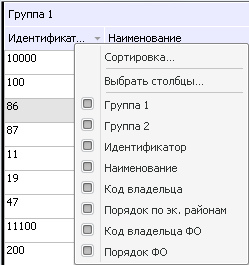
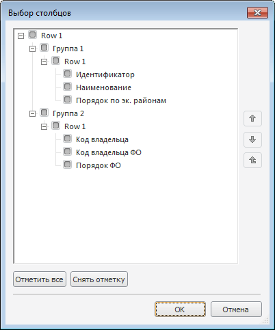
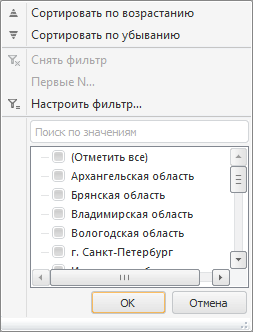
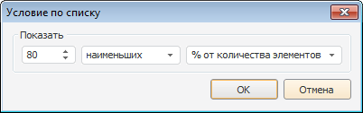
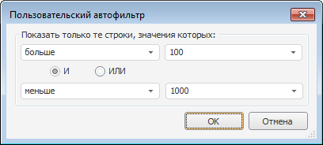
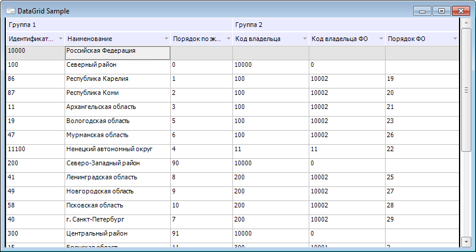

# DataGrid: Компонент

DataGrid: Компонент
-

# DataGrid

## Иерархия наследования

           [IComponent](modforms.chm::/Interface/IComponent/IComponent.htm)

           [IControl](ModForms.chm::/Interface/IControl/IControl.htm)

           [IDataGrid](keextctrls.chm::/Interface/IDataGrid/IDataGrid.htm)

           [DataGrid](KeExtCtrls.chm::/Class/DataGrid/DataGrid.htm)

## Описание

Компонент DataGrid предназначен
 для отображения каких-либо данных в виде таблицы.

## Работа с компонентом

В таблице могут отображаться данные из какого-либо источника данных
 или временный набор пользовательских данных.

Для подключения источника данных необходимо определить свойство [DataSource](KeExtCtrls.chm::/Interface/IDataGrid/IDataGrid.DataSource.htm)
 компонента. После этого в свойстве [ColumnCount](KeExtCtrls.chm::/Interface/IDataGrid/IDataGrid.ColumnCount.htm)
 необходимо указать количество столбцов, в которых будут отображаться данные.
 Для каждого столбца в свойстве [FieldName](KeExtCtrls.chm::/Interface/IDataGridColumn/IDataGridColumn.FieldName.htm)
 необходимо указать наименование поля источника данных, данные которого
 будут отображаться. Для работы со столбцом щелкните по его заголовку.
 При этом доступные свойства будут отображены в [инспекторе
 объектов](../../01_Development_Environment/03_Windows_of_Development_Environment/Object_Inspector.htm). При установленном источнике данных количество строк формируется
 автоматически и соответствует количеству доступных строк в источнике данных.

Примечание.
 Для ускорения работы при загрузке формы в компонент подгружаются только
 первые строки из источника данных. Количество подгружаемых строк рассчитывается
 таким образом, чтобы была занята вся доступная область компонента. Остальные
 строки будут подгружаться по мере прокрутки области строк в компоненте.

Если источник данных не подключен, то у разработчика есть возможность
 установить необходимое количество строк вручную, определив значение свойства
 [AbsoluteRowCount](KeExtCtrls.chm::/Interface/IDataGrid/IDataGrid.AbsoluteRowCount.htm).

Базовое свойство [Color](ModForms.chm::/Interface/IControl/IControl.Color.htm)
 позволяет определить цвет области, не занятой ячейками.

В таблице предусмотрены сортировка и фильтрация данных, разделение на
 группы, подсчет итогов по столбцам и по группам и т.д.

### Работа с группами

Таблица компонента DataGrid
 представляет собой [коллекцию](KeExtCtrls.chm::/Interface/IDataGrid/IDataGrid.Bands.htm)
 контейнеров, содержащих в себе коллекцию [столбцов](KeExtCtrls.chm::/Interface/IDataGrid/IDataGrid.Columns.htm).

По умолчанию в таблице имеется три встроенных, невидимых контейнера.
 Располагаются они в левой, центральной и правой [фиксированных
 областях](KeExtCtrls.chm::/Interface/IDataGrid/IDataGrid.RootBands.htm).

Для изменения положения какого-либо контейнера (колонки) необходимо
 навести курсор мыши на заголовок нужного объекта, зажать кнопку
 мыши и перетащить объект в нужную позицию. Необходимым условием для изменения
 положения контейнера (колонки) является установка свойствам [AllowPress](KeExtCtrls.chm::/Interface/IDataGridBandBaseOptions/IDataGridBandBaseOptions.AllowPress.htm)
 и [Moveable](KeExtCtrls.chm::/Interface/IDataGridBandBaseOptions/IDataGridBandBaseOptions.Moveable.htm)
 значения True. Для изменения положения
 контейнера (колонки) в языке Fore
 используется метод [SetParentBand](KeExtCtrls.chm::/Interface/IDataGridBandBase/IDataGridBandBase.SetParentBand.htm).

### Подсчет итогов

Для контейнеров и столбцов таблицы реализован расчет итогов. Для отображения
 рассчитанных данных необходимо свойству [ShowTotals](KeExtCtrls.chm::/Interface/IDataGrid/IDataGrid.ShowTotals.htm)
 установить значение True. Вид
 рассчитываемых итогов определяется в свойстве [TotalStyle](KeExtCtrls.chm::/Interface/IDataGridBandBase/IDataGridBandBase.TotalStyle.htm)
 выбранного контейнера (столбца).

Автоматический расчет итогов осуществляется только по числовым данным.
 Для контейнеров (столбцов), содержащих нечисловые данные, расчет итогов
 можно организовать самостоятельно в пользовательском макросе. Для вывода
 собственных значений необходимо свойству [TotalStyle](KeExtCtrls.chm::/Interface/IDataGridBandBase/IDataGridBandBase.TotalStyle.htm)
 установить значение DataGridTotalStyle.Value, итоговое (отображаемое в
 таблице) значение установить в свойстве [TotalValue](KeExtCtrls.chm::/Interface/IDataGridBandBase/IDataGridBandBase.TotalValue.htm).

### Сортировка данных

Для сортировки данных по какому-либо столбцу необходимо щелкнуть по
 заголовку данного столбца. При этом все данные будут отсортированы по
 возрастанию значений. Повторные щелчки будут вызывать смену направления
 сортировки.

Если свойству [MultipleSort](KeExtCtrls.chm::/Interface/IDataGrid/IDataGrid.MultipleSort.htm)
 установлено значение True, то
 в таблице будет доступна сортировка по нескольким столбцам. Для мультисортировки
 необходимо зажать клавишу CTRL и щелкнуть по заголовкам необходимых столбцов.
 Порядок сортировки будет определяться следующим образом: столбец, по заголовку
 которого был осуществлен последний щелчок, будет отсортирован в последнюю
 очередь.

Также осуществить настройку сортировки можно в специализированном окне
 «Сортировка»:

,

Данное окно появляется при выборе соответствующего пункта контекстного
 меню, вызываемого в области заголовков колонок. Колонки, по которым будет
 осуществляться сортировка, необходимо переместить в список выбранных.
 Кнопки  и 
 используются для изменения направления сортировки по выбранному столбцу.
 Кнопки  и  используются
 для изменения порядка сортировки. Колонки, расположенные вверху списка,
 будут сортироваться в первую очередь.

В языке Fore для установки сортировки
 надо изменить значение свойства [SortIndex](KeExtCtrls.chm::/Interface/IDataGridColumn/IDataGridColumn.SortIndex.htm)
 у необходимой колонки. Направление сортировки определяется в свойстве
 [SortAscending](KeExtCtrls.chm::/Interface/IDataGridColumn/IDataGridColumn.SortAscending.htm).
 Для установки мультисортировки нужно изменить значение свойства [SortIndex](KeExtCtrls.chm::/Interface/IDataGridColumn/IDataGridColumn.SortIndex.htm)
 у необходимых столбцов. Необходимым условием для возможности изменения
 сортировки является установка свойству [EnableSort](KeExtCtrls.chm::/Interface/IDataGrid/IDataGrid.EnableSort.htm)
 значения True.

### Выбор столбцов

Настройка отображения столбцов производится с помощью контекстного меню,
 вызываемого для заголовка таблицы.

Контекстное меню содержит список всех столбцов компонента. Для включения/отключения
 отображения столбца следует установить /снять флажок напротив него.

При выборе пункта «Выбрать столбцы»
 будет открыт диалог:

Для включения/отключения столбца следует установить/снять флажок напротив
 него. Для отметки/снятия всех установленных флажков следует использовать
 кнопку «Отметить все»/«Снять
 отметку». Для задания порядка столбцов в таблице следует использовать
 кнопки, расположенные в окне справа: вверх, вниз, на уровень вверх.

### Автофильтр

Для облегчения поиска необходимых данных в таблице доступна настройка
 различных условий автофильтра. Для настройки автофильтра используется
 кнопка , отображаемая в заголовке колонки таблицы. При
 нажатии на которую будет выведен список, сформированный из элементов данного
 столбца и зарезервированных пунктов:

	- Сортировать по возрастанию.
	 Элементы выбранного столбца будут отсортированы по возрастанию;

	- Сортировать по убыванию.
	 Элементы выбранного столбца будут отсортированы по убыванию;

	- Снять фильтр. Данный
	 пункт доступен только для столбцов, на которые наложен фильтр.
	 Название команды может изменяться в зависимости от выбранного типа
	 фильтрации;

	- Первые N. Данный пункт
	 доступен, когда в фильтруемом столбце присутствуют только числовые
	 значения. При его выборе открывается диалог настройки фильтра:

	

После установки параметров в выбранном столбце
 будет отображаться заданное количество элементов списка (количество задается
 явно либо в процентах от количества элементов).

	- Настроить фильтр. Позволяет
	 задать определенные условия фильтрации данных в окне «Пользовательский
	 автофильтр». При формировании списка элементов автофильтра
	 регистр символов, используемых в значениях, не учитывается:

	

	- Список элементов столбца.
	 Список содержит все элементы столбца. Чтобы выделить/снять выделение
	 со всех элементов следует щелкнуть по элементу «Отметить
	 все».

Примечание.
 Если в списке содержится более 1000 записей, в меню с командами
 управления автофильтром будут отображаться только первые 1000 значений
 и предупреждающее сообщение «Показаны
 первые 1000 элементов».

После выбора и настройки какого-либо условия фильтрации кнопка автофильтра
 будет подсвечена синим цветом. Необходимым условием для возможности установки
 автофильтра в колонках является установка свойству [AutoFilter](KeExtCtrls.chm::/Interface/IDataGrid/IDataGrid.AutoFilter.htm)
 значения AutoFilterType.Inplace.

Если свойству [AutoFilter](KeExtCtrls.chm::/Interface/IDataGrid/IDataGrid.AutoFilter.htm)
 установлено значение AutoFilterType.None, то кнопка для настройки автофильтра
 отображаться не будет, но будет возможность настроить фильтрацию с использованием
 языка Fore. Для установки автофильтра
 используется свойство [TableFilter](KeExtCtrls.chm::/Interface/IDataGrid/IDataGrid.TableFilter.htm).

### Настройка оформления

Оформление можно настроить как у компонента в целом, так и по отдельным
 столбцам и строкам. Настройка оформления компонента осуществляется за
 счет свойств, доступных в интерфейсе [IDataGrid](KeExtCtrls.chm::/Interface/IDataGrid/IDataGrid.htm).

Для настройки оформления столбцов и строк используются стили. Коллекция
 стилей доступна в свойстве [Styles](KeExtCtrls.chm::/Interface/IDataGrid/IDataGrid.Styles.htm).
 По умолчанию в коллекции создан один стиль, используемый для оформления
 всех столбцов и строк. После создания и настройки требуемых стилей индексы
 стилей необходимо указать в свойствах [IDataGridColumn.StyleIndex](KeExtCtrls.chm::/Interface/IDataGridColumn/IDataGridColumn.StyleIndex.htm)
 - для оформления столбцов, либо [IDataGridRow.StyleIndex](KeExtCtrls.chm::/Interface/IDataGridRow/IDataGridRow.StyleIndex.htm)
 - для оформления строк. Во время выполнения формы можно динамически изменять
 стиль оформления строк, используя события [OnGetRowStyle](KeExtCtrls.chm::/Class/DataGrid/DataGrid.OnGetRowStyle.htm)
 и [OnGetSelectedRowStyle](KeExtCtrls.chm::/Class/DataGrid/DataGrid.OnGetSelectedRowStyle.htm).
 Стиль задается в свойстве StyleIndex
 аргумента этих событий. Если для компонента свойству [CustomCellStyle](KeExtCtrls.chm::/Interface/IDataGrid/IDataGrid.CustomCellStyle.htm)
 установлено значение True, то
 также будут генерироваться события [OnGetCellStyle](KeExtCtrls.chm::/Class/DataGrid/DataGrid.OnGetCellStyle.htm)
 и [OnGetSelectedCellStyle](KeExtCtrls.chm::/Class/DataGrid/DataGrid.OnGetSelectedCellStyle.htm).
 В данных событиях можно определить стиль оформления отдельных ячеек таблицы.
 Для изменения стиля также используется свойство StyleIndex
 аргумента событий.

### Сохранение параметров

Настройки столбцов можно сохранять и загружать когда это необходимо.
 Для этого предназначены методы [SaveColumns](KeExtCtrls.chm::/Interface/IDataGrid/IDataGrid.SaveColumns.htm)
 и [LoadColumns](KeExtCtrls.chm::/Interface/IDataGrid/IDataGrid.LoadColumns.htm).
 Сохраняются следующие параметры столбцов: размеры, видимость, расположение
 столбцов.

Параметры автофильтров, которые могут быть установлены по столбцам,
 также можно сохранять и загружать, используя методы [SaveAutoFilters](KeExtCtrls.chm::/Interface/IDataGrid/IDataGrid.SaveAutoFilters.htm)
 и [LoadAutoFilters](KeExtCtrls.chm::/Interface/IDataGrid/IDataGrid.LoadAutoFilters.htm).
 Для автофильтров сохраняются установленные условия, а также параметры
 сортировки, установленной по столбцам.

Все указанные методы работают с XML-строкой.

### Контекстное меню в компоненте

Используя различные свойства, можно настроить вызов необходимых контекстных
 меню для различных элементов таблицы:

	- [PopupMenu](ModForms.chm::/Interface/IControl/IControl.PopupMenu.htm)
	 - контекстное меню, вызываемое в рабочей области компонента.

	- [HeaderMenu](KeExtCtrls.chm::/Interface/IDataGrid/IDataGrid.HeaderMenu.htm)
	 - контекстное меню, вызываемое в области заголовков контейнеров/столбцов
	 компонента. Если свойство не установлено, то будет вызываться системное
	 контекстное меню. Системное контекстное меню описано выше в подразделе
	 [Выбор столбцов](#choice_column).

	- Для отдельных контейнеров/столбцов можно настроить свои контекстные
	 меню:

	-

		- [Menu](KeExtCtrls.chm::/Interface/IDataGridBandBase/IDataGridBandBase.Menu.htm)
		 - контекстное меню, вызываемое в области заголовка конкретного
		 контейнера/столбца.

		- [TotalPopup](KeExtCtrls.chm::/Interface/IDataGridBandBase/IDataGridBandBase.TotalPopup.htm)
		 - контекстное меню, вызываемое в области итогов конкретного контейнера/столбца.

## Пример

## Свойства, унаследованные от [IDataGrid](KeExtCtrls.chm::/Interface/IDataGrid/IDataGrid.htm)

		 Имя свойства
		 Краткое описание

		 
		 [AbsoluteFocusedRow](KeExtCtrls.chm::/Interface/IDataGrid/IDataGrid.AbsoluteFocusedRow.htm)
		 Свойство AbsoluteFocusedRow
		 определяет абсолютный индекс сфокусированной строки таблицы.

		 
		 [AbsoluteRowCount](KeExtCtrls.chm::/Interface/IDataGrid/IDataGrid.AbsoluteRowCount.htm)
		 Свойство AbsoluteRowCount
		 определяет абсолютное количество строк, присутствующих в таблице.

		 
		 [AllowAppend](KeExtCtrls.chm::/Interface/IDataGrid/IDataGrid.AllowAppend.htm)
		 Свойство AllowAppend
		 определяет возможность добавления записей.

		 
		 [AllowDelete](KeExtCtrls.chm::/Interface/IDataGrid/IDataGrid.AllowDelete.htm)
		 Свойство AllowDelete
		 определяет возможность удаления записей в таблице.

		 
		 [AllowEdit](KeExtCtrls.chm::/Interface/IDataGrid/IDataGrid.AllowEdit.htm)
		 Свойство AllowEdit
		 определяет возможность редактирования записей в таблице.

		 
		 [AutoFilter](KeExtCtrls.chm::/Interface/IDataGrid/IDataGrid.AutoFilter.htm)
		 Свойство AutoFilter
		 определяет признак использования автофильтра в столбцах.

		 
		 [BandCount](KeExtCtrls.chm::/Interface/IDataGrid/IDataGrid.BandCount.htm)
		 Свойство BandCount
		 определяет количество пользовательских контейнеров, присутствующих
		 в таблице.

		 
		 [Bands](KeExtCtrls.chm::/Interface/IDataGrid/IDataGrid.Bands.htm)
		 Свойство Bands возвращает
		 коллекцию контейнеров таблицы.

		 
		 [BorderStyle](KeExtCtrls.chm::/Interface/IDataGrid/IDataGrid.BorderStyle.htm)
		 Свойство BorderStyle
		 определяет стиль границы компонента.

		 
		 [CellValue](KeExtCtrls.chm::/Interface/IDataGrid/IDataGrid.CellValue.htm)
		 Свойство CellValue
		 определяет значение ячейки, координаты которой передаются в качестве
		 входных параметров.

		 
		 [ColumnCount](KeExtCtrls.chm::/Interface/IDataGrid/IDataGrid.ColumnCount.htm)
		 Свойство ColumnCount
		 определяет количество столбцов компонента [DataGrid](DataGrid.htm).

		 
		 [Columns](KeExtCtrls.chm::/Interface/IDataGrid/IDataGrid.Columns.htm)
		 Свойство Соlumns возвращает
		 коллекцию столбцов компонента [DataGrid](DataGrid.htm#choice_column).

		 
		 [CurrentColumn](KeExtCtrls.chm::/Interface/IDataGrid/IDataGrid.CurrentColumn.htm)
		 Свойство CurentColumn
		 определяет номер столбца, на котором установлен фокус.

		 
		 [CustomCellStyle](KeExtCtrls.chm::/Interface/IDataGrid/IDataGrid.CustomCellStyle.htm)
		 Свойство CustomCellStyle
		 определяет признак генерации событий для отрисовки отдельных ячеек.

		 
		 [DataSource](KeExtCtrls.chm::/Interface/IDataGrid/IDataGrid.DataSource.htm)
		 Свойство DataSource
		 указывает источник данных, с которым связан компонент.

		 
		 [DrawFocus](KeExtCtrls.chm::/Interface/IDataGrid/IDataGrid.DrawFocus.htm)
		 Свойство DrawFocus
		 определяет признак отображения рамки фокуса в ячейке таблицы.

		 
		 [EnableSort](KeExtCtrls.chm::/Interface/IDataGrid/IDataGrid.EnableSort.htm)
		 Свойство EnableSort
		 определяет возможность сортировки данных щелчком мыши по заголовку
		 столбца.

		 
		 [FixedBorderColor](KeExtCtrls.chm::/Interface/IDataGrid/IDataGrid.FixedBorderColor.htm)
		 Свойство FixedBorderColor
		 определяет цвет линий, разделяющих фиксированные области таблицы.

		 
		 [FixedBorderWidth](KeExtCtrls.chm::/Interface/IDataGrid/IDataGrid.FixedBorderWidth.htm)
		 Свойство FixedBorderWidth
		 определяет толщину границы между фиксированными областями.

		 
		 [FocusedColumn](KeExtCtrls.chm::/Interface/IDataGrid/IDataGrid.FocusedColumn.htm)
		 Свойство FocusedColumn
		 возвращает сфокусированный столбец таблицы.

		 
		 [GridLinesColor](KeExtCtrls.chm::/Interface/IDataGrid/IDataGrid.GridLinesColor.htm)
		 Свойство GridLinesColor
		 определяет цвет вертикальных и горизонтальных линий сетки таблицы.

		 
		 [HeaderHeight](KeExtCtrls.chm::/Interface/IDataGrid/IDataGrid.HeaderHeight.htm)
		 Свойство HeaderHeight
		 определяет высоту заголовков столбцов и контейнеров компонента.

		 
		 [HeaderMenu](KeExtCtrls.chm::/Interface/IDataGrid/IDataGrid.HeaderMenu.htm)
		 Свойство HeaderMenu
		 определяет контекстное меню, вызываемое в области заголовков контейнеров/колонок
		 компонента.

		 
		 [HideSelection](KeExtCtrls.chm::/Interface/IDataGrid/IDataGrid.HideSelection.htm)
		 Свойство HideSelection
		 определяет видимость установленной отметки при потере фокуса компонентом.

		 
		 [Images](KeExtCtrls.chm::/Interface/IDataGrid/IDataGrid.Images.htm)
		 Свойство Images определяет
		 компонент, изображения которого будут использоваться в ячейках
		 таблицы.

		 
		 [MultipleSort](KeExtCtrls.chm::/Interface/IDataGrid/IDataGrid.MultipleSort.htm)
		 Свойство MultipleSort
		 определяет возможность учитывать более одной колонки при сортировке.

		 
		 [MultiSelect](KeExtCtrls.chm::/Interface/IDataGrid/IDataGrid.MultiSelect.htm)
		 Свойство MultiSelect
		 определяет возможность множественной отметки строк компонента
		 [DataGrid](DataGrid.htm).

		 
		 [ReadOnly](KeExtCtrls.chm::/Interface/IDataGrid/IDataGrid.ReadOnly.htm)
		 Свойство ReadOnly определяет,
		 будет ли пользователь иметь возможность изменять значение поля
		 текущей записи.

		 
		 [RootBands](KeExtCtrls.chm::/Interface/IDataGrid/IDataGrid.RootBands.htm)
		 Свойство RootBands
		 возвращает коллекцию корневых контейнеров таблицы

		 
		 [RowHeight](KeExtCtrls.chm::/Interface/IDataGrid/IDataGrid.RowHeight.htm)
		 Свойство RowHeight
		 определяет базовую высоту строк компонента.

		 
		 [Rows](KeExtCtrls.chm::/Interface/IDataGrid/IDataGrid.Rows.htm)
		 Свойство Rows возвращает
		 коллекцию строк таблицы.

		 
		 [RowSizing](KeExtCtrls.chm::/Interface/IDataGrid/IDataGrid.RowSizing.htm)
		 Свойство RowSizing
		 определяет возможность изменения высоты строк компонента с помощью
		 мыши.

		 
		 [RowSizingMode](KeExtCtrls.chm::/Interface/IDataGrid/IDataGrid.RowSizingMode.htm)
		 Свойство RowSizingMode
		 определяет, в каком режиме будет изменяться высота строк.

		 
		 [Selection](KeExtCtrls.chm::/Interface/IDataGrid/IDataGrid.Selection.htm)
		 Свойство Selection
		 определяет отметку элементов в компоненте.

		 
		 [ShowBands](KeExtCtrls.chm::/Interface/IDataGrid/IDataGrid.ShowBands.htm)
		 Свойство ShowBands
		 определяет признак отображения заголовков контейнеров.

		 
		 [ShowFocusedCell](KeExtCtrls.chm::/Interface/IDataGrid/IDataGrid.ShowFocusedCell.htm)
		 Свойство ShowFocusedCell
		 определяет признак отображения сфокусированной ячейки.

		 
		 [ShowHeaders](KeExtCtrls.chm::/Interface/IDataGrid/IDataGrid.ShowHeaders.htm)
		 Свойство ShowHeaders
		 определяет признак отображения заголовков контейнеров и столбцов
		 таблицы.

		 
		 [ShowHorizontalGridLines](KeExtCtrls.chm::/Interface/IDataGrid/IDataGrid.ShowHorizontalGridLines.htm)
		 Свойство ShowHorizontalGridLines
		 определяет признак отображения горизонтальных линий сетки таблицы.

		 
		 [ShowTotals](KeExtCtrls.chm::/Interface/IDataGrid/IDataGrid.ShowTotals.htm)
		 Свойство ShowTotals
		 определяет признак отображения итоговых значений столбцов.

		 
		 [ShowVerticalGridLines](KeExtCtrls.chm::/Interface/IDataGrid/IDataGrid.ShowVerticalGridLines.htm)
		 Свойство ShowVerticalGridLines
		 определяет признак отображения вертикальных линий сетки таблицы.

		 
		 [SortType](KeExtCtrls.chm::/Interface/IDataGrid/IDataGrid.SortType.htm)
		 Свойство SortType определяет
		 тип сортировки для компонента.

		 
		 [Styles](KeExtCtrls.chm::/Interface/IDataGrid/IDataGrid.Styles.htm)
		 Свойство Styles определяет
		 коллекцию стилей, используемых в компоненте [DataGrid](DataGrid.htm).

		 
		 [TableFilter](KeExtCtrls.chm::/Interface/IDataGrid/IDataGrid.TableFilter.htm)
		 Свойство TableFilter
		 определяет настройки автофильтрации компонента [DataGrid](DataGrid.htm).

		 
		 [TotalScope](KeExtCtrls.chm::/Interface/IDataGrid/IDataGrid.TotalScope.htm)
		 Свойство TotalScope
		 определяет, по каким данным будут считаться итоги.

		 
		 [VisualFocusedRow](KeExtCtrls.chm::/Interface/IDataGrid/IDataGrid.VisualFocusedRow.htm)
		 Свойство VisualFocusedRow
		 определяет индекс видимой сфокусированной строки таблицы.

		 
		 [VisualRowCount](KeExtCtrls.chm::/Interface/IDataGrid/IDataGrid.VisualRowCount.htm)
		 Свойство VisualRowCount
		 возвращает количество строк, фактически отображаемых в таблице.

## Свойства, унаследованные от [IControl](ModForms.chm::/Interface/IControl/IControl.htm)

		 Имя свойства
		 Краткое описание

		 
		 [Align](ModForms.chm::/Interface/IControl/IControl.Align.htm)

		 Свойство Align определяет
		 выравнивание компонента в рамках содержащего его родительского
		 компонента.

		 
		 [AllowDrag](ModForms.chm::/Interface/IControl/IControl.AllowDrag.htm)

		 Свойство AllowDrag
		 определяет возможность взять у компонента перетаскиваемый объект.

		 
		 [AllowDrop](ModForms.chm::/Interface/IControl/IControl.AllowDrop.htm)

		 Свойство AllowDrop
		 определяет, будет ли возможность у компонента принять перетаскиваемый
		 объект.

		 
		 [Anchors](ModForms.chm::/Interface/IControl/IControl.Anchors.htm)

		 Свойство Anchors возвращает
		 настройки, определяющие в процентном соотношении изменение размеров
		 текущего компонента при изменении размеров родительского компонента.

		 
		 [Brush](ModForms.chm::/Interface/IControl/IControl.Brush.htm)

		 Свойство Brush определяет
		 кисть, используемую для заливки области компонента.

		 
		 [ClientHeight](ModForms.chm::/Interface/IControl/IControl.ClientHeight.htm)

		 Свойство ClientHeight
		 определяет высоту клиентской области компонента.

		 
		 [ClientWidth](ModForms.chm::/Interface/IControl/IControl.ClientWidth.htm)

		 Свойство ClientWidth
		 определяет ширину клиентской области компонента.

		 
		 [Color](ModForms.chm::/Interface/IControl/IControl.Color.htm)

		 Свойство Color определяет
		 цвет фона компонента.

		 
		 [Cursor](ModForms.chm::/Interface/IControl/IControl.Cursor.htm)

		 Свойство Cursor определяет
		 вид курсора, отображаемого при наведении курсора мыши на компонент,
		 во время выполнения формы.

		 
		 [Enabled](ModForms.chm::/Interface/IControl/IControl.Enabled.htm)

		 Свойство Enabled определяет
		 доступность компонента для пользователя.

		 
		 [Focused](ModForms.chm::/Interface/IControl/IControl.Focused.htm)

		 Свойство Focused возвращает
		 True, если фокус установлен
		 на данном компоненте.

		 
		 [Font](ModForms.chm::/Interface/IControl/IControl.Font.htm)

		 Свойство Font определяет
		 параметры шрифта, используемого при отображении текста в компоненте.

		 
		 [Height](ModForms.chm::/Interface/IControl/IControl.Height.htm)

		 Свойство Height определяет
		 высоту компонента в пикселях.

		 
		 [HelpContext](ModForms.chm::/Interface/IControl/IControl.HelpContext.htm)

		 Свойство HelpContext
		 определяет уникальный индекс раздела контекстно-зависимой справки
		 для данного компонента.

		 
		 [Hint](ModForms.chm::/Interface/IControl/IControl.Hint.htm)

		 Свойство Hint определяет
		 текст подсказки, появляющийся при задержке указателя мыши над
		 компонентом.

		 
		 [HintTimeout](ModForms.chm::/Interface/IControl/IControl.HintTimeout.htm)

		 Свойство HintTimeout
		 определяет время отображения всплывающей подсказки.

		 
		 [Left](ModForms.chm::/Interface/IControl/IControl.Left.htm)

		 Свойство Left определяет
		 координату левого края компонента в пикселях.

		 
		 [Parent](ModForms.chm::/Interface/IControl/IControl.Parent.htm)

		 Свойство Parent определяет
		 родительский компонент.

		 
		 [ParentColor](ModForms.chm::/Interface/IControl/IControl.ParentColor.htm)

		 Свойство ParentColor
		 определяет, будет ли для компонента заимствован цвет родительского
		 компонента.

		 
		 [ParentFont](ModForms.chm::/Interface/IControl/IControl.ParentFont.htm)

		 Свойство ParentFont
		 определяет, будет ли для компонента использоваться шрифт родительского
		 компонента.

		 
		 [ParentShowHint](ModForms.chm::/Interface/IControl/IControl.ParentShowHint.htm)

		 Свойство ParentShowHint
		 определяет условие отображения всплывающей подсказки.

		 
		 [PopupMenu](ModForms.chm::/Interface/IControl/IControl.PopupMenu.htm)

		 Свойство PopupMenu
		 определяет контекстное меню, которое будет появляться по щелчку
		 правой кнопки мыши на компоненте.

		 
		 [Scrolls](ModForms.chm::/Interface/IControl/IControl.Scrolls.htm)

		 Свойство Scrolls возвращает
		 параметры полос прокрутки компонента.

		 
		 [ShowHint](ModForms.chm::/Interface/IControl/IControl.ShowHint.htm)

		 Свойство ShowHint определяет,
		 будет ли показываться всплывающая подсказка при задержке курсора
		 мыши над компонентом.

		 
		 [TabOrder](ModForms.chm::/Interface/IControl/IControl.TabOrder.htm)

		 Свойство TabOrder определяет
		 позицию компонента в последовательности табуляции.

		 
		 [TabStop](ModForms.chm::/Interface/IControl/IControl.TabStop.htm)

		 Свойство TabStop определяет
		 признак необходимости компоненту получать фокус при нажатии кнопки
		 «Tab».

		 
		 [Text](ModForms.chm::/Interface/IControl/IControl.Text.htm)

		 Свойство Text определяет
		 строку, идентифицирующую компонент для пользователя.

		 
		 [Top](ModForms.chm::/Interface/IControl/IControl.Top.htm)

		 Свойство Top определяет
		 координату верхнего края компонента в пикселях.

		 
		 [Visible](ModForms.chm::/Interface/IControl/IControl.Visible.htm)

		 Свойство Visible определяет
		 видимость компонента во время выполнения формы.

		 
		 [Width](ModForms.chm::/Interface/IControl/IControl.Width.htm)

		 Свойство Width определяет
		 горизонтальный размер компонента в пикселях.

## Методы, унаследованные от [IComponent](ModForms.chm::/Interface/IComponent/IComponent.htm)

		 Имя свойства
		 Краткое описание

		 
		 [ComponentCount](ModForms.chm::/Interface/IComponent/IComponent.ComponentCount.htm)
		 Свойство ComponentCount
		 возвращает количество дочерних компонентов, расположенных на родительском
		 компоненте.

		 
		 [Components](ModForms.chm::/Interface/IComponent/IComponent.Components.htm)
		 Свойство Components
		 возвращает дочерний компонент, индекс которого передается посредством
		 входного параметра.

		 
		 [Data](ModForms.chm::/Interface/IComponent/IComponent.Data.htm)
		 Свойство Data предназначено
		 для хранения любых пользовательских данных.

		 
		 [Name](ModForms.chm::/Interface/IComponent/IComponent.Name.htm)
		 Свойство Name определяет
		 наименование компонента.

		 
		 [Tag](ModForms.chm::/Interface/IComponent/IComponent.Tag.htm)
		 Свойство Tag не используется
		 компилятором. Пользователь может изменить значение данного свойства
		 и использовать его по своему усмотрению.

## Методы, унаследованные от [IDataGrid](KeExtCtrls.chm::/Interface/IDataGrid/IDataGrid.htm)

		  Имя метода
		 Краткое описание

		 
		 [BeginUpdate](KeExtCtrls.chm::/Interface/IDataGrid/IDataGrid.BeginUpdate.htm)
		 Метод BeginUpdate запрещает
		 перерисовку компонента [DataGrid](DataGrid.htm).

		 
		 [EndUpdate](KeExtCtrls.chm::/Interface/IDataGrid/IDataGrid.EndUpdate.htm)
		 Метод EndUpdate отключает
		 режим запрета перерисовки компонента [DataGrid](DataGrid.htm).

		 
		 [GetCellCoordAt](KeExtCtrls.chm::/Interface/IDataGrid/IDataGrid.GetCellCoordAt.htm)
		 Метод GetCellCoordAt
		 возвращает преобразованные координаты мыши в координаты ячейки,
		 над которой находился курсор.

		 
		 [LoadAutoFilters](KeExtCtrls.chm::/Interface/IDataGrid/IDataGrid.LoadAutoFilters.htm)
		 Метод LoadAutoFilters
		 загружает параметры автофильтров таблицы.

		 
		 [LoadColumns](KeExtCtrls.chm::/Interface/IDataGrid/IDataGrid.LoadColumns.htm)
		 Метод LoadColumns загружает
		 параметры столбцов таблицы.

		 
		 [ParametersOfColumnsDialog](KeExtCtrls.chm::/Interface/IDataGrid/IDataGrid.ParametersOfColumnsDialog.htm)
		 Метод ParametersOfColumnsDialog
		 вызывает диалог настройки сортировки колонок.

		 
		 [RealToVisual](KeExtCtrls.chm::/Interface/IDataGrid/IDataGrid.RealToVisual.htm)
		 Метод RealToVisual
		 возвращает индекс видимой строки по абсолютному индексу строки
		 в таблице.

		 
		 [SaveAutoFilters](KeExtCtrls.chm::/Interface/IDataGrid/IDataGrid.SaveAutoFilters.htm)
		 Метод SaveAutoFilters
		 осуществляет сохранение параметров автофильтров, установленных
		 для столбцов таблицы.

		 
		 [SaveColumns](KeExtCtrls.chm::/Interface/IDataGrid/IDataGrid.SaveColumns.htm)
		 Метод SaveColumns осуществляет
		 сохранение параметров столбцов таблицы.

		 
		 [SelectColumnsDialog](KeExtCtrls.chm::/Interface/IDataGrid/IDataGrid.SelectColumnsDialog.htm)
		 Метод SelectColumnsDialog
		 вызывает диалог выбора контейнеров/колонок, отображаемых в компоненте.

		 
		 [VisualToReal](KeExtCtrls.chm::/Interface/IDataGrid/IDataGrid.VisualToReal.htm)
		 Метод VisualToReal
		 возвращает абсолютный индекс строки по индексу строки среди фактически
		 отображаемых строк.

## Методы, унаследованные от [IControl](ModForms.chm::/Interface/IControl/IControl.htm)

		 Имя метода
		 Краткое описание

		 
		 [ClientToScreen](ModForms.chm::/Interface/IControl/IControl.ClientToScreen.htm)

		 Метод ClientToScreen
		 преобразовывает координаты точки, указанные относительно системы
		 координат компонента, в экранные координаты.

		 
		 [DoDragDrop](ModForms.chm::/Interface/IControl/IControl.DoDragDrop.htm)

		 Метод DoDragDrop позволяет
		 начать операцию перетаскивания.

		 
		 [GetImage](ModForms.chm::/Interface/IControl/IControl.GetImage.htm)

		 Метод GetImage возвращает
		 графическое изображение компонента со всеми дочерними компонентами.

		 
		 [ScreenToClient](ModForms.chm::/Interface/IControl/IControl.ScreenToClient.htm)

		 Метод ScreenToClient
		 преобразовывает экранные координаты точки в координаты, указываемые
		 относительно системы координат компонента.

		 
		 [SetFocus](ModForms.chm::/Interface/IControl/IControl.SetFocus.htm)

		 Метод SetFocus устанавливает
		 фокус на данный компонент.

## События

		  Имя события
		 Краткое описание

		 
		 [OnAfterEdit](KeExtCtrls.chm::/Class/DataGrid/DataGrid.OnAfterEdit.htm)
		 Событие OnAfterEdit
		 происходит после попытки изменить значение ячейки.

		 
		 [OnBandBaseClick](KeExtCtrls.chm::/Class/DataGrid/DataGrid.OnBandBaseClick.htm)
		 Событие OnBandBaseClick
		 наступает после щелчка мыши по заголовку столбца или контейнера.

		 
		 [OnBandBaseMove](KeExtCtrls.chm::/Class/DataGrid/DataGrid.OnBandBaseMove.htm)
		 Событие OnBandBaseMove
		 наступает при перемещении столбца или контейнера.

		 
		 [OnBandBaseResize](KeExtCtrls.chm::/Class/DataGrid/DataGrid.OnBandBaseResize.htm)
		 Событие OnBandBaseResize
		 наступает при изменении ширины столбца или контейнера.

		 
		 [OnBeforeCellChange](KeExtCtrls.chm::/Class/DataGrid/DataGrid.OnBeforeCellChange.htm)
		 Событие OnBeforeCellChange
		 наступает перед присвоением ячейке нового значения.

		 
		 [OnBeforeEdit](KeExtCtrls.chm::/Class/DataGrid/DataGrid.OnBeforeEdit.htm)
		 Событие OnBeforeEdit
		 наступает перед началом редактирования ячейки.

		 
		 [OnCellChange](KeExtCtrls.chm::/Class/DataGrid/DataGrid.OnCellChange.htm)
		 Событие OnCellChange
		 наступает после изменения значения ячейки.

		 
		 [OnChangeBandVisible](KeExtCtrls.chm::/Class/DataGrid/DataGrid.OnChangeBandVisible.htm)
		 Событие OnChangeBandVisible
		 наступает при изменении видимости у какого-либо контейнера/колонки
		 компонента.

		 
		 [OnCompareItems](KeExtCtrls.chm::/Class/DataGrid/DataGrid.OnCompareItems.htm)
		 Событие OnCompareItems
		 наступает при сравнении значений колонки во время пользовательской
		 сортировки компонента [DataGrid](DataGrid.htm).

		 
		 [OnFilter](KeExtCtrls.chm::/Class/DataGrid/DataGrid.OnFilter.htm)
		 Событие OnFilter наступает
		 после установки фильтра в каком-либо столбце таблицы.

		 
		 [OnFocusedChange](KeExtCtrls.chm::/Class/DataGrid/DataGrid.OnFocusedChange.htm)
		 Событие OnFocusedChange
		 наступает при передаче фокуса другой ячейке компонента.

		 
		 [OnGetCellStyle](KeExtCtrls.chm::/Class/DataGrid/DataGrid.OnGetCellStyle.htm)
		 Событие OnGetCellStyle
		 наступает при отрисовке ячейки.

		 
		 [OnGetRowStyle](KeExtCtrls.chm::/Class/DataGrid/DataGrid.OnGetRowStyle.htm)
		 Событие OnGetRowStyle
		 наступает при отрисовке строки.

		 
		 [OnGetSelectedCellStyle](KeExtCtrls.chm::/Class/DataGrid/DataGrid.OnGetSelectedCellStyle.htm)
		 Событие OnGetSelectedCellStyle
		 наступает при отрисовке выделенной ячейки.

		 
		 [OnGetSelectedRowStyle](KeExtCtrls.chm::/Class/DataGrid/DataGrid.OnGetSelectedRowStyle.htm)
		 Событие OnGetSelectedRowStyle
		 наступает при отрисовке выделенной строки.

		 
		 [OnSort](KeExtCtrls.chm::/Class/DataGrid/DataGrid.OnSort.htm)
		 Событие OnSort наступает
		 после сортировки столбца.

## События, унаследованные от [IControl](ModForms.chm::/Interface/IControl/IControl.htm)

		  Имя события
		 Краткое описание

		 
		 [OnBeginDrag](ModForms.chm::/Interface/IControl/IControl.OnBeginDrag.htm)

		 Событие OnBeginDrag
		 для компонента наступает, когда пользователь начинает перетаскивать
		 объект от компонента.

		 
		 [OnClick](ModForms.chm::/Interface/IControl/IControl.OnClick.htm)

		 Событие OnClick наступает,
		 если пользователь щёлкнул в области компонента.

		 
		 [OnControlMove](ModForms.chm::/Interface/IControl/IControl.OnControlMove.htm)

		 Событие OnControlMove
		 наступает при перемещении компонента.

		 
		 [OnControlResize](ModForms.chm::/Interface/IControl/IControl.OnControlResize.htm)

		 Событие OnControlResize
		 наступает при изменении размеров у компонента.

		 
		 [OnDblClick](ModForms.chm::/Interface/IControl/IControl.OnDblClick.htm)

		 Событие OnDblClick
		 наступает, если пользователь дважды щёлкнул в области компонента.

		 
		 [OnDragDrop](ModForms.chm::/Interface/IControl/IControl.OnDragDrop.htm)

		 Событие OnDragDrop
		 для компонента наступает, когда пользователь отпускает над ним
		 перетаскиваемый объект.

		 
		 [OnDragEnter](ModForms.chm::/Interface/IControl/IControl.OnDragEnter.htm)

		 Событие OnDragEnter
		 наступает, когда перетаскиваемый объект входит в область данного
		 компонента.

		 
		 [OnDragLeave](ModForms.chm::/Interface/IControl/IControl.OnDragLeave.htm)

		 Событие OnDragLeave
		 наступает, когда перетаскиваемый объект выходит за границы данного
		 компонента.

		 
		 [OnDragOver](ModForms.chm::/Interface/IControl/IControl.OnDragOver.htm)

		 Событие OnDragOver
		 для компонента наступает, когда пользователь протаскивает над
		 ним перетаскиваемый объект.

		 
		 [OnEnter](ModForms.chm::/Interface/IControl/IControl.OnEnter.htm)

		 Событие OnEnter наступает
		 в момент получения фокуса компонентом.

		 
		 [OnExit](ModForms.chm::/Interface/IControl/IControl.OnExit.htm)

		 Событие OnExit наступает
		 в момент потери фокуса компонентом.

		 
		 [OnHScroll](ModForms.chm::/Interface/IControl/IControl.OnHScroll.htm)

		 Событие OnHScroll наступает
		 при изменении положения ползунка горизонтальной полосы прокрутки.

		 
		 [OnKeyDown](ModForms.chm::/Interface/IControl/IControl.OnKeyDown.htm)

		 Событие OnKeyDown наступает,
		 если компонент находится в фокусе и производится нажатие на клавиатуру.

		 
		 [OnKeyPress](ModForms.chm::/Interface/IControl/IControl.OnKeyPress.htm)

		 Событие OnKeyPress
		 наступает, если компонент находится в фокусе, при нажатии пользователем
		 символьной клавиши.

		 
		 [OnKeyPreview](ModForms.chm::/Interface/IControl/IControl.OnKeyPreview.htm)

		 Событие OnKeyPreview
		 наступает перед каждым событием, связанным с нажатием клавиш.

		 
		 [OnKeyUp](ModForms.chm::/Interface/IControl/IControl.OnKeyUp.htm)

		 Событие OnKeyUp наступает,
		 если компонент находится в фокусе, при отпускании пользователем
		 любой, ранее нажатой клавиши.

		 
		 [OnMouseDown](ModForms.chm::/Interface/IControl/IControl.OnMouseDown.htm)

		 Событие OnMouseDown
		 наступает, если указатель находится в области компонента и была
		 нажата любая кнопка мыши.

		 
		 [OnMouseEnter](ModForms.chm::/Interface/IControl/IControl.OnMouseEnter.htm)

		 Событие OnMouseEnter
		 наступает в момент входа курсора мыши в область компонента.

		 
		 [OnMouseHover](ModForms.chm::/Interface/IControl/IControl.OnMouseHover.htm)

		 Событие OnMouseHover
		 наступает при задержке курсора мыши в области компонента.

		 
		 [OnMouseLeave](ModForms.chm::/Interface/IControl/IControl.OnMouseLeave.htm)

		 Событие OnMouseLeave
		 наступает в момент выхода курсора мыши за пределы области компонента.

		 
		 [OnMouseMove](ModForms.chm::/Interface/IControl/IControl.OnMouseMove.htm)

		 Событие OnMouseMove
		 наступает при перемещении курсора мыши над компонентом.

		 
		 [OnMouseUp](ModForms.chm::/Interface/IControl/IControl.OnMouseUp.htm)

		 Событие OnMouseUp наступает
		 при отпускании кнопки мыши, когда указатель находится в области
		 компонента.

		 
		 [OnMouseWheel](ModForms.chm::/Interface/IControl/IControl.OnMouseWheel.htm)

		 Событие OnMouseWheel
		 наступает, если компонент находится в фокусе при вращении колеса
		 мыши.

		 
		 [OnVScroll](ModForms.chm::/Interface/IControl/IControl.OnVScroll.htm)

		 Событие OnVScroll наступает
		 при изменении положения ползунка вертикальной полосы прокрутки.

См. также:

[Компоненты доступа
 к данным](03_components_of_the_access_to_data.htm)

		Справочная
		 система на версию 10.9
		 от 18/08/2025,
		 © ООО «ФОРСАЙТ»,
