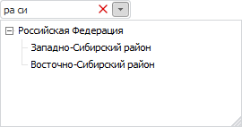
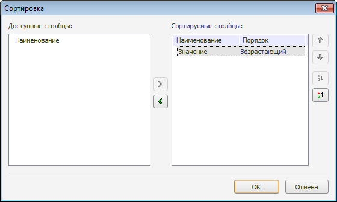
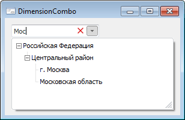

# DimensionCombo: Компонент

DimensionCombo: Компонент
-

# DimensionCombo

## Иерархия наследования

           [IComponent](modforms.chm::/Interface/IComponent/IComponent.htm)

           [IControl](ModForms.chm::/Interface/IControl/IControl.htm)

           [IDimensionViewer](KeExtCtrls.chm::/Interface/IDimensionViewer/IDimensionViewer.htm)

           [IDimensionCombo](KeExtCtrls.chm::/Interface/IDimensionCombo/IDimensionCombo.htm)

           [DimensionCombo](KeExtCtrls.chm::/Class/DimensionCombo/DimensionCombo.htm)

## Описание

Компонент DimensionCombo предназначен
 для отображения элементов справочника в виде раскрывающегося списка.

## Работа с компонентом

Отметка элементов компонента осуществляется при щелчке как по пиктограмме
 элемента, так и по самому элементу либо нажатием клавиши ПРОБЕЛ. Источником
 данных для компонента DimensionCombo
 является компонент [UiDimension](UiDimension.htm).

При двойном щелчке по разделительной линии колонок будет осуществляться
 автоматический подгон по ширине колонки, расположенной слева. Ширина подгоняется
 с учетом всех элементов, которые могут содержаться у вершины (наличие
 экспандера, флажка, пиктограммы и пиктограммы состояния, текста вершины).

Примечание.
 Размеры раскрывающегося списка элементов можно изменять, перетаскивая
 его правую, левую или нижнюю границы при помощи мыши. Минимальная ширина
 раскрывающегося списка равна ширине компонента.

В редакторе компонента по умолчанию отображается информация об отметке
 элементов. За автоматическое обновление этой информации отвечает свойство
 [AutoUpdateInfo](KeExtCtrls.chm::/Interface/IDimensionCombo/IDimensionCombo.AutoUpdateInfo.htm).
 Для отображения пользовательских данных в редакторе компонента необходимо
 изменить базовое свойство [Text](ModForms.chm::/Interface/IControl/IControl.Text.htm).

### Поиск элементов

При развернутом раскрывающемся списке компонента предусмотрены следующие
 виды поиска:

	- При наборе первых символов в наименовании элементов
	 курсор будет переходить к первому найденному элементу. Данный поиск
	 осуществляется циклически и только по элементам, присутствующим в
	 развернутой части иерархии дерева элементов.

	- При помощи строки поиска, которая вызывается при нажатии
	 клавиш F3 либо CTRL+F. После ввода искомой части слова и нажатии
	 клавиши ENTER либо кнопки 
	 будет осуществляться поиск. Поиск осуществляется циклически по всей
	 иерархии элементов.

При удачном поиске курсор будет фокусироваться на найденном элементе.
 Состояние отметки зависит от значения свойства [FindMode](KeExtCtrls.chm::/Interface/IDimensionViewer/IDimensionViewer.FindMode.htm).
 В зависимости от выбранного [режима
 множественной отметки](KeExtCtrls.chm::/Interface/IDimensionViewer/IDimensionViewer.SelectionMode.htm) добавление элемента в отметку осуществляется
 выделением с использованием клавиши ПРОБЕЛ либо выделением с помощью мыши
 при зажатой клавише CTRL.

Также существует возможность поиска при свернутом раскрывающемся списке
 компонента. Когда компонент находится в фокусе, при наборе сочетания символов
 будет формироваться список, отфильтрованный по элементам, содержащим в
 своем наименовании данное сочетание:

Отметка элементов осуществляется так же, как было описано выше, в зависимости
 от установленного значения свойства [SelectionMode](KeExtCtrls.chm::/Interface/IDimensionViewer/IDimensionViewer.SelectionMode.htm).
 После закрытия данного окна отметка будет применена в компоненте.

В строке поиска существует возможность поиска по частям не только одного,
 но и нескольких слов. Для этого искомые сочетания символов разделяются
 пробелом. Порядок слов в наименовании элементов при поиске не учитывается.

### Сортировка данных

Необходимым условием для сортировки данных является установка свойствам
 [ShowColumnHeaders](KeExtCtrls.chm::/Interface/IDimensionViewer/IDimensionViewer.ShowColumnHeaders.htm),
 [Sorted](KeExtCtrls.chm::/Interface/IDimensionViewer/IDimensionViewer.Sorted.htm)
 и [ColumnClick](KeExtCtrls.chm::/Interface/IDimensionViewer/IDimensionViewer.ColumnClick.htm)
 значения True, и свойству [SortType](KeExtCtrls.chm::/Interface/IDimensionViewer/IDimensionViewer.SortType.htm)
 значения, отличного от None.

В режиме выполнения формы для сортировки данных по какому-либо столбцу
 необходимо щелкнуть по заголовку данного столбца. При этом все данные
 будут отсортированы по возрастанию значений. Повторные щелчки будут вызывать
 смену направления сортировки. Для мультисортировки необходимо зажать клавишу
 CTRL и щелкнуть по заголовкам необходимых столбцов. Порядок сортировки
 будет определяться следующим образом: столбец, по заголовку которого был
 осуществлен последний щелчок, будет отсортирован в последнюю очередь.

Также осуществить настройку сортировки можно в специализированном окне
 «Сортировка»:

Данное окно появляется при выборе соответствующего пункта контекстного
 меню, вызываемого в области заголовков колонок.

Примечание.
 Пункт контекстного меню будет доступен, если свойствам [ShowColumnHeaders](KeExtCtrls.chm::/Interface/IDimensionViewer/IDimensionViewer.ShowColumnHeaders.htm)
 и [Sorted](KeExtCtrls.chm::/Interface/IDimensionViewer/IDimensionViewer.Sorted.htm)
 установлено значения True, а свойству
 [SortType](KeExtCtrls.chm::/Interface/IDimensionViewer/IDimensionViewer.SortType.htm)
 значение, отличное от None.

Колонки, по которым будет осуществляться сортировка, необходимо переместить
 в список выбранных. Кнопки  и
  используются для изменения направления
 сортировки по выбранному столбцу. Кнопки  и 
 используются для изменения порядка сортировки. Колонки, расположенные
 вверху списка, будут сортироваться в первую очередь.

В языке Fore для применения
 сортировки необходимо установить свойству [Sorted](KeExtCtrls.chm::/Interface/IDimensionViewer/IDimensionViewer.Sorted.htm)
 значение True и свойству [SortType](KeExtCtrls.chm::/Interface/IDimensionViewer/IDimensionViewer.SortType.htm)
 значение, отличное от None. Колонка, по данным которой осуществляется
 сортировка, указывается в свойстве [SortColumn](KeExtCtrls.chm::/Interface/IDimensionViewer/IDimensionViewer.SortColumn.htm).
 Направление сортировки определяется в свойстве [SortAscending](KeExtCtrls.chm::/Interface/IDimensionViewerColumn/IDimensionViewerColumn.SortAscending.htm)
 соответствующего столбца.

Также для управления сортировкой могут применяться методы [Sort](KeExtCtrls.chm::/Interface/IDimensionViewer/IDimensionViewer.Sort.htm)
 и [SortDefault](KeExtCtrls.chm::/Interface/IDimensionViewer/IDimensionViewer.SortDefault.htm).

### Отображение нескольких атрибутов справочника

По умолчанию в компоненте отображаются значения атрибута с назначением
 - «[Наименование](KeDims.chm::/interface/IDimAttributes/IDimAttributes.Name.htm)».
 Для отображения других атрибутов необходимо свойству [ShowColumnHeaders](KeExtCtrls.chm::/Interface/IDimensionViewer/IDimensionViewer.ShowColumnHeaders.htm)
 установить значение True и настроить
 коллекцию столбцов компонента. Для настройки коллекции нажмите кнопку
 
 в области свойства [Columns](KeExtCtrls.chm::/Interface/IDimensionViewer/IDimensionViewer.Columns.htm)
 или выполните пункт контекстного меню «Колонки».
 По умолчанию список колонок соответствует списку атрибутов в структуре
 справочника. Для столбцов, которые должны отображаться, установите
 в свойстве [Visible](KeExtCtrls.chm::/Interface/IDimensionViewerColumn/IDimensionViewerColumn.Visible.htm)
 значение True. По умолчанию значение
 этого свойства выставляется в соответствии со значением свойства [Visible](KeDims.chm::/interface/IDimAttribute/IDimAttribute.Visible.htm)
 ([Hidden](KeRds.chm::/Interface/IRdsAttribute/IRdsAttribute.Hidden.htm)
 для справочников НСИ) атрибута, с которым связан столбец.

## Пример

## Свойства компонента DimensionCombo

		 Имя свойства
		 Краткое описание

		 
		 [Align](ModForms.chm::/Interface/IControl/IControl.Align.htm)
		 Свойство Align определяет,
		 как поведет себя компонент при изменении размеров содержащего
		 его родительского компонента.

		 
		 [AllowDrag](ModForms.chm::/Interface/IControl/IControl.AllowDrag.htm)
		 Свойство AllowDrag
		 определяет возможность взять у компонента перетаскиваемый объект.

		 
		 [AllowDrop](ModForms.chm::/Interface/IControl/IControl.AllowDrop.htm)
		 Свойство AllowDrop
		 определяет, будет ли возможность у компонента принять перетаскиваемый
		 объект.

		 
		 [Anchors](ModForms.chm::/Interface/IControl/IControl.Anchors.htm)
		 Свойство Anchors возвращает
		 настройки, определяющие в процентном соотношении изменение размеров
		 текущего компонента при изменении размеров родительского компонента.

		 
		 [AnimationType](KeExtCtrls.chm::/Interface/IDimensionCombo/IDimensionCombo.AnimationType.htm)

		 Свойство AnimationType
		 определяет тип анимации, применяемый при разворачивании списка
		 компонента.

		 
		 [AutoCheckParent](KeExtCtrls.chm::/Interface/IDimensionViewer/IDimensionViewer.AutoCheckParent.htm)

		 Свойство AutoCheckParent
		 определяет, будет ли у родительских вершин компонента автоматически
		 устанавливаться неопределенное состояние, если отмечены не все
		 дочерние элементы.

		 
		 [AutoExpandDepth](KeExtCtrls.chm::/Interface/IDimensionViewer/IDimensionViewer.AutoExpandDepth.htm)

		 Свойство AutoExpandDepth
		 определяет номер уровня измерения, который будет автоматически
		 разворачиваться при запуске формы на выполнение.

		 
		 [AutoUpdateInfo](KeExtCtrls.chm::/Interface/IDimensionCombo/IDimensionCombo.AutoUpdateInfo.htm)

		 Свойство AutoUpdateInfo
		 определяет признак автоматического обновления информации об отметке
		 в редакторе компонента.

		 
		 [BorderStyle](KeExtCtrls.chm::/Interface/IDimensionViewer/IDimensionViewer.BorderStyle.htm)

		 Свойство BorderStyle
		 определяет стиль границы компонента.

		 
		 [Brush](ModForms.chm::/Interface/IControl/IControl.Brush.htm)

		 Свойство Brush определяет
		 кисть, используемую для заливки области компонента.

		 
		 [CancelOnEscape](KeExtCtrls.chm::/Interface/IDimensionCombo/IDimensionCombo.CancelOnEscape.htm)

		 Свойство CancelOnEscape
		 определяет, будет ли производиться отмена установленной отметки
		 и закрытие списка при нажатии клавиши ESC.

		 
		 [Checkboxes](KeExtCtrls.chm::/Interface/IDimensionViewer/IDimensionViewer.Checkboxes.htm)

		 Свойство Checkboxes
		 определяет видимость флагов у элементов компонента.

		 
		 [Checked](KeExtCtrls.chm::/Interface/IDimensionViewer/IDimensionViewer.Checked.htm)

		 Свойство Checked определяет
		 признак установки флага у элемента измерения.

		 
		 [CheckState](KeExtCtrls.chm::/Interface/IDimensionViewer/IDimensionViewer.CheckState.htm)

		 Свойство CheckState
		 определяет состояние вершины измерения.

		 
		 [ClientHeight](ModForms.chm::/Interface/IControl/IControl.ClientHeight.htm)

		 Свойство ClientHeight
		 используется для получения или задания высоты клиентской области
		 компонента.

		 
		 [ClientWidth](ModForms.chm::/Interface/IControl/IControl.ClientWidth.htm)

		 Свойство ClientWidth
		 используется для получения или задания ширины клиентской области
		 компонента.

		 
		 [CloseOnClick](KeExtCtrls.chm::/Interface/IDimensionCombo/IDimensionCombo.CloseOnClick.htm)

		 Свойство CloseOnClick
		 определяет, будет ли производиться автоматическое закрытие списка
		 при выборе одного элемента из этого списка.

		 
		 [CloseOnEnter](KeExtCtrls.chm::/Interface/IDimensionCombo/IDimensionCombo.CloseOnEnter.htm)

		 Свойство CloseOnEnter
		 определяет, будет ли производиться закрытие списка и сохранение
		 отметки при нажатии клавиши ENTER.

		 
		 [Color](ModForms.chm::/Interface/IControl/IControl.Color.htm)

		 Свойство Color определяет
		 цвет фона компонента.

		 
		 [ColumnClick](KeExtCtrls.chm::/Interface/IDimensionViewer/IDimensionViewer.ColumnClick.htm)

		 Свойство ColumnClick
		 определяет возможность отображения заголовков столбцов в виде
		 кнопок.

		 
		 [Columns](KeExtCtrls.chm::/Interface/IDimensionViewer/IDimensionViewer.Columns.htm)

		 Свойство Соlumns возвращает
		 коллекцию столбцов компонента.

		 
		 [ComponentCount](ModForms.chm::/Interface/IComponent/IComponent.ComponentCount.htm)

		 Свойство ComponentCount
		 возвращает количество дочерних компонентов.

		 
		 [Components](ModForms.chm::/Interface/IComponent/IComponent.Components.htm)

		 Свойство Components
		 возвращает дочерний компонент.

		 
		 [Cursor](ModForms.chm::/Interface/IControl/IControl.Cursor.htm)

		 Свойство Cursor определяет
		 вид курсора над компонентом.

		 
		 [CustomMultiselectText](KeExtCtrls.chm::/Interface/IDimensionCombo/IDimensionCombo.CustomMultiselectText.htm)

		 Свойство CustomMultiselectText
		 определяет признак использования пользовательского шаблона для
		 формирования текста компонента при множественной отметке.

		 
		 [CustomMultiselectTextTemplate](KeExtCtrls.chm::/Interface/IDimensionCombo/IDimensionCombo.CustomMultiselectTextTemplate.htm)

		 Свойство CustomMultiselectTextTemplate
		 определяет шаблон, в соответствии с которым будет формироваться
		 текст компонента при множественной отметке.

		 
		 [Data](ModForms.chm::/Interface/IComponent/IComponent.Data.htm)

		 Свойство Data предназначено
		 для хранения любых пользовательских данных.

		 
		 [Dimension](KeExtCtrls.chm::/Interface/IDimensionViewer/IDimensionViewer.Dimension.htm)

		 Свойство Dimension
		 определяет наименование компонента [UiDimension](UiDimension.htm) , который
		 будет являться источником данных для компонента.

		 
		 [DimGroup](KeExtCtrls.chm::/Interface/IDimensionViewer/IDimensionViewer.DimGroup.htm)

		 Свойство DimGroup определяет
		 группу элементов справочника, на базе которой будет строиться
		 дерево элементов в компоненте.

		 
		 [DimUpdateTimer](KeExtCtrls.chm::/Interface/IDimensionViewer/IDimensionViewer.DimUpdateTimer.htm)

		 Свойство DimUpdateTimer
		 определяет задержку между выделением элементов и сменой отметки
		 в измерении.

		 
		 [Dropped](KeExtCtrls.chm::/Interface/IDimensionCombo/IDimensionCombo.Dropped.htm)

		 Свойство Dropped возвращает
		 видимость раскрывающегося списка.

		 
		 [DroppedListHeight](KeExtCtrls.chm::/Interface/IDimensionCombo/IDimensionCombo.DroppedListHeight.htm)

		 Свойство DroppedListHeight
		 определяет высоту раскрывающегося списка компонента.

		 
		 [DroppedListWidth](KeExtCtrls.chm::/Interface/IDimensionCombo/IDimensionCombo.DroppedListWidth.htm)

		 Свойство DroppedListWidth
		 определяет ширину раскрывающегося списка компонента.

		 
		 [DroppedPopupMenu](KeExtCtrls.chm::/Interface/IDimensionCombo/IDimensionCombo.DroppedPopupMenu.htm)

		 Свойство DroppedPopupMenu
		 определяет контекстное меню, вызываемое в области раскрывающегося
		 списка компонента.

		 
		 [DropTargetNode](KeExtCtrls.chm::/Interface/IDimensionViewer/IDimensionViewer.DropTargetNode.htm)

		 Свойство DropTargetNode
		 определяет индекс элемента измерения, который подсвечен.

		 
		 [Enabled](ModForms.chm::/Interface/IControl/IControl.Enabled.htm)

		 Свойство Enabled определяет
		 доступность компонента для пользователя.

		 
		 [EnableFindDialog](KeExtCtrls.chm::/Interface/IDimensionViewer/IDimensionViewer.EnableFindDialog.htm)
		 [EnableFindDialog](KeExtCtrls.chm::/Interface/IDimensionViewer/IDimensionViewer.EnableFindDialog.htm)

		 Свойство EnableFindDialog
		 определяет, будет ли вызываться стандартный диалог поиска элементов
		 при нажатии сочетания клавиш CTRL+F или F3.

		 
		 [FindMode](KeExtCtrls.chm::/Interface/IDimensionViewer/IDimensionViewer.FindMode.htm)

		 Свойство FindMode определяет
		 режим отметки найденных элементов.

		 
		 [FilterStyle](KeExtCtrls.chm::/Interface/IDimensionCombo/IDimensionCombo.FilterStyle.htm)

		 Свойство FilterStyle
		 определяет режим построения дерева отфильтрованных элементов.

		 
		 [FindEditVisible](KeExtCtrls.chm::/Interface/IDimensionCombo/IDimensionCombo.FindEditVisible.htm)

		 Свойство FindEditVisible
		 определяет признак отображения строки поиска при развернутом раскрывающемся
		 списке компонента.

		 
		 [Focused](ModForms.chm::/Interface/IControl/IControl.Focused.htm)

		 Свойство Focused возвращает
		 True, если фокус установлен
		 на данном компоненте.

		 
		 [FocusedElement](KeExtCtrls.chm::/Interface/IDimensionViewer/IDimensionViewer.FocusedElement.htm)

		 Свойство FocusedElement
		 определяет индекс элемента измерения, на котором установлен фокус.

		 
		 [Font](ModForms.chm::/Interface/IControl/IControl.Font.htm)

		 Свойство Font определяет
		 множество характеристик, описывающих шрифт, используемый при отображении
		 текста.

		 
		 [GridLines](KeExtCtrls.chm::/Interface/IDimensionViewer/IDimensionViewer.GridLines.htm)

		 Свойство GridLines
		 определяет, будет ли отображаться сетка.

		 
		 [Height](ModForms.chm::/Interface/IControl/IControl.Height.htm)

		 Свойство Height определяет
		 высоту компонента.

		 
		 [HelpContext](ModForms.chm::/Interface/IControl/IControl.HelpContext.htm)

		 Свойство HelpContext
		 определяет уникальный индекс раздела контекстно-зависимой справки
		 для данного компонента.

		 
		 [HideSelection](KeExtCtrls.chm::/Interface/IDimensionViewer/IDimensionViewer.HideSelection.htm)

		 Свойство HideSelection
		 определяет признак отображения отметки в компоненте при передаче
		 фокуса другому компоненту.

		 
		 [Hint](ModForms.chm::/Interface/IControl/IControl.Hint.htm)

		 Свойство Hint определяет
		 текст подсказки для компонента.

		 
		 [HotTrack](KeExtCtrls.chm::/Interface/IDimensionViewer/IDimensionViewer.HotTrack.htm)

		 Свойство HotTrack определяет
		 признак выделения подчеркиванием элемента, над которым проходит
		 указатель мыши.

		 
		 [HotTrackAutoExpand](KeExtCtrls.chm::/Interface/IDimensionViewer/IDimensionViewer.HotTrackAutoExpand.htm)

		 Свойство HotTrackAutoExpand
		 определяет признак изменения состояния дерева дочерних элементов
		 при щелчке по выделенному элементу.

		 
		 [Images](KeExtCtrls.chm::/Interface/IDimensionViewer/IDimensionViewer.Images.htm)

		 Свойство Images определяет
		 имя компонента [ImageList](../02_Additional_components/ImageList.htm)
		 , изображения которого будут использоваться в компоненте.

		 
		 [Left](ModForms.chm::/Interface/IControl/IControl.Left.htm)

		 Свойство Left определяет
		 координату левого края компонента.

		 
		 [Locked](KeExtCtrls.chm::/Interface/IDimensionViewer/IDimensionViewer.Locked.htm)

		 Свойство Locked определяет
		 возможность изменения отметки элементов в компоненте.

		 
		 [Name](ModForms.chm::/Interface/IComponent/IComponent.Name.htm)

		 Свойство Name определяет
		 наименование компонента.

		 
		 [OwnSelection](KeExtCtrls.chm::/Interface/IDimensionViewer/IDimensionViewer.OwnSelection.htm)

		 Свойство OwnSelection
		 определяет необходимость создания копии массива выделения.

		 
		 [Parent](ModForms.chm::/Interface/IControl/IControl.Parent.htm)

		 Свойство Parent
		 определяет родительский компонент.

		 
		 [ParentColor](ModForms.chm::/Interface/IControl/IControl.ParentColor.htm)

		 Свойство ParentColor
		 определяет, будет ли для компонента заимствован цвет родительского
		 компонента.

		 
		 [ParentFont](ModForms.chm::/Interface/IControl/IControl.ParentFont.htm)

		 Свойство ParentFont
		 определяет, будет ли для компонента использоваться шрифт родительского
		 компонента.

		 
		 [ParentShowHint](ModForms.chm::/Interface/IControl/IControl.ParentShowHint.htm)

		 Свойство ParentShowHint
		 определяет признак отображения всплывающей подсказки.

		 
		 [PopupMenu](ModForms.chm::/Interface/IControl/IControl.PopupMenu.htm)

		 Свойство PopupMenu
		 определяет контекстное меню, которое будет появляться по щелчку
		 правой кнопки мыши на компоненте.

		 
		 [RowSelect](KeExtCtrls.chm::/Interface/IDimensionViewer/IDimensionViewer.RowSelect.htm)

		 Свойство RowSelect
		 определяет необходимость выделения выбранного элемента подсветкой
		 всей строки.

		 
		 [Scrolls](ModForms.chm::/Interface/IControl/IControl.Scrolls.htm)

		 Свойство Scrolls возвращает
		 параметры полос прокрутки компонента.

		 
		 [Selection](KeExtCtrls.chm::/Interface/IDimensionViewer/IDimensionViewer.Selection.htm)

		 Свойство Selection
		 определяет отметку элементов в измерении.

		 
		 [SelectionMode](KeExtCtrls.chm::/Interface/IDimensionViewer/IDimensionViewer.SelectionMode.htm)

		 Свойство SelectionMode
		 определяет режим отметки элементов в компоненте.

		 
		 [ShowButtons](KeExtCtrls.chm::/Interface/IDimensionViewer/IDimensionViewer.ShowButtons.htm)

		 Свойство ShowButtons
		 разрешает или запрещает показ кнопок разворачивания и сворачивания
		 дерева потомков вершин.

		 
		 [ShowColumnHeaders](KeExtCtrls.chm::/Interface/IDimensionViewer/IDimensionViewer.ShowColumnHeaders.htm)

		 Свойство ShowColumnHeaders
		 определяет, будут ли отображаться заголовки столбцов.

		 
		 [ShowEditImage](KeExtCtrls.chm::/Interface/IDimensionCombo/IDimensionCombo.ShowEditImage.htm)

		 Свойство ShowEditImage
		 определяет признак отображения пиктограммы элемента в редакторе
		 компонента.

		 
		 [ShowHint](ModForms.chm::/Interface/IControl/IControl.ShowHint.htm)

		 Свойство ShowHint включает
		 и выключает показ всплывающего окна подсказки для компонента.

		 
		 [ShowHints](KeExtCtrls.chm::/Interface/IDimensionViewer/IDimensionViewer.ShowHints.htm)

		 Свойство ShowHints
		 определяет, будет ли появляться подсказка при задержке мыши над
		 одним из элементов компонента.

		 
		 [ShowLines](KeExtCtrls.chm::/Interface/IDimensionViewer/IDimensionViewer.ShowLines.htm)

		 Свойство ShowLines
		 определяет, будет ли отображаться линия, соединяющая вершину с
		 ее потомками.

		 
		 [ShowRoot](KeExtCtrls.chm::/Interface/IDimensionViewer/IDimensionViewer.ShowRoot.htm)

		 Свойство ShowRoot определяет,
		 будут ли отображаться кнопки сворачивания и разворачивания корней
		 деревьев.

		 
		 [ShowSystemHints](KeExtCtrls.chm::/Interface/IDimensionCombo/IDimensionCombo.ShowSystemHints.htm)

		 Свойство ShowSystemHints
		 определяет, будет ли отображаться системная всплывающая подсказка
		 для различных элементов компонента.

		 
		 [SortColumn](KeExtCtrls.chm::/Interface/IDimensionViewer/IDimensionViewer.SortColumn.htm)

		 Свойство SortColumn
		 определяет индекс столбца, по которому будет осуществляться сортировка.

		 
		 [Sorted](KeExtCtrls.chm::/Interface/IDimensionViewer/IDimensionViewer.Sorted.htm)

		 Свойство Sorted определяет
		 возможность сортировки по столбцу, указанному в свойстве [SortColumn](KeExtCtrls.chm::/Interface/IDimensionViewer/IDimensionViewer.SortColumn.htm)
		 .

		 
		 [SortType](KeExtCtrls.chm::/Interface/IDimensionViewer/IDimensionViewer.SortType.htm)

		 Свойство SortType определяет
		 тип сортировки для компонента.

		 
		 [TabOrder](ModForms.chm::/Interface/IControl/IControl.TabOrder.htm)

		 Свойство TabOrder
		 определяет позицию компонента в последовательности табуляции.

		 
		 [TabStop](ModForms.chm::/Interface/IControl/IControl.TabStop.htm)

		 Свойство TabStop
		 определяет признак необходимости компоненту получать фокус при
		 нажатии кнопки «Tab».

		 
		 [Tag](ModForms.chm::/Interface/IComponent/IComponent.Tag.htm)

		 Свойство Tag не используется
		 компилятором. Пользователь может изменить значение свойства Tag и использовать
		 его по своему усмотрению.

		 
		 [Text](ModForms.chm::/Interface/IControl/IControl.Text.htm)

		 Свойство Text
		 определяет строку, идентифицирующую компонент для пользователя.

		 
		 [Top](ModForms.chm::/Interface/IControl/IControl.Top.htm)

		 Свойство Top
		 определяет координату верхнего края компонента в пикселях.

		 
		 [Visible](ModForms.chm::/Interface/IControl/IControl.Visible.htm)

		 Свойство Visible
		 определяет видимость компонента во время выполнения формы.

		 
		 [Width](ModForms.chm::/Interface/IControl/IControl.Width.htm)

		 Свойство Width
		 определяет горизонтальный размер компонента в пикселях.

## Методы компонента DimensionCombo

		 Имя метода
		 Краткое описание

		 
		 [AdjustDroppedListWidth](KeExtCtrls.chm::/Interface/IDimensionCombo/IDimensionCombo.AdjustDroppedListWidth.htm)

		 Метод AdjustDroppedListWidth
		 осуществляет подгонку ширины раскрывающегося списка компонента.

		 
		 [AdjustWidth](KeExtCtrls.chm::/Interface/IDimensionViewer/IDimensionViewer.AdjustWidth.htm)

		 Метод AdjustWidth осуществляет
		 автоматический подгон ширины колонки с учетом её содержимого.

		 
		 [ClientToScreen](ModForms.chm::/Interface/IControl/IControl.ClientToScreen.htm)

		 Метод ClientToScreen
		 преобразовывает координаты точки, указанные относительно системы
		 координат компонента, в экранные координаты.

		 
		 [Collapse](KeExtCtrls.chm::/Interface/IDimensionViewer/IDimensionViewer.Collapse.htm)

		 Метод Collapse осуществляет
		 сворачивание иерархии потомков дерева.

		 
		 [DoDragDrop](ModForms.chm::/Interface/IControl/IControl.DoDragDrop.htm)

		 Метод DoDragDrop позволяет
		 начать операцию перетаскивания.

		 
		 [DropDown](KeExtCtrls.chm::/Interface/IDimensionCombo/IDimensionCombo.DropDown.htm)

		 Метод DropDown осуществляет
		 разворачивание списка элементов компонента.

		 
		 [Expand](KeExtCtrls.chm::/Interface/IDimensionViewer/IDimensionViewer.Expand.htm)

		 Метод Expand осуществляет
		 разворачивание иерархии потомков дерева.

		 
		 [GetCheckedNodes](KeExtCtrls.chm::/Interface/IDimensionViewer/IDimensionViewer.GetCheckedNodes.htm)

		 Метод GetCheckedNodes
		 возвращает коллекцию элементов, отмеченных флагом.

		 
		 [GetImage](ModForms.chm::/Interface/IControl/IControl.GetImage.htm)

		 Метод GetImage возвращает
		 графическое изображение компонента со всеми дочерними компонентами.

		 
		 [GetItemAt](KeExtCtrls.chm::/Interface/IDimensionViewer/IDimensionViewer.GetItemAt.htm)

		 Метод GetItemAt осуществляет
		 проверку наличия элемента в заданной точке клиентской области
		 компонента.

		 
		 [HitTest](KeExtCtrls.chm::/Interface/IDimensionViewer/IDimensionViewer.HitTest.htm)

		 Метод HitTest осуществляет
		 проверку наличия элемента в заданной точке клиентской области
		 компонента и возвращает результат проверки.

		 
		 [MakeVisible](KeExtCtrls.chm::/Interface/IDimensionViewer/IDimensionViewer.MakeVisible.htm)

		 Метод MakeVisible позволяет
		 сделать видимым конкретный элемент.

		 
		 [RollUp](KeExtCtrls.chm::/Interface/IDimensionCombo/IDimensionCombo.RollUp.htm)

		 Метод RollUp осуществляет
		 сворачивание раскрывающегося списка.

		 
		 [ScreenToClient](ModForms.chm::/Interface/IControl/IControl.ScreenToClient.htm)

		 Метод ScreenToClient
		 преобразовывает экранные координаты точки в координаты, указываемые
		 относительно системы координат компонента.

		 
		 [SetFocus](ModForms.chm::/Interface/IControl/IControl.SetFocus.htm)

		 Метод SetFocus устанавливает
		 фокус на данный компонент.

		 
		 [Sort](KeExtCtrls.chm::/Interface/IDimensionViewer/IDimensionViewer.Sort.htm)

		 Метод Sort выполняет
		 сортировку по значениям указанного столбца.

		 
		 [SortDefault](KeExtCtrls.chm::/Interface/IDimensionViewer/IDimensionViewer.SortDefault.htm)

		 Метод SortDefault выполняет
		 сортировку по значениям столбца, индекс которого указан в свойстве
		 [SortColumn](KeExtCtrls.chm::/Interface/IDimensionViewer/IDimensionViewer.SortColumn.htm)
		 .

		 
		 [UpdateInfo](KeExtCtrls.chm::/Interface/IDimensionCombo/IDimensionCombo.UpdateInfo.htm)

		 Метод UpdateInfo производит
		 обновление информации об отметке элементов.

## События компонента DimensionCombo

		 Имя события
		 Краткое описание

		 
		 [OnBeginDrag](ModForms.chm::/Interface/IControl/IControl.OnBeginDrag.htm)

		 Событие OnBeginDrag
		 для компонента наступает, когда пользователь начинает перетаскивать
		 объект от компонента.

		 
		 [OnChecked](KeExtCtrls.chm::/Interface/IDimensionViewer/IDimensionViewer.OnChecked.htm)

		 Событие OnChecked наступает
		 после изменения состояния отметки флага элемента.

		 
		 [OnChecking](KeExtCtrls.chm::/Interface/IDimensionViewer/IDimensionViewer.OnChecking.htm)

		 Событие OnChecking
		 наступает перед изменением состояния отметки флага элемента.

		 
		 [OnClick](ModForms.chm::/Interface/IControl/IControl.OnClick.htm)

		 Событие OnClick наступает,
		 если пользователь осуществил щёлкнул в области компонента.

		 
		 [OnCollapsed](KeExtCtrls.chm::/Interface/IDimensionViewer/IDimensionViewer.OnCollapsed.htm)

		 Событие OnCollapsed
		 наступает после свертывания иерархии потомков вершины дерева.

		 
		 [OnCollapsing](KeExtCtrls.chm::/Interface/IDimensionViewer/IDimensionViewer.OnCollapsing.htm)

		 Событие OnCollapsing
		 наступает начале свертывания иерархии потомков вершины дерева.

		 
		 [OnColumnClick](KeExtCtrls.chm::/Interface/IDimensionViewer/IDimensionViewer.OnColumnClick.htm)

		 Событие OnColumnClick
		 наступает при щелчке кнопкой мыши по одному из столбцов компонента.

		 
		 [OnCompareItems](KeExtCtrls.chm::/Interface/IDimensionViewer/IDimensionViewer.OnCompareItems.htm)

		 Событие OnCompareItems
		 наступает при сравнении двух элементов во время пользовательской
		 сортировки элементов.

		 
		 [OnDblClick](ModForms.chm::/Interface/IControl/IControl.OnDblClick.htm)
		 Событие OnDblClick
		 наступает, если пользователь дважды щёлкнул в области компонента.

		 
		 [OnDragDrop](ModForms.chm::/Interface/IControl/IControl.OnDragDrop.htm)
		 Событие OnDragDrop
		 для компонента наступает, когда пользователь отпускает над ним
		 перетаскиваемый объект.

		 
		 [OnDragEnter](ModForms.chm::/Interface/IControl/IControl.OnDragEnter.htm)
		 Событие OnDragEnter
		 наступает, когда перетаскиваемый объект входит в область данного
		 компонента.

		 
		 [OnDragLeave](ModForms.chm::/Interface/IControl/IControl.OnDragLeave.htm)
		 Событие OnDragLeave
		 наступает, когда перетаскиваемый объект выходит за границы данного
		 компонента.

		 
		 [OnDragOver](ModForms.chm::/Interface/IControl/IControl.OnDragOver.htm)
		 Событие OnDragOver
		 для компонента наступает, когда пользователь протаскивает над
		 ним перетаскиваемый объект.

		 
		 [OnDropDown](KeExtCtrls.chm::/Class/DimensionCombo/DimensionCombo.OnDropDown.htm)

		 Событие OnDropDown
		 наступает при разворачивании списка компонента.

		 
		 [OnEnter](ModForms.chm::/Interface/IControl/IControl.OnEnter.htm)
		 Событие OnEnter наступает
		 в момент получения фокуса компонентом.

		 
		 [OnExit](ModForms.chm::/Interface/IControl/IControl.OnExit.htm)
		 Событие OnExit наступает
		 в момент потери фокуса компонентом.

		 
		 [OnExpanded](KeExtCtrls.chm::/Interface/IDimensionViewer/IDimensionViewer.OnExpanded.htm)
		 Событие OnExpanded
		 наступает после развертывания иерархии потомков вершины дерева.

		 
		 [OnExpanding](KeExtCtrls.chm::/Interface/IDimensionViewer/IDimensionViewer.OnExpanding.htm)
		 Событие OnExpanding
		 наступает непосредственно перед развертыванием иерархии потомков
		 вершины дерева.

		 
		 [OnFocusedChanged](KeExtCtrls.chm::/Interface/IDimensionViewer/IDimensionViewer.OnFocusedChanged.htm)
		 Событие OnFocusedChanged
		 наступает при передаче фокуса другому элементу компонента.

		 
		 [OnGetHint](KeExtCtrls.chm::/Interface/IDimensionViewer/IDimensionViewer.OnGetHint.htm)
		 Событие OnGetHint наступает
		 при появлении подсказки над элементом, где остановился курсор
		 мыши.

		 
		 [OnGetNodeImage](KeExtCtrls.chm::/Interface/IDimensionViewer/IDimensionViewer.OnGetNodeImage.htm)
		 Событие OnGetNodeImage
		 используется при определении изображения возле элемента дерева.

		 
		 [OnHover](KeExtCtrls.chm::/Interface/IDimensionViewer/IDimensionViewer.OnHover.htm)
		 Событие OnHover наступает
		 в момент прохождения курсора мыши над элементом и отметки подчеркиванием
		 элемента компонента.

		 
		 [OnHScroll](ModForms.chm::/Interface/IControl/IControl.OnHScroll.htm)
		 Событие OnHScroll наступает
		 при изменении положения ползунка горизонтальной полосы прокрутки.

		 
		 [OnKeyDown](ModForms.chm::/Interface/IControl/IControl.OnKeyDown.htm)
		 Событие OnKeyDown наступает,
		 если компонент находится в фокусе и производится нажатие на клавиатуру.

		 
		 [OnKeyPress](ModForms.chm::/Interface/IControl/IControl.OnKeyPress.htm)
		 Событие OnKeyPress
		 наступает, если компонент находится в фокусе, при нажатии пользователем
		 символьной клавиши.

		 
		 [OnKeyPreview](ModForms.chm::/Interface/IControl/IControl.OnKeyPreview.htm)
		 Событие OnKeyPreview
		 наступает перед каждым событием, связанным с нажатием клавиш.

		 
		 [OnKeyUp](ModForms.chm::/Interface/IControl/IControl.OnKeyUp.htm)
		 Событие OnKeyUp наступает,
		 если компонент находится в фокусе, при отпускании пользователем
		 любой, ранее нажатой клавиши.

		 
		 [OnMouseDown](ModForms.chm::/Interface/IControl/IControl.OnMouseDown.htm)
		 Событие OnMouseDown
		 наступает, если указатель находится в области компонента и была
		 нажата любая кнопка мыши.

		 
		 [OnMouseEnter](ModForms.chm::/Interface/IControl/IControl.OnMouseEnter.htm)
		 Событие OnMouseEnter
		 наступает в момент входа курсора мыши в область компонента.

		 
		 [OnMouseHover](ModForms.chm::/Interface/IControl/IControl.OnMouseHover.htm)
		 Событие OnMouseHover
		 наступает при задержке курсора мыши в области компонента.

		 
		 [OnMouseLeave](ModForms.chm::/Interface/IControl/IControl.OnMouseLeave.htm)
		 Событие OnMouseLeave
		 наступает в момент выхода курсора мыши за пределы области компонента.

		 
		 [OnMouseMove](ModForms.chm::/Interface/IControl/IControl.OnMouseMove.htm)
		 Событие OnMouseMove
		 наступает при перемещении курсора мыши над компонентом.

		 
		 [OnMouseUp](ModForms.chm::/Interface/IControl/IControl.OnMouseUp.htm)
		 Событие OnMouseUp наступает
		 при отпускании кнопки мыши, когда указатель находится в области
		 компонента.

		 
		 [OnMouseWheel](ModForms.chm::/Interface/IControl/IControl.OnMouseWheel.htm)
		 Событие OnMouseWheel
		 наступает, если компонент находится в фокусе при вращении колеса
		 мыши.

		 
		 [OnRollUp](KeExtCtrls.chm::/Class/DimensionCombo/DimensionCombo.OnRollUp.htm)

		 Событие OnRollUp наступает
		 при сворачивании списка компонента.

		 
		 [OnSelectionChanged](KeExtCtrls.chm::/Interface/IDimensionViewer/IDimensionViewer.OnSelectionChanged.htm)

		 Событие OnSelectionChanged
		 наступает при изменении отметки элементов компонента.

		 
		 [OnVScroll](ModForms.chm::/Interface/IControl/IControl.OnVScroll.htm)

		 Событие OnVScroll наступает
		 при изменении положения ползунка вертикальной полосы прокрутки.

См. также:

[Компоненты доступа
 к данным](03_components_of_the_access_to_data.htm)

		Справочная
		 система на версию 10.9
		 от 18/08/2025,
		 © ООО «ФОРСАЙТ»,
