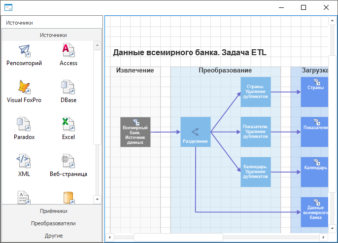

# EtlBox: Компонент

EtlBox: Компонент
-

# EtlBox

## Иерархия наследования

           [IComponent](ModForms.chm::/Interface/IComponent/IComponent.htm)

           [IControl](ModForms.chm::/Interface/IControl/IControl.htm)

           [IEtlBox](KeEtl.chm::/Interface/IEtlBox/IEtlBox.htm)

           [EtlBox](KeEtl.chm::/Class/EtlBox/EtlBox.htm)

## Описание

Компонент EtlBox предназначен
 для отображения данных задач ETL.

## Работа с компонентом

Для работы компонента необходимо в свойстве [Source](KeEtl.chm::/Interface/IEtlBox/IEtlBox.Source.htm)
 задать источник данных, предоставляющий доступ к задаче ETL. В качестве
 значения свойства указывается компонент [UiEtlObject](UiEtlObject.htm).

Используя свойства с префиксом Display,
 можно определить различные параметры отображения рабочего пространства.
 В свойстве [ActiveTool](KeEtl.chm::/Interface/IEtlBox/IEtlBox.ActiveTool.htm)
 задается текущий инструмент задачи ETL. Свойство [View](KeEtl.chm::/Interface/IEtlBox/IEtlBox.View.htm)
 возвращает дополнительные настройки отображения рабочей области задачи
 ETL. Также компонент EtlBox может
 быть связан с компонентом [EtlObjectPanelBox](EtlObjectPanelBox.htm),
 который позволяет создавать новые коннекторы/преобразователи в задаче
 ETL.

## Пример

## Свойства компонента EtlBox

		 Имя свойства
		 Краткое описание

		 
		 [ActiveTool](KeEtl.chm::/Interface/IEtlBox/IEtlBox.ActiveTool.htm)

		 Свойство ActiveTool
		 определяет активный инструмент рабочей области задачи ETL.

		 
		 [Align](ModForms.chm::/Interface/IControl/IControl.Align.htm)

		 Свойство Align определяет,
		 как поведет себя компонент при изменении размеров содержащего
		 его родительского компонента.

		 
		 [AllowDrag](ModForms.chm::/Interface/IControl/IControl.AllowDrag.htm)

		 Свойство AllowDrag
		 определяет возможность взять у компонента перетаскиваемый объект.

		 
		 [AllowDrop](ModForms.chm::/Interface/IControl/IControl.AllowDrop.htm)

		 Свойство AllowDrop
		 определяет будет ли возможность у компонента принять перетаскиваемый
		 объект.

		 
		 [Anchors](ModForms.chm::/Interface/IControl/IControl.Anchors.htm)

		 Свойство Anchors возвращает
		 настройки, определяющие в процентном соотношении изменение размеров
		 текущего компонента при изменении размеров родительского компонента.

		 
		 [BorderStyle](KeEtl.chm::/Interface/IEtlBox/IEtlBox.BorderStyle.htm)

		 Свойство BorderStyle
		 определяет стиль границы компонента.

		 
		 [Brush](ModForms.chm::/Interface/IControl/IControl.Brush.htm)

		 Свойство Brush определяет
		 кисть, используемую для заливки области компонента.

		 
		 [ClientHeight](modforms.chm::/Interface/IControl/IControl.ClientHeight.htm)

		 Свойство ClientHeight
		 используется для получения или задания высоты клиентской области
		 компонента.

		 
		 [ClientWidth](ModForms.chm::/Interface/IControl/IControl.ClientWidth.htm)

		 Свойство ClientWidth
		 используется для получения или задания ширины клиентской области
		 компонента.

		 
		 [Color](ModForms.chm::/Interface/IControl/IControl.Color.htm)

		 Свойство Color определяет
		 цвет фона компонента.

		 
		 [ComponentCount](ModForms.chm::/Interface/IComponent/IComponent.ComponentCount.htm)

		 Свойство ComponentCount
		 возвращает количество дочерних компонентов.

		 
		 [Components](ModForms.chm::/Interface/IComponent/IComponent.Components.htm)

		 Свойство Components
		 возвращает дочерний компонент.

		 
		 [Cursor](ModForms.chm::/Interface/IControl/IControl.Cursor.htm)

		 Свойство Cursor определяет
		 вид курсора, отображаемого при наведении курсора мыши на компонент
		 во время выполнения формы.

		 
		 [Data](ModForms.chm::/Interface/IComponent/IComponent.Data.htm)

		 Свойство Data предназначено
		 для хранения любых пользовательских данных.

		 
		 [DefaultHandlers](KeEtl.chm::/Interface/IEtlBox/IEtlBox.DefaultHandlers.htm)

		 Свойство DefaultHandlers
		 определяет возможность выполнения установленного по умолчанию
		 действия над фигурой в задаче ETL.

		 
		 [DefaultMenu](KeEtl.chm::/Interface/IEtlBox/IEtlBox.DefaultMenu.htm)

		 Свойство DefaultMenu
		 определяет, будет ли доступно системное контекстное меню у объектов
		 задачи ETL и её рабочей области.

		 
		 [DisplayConnectionPoints](KeEtl.chm::/Interface/IEtlBox/IEtlBox.DisplayConnectionPoints.htm)

		 Свойство DisplayConnectionPoints
		 определяет признак отображения точек соединения.

		 
		 [DisplayFocusFrame](KeEtl.chm::/Interface/IEtlBox/IEtlBox.DisplayFocusFrame.htm)

		 Свойство DisplayFocusFrame
		 определяет признак отображения фокуса.

		 
		 [DisplayGrid](KeEtl.chm::/Interface/IEtlBox/IEtlBox.DisplayGrid.htm)

		 Свойство DisplayGrid
		 определяет признак отображения сетки в рабочей области задачи
		 ETL.

		 
		 [DisplayIntersections](KeEtl.chm::/Interface/IEtlBox/IEtlBox.DisplayIntersections.htm)

		 Свойство DisplayIntersections
		 определяет признак отображения пересечений линий.

		 
		 [DisplayScrollBars](KeEtl.chm::/Interface/IEtlBox/IEtlBox.DisplayScrollBars.htm)

		 Свойство DisplayScrollBars
		 определяет признак отображения полос прокрутки в рабочей области
		 задачи ETL.

		 
		 [DisplaySelections](KeEtl.chm::/Interface/IEtlBox/IEtlBox.DisplaySelections.htm)

		 Свойство DisplaySelections
		 определяет признак отображения выделения объектов в рабочей области
		 задачи ETL.

		 
		 [Enabled](ModForms.chm::/Interface/IControl/IControl.Enabled.htm)

		 Свойство Enabled определяет
		 доступность компонента для пользователя.

		 
		 [Focused](ModForms.chm::/Interface/IControl/IControl.Focused.htm)

		 Свойство Focused возвращает
		 True, если фокус установлен
		 на данном компоненте.

		 
		 [Font](ModForms.chm::/Interface/IControl/IControl.Font.htm)

		 Свойство Font определяет
		 параметры шрифта, используемого при отображении текста в компоненте.

		 
		 [Height](ModForms.chm::/Interface/IControl/IControl.Height.htm)

		 Свойство Height определяет
		 высоту компонента в пикселях.

		 
		 [HelpContext](ModForms.chm::/Interface/IControl/IControl.HelpContext.htm)

		 Свойство HelpContext
		 определяет уникальный индекс раздела контекстно-зависимой справки
		 для данного компонента.

		 
		 [Hint](ModForms.chm::/Interface/IControl/IControl.Hint.htm)

		 Свойство Hint определяет
		 текст подсказки для компонента.

		 
		 [HintTimeout](ModForms.chm::/Interface/IControl/IControl.HintTimeout.htm)

		 Свойство HintTimeout
		 определяет время отображения всплывающей подсказки.

		 
		 [Left](ModForms.chm::/Interface/IControl/IControl.Left.htm)

		 Свойство Left определяет
		 координату левого края компонента.

		 
		 [Name](ModForms.chm::/Interface/IComponent/IComponent.Name.htm)

		 Свойство Name определяет
		 наименование компонента.

		 
		 [Parent](ModForms.chm::/Interface/IControl/IControl.Parent.htm)

		 Свойство Parent определяет
		 родительский компонент.

		 
		 [ParentColor](ModForms.chm::/Interface/IControl/IControl.ParentColor.htm)

		 Свойство ParentColor
		 определяет, будет ли для компонента заимствован цвет родительского
		 компонента.

		 
		 [ParentFont](ModForms.chm::/Interface/IControl/IControl.ParentFont.htm)

		 Свойство ParentFont
		 определяет, будет ли для компонента использоваться шрифт родительского
		 компонента.

		 
		 [ParentShowHint](ModForms.chm::/Interface/IControl/IControl.ParentShowHint.htm)

		 Свойство ParentShowHint
		 определяет условие отображения всплывающей подсказки.

		 
		 [PopupMenu](ModForms.chm::/Interface/IControl/IControl.PopupMenu.htm)

		 Свойство PopupMenu
		 определяет контекстное меню для компонента.

		 
		 [ShowHint](ModForms.chm::/Interface/IControl/IControl.ShowHint.htm)

		 Свойство ShowHint определяет,
		 будет ли показываться всплывающая подсказка при задержке курсора
		 мыши над компонентом.

		 
		 [Source](KeEtl.chm::/Interface/IEtlBox/IEtlBox.Source.htm)

		 Свойство Source определяет
		 источник данных для компонента.

		 
		 [TabOrder](ModForms.chm::/Interface/IControl/IControl.TabOrder.htm)

		 Свойство TabOrder определяет
		 позицию компонента в последовательности табуляции.

		 
		 [TabStop](ModForms.chm::/Interface/IControl/IControl.TabStop.htm)

		 Cвойство TabStop определяет
		 признак необходимости компоненту получать фокус при нажатии кнопки
		 «Tab».

		 
		 [Tag](ModForms.chm::/Interface/IComponent/IComponent.Tag.htm)

		 Свойство Tag не используется
		 компилятором. Пользователь может изменить значение свойства Tag и использовать его по своему
		 усмотрению.

		 
		 [Text](ModForms.chm::/Interface/IControl/IControl.Text.htm)

		 Свойство Text определяет
		 строку, идентифицирующую компонент для пользователя.

		 
		 [Top](ModForms.chm::/Interface/IControl/IControl.Top.htm)

		 Свойство Top определяет
		 координату верхнего края компонента.

		 
		 [View](KeEtl.chm::/Interface/IEtlBox/IEtlBox.View.htm)

		 Свойство View определяет
		 настройки отображения рабочей области задачи ETL.

		 
		 [Visible](ModForms.chm::/Interface/IControl/IControl.Visible.htm)

		 Свойство Visible определяет
		 видимость компонента во время выполнения.

		 
		 [Width](ModForms.chm::/Interface/IControl/IControl.Width.htm)

		 Свойство Width определяет
		 ширину компонента в пикселях.

## Методы компонента EtlBox

		 Имя метода
		 Краткое описание

		 
		 [ClientToScreen](ModForms.chm::/Interface/IControl/IControl.ClientToScreen.htm)

		 Метод ClientToScreen
		 преобразовывает координаты точки, указанные относительно системы
		 координат компонента, в экранные координаты.

		 
		 [ConvertPtToView](KeEtl.chm::/Interface/IEtlBox/IEtlBox.ConvertPtToView.htm)

		 Метод ConvertPtToView
		 позволяет получить координаты точки в рабочей области по экранным
		 координатам точки.

		 
		 [DoDragDrop](ModForms.chm::/Interface/IControl/IControl.DoDragDrop.htm)

		 Метод DoDragDrop позволяет
		 начать операцию перетаскивания.

		 
		 [ExecuteTask](KeEtl.chm::/Interface/IEtlBox/IEtlBox.ExecuteTask.htm)

		 Метод ExecuteTask запускает
		 задачу ETL на выполнение.

		 
		 [GetImage](ModForms.chm::/Interface/IControl/IControl.GetImage.htm)

		 Метод GetImage возвращает
		 изображение компонента со всеми дочерними компонентами.

		 
		 [GetShapeByPt](KeEtl.chm::/Interface/IEtlBox/IEtlBox.GetShapeByPt.htm)

		 Метод GetShapeByPt
		 позволяет получить информацию о фигуре по экранным координатам
		 точки, которая находится в пределах фигуры.

		 
		 [OrderOperations](KeEtl.chm::/Interface/IEtlBox/IEtlBox.OrderOperations.htm)

		 Метод OrderOperations
		 вызывает диалог настройки очерёдности выполнения операций.

		 
		 [ScreenToClient](ModForms.chm::/Interface/IControl/IControl.ScreenToClient.htm)

		 Метод ScreenToClient
		 преобразовывает экранные координаты точки в координаты, указываемые
		 относительно системы координат компонента.

		 
		 [SetFocus](ModForms.chm::/Interface/IControl/IControl.SetFocus.htm)

		 Метод SetFocus устанавливает
		 фокус на данный компонент.

		 
		 [UpdateObjectsState](KeEtl.chm::/Interface/IEtlBox/IEtlBox.UpdateObjectsState.htm)

		 Метод UpdateObjectsState
		 обновляет отображение состояния активности цепочек расчета.

## События компонента EtlBox

		 Имя события
		 Краткое описание

		 
		 [OnAfterMoveCP](KeEtl.chm::/Class/EtlBox/EtlBox.OnAfterMoveCP.htm)

		 Событие OnAfterMoveCP
		 наступает после перемещения соединительной точки линии.

		 
		 [OnBeforeMoveCP](KeEtl.chm::/Class/EtlBox/EtlBox.OnBeforeMoveCP.htm)

		 Событие OnBeforeMoveCP наступает
		 перед перемещением соединительной точки линии.

		 
		 [OnBeginDrag](ModForms.chm::/Interface/IControl/IControl.OnBeginDrag.htm)

		 Событие OnBeginDrag
		 для компонента наступает, когда пользователь начинает перетаскивать
		 объект от компонента.

		 
		 [OnClick](ModForms.chm::/Interface/IControl/IControl.OnClick.htm)

		 Событие OnClick наступает,
		 если пользователь щёлкнул в области компонента.

		 
		 [OnControlMove](ModForms.chm::/Interface/IControl/IControl.OnControlMove.htm)

		 Событие OnControlMove
		 наступает при перемещении компонента.

		 
		 [OnControlResize](ModForms.chm::/Interface/IControl/IControl.OnControlResize.htm)

		 Событие OnControlResize
		 наступает при изменении размеров у компонента.

		 
		 [OnDblClick](ModForms.chm::/Interface/IControl/IControl.OnDblClick.htm)

		 Событие OnDblClick
		 наступает, если пользователь дважды щёлкнул в области компонента.

		 
		 [OnDragDrop](ModForms.chm::/Interface/IControl/IControl.OnDragDrop.htm)

		 Событие OnDragDrop
		 для компонента наступает, когда пользователь отпускает над ним
		 перетаскиваемый объект.

		 
		 [OnDragEnter](ModForms.chm::/Interface/IControl/IControl.OnDragEnter.htm)

		 Событие OnDragEnter
		 наступает, когда перетаскиваемый объект входит в границы данного
		 компонента.

		 
		 [OnDragLeave](ModForms.chm::/Interface/IControl/IControl.OnDragLeave.htm)

		 Событие OnDragLeave
		 наступает, когда перетаскиваемый объект выходит за границы данного
		 компонента.

		 
		 [OnDragOver](ModForms.chm::/Interface/IControl/IControl.OnDragOver.htm)

		 Событие OnDragOver
		 для компонента наступает, когда пользователь протаскивает над
		 ним перетаскиваемый объект.

		 
		 [OnEnter](ModForms.chm::/Interface/IControl/IControl.OnEnter.htm)

		 Событие OnEnter наступает
		 в момент получения фокуса компонентом.

		 
		 [OnExit](ModForms.chm::/Interface/IControl/IControl.OnExit.htm)

		 Событие OnExit наступает
		 в момент потери фокуса компонентом.

		 
		 [OnHScroll](ModForms.chm::/Interface/IControl/IControl.OnHScroll.htm)

		 Событие OnHScroll
		 наступает при изменении положения ползунка горизонтальной
		 полосы прокрутки.

		 
		 [OnKeyDown](ModForms.chm::/Interface/IControl/IControl.OnKeyDown.htm)

		 Событие OnKeyDown наступает,
		 если компонент находится в фокусе и производится нажатие на клавиатуру.

		 
		 [OnKeyPress](ModForms.chm::/Interface/IControl/IControl.OnKeyPress.htm)

		 Событие OnKeyPress
		 наступает, если компонент находится в фокусе, при нажатии пользователем
		 символьной клавиши.

		 
		 [OnKeyPreview](ModForms.chm::/Interface/IControl/IControl.OnKeyPreview.htm)

		 Событие OnKeyPreview
		 наступает перед каждым событием, связанным с нажатием клавиш.

		 
		 [OnKeyUp](ModForms.chm::/Interface/IControl/IControl.OnKeyUp.htm)

		 Событие OnKeyUp наступает,
		 если компонент находится в фокусе, при отпускании пользователем
		 любой, ранее нажатой клавиши.

		 
		 [OnMouseDown](ModForms.chm::/Interface/IControl/IControl.OnMouseDown.htm)

		 Событие OnMouseDown
		 наступает, если компонент находится в фокусе и на компоненте произведено
		 нажатие любой из кнопок мыши.

		 
		 [OnMouseEnter](ModForms.chm::/Interface/IControl/IControl.OnMouseEnter.htm)

		 Событие OnMouseEnter
		 наступает в момент входа курсора мыши в область компонента.

		 
		 [OnMouseHover](ModForms.chm::/Interface/IControl/IControl.OnMouseHover.htm)

		 Событие OnMouseHover
		 наступает при задержке курсора мыши в области компонента.

		 
		 [OnMouseLeave](ModForms.chm::/Interface/IControl/IControl.OnMouseLeave.htm)

		 Событие OnMouseLeave
		 наступает в момент выхода курсора мыши за пределы области
		 компонента.

		 
		 [OnMouseMove](ModForms.chm::/Interface/IControl/IControl.OnMouseMove.htm)

		 Событие OnMouseMove
		 наступает при перемещении пользователем курсора мыши над компонентом.

		 
		 [OnMouseUp](ModForms.chm::/Interface/IControl/IControl.OnMouseUp.htm)

		 Событие OnMouseUp наступает,
		 если компонент находится в фокусе и на компоненте, была отпущена
		 любая из ранее нажатых кнопок мыши.

		 
		 [OnMouseWheel](ModForms.chm::/Interface/IControl/IControl.OnMouseWheel.htm)

		 Событие OnMouseWheel
		 наступает, если компонент находится в фокусе при вращении колеса
		 мыши.

		 
		 [OnSelectionChanged](KeEtl.chm::/Class/EtlBox/EtlBox.OnSelectionChanged.htm)

		 Событие OnSelectionChanged
		 наступает при смене выделенного объекта в рабочей области компонента.

		 
		 [OnShapeChanged](KeEtl.chm::/Class/EtlBox/EtlBox.OnShapeChanged.htm)

		 Событие OnShapeChanged
		 наступает после каких-либо изменений, связанных с какой-либо фигурой.

		 
		 [OnVScroll](ModForms.chm::/Interface/IControl/IControl.OnVScroll.htm)

		 Событие OnVScroll
		 наступает при изменении положения ползунка вертикальной
		 полосы прокрутки.

См. также:

[Компоненты
 доступа к данным](03_components_of_the_access_to_data.htm)

		Справочная
		 система на версию 10.9
		 от 18/08/2025,
		 © ООО «ФОРСАЙТ»,
