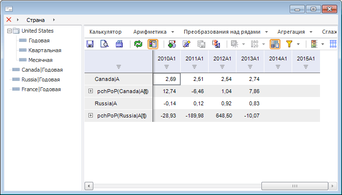

# MetaAttributesBreadcrumb: Компонент

MetaAttributesBreadcrumb: Компонент
-

# MetaAttributesBreadcrumb

## Иерархия наследования

           [IComponent](modforms.chm::/Interface/IComponent/IComponent.htm)

           [IControl](ModForms.chm::/Interface/IControl/IControl.htm)

           [IBreadcrumb](ModForms.chm::/Interface/IBreadcrumb/IBreadcrumb.htm)

           [IMetaAttributesBreadcrumb](KeExtCtrls.chm::/Interface/IMetaAttributesBreadcrumb/IMetaAttributesBreadcrumb.htm)

           [MetaAttributesBreadcrumb](KeExtCtrls.chm::/Class/MetaAttributesBreadcrumb/MetaAttributesBreadcrumb.htm)

## Описание

Компонент MetaAttributesBreadcrumb
 используется для создания цепочки навигации по временным рядам, содержащимся
 в базе данных временных рядов.

## Работа с компонентом

Для подключения компонента необходимо в свойстве [Rubricator](KeExtCtrls.chm::/Interface/IMetaAttributesBreadcrumb/IMetaAttributesBreadcrumb.Rubricator.htm)
 указать базу данных временных рядов, на основе атрибутов которой, будет
 строиться цепочка навигации.

После подключения базы данных временных рядов в компоненте не отображаются
 атрибуты. Для отображения иерархии атрибутов, заданной по умолчанию, используйте
 метод [ApplyDefaultAttriburesOrder](KeExtCtrls.chm::/Interface/IMetaAttributesBreadcrumb/IMetaAttributesBreadcrumb.ApplyDefaultAttriburesOrder.htm).

В компоненте может отображаться атрибут «Период»,
 а также пользовательские обязательные атрибуты, для которых не установлен
 признак [скрытого
 атрибута](KeRds.chm::/Interface/IMetaAttribute/IMetaAttribute.Hidden.htm) и которые ссылаются на справочники НСИ. Для
 изменения списка отображаемых в компоненте атрибутов используются настройки,
 доступные в свойстве [MetaAttributeSettings](KeExtCtrls.chm::/Interface/IMetaAttributesBreadcrumb/IMetaAttributesBreadcrumb.MetaAttributeSettings.htm)
 .

Для управления отображением атрибута «[Ревизии](UiDw.chm::/Revision/Revision_Work.htm)»
 используется свойство [IncludeRevision](KeExtCtrls.chm::/Interface/IMetaAttributesBreadcrumb/IMetaAttributesBreadcrumb.IncludeRevision.htm).

Во время работы с компонентом при изменении комбинации отображаемых
 атрибутов и их отметки для восстановления исходного вида компонента используется
 кнопка . История всех изменений сохраняется.

В компоненте может быть отображен объединенный элемент, состоящий из
 кнопки  и дополнительной кнопки. Для отображения
 этого элемента необходимо свойству [ExtendedRootItem](KeExtCtrls.chm::/Interface/IMetaAttributesBreadcrumb/IMetaAttributesBreadcrumb.ExtendedRootItem.htm)
 установить значение True. Текст
 дополнительной кнопки устанавливается в свойстве [RootText](KeExtCtrls.chm::/Interface/IMetaAttributesBreadcrumb/IMetaAttributesBreadcrumb.RootText.htm).
 Объединенный элемент может быть использован, например, для отображения
 какой-либо информации о базе данных временных рядов, которая подключена
 к компоненту. При щелчке по дополнительной кнопке будет сгенерировано
 событие [OnRootClick](KeExtCtrls.chm::/Class/MetaAttributesBreadcrumb/MetaAttributesBreadcrumb.OnRootClick.htm).

Если свойству [HistoryButton](KeExtCtrls.chm::/Interface/IMetaAttributesBreadcrumb/IMetaAttributesBreadcrumb.HistoryButton.htm)
 установлено значение True, то
 в правой части компонента будет отображаться кнопка, используемая для
 вызова раскрывающегося списка, содержащего записи о ранее установленных
 цепочках навигации по атрибутам справочника.

Свойство [VerticalMode](KeExtCtrls.chm::/Interface/IMetaAttributesBreadcrumb/IMetaAttributesBreadcrumb.VerticalMode.htm)
 управляет расположением элементов в компоненте (вертикально/горизонтально).
 Свойство [BorderStyle](ModForms.chm::/Interface/IBreadcrumb/IBreadcrumb.BorderStyle.htm)
 позволяет изменить стиль границ компонента.

Компонент MetaAttributesBreadcrumb
 может использоваться вместе с компонентом [MetaAttributesTreeList](MetaAttributesTreeList.htm).

## Пример

## Свойства компонента MetaAttributesBreadcrumb

		 Имя свойства
		 Краткое описание

		 
		 [Align](ModForms.chm::/Interface/IControl/IControl.Align.htm)

		 Свойство Align
		 определяет выравнивание компонента в рамках содержащего его родительского
		 компонента.

		 
		 [AllowDrag](ModForms.chm::/Interface/IControl/IControl.AllowDrag.htm)

		 Свойство AllowDrag
		 определяет возможность взять у компонента перетаскиваемый объект.

		 
		 [AllowDrop](ModForms.chm::/Interface/IControl/IControl.AllowDrop.htm)

		 Свойство AllowDrop
		 определяет, будет ли возможность у компонента принять перетаскиваемый
		 объект.

		 
		 [Anchors](ModForms.chm::/Interface/IControl/IControl.Anchors.htm)

		 Свойство Anchors
		 возвращает настройки, определяющие в процентном соотношении изменение
		 размеров текущего компонента при изменении размеров родительского
		 компонента.

		 
		 [BorderStyle](KeExpress.chm::/Interface/IEaxMapBox/IEaxMapBox.BorderStyle.htm)

		 Свойство BorderStyle
		 определяет стиль границы компонента.

		 
		 [Brush](ModForms.chm::/Interface/IControl/IControl.Brush.htm)

		 Свойство Brush
		 определяет кисть, используемую для заливки области компонента.

		 
		 [ClientHeight](ModForms.chm::/Interface/IControl/IControl.ClientHeight.htm)

		 Свойство ClientHeight
		 определяет высоту клиентской области компонента.

		 
		 [ClientWidth](ModForms.chm::/Interface/IControl/IControl.ClientWidth.htm)

		 Свойство ClientWidth
		 определяет ширину клиентской области компонента.

		 
		 [Color](ModForms.chm::/Interface/IControl/IControl.Color.htm)

		 Свойство Color
		 определяет цвет фона компонента.

		 
		 [ComponentCount](ModForms.chm::/Interface/IComponent/IComponent.ComponentCount.htm)

		 Свойство ComponentCount
		 возвращает количество дочерних компонентов.

		 
		 [Components](ModForms.chm::/Interface/IComponent/IComponent.Components.htm)

		 Свойство Components
		 возвращает дочерний компонент.

		 
		 [Cursor](ModForms.chm::/Interface/IControl/IControl.Cursor.htm)

		 Свойство Cursor определяет
		 вид курсора над компонентом.

		 
		 [CustomMultiselectText](KeExtCtrls.chm::/Interface/IMetaAttributesBreadcrumb/IMetaAttributesBreadcrumb.CustomMultiselectText.htm)

		 Свойство CustomMultiselectText
		 определяет признак использования пользовательского шаблона для
		 формирования текста компонента при множественной отметке.

		 
		 [CustomMultiselectTextTemplate](KeExtCtrls.chm::/Interface/IMetaAttributesBreadcrumb/IMetaAttributesBreadcrumb.CustomMultiselectTextTemplate.htm)

		 Свойство CustomMultiselectTextTemplate
		 определяет шаблон, в соответствии с которым будет формироваться
		 текст компонента при множественной отметке.

		 
		 [Data](ModForms.chm::/Interface/IComponent/IComponent.Data.htm)

		 Свойство Data предназначено
		 для хранения любых пользовательских данных.

		 
		 [DeleteButton](ModForms.chm::/Interface/IBreadcrumb/IBreadcrumb.DeleteButton.htm)

		 Свойство DeleteButton
		 определяет признак отображения кнопки, используемой для удаления
		 всех элементов компонента.

		 
		 [Dictionary](KeExtCtrls.chm::/Interface/IMetaAttributesBreadcrumb/IMetaAttributesBreadcrumb.Dictionary.htm)

		 Свойство Dictionary
		 определяет справочник, на который настраивается компонент.

		 
		 [DimensionViewer](KeExtCtrls.chm::/Interface/IMetaAttributesBreadcrumb/IMetaAttributesBreadcrumb.DimensionViewer.htm)

		 Свойство DimensionViewer
		 возвращает объект для работы с раскрывающимся списком компонента.

		 
		 [Enabled](ModForms.chm::/Interface/IControl/IControl.Enabled.htm)

		 Свойство Enabled определяет
		 доступность компонента для пользователя.

		 
		 [ExtendedRootItem](KeExtCtrls.chm::/Interface/IMetaAttributesBreadcrumb/IMetaAttributesBreadcrumb.ExtendedRootItem.htm)

		 Свойство ExtendedRootItem
		 определяет признак отображения в компоненте объединенного элемента.

		 
		 [Focused](ModForms.chm::/Interface/IControl/IControl.Focused.htm)

		 Свойство Focused
		 возвращает True, если
		 фокус установлен на данном компоненте.

		 
		 [Font](ModForms.chm::/Interface/IControl/IControl.Font.htm)

		 Свойство Font
		 определяет параметры шрифта, используемого при отображении текста
		 в компоненте.

		 
		 [Height](ModForms.chm::/Interface/IControl/IControl.Height.htm)

		 Свойство Height
		 определяет высоту компонента в пикселях.

		 
		 [HelpContext](ModForms.chm::/Interface/IControl/IControl.HelpContext.htm)

		 Свойство HelpContext
		 определяет уникальный индекс раздела контекстно-зависимой справки
		 для данного компонента.

		 
		 [Hint](ModForms.chm::/Interface/IControl/IControl.Hint.htm)

		 Свойство Hint
		 определяет текст подсказки, появляющийся при задержке указателя
		 мыши над компонентом.

		 
		 [HistoryButton](KeExtCtrls.chm::/Interface/IMetaAttributesBreadcrumb/IMetaAttributesBreadcrumb.HistoryButton.htm)

		 Свойство HistoryButton
		 определяет признак отображения в компоненте кнопки, позволяющей
		 выбрать комбинацию и отметку атрибутов, которая была установлена
		 ранее.

		 
		 [IncludeRevision](KeExtCtrls.chm::/Interface/IMetaAttributesBreadcrumb/IMetaAttributesBreadcrumb.IncludeRevision.htm)

		 Свойство IncludeRevision
		 определяет признак отображения атрибута с ревизиями в компоненте.

		 
		 [Items](ModForms.chm::/Interface/IBreadcrumb/IBreadcrumb.Items.htm)

		 Свойство Items возвращает
		 коллекцию элементов компонента.

		 
		 [LabelDropDown](KeExtCtrls.chm::/Interface/IMetaAttributesBreadcrumb/IMetaAttributesBreadcrumb.LabelDropDown.htm)

		 Свойство LabelDropDown
		 определяет признак отображения раскрывающегося списка, содержащего
		 список показателей атрибута, при выборе элемента в списке компонента.

		 
		 [Left](ModForms.chm::/Interface/IControl/IControl.Left.htm)

		 Свойство Left определяет
		 координату левого края компонента.

		 
		 [MetaAttributes](KeExtCtrls.chm::/Interface/IMetaAttributesBreadcrumb/IMetaAttributesBreadcrumb.MetaAttributes.htm)

		 Свойство MetaAttributes
		 определяет атрибуты базы данных временных рядов, отображаемые
		 в компоненте.

		 
		 [Name](ModForms.chm::/Interface/IComponent/IComponent.Name.htm)

		 Свойство Name определяет
		 наименование компонента.

		 
		 [Parent](ModForms.chm::/Interface/IControl/IControl.Parent.htm)

		 Свойство Parent
		 определяет родительский компонент.

		 
		 [ParentColor](ModForms.chm::/Interface/IControl/IControl.ParentColor.htm)

		 Свойство ParentColor
		 определяет, будет ли для компонента заимствован цвет родительского
		 компонента.

		 
		 [ParentFont](ModForms.chm::/Interface/IControl/IControl.ParentFont.htm)

		 Свойство ParentFont
		 определяет, будет ли для компонента использоваться шрифт родительского
		 компонента.

		 
		 [ParentShowHint](ModForms.chm::/Interface/IControl/IControl.ParentShowHint.htm)

		 Свойство ParentShowHint
		 определяет признак отображения всплывающей подсказки.

		 
		 [PopupMenu](ModForms.chm::/Interface/IControl/IControl.PopupMenu.htm)

		 Свойство PopupMenu
		 определяет контекстное меню, которое будет появляться по щелчку
		 правой кнопки мыши на компоненте.

		 
		 [ReadOnly](KeExtCtrls.chm::/Interface/IMetaAttributesBreadcrumb/IMetaAttributesBreadcrumb.ReadOnly.htm)

		 Свойство ReadOnly определяет
		 запрет изменения настроек компонента через визуальный интерфейс.

		 
		 [RootHint](KeExtCtrls.chm::/Interface/IMetaAttributesBreadcrumb/IMetaAttributesBreadcrumb.RootHint.htm)

		 Свойство RootHint определяет
		 текст всплывающей подсказки для дополнительной кнопки объединенного
		 элемента.

		 
		 [RootText](KeExtCtrls.chm::/Interface/IMetaAttributesBreadcrumb/IMetaAttributesBreadcrumb.RootText.htm)

		 Свойство RootText определяет
		 текст для дополнительной кнопки объединенного элемента.

		 
		 [Rubricator](KeExtCtrls.chm::/Interface/IMetaAttributesBreadcrumb/IMetaAttributesBreadcrumb.Rubricator.htm)

		 Свойство Rubricator
		 определяет базу данных временных рядов, данные которой будут отображаться
		 в компоненте.

		 
		 [ScrollLeft](ModForms.chm::/Interface/IBreadcrumb/IBreadcrumb.ScrollLeft.htm)

		 Свойство находится в стадии разработки.

		 
		 [ScrollRight](ModForms.chm::/Interface/IBreadcrumb/IBreadcrumb.ScrollRight.htm)

		 Свойство находится в стадии разработки.

		 
		 [Scrolls](ModForms.chm::/Interface/IControl/IControl.Scrolls.htm)

		 Свойство Scrolls возвращает
		 параметры полос прокрутки компонента.

		 
		 [SelectionMode](KeExtCtrls.chm::/Interface/IMetaAttributesBreadcrumb/IMetaAttributesBreadcrumb.SelectionMode.htm)

		 Свойство SelectionMode
		 определяет режим отметки показателей по атрибутам, отображаемым
		 в компоненте.

		 
		 [ShowColumnHeaders](KeExtCtrls.chm::/Interface/IMetaAttributesBreadcrumb/IMetaAttributesBreadcrumb.ShowColumnHeaders.htm)

		 Свойство ShowColumnHeaders
		 определяет признак отображения заголовков столбцов в раскрывающемся
		 списке значений атрибутов базы данных временных рядов показателей.

		 
		 [ShowHint](ModForms.chm::/Interface/IControl/IControl.ShowHint.htm)

		 Свойство ShowHint включает
		 и выключает показ всплывающего окна подсказки для компонента.

		 
		 [StartDownButton](ModForms.chm::/Interface/IBreadcrumb/IBreadcrumb.StartDownButton.htm)

		 Свойство StartDownButton
		 определяет признак отображения дополнительной кнопки после кнопки
		 удаления элементов.

		 
		 [Suffix](ModForms.chm::/Interface/IBreadcrumb/IBreadcrumb.Suffix.htm)

		 Свойство Suffix определяет
		 вспомогательный текст, отображаемый в области компонента после
		 цепочки навигации.

		 
		 [TabOrder](ModForms.chm::/Interface/IControl/IControl.TabOrder.htm)

		 Свойство TabOrder
		 определяет позицию компонента в последовательности табуляции.

		 
		 [TabStop](ModForms.chm::/Interface/IControl/IControl.TabStop.htm)

		 Свойство TabStop
		 определяет признак необходимости компоненту получать фокус при
		 нажатии кнопки «Tab».

		 
		 [Tag](ModForms.chm::/Interface/IComponent/IComponent.Tag.htm)

		 Свойство Tag не используется
		 компилятором. Пользователь может изменить значение свойства Tag и использовать
		 его по своему усмотрению.

		 
		 [Text](ModForms.chm::/Interface/IControl/IControl.Text.htm)

		 Свойство Text
		 определяет строку, идентифицирующую компонент для пользователя.

		 
		 [Top](ModForms.chm::/Interface/IControl/IControl.Top.htm)

		 Свойство Top
		 определяет координату верхнего края компонента в пикселях.

		 
		 [VerticalMode](KeExtCtrls.chm::/Interface/IMetaAttributesBreadcrumb/IMetaAttributesBreadcrumb.VerticalMode.htm)

		 Свойство VerticalMode
		 определяет режим расположения элементов в компоненте.

		 
		 [Visible](ModForms.chm::/Interface/IControl/IControl.Visible.htm)

		 Свойство Visible определяет
		 видимость компонента во время выполнения.

		 
		 [Width](ModForms.chm::/Interface/IControl/IControl.Width.htm)

		 Свойство Width определяет
		 ширину компонента.

## Методы компонента MetaAttributesBreadcrumb

		 Имя метода
		 Краткое описание

		 
		 [ApplyDefaultAttriburesOrder](KeExtCtrls.chm::/Interface/IMetaAttributesBreadcrumb/IMetaAttributesBreadcrumb.ApplyDefaultAttriburesOrder.htm)

		 Метод ApplyDefaultAttriburesOrder
		 применяет иерархию атрибутов, заданную по умолчанию.

		 
		 [BeginUpdate](ModForms.chm::/Interface/IBreadcrumb/IBreadcrumb.BeginUpdate.htm)

		 Метод BeginUpdate запрещает
		 перерисовку компонента.

		 
		 [ClientToScreen](ModForms.chm::/Interface/IControl/IControl.ClientToScreen.htm)

		 Метод ClientToScreen
		 преобразовывает координаты точки, указанные относительно системы
		 координат компонента, в экранные координаты.

		 
		 [DoDragDrop](ModForms.chm::/Interface/IControl/IControl.DoDragDrop.htm)

		 Метод DoDragDrop позволяет
		 начать операцию перетаскивания.

		 
		 [EndUpdate](ModForms.chm::/Interface/IBreadcrumb/IBreadcrumb.EndUpdate.htm)

		 Метод EndUpdate снимает
		 запрет на перерисовку объекта.

		 
		 [GetAttributeValue](KeExtCtrls.chm::/Interface/IMetaAttributesBreadcrumb/IMetaAttributesBreadcrumb.GetAttributeValue.htm)

		 Метод GetAttributeValue
		 возвращает отметку показателей по указанному атрибуту.

		 
		 [GetSelectionSet](KeExtCtrls.chm::/Interface/IMetaAttributesBreadcrumb/IMetaAttributesBreadcrumb.GetSelectionSet.htm)

		 Метод GetSelectionSet
		 возвращает отметку показателей по атрибутам, входящим в цепочку
		 навигации компонента.

		 
		 [GetImage](ModForms.chm::/Interface/IControl/IControl.GetImage.htm)

		 Метод GetImage возвращает
		 изображение компонента со всеми дочерними компонентами.

		 
		 [HitTest](ModForms.chm::/Interface/IBreadcrumb/IBreadcrumb.HitTest.htm)

		 Метод HitTest позволяет
		 получить элемент компонента в заданной точке.

		 
		 [LoadState](ModForms.chm::/Interface/IBreadcrumb/IBreadcrumb.LoadState.htm)

		 Метод LoadState осуществляет
		 загрузку состояния элементов компонента.

		 
		 [Refresh](KeExtCtrls.chm::/Interface/IMetaAttributesBreadcrumb/IMetaAttributesBreadcrumb.Refresh.htm)

		 Метод Refresh осуществляет
		 обновление данных по всем атрибутам, отображаемым в цепочке компонента.

		 
		 [SaveState](ModForms.chm::/Interface/IBreadcrumb/IBreadcrumb.SaveState.htm)

		 Метод SaveState осуществляет
		 сохранение состояния элементов компонента.

		 
		 [ScreenToClient](ModForms.chm::/Interface/IControl/IControl.ScreenToClient.htm)

		 Метод ScreenToClient
		 преобразовывает экранные координаты точки в координаты, указываемые
		 относительно системы координат компонента.

		 
		 [SetAttributeValue](KeExtCtrls.chm::/Interface/IMetaAttributesBreadcrumb/IMetaAttributesBreadcrumb.SetAttributeValue.htm)

		 Метод SetAttributeValue
		 устанавливает отметку показателей по указанному атрибуту.

		 
		 [SetFocus](ModForms.chm::/Interface/IControl/IControl.SetFocus.htm)

		 Метод SetFocus устанавливает
		 фокус на данный компонент.

		 
		 [SetSelectionSet](KeExtCtrls.chm::/Interface/IMetaAttributesBreadcrumb/IMetaAttributesBreadcrumb.SetSelectionSet.htm)

		 Метод SetSelectionSet
		 осуществляет установку отметки показателей по атрибутам, входящим
		 в цепочку навигации компонента.

## События компонента MetaAttributesBreadcrumb

		 Имя события
		 Краткое описание

		 
		 [OnAddItem](ModForms.chm::/Class/Breadcrumb/Breadcrumb.OnAddItem.htm)

		 Событие OnAddItem наступает
		 при добавлении нового элемента в коллекцию элементов компонента.

		 
		 [OnBeforeAddItem](ModForms.chm::/Class/Breadcrumb/Breadcrumb.OnBeforeAddItem.htm)

		 Событие OnBeforeAddItem
		 наступает перед добавлением нового элемента в коллекцию элементов
		 компонента.

		 
		 [OnBeforeMoveItem](ModForms.chm::/Class/Breadcrumb/Breadcrumb.OnBeforeMoveItem.htm)

		 Событие OnBeforeMoveItem
		 наступает перед перемещением элемента компонента.

		 
		 [OnBeforeRemoveItem](ModForms.chm::/Class/Breadcrumb/Breadcrumb.OnBeforeRemoveItem.htm)

		 Событие OnBeforeRemoveItem
		 наступает перед удалением элемента компонента.

		 
		 [OnBeforeReplaceItem](KeExtCtrls.chm::/Class/MetaAttributesBreadcrumb/MetaAttributesBreadcrumb.OnBeforeReplaceItem.htm)

		 Событие OnBeforeReplaceItem
		 наступает перед заменой элементов в компоненте.

		 
		 [OnBeginDrag](ModForms.chm::/Interface/IControl/IControl.OnBeginDrag.htm)

		 Событие OnBeginDrag
		 для компонента наступает, когда пользователь начинает перетаскивать
		 объект от компонента.

		 
		 [OnButtonClick](ModForms.chm::/Class/Breadcrumb/Breadcrumb.OnButtonClick.htm)

		 Событие OnButtonClick
		 наступает при щелчке кнопкой мыши по дополнительной кнопке, отображаемой
		 рядом с наименованием элемента.

		 
		 [OnChangeSelection](KeExtCtrls.chm::/Class/MetaAttributesBreadcrumb/MetaAttributesBreadcrumb.OnChangeSelection.htm)

		 Событие OnChangeSelection
		 возникает при изменении отметки элементов по какому-либо атрибуту.

		 
		 [OnClick](ModForms.chm::/Interface/IControl/IControl.OnClick.htm)

		 Событие OnClick наступает,
		 если пользователь щёлкнул в области компонента.

		 
		 [OnDblClick](ModForms.chm::/Interface/IControl/IControl.OnDblClick.htm)

		 Событие OnDblClick
		 наступает, если пользователь дважды щёлкнул в области компонента.

		 
		 [OnDragDrop](ModForms.chm::/Interface/IControl/IControl.OnDragDrop.htm)

		 Событие OnDragDrop
		 для компонента наступает, когда пользователь отпускает над ним
		 перетаскиваемый объект.

		 
		 [OnDragEnter](ModForms.chm::/Interface/IControl/IControl.OnDragEnter.htm)

		 Событие OnDragEnter
		 наступает, когда перетаскиваемый объект входит в границы данного
		 компонента.

		 
		 [OnDragLeave](ModForms.chm::/Interface/IControl/IControl.OnDragLeave.htm)

		 Событие OnDragLeave
		 наступает, когда перетаскиваемый объект выходит за границы данного
		 компонента.

		 
		 [OnDragOver](ModForms.chm::/Interface/IControl/IControl.OnDragOver.htm)

		 Событие OnDragOver
		 для компонента наступает, когда пользователь протаскивает над
		 ним перетаскиваемый объект.

		 
		 [OnDropDown](KeExtCtrls.chm::/Class/MetaAttributesBreadcrumb/MetaAttributesBreadcrumb.OnDropDown.htm)

		 Событие OnDropDown
		 наступает при разворачивании списка элементов атрибута, которому
		 соответствует какой-либо элемент компонента.

		 
		 [OnEnter](ModForms.chm::/Interface/IControl/IControl.OnEnter.htm)

		 Событие OnEnter наступает
		 в момент получения фокуса компонентом.

		 
		 [OnExit](ModForms.chm::/Interface/IControl/IControl.OnExit.htm)

		 Событие OnExit наступает
		 в момент потери фокуса компонентом.

		 
		 [OnGetPopupMenu](ModForms.chm::/Class/Breadcrumb/Breadcrumb.OnGetPopupMenu.htm)

		 Событие OnGetPopupMenu
		 наступает при вызове контекстного меню для элемента компонента.

		 
		 [OnHScroll](ModForms.chm::/Interface/IControl/IControl.OnHScroll.htm)

		 Событие OnHScroll наступает
		 при изменении положения ползунка горизонтальной полосы прокрутки.

		 
		 [OnItemClick](ModForms.chm::/Class/Breadcrumb/Breadcrumb.OnItemClick.htm)

		 Событие OnItemClick
		 наступает при щелчке кнопкой мыши по элементу компонента.

		 
		 [OnKeyDown](ModForms.chm::/Interface/IControl/IControl.OnKeyDown.htm)

		 Событие OnKeyDown наступает,
		 если компонент находится в фокусе и производится нажатие на клавиатуру.

		 
		 [OnKeyPress](ModForms.chm::/Interface/IControl/IControl.OnKeyPress.htm)

		 Событие OnKeyPress
		 наступает, если компонент находится в фокусе, при нажатии пользователем
		 символьной клавиши.

		 
		 [OnKeyPreview](ModForms.chm::/Interface/IControl/IControl.OnKeyPreview.htm)

		 Событие OnKeyPreview
		 наступает перед каждым событием, связанным с нажатием клавиш.

		 
		 [OnKeyUp](ModForms.chm::/Interface/IControl/IControl.OnKeyUp.htm)

		 Событие OnKeyUp наступает,
		 если компонент находится в фокусе, при отпускании пользователем
		 любой, ранее нажатой клавиши.

		 
		 [OnMetaAttributeParam](KeExtCtrls.chm::/Class/MetaAttributesBreadcrumb/MetaAttributesBreadcrumb.OnMetaAttributeParam.htm)

		 Событие OnMetaAttributeParam
		 наступает при установке в качестве значения атрибута какого-либо
		 параметра.

		 
		 [OnMouseDown](ModForms.chm::/Interface/IControl/IControl.OnMouseDown.htm)

		 Событие OnMouseDown
		 наступает, если компонент находится в фокусе, и на компоненте
		 произведено нажатие любой из кнопок мыши.

		 
		 [OnMouseEnter](ModForms.chm::/Interface/IControl/IControl.OnMouseEnter.htm)
		 Событие OnMouseEnter
		 наступает в момент входа курсора мыши в область компонента.

		 
		 [OnMouseHover](ModForms.chm::/Interface/IControl/IControl.OnMouseHover.htm)
		 Событие OnMouseHover
		 наступает при задержке курсора мыши в области компонента.

		 
		 [OnMouseLeave](ModForms.chm::/Interface/IControl/IControl.OnMouseLeave.htm)
		 Событие OnMouseLeave
		 наступает в момент выхода курсора мыши за пределы области компонента.

		 
		 [OnMouseMove](ModForms.chm::/Interface/IControl/IControl.OnMouseMove.htm)

		 Событие OnMouseMove
		 наступает при перемещении пользователем курсора мыши над компонентом.

		 
		 [OnMouseUp](ModForms.chm::/Interface/IControl/IControl.OnMouseUp.htm)

		 Событие OnMouseUp наступает,
		 если компонент находится в фокусе и на компоненте была отпущена
		 любая из ранее нажатых кнопок мыши.

		 
		 [OnMouseWheel](ModForms.chm::/Interface/IControl/IControl.OnMouseWheel.htm)

		 Событие OnMouseWheel
		 наступает, если компонент находится в фокусе при вращении колеса
		 мыши.

		 
		 [OnMoveItem](ModForms.chm::/Class/Breadcrumb/Breadcrumb.OnMoveItem.htm)

		 Событие OnMoveItem
		 наступает при перемещении элемента компонента.

		 
		 [OnRemoveItem](ModForms.chm::/Class/Breadcrumb/Breadcrumb.OnRemoveItem.htm)

		 Событие OnRemoveItem
		 наступает при удалении элемента компонента.

		 
		 [OnReplaceItem](KeExtCtrls.chm::/Class/MetaAttributesBreadcrumb/MetaAttributesBreadcrumb.OnReplaceItem.htm)

		 Событие OnReplaceItem
		 наступает после замены элементов в компоненте.

		 
		 [OnRollUp](KeExtCtrls.chm::/Class/MetaAttributesBreadcrumb/MetaAttributesBreadcrumb.OnRollUp.htm)

		 Событие OnRollUp наступает
		 после сворачивания списка элементов атрибута, которому соответствует
		 какой-либо элемент компонента.

		 
		 [OnRootClick](KeExtCtrls.chm::/Class/MetaAttributesBreadcrumb/MetaAttributesBreadcrumb.OnRootClick.htm)

		 Событие OnRootClick
		 наступает при щелчке по дополнительной кнопке объединенного элемента.

		 
		 [OnVScroll](ModForms.chm::/Interface/IControl/IControl.OnVScroll.htm)

		 Событие OnVScroll наступает
		 при изменении положения ползунка вертикальной полосы прокрутки.

См. также:

[Компоненты доступа
 к данным](03_components_of_the_access_to_data.htm)

		Справочная
		 система на версию 10.9
		 от 18/08/2025,
		 © ООО «ФОРСАЙТ»,
