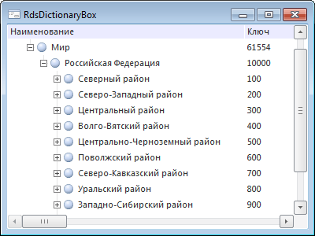

# RdsDictionaryBox: Компонент

RdsDictionaryBox: Компонент
-

# RdsDictionaryBox

## Иерархия наследования

           [IComponent](ModForms.chm::/Interface/IComponent/IComponent.htm)

           [IControl](ModForms.chm::/Interface/IControl/IControl.htm)

           [IRdsDictionaryBox](KeRds.chm::/Interface/IRdsDictionaryBox/IRdsDictionaryBox.htm)

           [RdsDictionaryBox](KeRds.chm::/Class/RdsDictionaryBox/RdsDictionaryBox.htm)

## Описание

Компонент RdsDictionaryBox используется
 для отображения и редактирования справочников НСИ.

## Работа с компонентом

Для работы компонента необходимо в свойстве [Source](KeRds.chm::/Interface/IRdsDictionaryBox/IRdsDictionaryBox.Source.htm)
 задать источник данных, предоставляющий справочник НСИ. В качестве значения
 свойства указывается компонент [UiRdsDictionary](UiRdsDictionary.htm).

Для редактирования списка элементов справочника НСИ используйте методы
 компонента RdsDictionaryBox или [UiRdsDictionary](UiRdsDictionary.htm).
 Если предполагается работа с экземпляром справочника НСИ, описываемым
 интерфейсом [IRdsDictionaryInstance](KeRds.chm::/Interface/IRdsDictionaryInstance/IRdsDictionaryInstance.htm),
 то экземпляр справочника должен быть получен через свойство RdsDictionaryBox.[Source](KeRds.chm::/Interface/IRdsDictionaryBox/IRdsDictionaryBox.Source.htm).[Instance](KeRds.chm::/Interface/IRdsDictionarySource/IRdsDictionarySource.Instance.htm). После выполнения
 каких-либо действий с элементами для обновления дерева элементов в компоненте
 RdsDictionaryBox используйте метод [RdsDictionaryBox.RefreshElements](KeRds.chm::/Interface/IRdsDictionaryBox/IRdsDictionaryBox.RefreshElements.htm)/[UiRdsDictionary.Refresh](KeExtCtrls.chm::/Interface/IUiDataSet/IUiDataSet.Refresh.htm).
 Данные методы не переоткрывают справочник НСИ, а выполняют обновление
 дерева элементов для текущего экземпляра справочника, с которым осуществляется
 работа в компоненте. Если предполагается, что справочник НСИ может быть
 параллельно изменён каким-либо другим образом, например, другим пользователем
 или каким-либо параллельно выполняемым кодом, то для обновления содержимого
 в компоненте RdsDictionaryBox необходимо переоткрыть справочник. Для этого
 у компонента [UiRdsDictionary](UiRdsDictionary.htm)
 свойству [Active](KeExtCtrls.chm::/Interface/IUiDataSet/IUiDataSet.Active.htm)
 установите значение False и затем
 True:

UiRdsDictionary1.Active := False;

UiRdsDictionary1.Active := True;

### Поиск элементов

В компоненте предусмотрены следующие виды поиска:

	- Поиск по введенным
	 символам. При наборе первых символов в наименовании элементов
	 курсор будет переходить к первому найденному элементу. Данный вид
	 поиска выполняется циклически и только по элементам, присутствующим
	 в развернутой части иерархии дерева элементов;

	- Поиск с помощью диалога
	 поиска. Диалог поиска вызывается нажатием сочетания клавиш CTRL+F. Введите
	 текст в строку поиска и нажмите клавишу ENTER или кнопку «Найти далее».
	 Будет произведен поиск, фокус ввода будет переведен на найденный элемент.
	 Поиск выполняется циклически по всей иерархии элементов.

	Кнопка «Дополнительно» позволяет настроить расширенные параметры поиска.

	Кнопка «Найти все» отображает в нижней части диалога список всех элементов,
	 удовлетворяющих условиям поиска. Отметка элементов в списке приведет
	 к отметке элементов в компоненте. Если найденные элементы уже включены
	 в отметку компонента, то они также будут отмечены и в списке. Режим
	 отметки в списке соответствует режиму отметки в компоненте.

	Если диалог поиска вызывался и был закрыт, то поиск элементов по заданным
	 параметрам можно продолжить нажатием клавиши F3.

	В диалоге поиска существует возможность поиска по частям нескольких
	 слов. Для этого искомые сочетания разделяются пробелом. При поиске
	 порядок слов в наименовании элементов не учитывается.

## Пример

## Свойства компонента RdsDictionaryBox

		 Имя свойства
		 Краткое описание

		 
		 [Align](ModForms.chm::/Interface/IControl/IControl.Align.htm)
		 Свойство Align определяет,
		 как поведет себя компонент при изменении размеров содержащего
		 его родительского компонента.

		 
		 [AllowDrag](ModForms.chm::/Interface/IControl/IControl.AllowDrag.htm)
		 Свойство AllowDrag
		 определяет возможность взять у компонента перетаскиваемый объект.

		 
		 [AllowDrop](ModForms.chm::/Interface/IControl/IControl.AllowDrop.htm)
		 Свойство AllowDrop
		 определяет, будет ли возможность у компонента принять перетаскиваемый
		 объект.

		 
		 [Anchors](ModForms.chm::/Interface/IControl/IControl.Anchors.htm)
		 Свойство Anchors возвращает
		 настройки, определяющие в процентном соотношении изменение размеров
		 текущего компонента при изменении размеров родительского компонента.

		 
		 [Brush](ModForms.chm::/Interface/IControl/IControl.Brush.htm)
		 Свойство Brush определяет
		 кисть, используемую для заливки области компонента.

		 
		 [CanElementDown](KeRds.chm::/Interface/IRdsDictionaryBox/IRdsDictionaryBox.CanElementDown.htm)
		 Свойство CanElementDown
		 возвращает признак возможности перемещения выделенных элементов
		 на одну позицию вниз.

		 
		 [CanElementLevelUp](KeRds.chm::/Interface/IRdsDictionaryBox/IRdsDictionaryBox.CanElementLevelUp.htm)
		 Свойство CanElementLevelUp
		 возвращает признак возможности перемещения выделенных элементов
		 на один уровень вверх.

		 
		 [CanElementUp](KeRds.chm::/Interface/IRdsDictionaryBox/IRdsDictionaryBox.CanElementUp.htm)
		 Свойство CanElementUp
		 возвращает признак возможности перемещения выделенных элементов
		 на одну позицию вверх.

		 
		 [ClientHeight](ModForms.chm::/Interface/IControl/IControl.ClientHeight.htm)
		 Свойство ClientHeight
		 используется для получения или задания высоты клиентской области
		 компонента.

		 
		 [ClientWidth](ModForms.chm::/Interface/IControl/IControl.ClientWidth.htm)
		 Свойство ClientWidth
		 используется для получения или задания ширины клиентской области
		 компонента.

		 
		 [Color](ModForms.chm::/Interface/IControl/IControl.Color.htm)
		 Свойство Color определяет
		 цвет фона компонента.

		 
		 [Columns](KeRds.chm::/Interface/IRdsDictionaryBox/IRdsDictionaryBox.Columns.htm)
		 Свойство Columns возвращает
		 коллекцию столбцов справочника НСИ, отображаемого в компоненте.

		 
		 [ComponentCount](ModForms.chm::/Interface/icomponent/icomponent.ComponentCount.htm)
		 Свойство ComponentCount
		 возвращает количество дочерних компонентов.

		 
		 [Components](ModForms.chm::/Interface/icomponent/icomponent.Components.htm)
		 Свойство Components
		 возвращает дочерний компонент.

		 
		 [Cursor](ModForms.chm::/Interface/IControl/IControl.Cursor.htm)
		 Свойство Cursor определяет
		 вид курсора над компонентом.

		 
		 [Data](ModForms.chm::/Interface/icomponent/icomponent.Data.htm)
		 Свойство Data предназначено
		 для хранения любых пользовательских данных.

		 
		 [Enabled](ModForms.chm::/Interface/IControl/IControl.Enabled.htm)
		 Свойство Enabled определяет
		 доступность компонента для пользователя.

		 
		 [FindResultsMenu](KeRds.chm::/Interface/IRdsDictionaryBox/IRdsDictionaryBox.FindResultsMenu.htm)
		 Свойство FindResultsMenu
		 определяет, отображается ли в диалоге поиска контекстное
		 меню для найденных элементов.

		 
		 [Focused](ModForms.chm::/Interface/IControl/IControl.Focused.htm)
		 Свойство Focused возвращает
		 True, если фокус установлен
		 на данном компоненте.

		 
		 [FocusedElement](KeRds.chm::/Interface/IRdsDictionaryBox/IRdsDictionaryBox.FocusedElement.htm)
		 Свойство FocusedElement
		 определяет ключ сфокусированного элемента справочника НСИ.

		 
		 [Font](ModForms.chm::/Interface/IControl/IControl.Font.htm)
		 Свойство Font определяет
		 множество характеристик, описывающих шрифт, используемый при отображении
		 текста.

		 
		 [Height](ModForms.chm::/Interface/IControl/IControl.Height.htm)
		 Свойство Height определяет
		 высоту компонента.

		 
		 [HelpContext](ModForms.chm::/Interface/IControl/IControl.HelpContext.htm)
		 Свойство HelpContext
		 определяет уникальный индекс раздела контекстно-зависимой справки
		 для данного компонента.

		 
		 [Hint](ModForms.chm::/Interface/IControl/IControl.Hint.htm)
		 Свойство Hint определяет
		 текст подсказки для компонента.

		 
		 [Left](ModForms.chm::/Interface/IControl/IControl.Left.htm)
		 Свойство Left определяет
		 координату левого края компонента.

		 
		 [Name](ModForms.chm::/Interface/icomponent/icomponent.Name.htm)
		 Свойство Name определяет
		 наименование компонента.

		 
		 [Parent](ModForms.chm::/Interface/IControl/IControl.Parent.htm)
		 Свойство Parent определяет
		 родительский компонент.

		 
		 [ParentColor](ModForms.chm::/Interface/IControl/IControl.ParentColor.htm)
		 Свойство ParentColor
		 определяет, будет ли для компонента заимствован цвет родительского
		 компонента.

		 
		 [ParentFont](ModForms.chm::/Interface/IControl/IControl.ParentFont.htm)
		 Свойство ParentFont
		 определяет, будет ли для компонента использоваться шрифт родительского
		 компонента.

		 
		 [ParentShowHint](ModForms.chm::/Interface/IControl/IControl.ParentShowHint.htm)
		 Свойство ParentShowHint
		 определяет условие отображения всплывающей подсказки.

		 
		 [PopupMenu](ModForms.chm::/Interface/IControl/IControl.PopupMenu.htm)
		 Свойство PopupMenu
		 определяет контекстное меню, которое будет появляться по щелчку
		 дополнительной кнопки мыши на компоненте.

		 
		 [Scrolls](ModForms.chm::/Interface/IControl/IControl.Scrolls.htm)
		 Свойство Scrolls возвращает
		 параметры полос прокрутки компонента.

		 
		 [SelectionMode](KeRds.chm::/Interface/IRdsDictionaryBox/IRdsDictionaryBox.SelectionMode.htm)
		 Свойство SelectionMode
		 определяет режим отметки элементов в компоненте.

		 
		 [ShowHint](ModForms.chm::/Interface/IControl/IControl.ShowHint.htm)
		 Свойство ShowHint включает
		 и выключает показ всплывающего окна подсказки для компонента.

		 
		 [ShowHints](KeRds.chm::/Interface/IRdsDictionaryBox/IRdsDictionaryBox.ShowHints.htm)
		 Свойство ShowHints
		 определяет, будут ли отображаться всплывающие подсказки при задержке
		 мыши над элементами компонента.

		 
		 [Source](KeRds.chm::/Interface/IRdsDictionaryBox/IRdsDictionaryBox.Source.htm)
		 Свойство Source определяет
		 источник данных для компонента.

		 
		 [TabOrder](ModForms.chm::/Interface/IControl/IControl.TabOrder.htm)
		 Свойство TabOrder определяет
		 позицию компонента в последовательности табуляции.

		 
		 [TabStop](ModForms.chm::/Interface/IControl/IControl.TabStop.htm)
		 Свойство TabStop определяет
		 признак необходимости компоненту получать фокус при нажатии кнопки
		 «TAB».

		 
		 [Tag](ModForms.chm::/Interface/icomponent/icomponent.Tag.htm)
		 Свойство Tag не используется
		 компилятором. Пользователь может изменить значение свойства Tag и использовать его по своему
		 усмотрению.

		 
		 [Text](ModForms.chm::/Interface/IControl/IControl.Text.htm)
		 Свойство Text определяет
		 строку, идентифицирующую компонент для пользователя.

		 
		 [Top](ModForms.chm::/Interface/IControl/IControl.Top.htm)
		 Свойство Top определяет
		 координату верхнего края компонента.

		 
		 [Visible](ModForms.chm::/Interface/IControl/IControl.Visible.htm)
		 Свойство Visible определяет
		 видимость компонента во время выполнения.

		 
		 [Width](ModForms.chm::/Interface/IControl/IControl.Width.htm)
		 Свойство Width определяет
		 ширину компонента.

## Методы компонента RdsDictionaryBox

		 Имя метода
		 Краткое описание

		 
		 [AddElement](KeRds.chm::/Interface/IRdsDictionaryBox/IRdsDictionaryBox.AddElement.htm)
		 Метод AddElement добавляет
		 в справочник новый элемент и возвращает уникальный ключ добавленного
		 элемента.

		 
		 [ClearElements](KeRds.chm::/Interface/IRdsDictionaryBox/IRdsDictionaryBox.ClearElements.htm)
		 Метод ClearElements
		 осуществляет удаление всех элементов справочника НСИ.

		 
		 [ClientToScreen](ModForms.chm::/Interface/IControl/IControl.ClientToScreen.htm)
		 Метод ClientToScreen
		 преобразовывает координаты точки, указанные относительно системы
		 координат компонента, в экранные координаты.

		 
		 [DoDragDrop](ModForms.chm::/Interface/IControl/IControl.DoDragDrop.htm)
		 Метод DoDragDrop позволяет
		 начать операцию перетаскивания.

		 
		 [EditElement](KeRds.chm::/Interface/IRdsDictionaryBox/IRdsDictionaryBox.EditElement.htm)
		 Метод EditElement вызывает
		 стандартный диалог редактирования свойств сфокусированного элемента
		 и возвращает ключ элемента.

		 
		 [FindElement](KeRds.chm::/Interface/IRdsDictionaryBox/IRdsDictionaryBox.FindElement.htm)
		 Метод FindElement осуществляет
		 поиск элемента справочника НСИ.

		 
		 [GetImage](ModForms.chm::/Interface/IControl/IControl.GetImage.htm)
		 Метод GetImage возвращает
		 изображение компонента со всеми дочерними компонентами.

		 
		 [MoveElementDown](KeRds.chm::/Interface/IRdsDictionaryBox/IRdsDictionaryBox.MoveElementDown.htm)
		 Метод MoveElementDown
		 осуществляет перемещение выделенных элементов на одну позицию
		 вниз, если это возможно.

		 
		 [MoveElementLevelUp](KeRds.chm::/Interface/IRdsDictionaryBox/IRdsDictionaryBox.MoveElementLevelUp.htm)
		 Метод MoveElementLevelUp
		 осуществляет перемещение выделенных элементов на один уровень
		 вверх, если это возможно.

		 
		 [MoveElementUp](KeRds.chm::/Interface/IRdsDictionaryBox/IRdsDictionaryBox.MoveElementUp.htm)
		 Метод MoveElementUp
		 осуществляет перемещение выделенных элементов на одну позицию
		 вверх, если это возможно.

		 
		 [RefreshElements](KeRds.chm::/Interface/IRdsDictionaryBox/IRdsDictionaryBox.RefreshElements.htm)
		 Метод RefreshElements
		 осуществляет обновление дерева элементов.

		 
		 [RemoveElement](KeRds.chm::/Interface/IRdsDictionaryBox/IRdsDictionaryBox.RemoveElement.htm)
		 Метод RemoveElement
		 осуществляет удаление выделенных элементов.

		 
		 [RenameElement](KeRds.chm::/Interface/IRdsDictionaryBox/IRdsDictionaryBox.RenameElement.htm)
		 Метод RenameElement
		 переводит в режим редактирования наименование сфокусированного
		 элемента.

		 
		 [ScreenToClient](ModForms.chm::/Interface/IControl/IControl.ScreenToClient.htm)
		 Метод ScreenToClient
		 преобразовывает экранные координаты точки в координаты, указываемые
		 относительно системы координат компонента.

		 
		 [SetFocus](ModForms.chm::/Interface/IControl/IControl.SetFocus.htm)
		 Метод SetFocus устанавливает
		 фокус на данный компонент.

		 
		 [ShowFindDialog](KeRds.chm::/Interface/IRdsDictionaryBox/IRdsDictionaryBox.ShowFindDialog.htm)
		 Метод ShowFindDialog
		 вызывает стандартный диалог поиска элементов справочника НСИ.

## События компонента RdsDictionaryBox

		 Имя события
		 Краткое описание

		 
		 [OnAfterElementAdd](KeRds.chm::/Class/RdsDictionaryBox/RdsDictionaryBox.OnAfterElementAdd.htm)
		 Событие OnAfterElementAdd
		 наступает после добавления нового элемента в компоненте RdsDictionaryBox.

		 
		 [OnAfterElementChange](KeRds.chm::/Class/RdsDictionaryBox/RdsDictionaryBox.OnAfterElementChange.htm)
		 Событие OnAfterElementChange
		 наступает после изменения элемента в компоненте RdsDictionaryBox.

		 
		 [OnAfterElementDelete](KeRds.chm::/Class/RdsDictionaryBox/RdsDictionaryBox.OnAfterElementDelete.htm)
		 Событие OnAfterElementDelete
		 наступает после удаления элемента в компоненте RdsDictionaryBox.

		 
		 [OnBeforeElementAdd](KeRds.chm::/Class/RdsDictionaryBox/RdsDictionaryBox.OnBeforeElementAdd.htm)
		 Событие OnBeforeElementAdd
		 наступает перед добавлением нового элемента в компоненте RdsDictionaryBox.

		 
		 [OnBeforeElementChange](KeRds.chm::/Class/RdsDictionaryBox/RdsDictionaryBox.OnBeforeElementChange.htm)
		 Событие OnBeforeElementChange
		 наступает перед изменением элемента в компоненте RdsDictionaryBox.

		 
		 [OnBeforeElementDelete](KeRds.chm::/Class/RdsDictionaryBox/RdsDictionaryBox.OnBeforeElementDelete.htm)
		 Событие OnBeforeElementDelete
		 наступает перед удалением элемента в компоненте RdsDictionaryBox.

		 
		 [OnBeginDrag](ModForms.chm::/Interface/IControl/IControl.OnBeginDrag.htm)
		 Событие OnBeginDrag
		 для компонента наступает, когда пользователь начинает перетаскивать
		 объект от компонента.

		 
		 [OnClick](ModForms.chm::/Interface/IControl/IControl.OnClick.htm)
		 Событие OnClick наступает,
		 если пользователь щёлкнул в области компонента.

		 
		 [OnDblClick](ModForms.chm::/Interface/IControl/IControl.OnDblClick.htm)
		 Событие OnDblClick
		 наступает, если пользователь дважды щёлкнул в области компонента.

		 
		 [OnDragDrop](ModForms.chm::/Interface/IControl/IControl.OnDragDrop.htm)
		 Событие OnDragDrop
		 для компонента наступает, когда пользователь отпускает над ним
		 перетаскиваемый объект.

		 
		 [OnDragEnter](ModForms.chm::/Interface/IControl/IControl.OnDragEnter.htm)
		 Событие OnDragEnter
		 наступает, когда перетаскиваемый объект входит в границы данного
		 компонента.

		 
		 [OnDragLeave](ModForms.chm::/Interface/IControl/IControl.OnDragLeave.htm)
		 Событие OnDragLeave
		 наступает, когда перетаскиваемый объект выходит за границы данного
		 компонента.

		 
		 [OnDragOver](ModForms.chm::/Interface/IControl/IControl.OnDragOver.htm)
		 Событие OnDragOver
		 для компонента наступает, когда пользователь протаскивает над
		 ним перетаскиваемый объект.

		 
		 [OnEnter](ModForms.chm::/Interface/IControl/IControl.OnEnter.htm)
		 Событие OnEnter наступает
		 в момент получения фокуса компонентом.

		 
		 [OnExit](ModForms.chm::/Interface/IControl/IControl.OnExit.htm)
		 Событие OnExit наступает
		 в момент потери фокуса компонентом.

		 
		 [OnHScroll](ModForms.chm::/Interface/IControl/IControl.OnHScroll.htm)
		 Событие OnHScroll наступает
		 при изменении положения ползунка горизонтальной полосы прокрутки.

		 
		 [OnKeyDown](ModForms.chm::/Interface/IControl/IControl.OnKeyDown.htm)
		 Событие OnKeyDown наступает,
		 если компонент находится в фокусе и производится нажатие клавиши
		 на клавиатуре.

		 
		 [OnKeyPress](ModForms.chm::/Interface/IControl/IControl.OnKeyPress.htm)
		 Событие OnKeyPress
		 наступает, если компонент находится в фокусе, при нажатии пользователем
		 символьной клавиши.

		 
		 [OnKeyPreview](ModForms.chm::/Interface/IControl/IControl.OnKeyPreview.htm)
		 Событие OnKeyPreview
		 наступает перед каждым событием, связанным с нажатием клавиш.

		 
		 [OnKeyUp](ModForms.chm::/Interface/IControl/IControl.OnKeyUp.htm)
		 Событие OnKeyUp наступает,
		 если компонент находится в фокусе, при отпускании пользователем
		 любой, ранее нажатой клавиши.

		 
		 [OnMouseDown](ModForms.chm::/Interface/IControl/IControl.OnMouseDown.htm)
		 Событие OnMouseDown
		 наступает, если указатель находится в области компонента и была
		 нажата любая кнопка мыши.

		 
		 [OnMouseEnter](ModForms.chm::/Interface/IControl/IControl.OnMouseEnter.htm)
		 Событие OnMouseEnter
		 наступает в момент входа курсора мыши в область компонента.

		 
		 [OnMouseHover](ModForms.chm::/Interface/IControl/IControl.OnMouseHover.htm)
		 Событие OnMouseHover
		 наступает при задержке курсора мыши в области компонента.

		 
		 [OnMouseLeave](ModForms.chm::/Interface/IControl/IControl.OnMouseLeave.htm)
		 Событие OnMouseLeave
		 наступает в момент выхода курсора мыши за пределы области компонента.

		 
		 [OnMouseMove](ModForms.chm::/Interface/IControl/IControl.OnMouseMove.htm)
		 Событие OnMouseMove
		 наступает при перемещении курсора мыши над компонентом.

		 
		 [OnMouseUp](ModForms.chm::/Interface/IControl/IControl.OnMouseUp.htm)
		 Событие OnMouseUp наступает
		 при отпускании кнопки мыши, когда указатель находится в области
		 компонента.

		 
		 [OnMouseWheel](ModForms.chm::/Interface/IControl/IControl.OnMouseWheel.htm)
		 Событие OnMouseWheel
		 наступает, если компонент находится в фокусе при вращении колеса
		 мыши.

		 
		 [OnVScroll](ModForms.chm::/Interface/IControl/IControl.OnVScroll.htm)
		 Событие OnVScroll наступает
		 при изменении положения ползунка вертикальной полосы прокрутки.

См. также:

[Компоненты доступа
 к данным](03_components_of_the_access_to_data.htm)

		Справочная
		 система на версию 10.9
		 от 18/08/2025,
		 © ООО «ФОРСАЙТ»,
