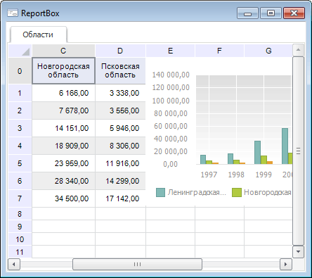

# ReportBox: Компонент

ReportBox: Компонент
-

# ReportBox

## Иерархия наследования

           [IComponent](modforms.chm::/Interface/IComponent/IComponent.htm)

           [IControl](ModForms.chm::/Interface/IControl/IControl.htm)

           [IReportBox](KeReport.chm::/Interface/IReportBox/IReportBox.htm)

           [ReportBox](KeReport.chm::/Class/ReportBox/ReportBox.htm)

## Описание

Компонент ReportBox предназначен для отображения данных регламентного отчета.

## Работа с компонентом

Для работы компонента необходимо в свойстве [Report](KeReport.chm::/Interface/IReportBox/IReportBox.Report.htm) задать источник данных, предоставляющий регламентный отчет. В качестве значения свойства указывается компонент [UiReport](UiReport.htm).

## Пример

## Свойства компонента ReportBox

 Имя свойства
		 Краткое описание

		 
		 [AllowDrag](ModForms.chm::/Interface/IControl/IControl.AllowDrag.htm)

		 Свойство AllowDrag
		 определяет возможность взять у компонента перетаскиваемый объект.

		 
		 [AllowDrop](ModForms.chm::/Interface/IControl/IControl.AllowDrop.htm)

		 Свойство AllowDrop
		 определяет, будет ли возможность у компонента принять перетаскиваемый
		 объект.

		 
		 [Anchors](ModForms.chm::/Interface/IControl/IControl.Anchors.htm)

		 Свойство Anchors возвращает
		 настройки, определяющие в процентном соотношении изменение размеров
		 текущего компонента при изменении размеров родительского компонента.

		 
		 [Brush](ModForms.chm::/Interface/IControl/IControl.Brush.htm)
		 Свойство Brush определяет
		 кисть, используемую для заливки области компонента.

		 
		 [ClientHeight](ModForms.chm::/Interface/IControl/IControl.ClientHeight.htm)

		 Свойство ClientHeight
		 используется для получения или задания высоты клиентской области
		 компонента.

		 
		 [ClientWidth](ModForms.chm::/Interface/IControl/IControl.ClientWidth.htm)

		 Свойство ClientWidth
		 используется для получения или задания ширины клиентской области
		 компонента.

		 
		 [Color](ModForms.chm::/Interface/IControl/IControl.Color.htm)

		 Свойство Color определяет
		 цвет фона компонента.

		 
		 [ComponentCount](ModForms.chm::/Interface/IComponent/IComponent.ComponentCount.htm)

		 Свойство ComponentCount
		 возвращает количество дочерних компонентов.

		 
		 [Components](ModForms.chm::/Interface/IComponent/IComponent.Components.htm)

		 Свойство Components
		 возвращает дочерний компонент.

		 
		 [Cursor](ModForms.chm::/Interface/IControl/IControl.Cursor.htm)

		 Свойство Cursor определяет
		 вид курсора над компонентом.

		 
		 [Data](ModForms.chm::/Interface/IComponent/IComponent.Data.htm)
		 Свойство Data предназначено
		 для хранения любых пользовательских данных.

		 
		 [DisplayNumericColumnNames](KeReport.chm::/Interface/IReportBox/IReportBox.DisplayNumericColumnNames.htm)
		 Свойство DisplayNumericColumnNames
		 определяет признак отображения числовых наименований столбцов
		 в компоненте.

		 
		 [DisplayTabs](KeReport.chm::/Interface/IReportBox/IReportBox.DisplayTabs.htm)
		 Свойство DisplayTabs
		 определяет, будут ли отображаться ярлыки листов.

		 
		 [Enabled](ModForms.chm::/Interface/IControl/IControl.Enabled.htm)
		 Свойство Enabled определяет
		 доступность компонента для пользователя.

		 
		 [Focused](ModForms.chm::/Interface/IControl/IControl.Focused.htm)
		 Свойство Focused возвращает
		 True, если фокус установлен
		 на данном компоненте.

		 
		 [Font](ModForms.chm::/Interface/IControl/IControl.Font.htm)

		 Свойство Font определяет
		 множество характеристик, описывающих шрифт, используемый при отображении
		 текста.

		 
		 [Height](ModForms.chm::/Interface/IControl/IControl.Height.htm)

		 Свойство Height определяет
		 высоту компонента.

		 
		 [HelpContext](ModForms.chm::/Interface/IControl/IControl.HelpContext.htm)
		 Свойство HelpContext
		 определяет уникальный индекс раздела контекстно-зависимой справки
		 для данного компонента.

		 
		 [Hint](ModForms.chm::/Interface/IControl/IControl.Hint.htm)
		 Свойство Hint определяет
		 текст подсказки для компонента.

		 
		 [Left](ModForms.chm::/Interface/IControl/IControl.Left.htm)
		 Свойство Left определяет
		 координату левого края компонента.

		 
		 [Name](ModForms.chm::/Interface/IComponent/IComponent.Name.htm)
		 Свойство Name определяет
		 наименование компонента.

		 
		 [Parent](ModForms.chm::/Interface/IControl/IControl.Parent.htm)

		 Свойство Parent определяет
		 родительский компонент.

		 
		 [ParentColor](ModForms.chm::/Interface/IControl/IControl.ParentColor.htm)

		 Свойство ParentColor
		 определяет, будет ли для компонента заимствован цвет родительского
		 компонента.

		 
		 [ParentFont](ModForms.chm::/Interface/IControl/IControl.ParentFont.htm)

		 Свойство ParentFont
		 определяет, будет ли для компонента использоваться шрифт родительского
		 компонента.

		 
		 [ParentShowHint](ModForms.chm::/Interface/IControl/IControl.ParentShowHint.htm)
		 Свойство ParentShowHint
		 определяет условие отображения всплывающей подсказки.

		 
		 [PopupMenu](ModForms.chm::/Interface/IControl/IControl.PopupMenu.htm)
		 Свойство PopupMenu
		 определяет контекстное меню, которое будет появляться по щелчку
		 дополнительной кнопки мыши на компоненте.

		 
		 [Report](KeReport.chm::/Interface/IReportBox/IReportBox.Report.htm)
		 Свойство Report определяет
		 компонент UiReport, который
		 будет использоваться как источник данных.

		 
		 [Scrolls](ModForms.chm::/Interface/IControl/IControl.Scrolls.htm)
		 Свойство Scrolls возвращает
		 параметры полос прокрутки компонента.

		 
		 [SelectedItem](KeExtCtrls.chm::/Interface/IDBLookupListBox/IDBLookupListBox.SelectedItem.htm)
		 Свойство SelectedItem
		 возвращает наименование выделенной строки компонента.

		 
		 [ShowHint](ModForms.chm::/Interface/IControl/IControl.ShowHint.htm)
		 Свойство ShowHint включает
		 и выключает показ всплывающего окна подсказки для компонента.

		 
		 [TabOrder](ModForms.chm::/Interface/IControl/IControl.TabOrder.htm)
		 Свойство TabOrder определяет
		 позицию компонента в последовательности табуляции.

		 
		 [TabStop](ModForms.chm::/Interface/IControl/IControl.TabStop.htm)
		 Свойство TabStop определяет
		 признак необходимости компоненту получать фокус при нажатии кнопки
		 «TAB».

		 
		 [Tag](ModForms.chm::/Interface/IComponent/IComponent.Tag.htm)
		 Свойство Tag не используется
		 компилятором. Пользователь может изменить значение свойства Tag и использовать его по своему
		 усмотрению.

		 
		 [Text](ModForms.chm::/Interface/IControl/IControl.Text.htm)
		 Свойство Text определяет
		 строку, идентифицирующую компонент для пользователя.

		 
		 [Top](ModForms.chm::/Interface/IControl/IControl.Top.htm)
		 Свойство Top определяет
		 координату верхнего края компонента.

		 
		 [Visible](ModForms.chm::/Interface/IControl/IControl.Visible.htm)
		 Свойство Visible определяет
		 видимость компонента во время выполнения.

		 
		 [Width](ModForms.chm::/Interface/IControl/IControl.Width.htm)
		 Свойство Width определяет
		 ширину компонента.

## Методы компонента ReportBox

		 Имя метода
		 Краткое описание

		 
		 [ClientToScreen](ModForms.chm::/Interface/IControl/IControl.ClientToScreen.htm)
		 Метод ClientToScreen
		 преобразовывает координаты точки, указанные относительно системы
		 координат компонента, в экранные координаты.

		 
		 [ClientToTab](KeReport.chm::/Interface/IReportBox/IReportBox.ClientToTab.htm)
		 Метод ClientToTab преобразует
		 координаты компонента ReportBox
		 в координаты отчета, являющегося источником данных этого компонента.

		 
		 [DoDragDrop](ModForms.chm::/Interface/IControl/IControl.DoDragDrop.htm)
		 Метод DoDragDrop позволяет
		 начать операцию перетаскивания.

		 
		 [GetImage](ModForms.chm::/Interface/IControl/IControl.GetImage.htm)
		 Метод GetImage возвращает
		 изображение компонента со всеми дочерними компонентами.

		 
		 [ScreenToClient](ModForms.chm::/Interface/IControl/IControl.ScreenToClient.htm)
		 Метод ScreenToClient
		 преобразовывает экранные координаты точки в координаты, указываемые
		 относительно системы координат компонента.

		 
		 [SetFocus](ModForms.chm::/Interface/IControl/IControl.SetFocus.htm)
		 Метод SetFocus устанавливает
		 фокус на данный компонент.

		 
		 [ShowBasicDataDialog](KeReport.chm::/Interface/IReportBox/IReportBox.ShowBasicDataDialog.htm)
		 Метод ShowBasicDataDialog
		 вызывает окно «Исходные
		 данные» для выбранной диаграммы регламентного отчёта.

## События компонента ReportBox

		 Имя события
		 Краткое описание

		 
		 [OnAfterEdit](KeReport.chm::/Class/ReportBox/ReportBox.OnAfterEdit.htm)
		 Событие OnAfterEdit
		 наступает после редактирования данных какой-либо ячейки таблицы.

		 
		 [OnAutoFilter](kereport.chm::/Class/reportbox/reportbox.onautofilter.htm)
		 Событие OnAutoFilter
		 наступает перед выполнением автофильтра.

		 
		 [OnBeforeCellChange](KeReport.chm::/Class/ReportBox/ReportBox.OnBeforeCellChange.htm)
		 Событие OnBeforeCellChange
		 наступает перед изменением значения ячейки таблицы.

		 
		 [OnBeforeColumnResize](KeReport.chm::/Class/ReportBox/ReportBox.OnBeforeColumnResize.htm)
		 Событие OnBeforeColumnResize
		 наступает перед изменением размера столбца таблицы.

		 
		 [OnBeforeEdit](KeReport.chm::/Class/ReportBox/ReportBox.OnBeforeEdit.htm)
		 Событие OnBeforeEdit
		 наступает перед редактированием данных какой-либо ячейки таблицы.

		 
		 [OnBeforeExpanderChanged](KeReport.chm::/Class/ReportBox/ReportBox.OnBeforeExpanderChanged.htm)
		 Событие OnBeforeExpanderChanged
		 наступает перед изменением состояния экспандера в ячейке таблицы.

		 
		 [OnBeforeRowResize](KeReport.chm::/Class/ReportBox/ReportBox.OnBeforeRowResize.htm)
		 Событие OnBeforeRowResize
		 наступает перед изменением размера строки таблицы.

		 
		 [OnBeginDrag](ModForms.chm::/Interface/IControl/IControl.OnBeginDrag.htm)
		 Событие OnBeginDrag
		 для компонента наступает, когда пользователь начинает перетаскивать
		 объект от компонента.

		 
		 [OnBeginInteractiveSelectionChange](KeReport.chm::/Class/ReportBox/ReportBox.OnBeginInteractiveSelectionChange.htm)
		 Событие OnBeginInteractiveSelectionChange
		 наступает при начале перемещения выделенной области ячеек в таблице.

		 
		 [OnCellChange](KeReport.chm::/Class/ReportBox/ReportBox.OnCellChange.htm)
		 Событие OnCellChange
		 наступает после изменения значения ячейки.

		 
		 [OnCellClick](KeReport.chm::/Class/ReportBox/ReportBox.OnCellClick.htm)
		 Событие OnCellClick
		 наступает при щелчке кнопки мыши по ячейке таблицы.

		 
		 [OnCellPictureClick](KeReport.chm::/Class/ReportBox/ReportBox.OnCellPictureClick.htm)
		 Событие OnCellPictureClick
		 наступает при щелчке кнопки мыши по рисунку, расположенному в
		 ячейке таблицы.

		 
		 [OnChangeCellContent](KeReport.chm::/Class/ReportBox/ReportBox.OnChangeCellContent.htm)
		 Событие OnChangeCellContent
		 наступает, если было произведено изменение содержимого в ячейке
		 таблицы.

		 
		 [OnClick](ModForms.chm::/Interface/IControl/IControl.OnClick.htm)
		 Событие OnClick наступает,
		 если пользователь щёлкнул в области компонента.

		 
		 [OnColumnClick](KeReport.chm::/Class/ReportBox/ReportBox.OnColumnClick.htm)
		 Событие OnColumnClick
		 наступает при щелчке кнопки мыши по заголовку одного из столбцов
		 таблицы.

		 
		 [OnColumnResize](KeReport.chm::/Class/ReportBox/ReportBox.OnColumnResize.htm)
		 Событие OnColumnResize
		 происходит после изменения размера столбца таблицы.

		 
		 [OnColumnResizing](KeReport.chm::/Class/ReportBox/ReportBox.OnColumnResizing.htm)
		 Событие OnColumnResizing
		 происходит при каждом видимом изменении размера столбца таблицы.

		 
		 [OnDblClick](ModForms.chm::/Interface/IControl/IControl.OnDblClick.htm)
		 Событие OnDblClick
		 наступает, если пользователь дважды щёлкнул в области компонента.

		 
		 [OnDragDrop](ModForms.chm::/Interface/IControl/IControl.OnDragDrop.htm)

		 Событие OnDragDrop
		 для компонента наступает, когда пользователь отпускает над ним
		 перетаскиваемый объект.

		 
		 [OnDragEnter](ModForms.chm::/Interface/IControl/IControl.OnDragEnter.htm)

		 Событие OnDragEnter
		 наступает, когда перетаскиваемый объект входит в границы данного
		 компонента.

		 
		 [OnDragLeave](ModForms.chm::/Interface/IControl/IControl.OnDragLeave.htm)

		 Событие OnDragLeave
		 наступает, когда перетаскиваемый объект выходит за границы данного
		 компонента.

		 
		 [OnDragOver](ModForms.chm::/Interface/IControl/IControl.OnDragOver.htm)

		 Событие OnDragOver
		 для компонента наступает, когда пользователь протаскивает над
		 ним перетаскиваемый объект.

		 
		 [OnEditorTextChanged](KeReport.chm::/Class/ReportBox/ReportBox.OnEditorTextChanged.htm)
		 Событие OnEditorTextChanged
		 наступает во время визуального редактирования данных в ячейке
		 таблицы.

		 
		 [OnEndInteractiveSelectionChange](KeReport.chm::/Class/ReportBox/ReportBox.OnEndInteractiveSelectionChange.htm)
		 Событие OnEndInteractiveSelectionChange
		 наступает при завершении перемещения выделенной области ячеек
		 в таблице.

		 
		 [OnEnter](ModForms.chm::/Interface/IControl/IControl.OnEnter.htm)
		 Событие OnEnter наступает
		 в момент получения фокуса компонентом.

		 
		 [OnExit](ModForms.chm::/Interface/IControl/IControl.OnExit.htm)
		 Событие OnExit наступает
		 в момент потери фокуса компонентом.

		 
		 [OnExpanderChanged](KeReport.chm::/Class/ReportBox/ReportBox.OnExpanderChanged.htm)
		 Событие OnExpanderChanged
		 наступает при изменении состояния экспандера в ячейке таблицы.

		 
		 [OnHScroll](ModForms.chm::/Interface/IControl/IControl.OnHScroll.htm)
		 Событие OnHScroll наступает
		 при изменении положения ползунка горизонтальной полосы прокрутки.

		 
		 [OnHyperlinkClick](KeReport.chm::/Class/ReportBox/ReportBox.OnHyperlinkClick.htm)
		 Событие OnHyperlinkClick
		 наступает при щелчке кнопки мыши по гиперссылке, расположенной
		 в ячейке таблицы.

		 
		 [OnInteractiveSelectionChange](KeReport.chm::/Class/ReportBox/ReportBox.OnInteractiveSelectionChange.htm)
		 Событие OnInteractiveSelectionChange
		 наступает во время перемещения выделенной области ячеек в таблице.

		 
		 [OnKeyDown](ModForms.chm::/Interface/IControl/IControl.OnKeyDown.htm)

		 Событие OnKeyDown наступает,
		 если компонент находится в фокусе и производится нажатие на клавиатуру.

		 
		 [OnKeyPress](ModForms.chm::/Interface/IControl/IControl.OnKeyPress.htm)

		 Событие OnKeyPress
		 наступает, если компонент находится в фокусе, при нажатии пользователем
		 символьной клавиши.

		 
		 [OnKeyPreview](ModForms.chm::/Interface/IControl/IControl.OnKeyPreview.htm)

		 Событие OnKeyPreview
		 наступает перед каждым событием, связанным с нажатием клавиш.

		 
		 [OnKeyUp](ModForms.chm::/Interface/IControl/IControl.OnKeyUp.htm)

		 Событие OnKeyUp наступает,
		 если компонент находится в фокусе, при отпускании пользователем
		 любой, ранее нажатой клавиши.

		 
		 [OnMouseDown](ModForms.chm::/Interface/IControl/IControl.OnMouseDown.htm)

		 Событие OnMouseDown
		 наступает, если компонент находится в фокусе, и на компоненте
		 произведено нажатие любой из кнопок мыши.

		 
		 [OnMouseEnter](ModForms.chm::/Interface/IControl/IControl.OnMouseEnter.htm)
		 Событие OnMouseEnter
		 наступает в момент входа курсора мыши в область компонента.

		 
		 [OnMouseHover](ModForms.chm::/Interface/IControl/IControl.OnMouseHover.htm)
		 Событие OnMouseHover
		 наступает при задержке курсора мыши в области компонента.

		 
		 [OnMouseLeave](ModForms.chm::/Interface/IControl/IControl.OnMouseLeave.htm)
		 Событие OnMouseLeave
		 наступает в момент выхода курсора мыши за пределы области компонента.

		 
		 [OnMouseMove](ModForms.chm::/Interface/IControl/IControl.OnMouseMove.htm)

		 Событие OnMouseMove
		 наступает при перемещении пользователем курсора мыши над компонентом.

		 
		 [OnMouseUp](ModForms.chm::/Interface/IControl/IControl.OnMouseUp.htm)

		 Событие OnMouseUp наступает,
		 если компонент находится в фокусе и на компоненте была отпущена
		 любая из ранее нажатых кнопок мыши.

		 
		 [OnMouseWheel](ModForms.chm::/Interface/IControl/IControl.OnMouseWheel.htm)

		 Событие OnMouseWheel
		 наступает, если компонент находится в фокусе при вращении колеса
		 мыши.

		 
		 [OnObjectActivate](KeReport.chm::/Class/ReportBox/ReportBox.OnObjectActivate.htm)
		 Событие OnObjectActivate
		 наступает при активации/деактивации объекта, расположенного на
		 листе регламентного отчета.

		 
		 [OnRowClick](KeReport.chm::/Class/ReportBox/ReportBox.OnRowClick.htm)
		 Событие OnRowClick
		 наступает при щелчке кнопки мыши по заголовку одной из строк таблицы.

		 
		 [OnRowResize](KeReport.chm::/Class/ReportBox/ReportBox.OnRowResize.htm)
		 Событие OnRowResize
		 происходит после изменения размера строки таблицы.

		 
		 [OnRowResizing](KeReport.chm::/Class/ReportBox/ReportBox.OnRowResizing.htm)
		 Событие OnRowResizing
		 происходит при каждом видимом изменении размера строки таблицы.

		 
		 [OnScaleChange](KeReport.chm::/Class/ReportBox/ReportBox.OnScaleChange.htm)
		 Событие OnScaleChange
		 наступает при изменении масштаба таблицы.

		 
		 [OnSelectionChange](KeReport.chm::/Class/ReportBox/ReportBox.OnSelectionChange.htm)
		 Событие OnSelectionChange
		 наступает при изменении выделения ячеек или групп ячеек таблицы.

		 
		 [OnTableClick](KeReport.chm::/Class/ReportBox/ReportBox.OnTableClick.htm)
		 Событие OnTableClick
		 наступает при щелчке кнопки мыши по области, расположенной на
		 пересечении заголовков строк и столбцов, осуществляющей выделение
		 всей таблицы.

		 
		 [OnVScroll](ModForms.chm::/Interface/IControl/IControl.OnVScroll.htm)
		 Событие OnVScroll наступает
		 при изменении положения ползунка вертикальной полосы прокрутки.

См. также:

[Компоненты доступа
 к данным](03_components_of_the_access_to_data.htm)

		Справочная
		 система на версию 10.9
		 от 18/08/2025,
		 © ООО «ФОРСАЙТ»,
