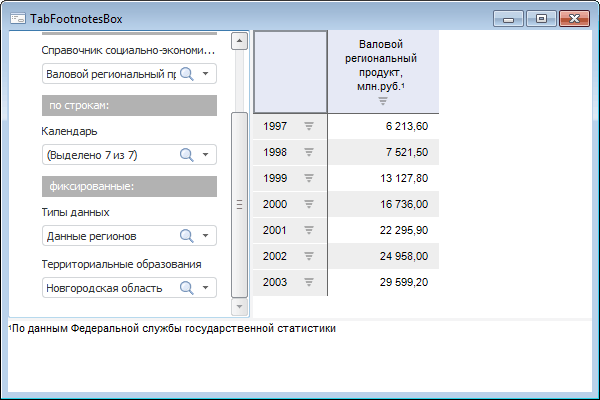

# TabFootnotesBox: Компонент

TabFootnotesBox: Компонент
-

# TabFootnotesBox

## Иерархия наследования

           [IComponent](ModForms.chm::/Interface/IComponent/IComponent.htm)

           [IControl](ModForms.chm::/Interface/IControl/IControl.htm)

           [ITabFootnotesBox](TabSheet.chm::/Interface/ITabFootnotesBox/ITabFootnotesBox.htm)

           [TabFootnotesBox](TabSheet.chm::/Class/TabFootnotesBox/TabFootnotesBox.htm)

## Описание

Компонент TabFootnotesBox предназначен
 для отображения сносок, созданных для каких-либо данных в таблицах различных
 инструментов продукта «Форсайт. Аналитическая платформа».

## Комментарии

Для работы компонента необходимо в свойстве [Source](TabSheet.chm::/Interface/ITabFootnotesBox/ITabFootnotesBox.Source.htm) указать
 источник, в котором настроены сноски. В качестве источника данных могут
 выступать следующие компоненты:

	- [UiErAnalyzer](UiErAnalyzer.htm);

	- [UiTabSheet](UiTabSheet.htm);

	- [UiReport](UiReport.htm).

В текущей реализации настройка сносок доступна только с помощью кода
 на Fore. Сноски могут быть настроены в таблице (доступ предоставляет свойство
 [ITabSheet.Footnotes](TabSheet.chm::/Interface/ITabSheet/ITabSheet.Footnotes.htm))
 или непосредственно в инструменте продукта «Форсайт. Аналитическая платформа»
 следующим образом:

[Настройки в
 экспресс-отчёте](javascript:TextPopup(this))

	При работе с экспресс-отчётами сноски могут быть настроены путем
	 задания отметки для метрики таблицы [EaxGridIndicatorType.Footnote](KeExpress.chm::/Enums/EaxGridIndicatorType.htm)
	 в свойстве [IEaxObject.IndicatorSelection](KeExpress.chm::/Interface/IEaxObject/IEaxObject.IndicatorSelection.htm):

		Sub UserProc;

		Var

		    MB: IMetabase;

		    Eax: IEaxAnalyzer;

		    Grid: IEaxGrid;

		Begin

		    MB := MetabaseClass.Active;

		    Eax := MB.ItemById("ExspressReport").Edit As IEaxAnalyzer;

		    Grid := Eax.Grid;

		    // Включение и настройка панели со сносками

		    Grid.FootnotePanelOptions.Position := BarDockingEdge.Bottom;

		    Grid.TabSheet.Footnotes.BackgroundBrush := New GxSolidBrush.Create(GxColor.FromKnownColor(GxKnownColor.Gold));

		    // Отметка элемента, по которому значения будут выступать в качестве сносок

		    Grid.IndicatorSelection(EaxGridIndicatorType.Footnote).SelectElement(0, False);

		    (Eax As IMetabaseObject).Save

		End Sub UserProc;

	При выполнении примера в экспресс-отчёте будет включено отображение
	 панели со сносками. В качестве сносок будут выступать значения по
	 первому элементу измерения метрик.

[Настройки в
 рабочей книге](javascript:TextPopup(this))

	В рабочих книгах сноски формируются отдельно для заголовков рядов
	 и области данных путем выбора атрибутов, значения которых будут выступать
	 в качестве текста сносок. Атрибуты задаются в свойствах [ILaner.SerieFootnoteAttributes](Laner.chm::/Interface/ILaner/ILaner.SerieFootnoteAttributes.htm)
	 (сноски для заголовков рядов) и [ILaner.ValueFootnoteAttributes](Laner.chm::/Interface/ILaner/ILaner.ValueFootnoteAttributes.htm)
	 (сноски для области данных).

		Sub UserProc;

		Var

		    MB: IMetabase;

		    Wbk: IEaxAnalyzer;

		    Grid: IEaxGrid;

		    Laner: ILaner;

		    FootnoteAttributes: ILanerCellAttributes;

		Begin

		    MB := MetabaseClass.Active;

		    Wbk := MB.ItemById("Workbook").Edit As IEaxAnalyzer;

		    Grid := Wbk.Grid;

		    // Включение и настройка панели со сносками

		    Grid.FootnotePanelOptions.Position := BarDockingEdge.Bottom;

		    Grid.TabSheet.Footnotes.BackgroundBrush := New GxSolidBrush.Create(GxColor.FromKnownColor(GxKnownColor.Gold));

		    Laner := Wbk.Laner;

		    // Получаем коллекцию атрибутов сносок для заголовков рядов

		    FootnoteAttributes := Laner.SerieFootnoteAttributes;

		    // Очищаем коллекцию

		    FootnoteAttributes.Clear;

		    // Добавляем атрибут "DL" в коллекцию атрибутов сносок

		    FootnoteAttributes.Add("DL", LnAttributeType.Fact);

		    // Сохраняем изменения

		    (Wbk As IMetabaseObject).Save;

		End Sub UserProc;

	При выполнении примера в рабочей книге будет включено отображение
	 панели со сносками. В качестве сносок для рядов будут выступать значения
	 атрибута Динамика (DL).

[Настройки в
 аналитической области данных](javascript:TextPopup(this))

	При работе с аналитической областью данных (настраивается для источников
	 в экспресс-отчетах и регламентных отчетах) сноски могут быть сформированы
	 путем задания метрики таблицы [EaxGridIndicatorType.Footnote](KeExpress.chm::/Enums/EaxGridIndicatorType.htm)
	 в свойстве [IEaxObject.IndicatorSelection](KeExpress.chm::/Interface/IEaxObject/IEaxObject.IndicatorSelection.htm).
	 Таблицу можно получить с помощью свойств и методов коллекции представлений
	 аналитической области данных - [IEaxDataAreaViews](KeExpress.chm::/Interface/IEaxDataAreaViews/IEaxDataAreaViews.htm):

		Sub UserProc;

		Var

		    MB: IMetabase;

		    Report: IPrxReport;

		    Slice: IEaxDataAreaSlice;

		    Grid: IEaxObject;

		Begin

		    MB := MetabaseClass.Active;

		    Report := MB.ItemById("REGULAR_REPORT").Edit As IPrxReport;

		    // Включение и настройка панели со сносками

		    Report.Options.FootnotePanelOptions.Position := BarDockingEdge.Bottom;

		    (Report.ActiveSheet As IPrxTable).TabSheet.Footnotes.BackgroundBrush := New GxSolidBrush.Create(GxColor.FromKnownColor(GxKnownColor.Gold));

		    // Отметка элемента, по которому значения будут выступать в качестве сносок

		    Slice := Report.DataArea.Slices.Item(0);

		    Grid := Slice.Views.Item(0);

		    Grid.IndicatorSelection(EaxGridIndicatorType.Footnote).SelectElement(1, True);

		    (Report As IMetabaseObject).Save;

		End Sub UserProc;

При выполнении примера в регламентном отчёте будет включено отображение
	 панели со сносками. Сноски будут добавлены в первом срезе аналитической
	 области данных. В качестве сносок будут выступать значения по первому
	 элементу измерения метрик.

Примечание.
 Сноски, настроенные в инструментах имеют больший приоритет, чем сноски,
 настроенные непосредственно в таблице. Необходимо это учитывать, так как
 при изменении отображаемых данных сноски, настроенные в таблице, могут
 быть сброшены.

## Пример

## Свойства компонента TabFootnotesBox

		 Имя свойства
		 Краткое описание

		 
		 [Align](ModForms.chm::/Interface/IControl/IControl.Align.htm)

		 Свойство Align определяет,
		 как поведет себя компонент при изменении размеров содержащего
		 его родительского компонента.

		 
		 [AllowDrag](ModForms.chm::/Interface/IControl/IControl.AllowDrag.htm)

		 Свойство AllowDrag
		 определяет возможность взять у компонента перетаскиваемый объект.

		 
		 [AllowDrop](ModForms.chm::/Interface/IControl/IControl.AllowDrop.htm)

		 Свойство AllowDrop
		 определяет, будет ли возможность у компонента принять перетаскиваемый
		 объект.

		 
		 [Anchors](ModForms.chm::/Interface/IControl/IControl.Anchors.htm)

		 Свойство Anchors возвращает
		 настройки, определяющие в процентном соотношении изменение размеров
		 текущего компонента при изменении размеров родительского компонента.

		 
		 [Brush](ModForms.chm::/Interface/IControl/IControl.Brush.htm)
		 Свойство Brush определяет
		 кисть, используемую для заливки области компонента.

		 
		 [ClientHeight](ModForms.chm::/Interface/IControl/IControl.ClientHeight.htm)

		 Свойство ClientHeight
		 используется для получения или задания высоты клиентской области
		 компонента.

		 
		 [ClientWidth](ModForms.chm::/Interface/IControl/IControl.ClientWidth.htm)

		 Свойство ClientWidth
		 используется для получения или задания ширины клиентской области
		 компонента.

		 
		 [Color](ModForms.chm::/Interface/IControl/IControl.Color.htm)

		 Свойство Color определяет
		 цвет фона компонента.

		 
		 [Columns](ModForms.chm::/Interface/IListBox/IListBox.Columns.htm)
		 Свойство Columns определяет
		 количество столбцов, в которых будут отображаться элементы (строки)
		 списка.

		 
		 [ComponentCount](ModForms.chm::/Interface/IComponent/IComponent.ComponentCount.htm)

		 Свойство ComponentCount
		 возвращает количество дочерних компонентов.

		 
		 [Components](ModForms.chm::/Interface/IComponent/IComponent.Components.htm)

		 Свойство Components
		 возвращает дочерний компонент.

		 
		 [Cursor](ModForms.chm::/Interface/IControl/IControl.Cursor.htm)

		 Свойство Cursor определяет
		 вид курсора над компонентом.

		 
		 [Data](ModForms.chm::/Interface/IComponent/IComponent.Data.htm)

		 Свойство Data предназначено
		 для хранения любых пользовательских данных.

		 
		 [Enabled](ModForms.chm::/Interface/IControl/IControl.Enabled.htm)

		 Свойство Enabled определяет
		 доступность компонента для пользователя.

		 
		 [Focused](ModForms.chm::/Interface/IControl/IControl.Focused.htm)

		 Свойство Focused возвращает
		 True, если фокус установлен
		 на данном компоненте.

		 
		 [Font](ModForms.chm::/Interface/IControl/IControl.Font.htm)

		 Свойство Font определяет
		 множество характеристик, описывающих шрифт, используемый при отображении
		 текста.

		 
		 [Height](ModForms.chm::/Interface/IControl/IControl.Height.htm)

		 Свойство Height определяет
		 высоту компонента.

		 
		 [HelpContext](ModForms.chm::/Interface/IControl/IControl.HelpContext.htm)
		 Свойство HelpContext
		 определяет уникальный индекс раздела контекстно-зависимой справки
		 для данного компонента.

		 
		 [Hint](ModForms.chm::/Interface/IControl/IControl.Hint.htm)
		 Свойство Hint определяет
		 текст подсказки для компонента.

		 
		 [HintTimeout](ModForms.chm::/Interface/IControl/IControl.HintTimeout.htm)

		 Свойство HintTimeout
		 определяет время отображения всплывающей подсказки.

		 
		 [Left](ModForms.chm::/Interface/IControl/IControl.Left.htm)

		 Свойство Left определяет
		 координату левого края компонента.

		 
		 [Name](ModForms.chm::/Interface/IComponent/IComponent.Name.htm)
		 Свойство Name определяет
		 наименование компонента.

		 
		 [Parent](ModForms.chm::/Interface/IControl/IControl.Parent.htm)

		 Свойство Parent определяет
		 родительский компонент.

		 
		 [ParentColor](ModForms.chm::/Interface/IControl/IControl.ParentColor.htm)

		 Свойство ParentColor
		 определяет, будет ли для компонента заимствован цвет родительского
		 компонента.

		 
		 [ParentFont](ModForms.chm::/Interface/IControl/IControl.ParentFont.htm)

		 Свойство ParentFont
		 определяет, будет ли для компонента использоваться шрифт родительского
		 компонента.

		 
		 [ParentShowHint](ModForms.chm::/Interface/IControl/IControl.ParentShowHint.htm)

		 Свойство ParentShowHint
		 определяет условие отображения всплывающей подсказки.

		 
		 [PopupMenu](ModForms.chm::/Interface/IControl/IControl.PopupMenu.htm)

		 Свойство PopupMenu
		 определяет контекстное меню, которое будет появляться по щелчку
		 дополнительной кнопки мыши на компоненте.

		 
		 [ShowHint](ModForms.chm::/Interface/IControl/IControl.ShowHint.htm)

		 Свойство ShowHint включает
		 и выключает показ всплывающего окна подсказки для компонента.

		 
		 [Source](TabSheet.chm::/Interface/ITabFootnotesBox/ITabFootnotesBox.Source.htm)

		 Свойство Source определяет
		 источник данных для компонента.

		 
		 [TabOrder](ModForms.chm::/Interface/IControl/IControl.TabOrder.htm)

		 Свойство TabOrder определяет
		 позицию компонента в последовательности табуляции.

		 
		 [TabStop](ModForms.chm::/Interface/IControl/IControl.TabStop.htm)

		 Свойство TabStop определяет
		 признак необходимости компоненту получать фокус при нажатии кнопки
		 «Tab».

		 
		 [Tag](ModForms.chm::/Interface/IComponent/IComponent.Tag.htm)
		 Свойство Tag не используется
		 компилятором. Пользователь может изменить значение свойства Tag и использовать его по своему
		 усмотрению.

		 
		 [Text](ModForms.chm::/Interface/IControl/IControl.Text.htm)
		 Свойство Text определяет
		 строку, идентифицирующую компонент для пользователя.

		 
		 [Top](ModForms.chm::/Interface/IControl/IControl.Top.htm)
		 Свойство Top определяет
		 координату верхнего края компонента.

		 
		 [Visible](ModForms.chm::/Interface/IControl/IControl.Visible.htm)
		 Свойство Visible определяет
		 видимость компонента во время выполнения.

		 
		 [Width](ModForms.chm::/Interface/IControl/IControl.Width.htm)
		 Свойство Width определяет
		 ширину компонента.

## Методы компонента TabFootnotesBox

		 Имя метода
		 Краткое описание

		 
		 [ClientToScreen](ModForms.chm::/Interface/IControl/IControl.ClientToScreen.htm)

		 Метод ClientToScreen
		 преобразовывает координаты точки, указанные относительно системы
		 координат компонента, в экранные координаты.

		 
		 [DoDragDrop](ModForms.chm::/Interface/IControl/IControl.DoDragDrop.htm)

		 Метод DoDragDrop позволяет
		 начать операцию перетаскивания.

		 
		 [GetImage](ModForms.chm::/Interface/IControl/IControl.GetImage.htm)

		 Метод GetImage возвращает
		 изображение компонента со всеми дочерними компонентами.

		 
		 [ScreenToClient](ModForms.chm::/Interface/IControl/IControl.ScreenToClient.htm)

		 Метод ScreenToClient
		 преобразовывает экранные координаты точки в координаты, указываемые
		 относительно системы координат компонента.

		 
		 [SetFocus](ModForms.chm::/Interface/IControl/IControl.SetFocus.htm)

		 Метод SetFocus устанавливает
		 фокус на данный компонент.

## События компонента TabFootnotesBox

		 Имя события
		 Краткое описание

		 
		 [OnBeginDrag](ModForms.chm::/Interface/IControl/IControl.OnBeginDrag.htm)

		 Событие OnBeginDrag
		 для компонента наступает, когда пользователь начинает перетаскивать
		 объект от компонента.

		 
		 [OnClick](ModForms.chm::/Interface/IControl/IControl.OnClick.htm)

		 Событие OnClick наступает,
		 если пользователь щёлкнул в области компонента.

		 
		 [OnControlMove](ModForms.chm::/Interface/IControl/IControl.OnControlMove.htm)

		 Событие OnControlMove
		 наступает при перемещении компонента.

		 
		 [OnControlResize](ModForms.chm::/Interface/IControl/IControl.OnControlResize.htm)

		 Событие OnControlResize
		 наступает при изменении размеров у компонента.

		 
		 [OnDblClick](ModForms.chm::/Interface/IControl/IControl.OnDblClick.htm)

		 Событие OnDblClick
		 наступает, если пользователь дважды щёлкнул в области компонента.

		 
		 [OnDragDrop](ModForms.chm::/Interface/IControl/IControl.OnDragDrop.htm)

		 Событие OnDragDrop
		 для компонента наступает, когда пользователь отпускает над ним
		 перетаскиваемый объект.

		 
		 [OnDragEnter](ModForms.chm::/Interface/IControl/IControl.OnDragEnter.htm)

		 Событие OnDragEnter
		 наступает, когда перетаскиваемый объект входит в границы данного
		 компонента.

		 
		 [OnDragLeave](ModForms.chm::/Interface/IControl/IControl.OnDragLeave.htm)

		 Событие OnDragLeave
		 наступает, когда перетаскиваемый объект выходит за границы данного
		 компонента.

		 
		 [OnDragOver](ModForms.chm::/Interface/IControl/IControl.OnDragOver.htm)

		 Событие OnDragOver
		 для компонента наступает, когда пользователь протаскивает над
		 ним перетаскиваемый объект.

		 
		 [OnEnter](ModForms.chm::/Interface/IControl/IControl.OnEnter.htm)

		 Событие OnEnter наступает
		 в момент получения фокуса компонентом.

		 
		 [OnExit](ModForms.chm::/Interface/IControl/IControl.OnExit.htm)

		 Событие OnExit наступает
		 в момент потери фокуса компонентом.

		 
		 [OnHScroll](ModForms.chm::/Interface/IControl/IControl.OnHScroll.htm)

		 Событие OnHScroll наступает
		 при изменении положения ползунка горизонтальной полосы прокрутки.

		 
		 [OnKeyDown](ModForms.chm::/Interface/IControl/IControl.OnKeyDown.htm)

		 Событие OnKeyDown наступает,
		 если компонент находится в фокусе и производится нажатие на клавиатуру.

		 
		 [OnKeyPress](ModForms.chm::/Interface/IControl/IControl.OnKeyPress.htm)

		 Событие OnKeyPress
		 наступает, если компонент находится в фокусе, при нажатии пользователем
		 символьной клавиши.

		 
		 [OnKeyPreview](ModForms.chm::/Interface/IControl/IControl.OnKeyPreview.htm)

		 Событие OnKeyPreview
		 наступает перед каждым событием, связанным с нажатием клавиш.

		 
		 [OnKeyUp](ModForms.chm::/Interface/IControl/IControl.OnKeyUp.htm)

		 Событие OnKeyUp наступает,
		 если компонент находится в фокусе, при отпускании пользователем
		 любой, ранее нажатой клавиши.

		 
		 [OnMouseDown](ModForms.chm::/Interface/IControl/IControl.OnMouseDown.htm)

		 Событие OnMouseDown
		 наступает, если компонент находится в фокусе, и на компоненте
		 произведено нажатие любой из кнопок мыши.

		 
		 [OnMouseEnter](ModForms.chm::/Interface/IControl/IControl.OnMouseEnter.htm)
		 Событие OnMouseEnter
		 наступает в момент входа курсора мыши в область компонента.

		 
		 [OnMouseHover](ModForms.chm::/Interface/IControl/IControl.OnMouseHover.htm)
		 Событие OnMouseHover
		 наступает при задержке курсора мыши в области компонента.

		 
		 [OnMouseLeave](ModForms.chm::/Interface/IControl/IControl.OnMouseLeave.htm)
		 Событие OnMouseLeave
		 наступает в момент выхода курсора мыши за пределы области компонента.

		 
		 [OnMouseMove](ModForms.chm::/Interface/IControl/IControl.OnMouseMove.htm)

		 Событие OnMouseMove
		 наступает при перемещении пользователем курсора мыши над компонентом.

		 
		 [OnMouseUp](ModForms.chm::/Interface/IControl/IControl.OnMouseUp.htm)

		 Событие OnMouseUp наступает,
		 если компонент находится в фокусе и на компоненте была отпущена
		 любая из ранее нажатых кнопок мыши.

		 
		 [OnMouseWheel](ModForms.chm::/Interface/IControl/IControl.OnMouseWheel.htm)

		 Событие OnMouseWheel
		 наступает, если компонент находится в фокусе при вращении колеса
		 мыши.

		 
		 [OnVScroll](ModForms.chm::/Interface/IControl/IControl.OnVScroll.htm)

		 Событие OnVScroll наступает
		 при изменении положения ползунка вертикальной полосы прокрутки.

См. также:

[Компоненты
 доступа к данным](03_components_of_the_access_to_data.htm)

		Справочная
		 система на версию 10.9
		 от 18/08/2025,
		 © ООО «ФОРСАЙТ»,
