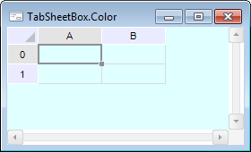
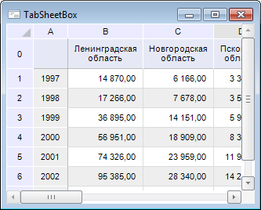

# TabSheetBox: Компонент

TabSheetBox: Компонент
-

# TabSheetBox

## Иерархия наследования

           [IComponent](modforms.chm::/Interface/IComponent/IComponent.htm)

           [IControl](ModForms.chm::/Interface/IControl/IControl.htm)

           [ITabSheetBox](TabSheet.chm::/Interface/ITabSheetBox/ITabSheetBox.htm)

           [TabSheetBox](TabSheet.chm::/Class/TabSheetBox/TabSheetBox.htm)

## Описание

Компонент TabSheetBox предназначен
 для визуального отображения таблиц.

## Работа с компонентом

Для работы компонента необходимо в свойстве [Source](TabSheet.chm::/Interface/ITabSheetBox/ITabSheetBox.Source.htm)
 задать источник данных, предоставляющий табличные данные.

Источниками данных для компонента являются:

	- [UiErAnalyzer](UiErAnalyzer.htm);

	- [UiReport](UiReport.htm);

	- [UiTabSheet](UiTabSheet.htm).

Если в качестве источника данных используется компонент [UiReport](UiReport.htm),
 то в данном компоненте будет отображена таблица активного листа регламентного
 отчета, с которым связан компонент [UiReport](UiReport.htm).

Примечание.
 Максимально возможный размер таблицы: 1048575 строк, 1048575 столбцов.

Существует возможность раздвигать столбцы/строки компонента, если они
 имеют нулевую ширину/высоту. При приближении курсора к заголовку скрытого
 столбца/строки курсор меняет свой вид.

Свойство [Color](ModForms.chm::/Interface/IControl/IControl.Color.htm)
 для данного компонента определяет цвет фона видимой неиспользуемой части:

## Пример

## Свойства компонента TabSheetBox

		 Имя свойства
		 Краткое описание

		 
		 [Align](ModForms.chm::/Interface/IControl/IControl.Align.htm)
		 Свойство Align определяет,
		 как поведет себя компонент при изменении размеров содержащего
		 его родительского компонента.

		 
		 [AllowDrag](ModForms.chm::/Interface/IControl/IControl.AllowDrag.htm)
		 Свойство AllowDrag
		 определяет возможность взять у компонента перетаскиваемый объект.

		 
		 [AllowDrop](ModForms.chm::/Interface/IControl/IControl.AllowDrop.htm)
		 Свойство AllowDrop
		 определяет, будет ли возможность у компонента принять перетаскиваемый
		 объект.

		 
		 [Anchors](ModForms.chm::/Interface/IControl/IControl.Anchors.htm)
		 Свойство Anchors возвращает
		 настройки, определяющие в процентном соотношении изменение размеров
		 текущего компонента при изменении размеров родительского компонента.

		 
		 [BorderStyle](TabSheet.chm::/Interface/ITabSheetBox/ITabSheetBox.BorderStyle.htm)
		 Свойство BorderStyle
		 определяет стиль границы компонента.

		 
		 [Brush](ModForms.chm::/Interface/IControl/IControl.Brush.htm)
		 Свойство Brush определяет
		 кисть, используемую для заливки области компонента.

		 
		 [ClientHeight](ModForms.chm::/Interface/IControl/IControl.ClientHeight.htm)
		 Свойство ClientHeight
		 используется для получения или задания высоты клиентской области
		 компонента.

		 
		 [ClientWidth](ModForms.chm::/Interface/IControl/IControl.ClientWidth.htm)
		 Свойство ClientWidth
		 используется для получения или задания ширины клиентской области
		 компонента.

		 
		 [Color](TabSheet.chm::/Class/TabSheetBox/TabSheetBox.Color.htm)
		 Свойство Color определяет
		 цвет фона компонента.

		 
		 [ComponentCount](ModForms.chm::/Interface/IComponent/IComponent.ComponentCount.htm)
		 Свойство ComponentCount
		 возвращает количество дочерних компонентов.

		 
		 [Components](ModForms.chm::/Interface/IComponent/IComponent.Components.htm)
		 Свойство Components
		 возвращает дочерний компонент.

		 
		 [Cursor](ModForms.chm::/Interface/IControl/IControl.Cursor.htm)
		 Свойство Cursor определяет
		 вид курсора над компонентом.

		 
		 [Data](ModForms.chm::/Interface/IComponent/IComponent.Data.htm)
		 Свойство Data предназначено
		 для хранения любых пользовательских данных.

		 
		 [DisplayNumericColumnNames](TabSheet.chm::/Interface/ITabSheetBox/ITabSheetBox.DisplayNumericColumnNames.htm)
		 Свойство DisplayNumericColumnNames
		 определяет признак отображения числовых наименований столбцов
		 в компоненте.

		 
		 [Enabled](ModForms.chm::/Interface/IControl/IControl.Enabled.htm)
		 Свойство Enabled определяет
		 доступность компонента для пользователя.

		 
		 [Focused](ModForms.chm::/Interface/IControl/IControl.Focused.htm)
		 Свойство Focused возвращает
		 True, если фокус установлен
		 на данном компоненте.

		 
		 [Font](ModForms.chm::/Interface/IControl/IControl.Font.htm)
		 Свойство Font определяет
		 множество характеристик, описывающих шрифт, используемый при отображении
		 текста.

		 
		 [Height](ModForms.chm::/Interface/IControl/IControl.Height.htm)
		 Свойство Height определяет
		 высоту компонента.

		 
		 [HelpContext](ModForms.chm::/Interface/IControl/IControl.HelpContext.htm)
		 Свойство HelpContext
		 определяет уникальный индекс раздела контекстно-зависимой справки
		 для данного компонента.

		 
		 [Hint](ModForms.chm::/Interface/IControl/IControl.Hint.htm)
		 Свойство Hint определяет
		 текст подсказки для компонента.

		 
		 [Left](ModForms.chm::/Interface/IControl/IControl.Left.htm)
		 Свойство Left определяет
		 координату левого края компонента.

		 
		 [Name](ModForms.chm::/Interface/IComponent/IComponent.Name.htm)
		 Свойство Name определяет
		 наименование компонента.

		 
		 [Parent](ModForms.chm::/Interface/IControl/IControl.Parent.htm)
		 Свойство Parent определяет
		 родительский компонент.

		 
		 [ParentColor](ModForms.chm::/Interface/IControl/IControl.ParentColor.htm)
		 Свойство ParentColor
		 определяет, будет ли для компонента заимствован цвет родительского
		 компонента.

		 
		 [ParentFont](ModForms.chm::/Interface/IControl/IControl.ParentFont.htm)
		 Свойство ParentFont
		 определяет, будет ли для компонента использоваться шрифт родительского
		 компонента.

		 
		 [ParentShowHint](ModForms.chm::/Interface/IControl/IControl.ParentShowHint.htm)
		 Свойство ParentShowHint
		 определяет условие отображения всплывающей подсказки.

		 
		 [PopupMenu](ModForms.chm::/Interface/IControl/IControl.PopupMenu.htm)
		 Свойство PopupMenu
		 определяет контекстное меню, которое будет появляться по щелчку
		 дополнительной кнопки мыши на компоненте.

		 
		 [Scrolls](ModForms.chm::/Interface/IControl/IControl.Scrolls.htm)
		 Свойство Scrolls возвращает
		 параметры полос прокрутки компонента.

		 
		 [ShowHint](ModForms.chm::/Interface/IControl/IControl.ShowHint.htm)
		 Свойство ShowHint включает
		 и выключает показ всплывающего окна подсказки для компонента.

		 
		 [Source](TabSheet.chm::/Interface/ITabSheetBox/ITabSheetBox.Source.htm)
		 Свойство Source определяет
		 источник данных, таблица значений которого, будет отображаться
		 в компоненте.

		 
		 [TabOrder](ModForms.chm::/Interface/IControl/IControl.TabOrder.htm)
		 Свойство TabOrder определяет
		 позицию компонента в последовательности табуляции.

		 
		 [TabStop](ModForms.chm::/Interface/IControl/IControl.TabStop.htm)
		 Свойство TabStop определяет
		 признак необходимости компоненту получать фокус при нажатии кнопки
		 «TAB».

		 
		 [Tag](ModForms.chm::/Interface/IComponent/IComponent.Tag.htm)
		 Свойство Tag не используется
		 компилятором. Пользователь может изменить значение свойства Tag и использовать его по своему
		 усмотрению.

		 
		 [Text](ModForms.chm::/Interface/IControl/IControl.Text.htm)
		 Свойство Text определяет
		 строку, идентифицирующую компонент для пользователя.

		 
		 [Top](ModForms.chm::/Interface/IControl/IControl.Top.htm)
		 Свойство Top определяет
		 координату верхнего края компонента.

		 
		 [Visible](ModForms.chm::/Interface/IControl/IControl.Visible.htm)
		 Свойство Visible определяет
		 видимость компонента во время выполнения.

		 
		 [Width](ModForms.chm::/Interface/IControl/IControl.Width.htm)
		 Свойство Width определяет
		 ширину компонента.

## Методы компонента TabSheetBox

		 Имя метода
		 Краткое описание

		 
		 [ClientToScreen](ModForms.chm::/Interface/IControl/IControl.ClientToScreen.htm)
		 Метод ClientToScreen
		 преобразовывает координаты точки, указанные относительно системы
		 координат компонента, в экранные координаты.

		 
		 [DoDragDrop](ModForms.chm::/Interface/IControl/IControl.DoDragDrop.htm)
		 Метод DoDragDrop позволяет
		 начать операцию перетаскивания.

		 
		 [GetImage](ModForms.chm::/Interface/IControl/IControl.GetImage.htm)
		 Метод GetImage возвращает
		 изображение компонента со всеми дочерними компонентами.

		 
		 [ScreenToClient](ModForms.chm::/Interface/IControl/IControl.ScreenToClient.htm)
		 Метод ScreenToClient
		 преобразовывает экранные координаты точки в координаты, указываемые
		 относительно системы координат компонента.

		 
		 [SetFocus](ModForms.chm::/Interface/IControl/IControl.SetFocus.htm)
		 Метод SetFocus устанавливает
		 фокус на данный компонент.

## События компонента TabSheetBox

		 Имя события
		 Краткое описание

		 
		 [OnAfterDeleteRange](tabsheet.chm::/Class/TabSheetBox/TabSheetBox.OnAfterDeleteRange.htm)
		 Событие OnAfterDeleteRange
		 наступает после удаления диапазона ячеек.

		 
		 [OnAfterEdit](tabsheet.chm::/Class/TabSheetBox/tabsheetbox.onafteredit.htm)
		 Событие OnAfterEdit
		 происходит после редактирования ячейки таблицы.

		 
		 [OnAfterInsertRange](tabsheet.chm::/Class/TabSheetBox/TabSheetBox.OnAfterInsertRange.htm)
		 Событие OnAfterInsertRange
		 наступает после добавления диапазона ячеек.

		 
		 [OnAfterObjectChange](tabsheet.chm::/Class/TabSheetBox/TabSheetBox.OnAfterObjectChange.htm)
		 Событие OnAfterObjectChange
		 наступает после изменения объекта.

		 
		 [OnAutoFilter](tabsheet.chm::/Class/TabSheetBox/tabsheetbox.onautofilter.htm)
		 Событие OnAutoFilter
		 возникает при установке автофильтра таблицы.

		 
		 [OnBeforeCellChange](tabsheet.chm::/Class/TabSheetBox/tabsheetbox.onbeforecellchange.htm)
		 Событие OnBeforeCellChange
		 возникает перед изменением значения ячейки таблицы.

		 
		 [OnBeforeCellsChange](tabsheet.chm::/Class/TabSheetBox/tabsheetbox.onbeforecellschange.htm)
		 Событие OnBeforeCellsChange
		 возникает перед изменением значений в диапазоне ячеек таблицы.

		 
		 [OnBeforeColumnResize](tabsheet.chm::/Class/TabSheetBox/tabsheetbox.onbeforecolumnresize.htm)
		 Событие OnBeforeColumnResize
		 наступает перед изменением размера столбца таблицы.

		 
		 [OnBeforeDeleteRange](tabsheet.chm::/Class/TabSheetBox/TabSheetBox.OnBeforeDeleteRange.htm)
		 Событие OnBeforeDeleteRange
		 наступает перед удалением диапазона ячеек.

		 
		 [OnBeforeEdit](tabsheet.chm::/Class/TabSheetBox/tabsheetbox.onbeforeedit.htm)
		 Событие OnBeforeEdit
		 возникает перед началом редактирования ячейки.

		 
		 [OnBeforeExpanderChanged](tabsheet.chm::/Class/TabSheetBox/tabsheetbox.onbeforeexpanderchanged.htm)
		 Событие OnBeforeExpanderChanged
		 наступает перед изменением состояния экспандера в ячейке таблицы.

		 
		 [OnBeforeInsertRange](tabsheet.chm::/Class/TabSheetBox/TabSheetBox.OnBeforeInsertRange.htm)
		 Событие OnBeforeInsertRange
		 наступает перед добавлением диапазона ячеек.

		 
		 [OnBeforeObjectChange](tabsheet.chm::/Class/TabSheetBox/TabSheetBox.OnBeforeObjectChange.htm)
		 Событие OnBeforeObjectChange
		 наступает перед изменением объекта.

		 
		 [OnBeforeRowResize](tabsheet.chm::/Class/TabSheetBox/tabsheetbox.onbeforerowresize.htm)
		 Событие OnBeforeRowResize
		 наступает перед изменением размера строки таблицы.

		 
		 [OnBeginInteractiveSelectionChange](tabsheet.chm::/Class/TabSheetBox/tabsheetbox.onbegininteractiveselectionchange.htm)
		 Событие OnBeginInteractiveSelectionChange
		 наступает при начале перемещения выделенной области ячеек в таблице.

		 
		 [OnBeginSelectionChange](tabsheet.chm::/Class/TabSheetBox/tabsheetbox.onbeginselectionchange.htm)
		 Событие OnBeginSelectionChange
		 возникает при начале выделения ячеек таблицы.

		 
		 [OnBeginUserInteractiveSelectionChange](TabSheet.chm::/Class/TabSheetBox/TabSheetBox.OnBeginUserInteractiveSelectionChange.htm)
		 Событие OnBeginUserInteractiveSelectionChange
		 наступает при начале изменения интерактивного диапазона ячеек.

		 
		 [OnCellChange](tabsheet.chm::/Class/TabSheetBox/tabsheetbox.oncellchange.htm)
		 Событие OnCellChange
		 наступает, если было произведено изменение значения в ячейке таблицы.

		 
		 [OnCellClick](tabsheet.chm::/Class/TabSheetBox/tabsheetbox.oncellclick.htm)
		 Событие OnCellClick
		 возникает при нажатии на ячейку таблицы.

		 
		 [OnCellPictureClick](tabsheet.chm::/Class/TabSheetBox/TabSheetBox.OnCellPictureClick.htm)
		 Событие OnCellPictureClick
		 возникает при нажатии на картинку в ячейке
		 таблицы.

		 
		 [OnCellsChange](tabsheet.chm::/Class/TabSheetBox/tabsheetbox.oncellschange.htm)
		 Событие OnCellsChange
		 возникает при изменении значений в диапазоне ячеек таблицы.

		 
		 [OnChangeCellContent](tabsheet.chm::/Class/TabSheetBox/tabsheetbox.onchangecellcontent.htm)
		 Событие OnChangeCellContent
		 наступает, если было произведено изменение содержимого в ячейке
		 таблицы.

		 
		 [OnColumnClick](tabsheet.chm::/Class/TabSheetBox/tabsheetbox.oncolumnclick.htm)
		 Событие OnColumnClick
		 возникает по щелчку на заголовок столбца таблицы.

		 
		 [OnColumnResize](tabsheet.chm::/Class/TabSheetBox/tabsheetbox.oncolumnresize.htm)
		 Событие OnColumnResize
		 происходит после изменения размера столбца таблицы.

		 
		 [OnColumnResizing](tabsheet.chm::/Class/TabSheetBox/tabsheetbox.oncolumnresizing.htm)
		 Событие OnColumnResizing
		 происходит при каждом видимом изменении размера столбца таблицы.

		 
		 [OnEditorTextChanged](tabsheet.chm::/Class/TabSheetBox/tabsheetbox.oneditortextchanged.htm)
		 Событие OnEditorTextChanged
		 наступает во время редактирования данных в ячейке таблицы.

		 
		 [OnEndInteractiveSelectionChange](tabsheet.chm::/Class/TabSheetBox/tabsheetbox.onendinteractiveselectionchange.htm)
		 Событие OnEndInteractiveSelectionChange
		 наступает при завершении перемещения выделенной области ячеек
		 в таблице.

		 
		 [OnEndSelectionChange](tabsheet.chm::/Class/TabSheetBox/tabsheetbox.onendselectionchange.htm)
		 Событие OnEndSelectionChange
		 возникает при окончании выделения ячеек таблицы.

		 
		 [OnEndUserInteractiveSelectionChange](TabSheet.chm::/Class/TabSheetBox/TabSheetBox.OnEndUserInteractiveSelectionChange.htm)
		 Событие OnEndUserInteractiveSelectionChange
		 наступает после окончания изменения интерактивного диапазона ячеек.

		 
		 [OnExpanderChanged](tabsheet.chm::/Class/TabSheetBox/tabsheetbox.onexpanderchanged.htm)
		 Событие OnExpanderChanged
		 наступает при изменении состояния экспандера в ячейке таблицы.

		 
		 [OnHyperlinkClick](tabsheet.chm::/Class/TabSheetBox/tabsheetbox.onhyperlinkclick.htm)
		 Событие OnHyperlinkClick
		 возникает при нажатии на гиперссылку в ячейке
		 таблицы.

		 
		 [OnInteractiveSelectionChange](tabsheet.chm::/Class/TabSheetBox/tabsheetbox.oninteractiveselectionchange.htm)
		 Событие OnInteractiveSelectionChange
		 наступает во время перемещения выделенной области ячеек в таблице.

		 
		 [OnObjectActivate](tabsheet.chm::/Class/TabSheetBox/tabsheetbox.onobjectactivate.htm)
		 Событие OnObjectActivate
		 наступает при активации/деактивации объекта таблицы.

		 
		 [OnObjectsSelectionChanged](tabsheet.chm::/Class/TabSheetBox/TabSheetBox.OnObjectsSelectionChanged.htm)
		 Событие OnObjectsSelectionChanged
		 наступает при выделении объекта, расположенного в таблице.

		 
		 [OnProtectionFail](tabsheet.chm::/Class/TabSheetBox/tabsheetbox.onprotectionfail.htm)
		 Событие OnProtectionFail
		 возникает при срабатывании защиты таблицы.

		 
		 [OnRowClick](tabsheet.chm::/Class/TabSheetBox/tabsheetbox.onrowclick.htm)
		 Событие OnRowClick
		 возникает по щелчку на заголовок строки таблицы.

		 
		 [OnRowResize](tabsheet.chm::/Class/TabSheetBox/tabsheetbox.onrowresize.htm)
		 Событие OnRowResize
		 происходит после изменения размера строки таблицы.

		 
		 [OnRowResizing](tabsheet.chm::/Class/TabSheetBox/tabsheetbox.onrowresizing.htm)
		 Событие OnRowResizing
		 происходит при каждом видимом изменении размера строки таблицы.

		 
		 [OnScaleChange](tabsheet.chm::/Class/TabSheetBox/tabsheetbox.onscalechange.htm)
		 Событие OnScaleChange
		 возникает при изменении масштаба таблицы.

		 
		 [OnSelectionChange](tabsheet.chm::/Class/TabSheetBox/tabsheetbox.onselectionchange.htm)
		 Событие OnSelectionChange
		 возникает при изменении выделения ячеек таблицы.

		 
		 [OnTableClick](tabsheet.chm::/Class/TabSheetBox/tabsheetbox.ontableclick.htm)
		 Событие OnTableClick
		 возникает по щелчку на левую верхнюю ячейку
		 таблицы (пересечение столбца и строки заголовков).

		 
		 [OnUserInteractiveSelectionChange](TabSheet.chm::/Class/TabSheetBox/TabSheetBox.OnUserInteractiveSelectionChange.htm)
		 Событие OnUserInteractiveSelectionChange
		 наступает при изменении интерактивного диапазона ячеек.

См. также:

[Компоненты доступа
 к данным](03_components_of_the_access_to_data.htm)

		Справочная
		 система на версию 10.9
		 от 18/08/2025,
		 © ООО «ФОРСАЙТ»,
