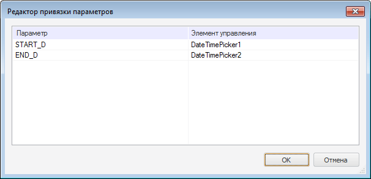

# UiMetabaseObjectParams: Компонент

UiMetabaseObjectParams: Компонент
-

# UiMetabaseObjectParams

## Иерархия наследования

           [IComponent](modforms.chm::/Interface/IComponent/IComponent.htm)

           [IUiMetabaseObjectParams](KeFore.chm::/Interface/IUiMetabaseObjectParams/IUiMetabaseObjectParams.htm)

           [UiMetabaseObjectParams](KeFore.chm::/Class/UiMetabaseObjectParams/UiMetabaseObjectParams.htm)

## Описание

Компонент UiMetabaseObjectParams является невизуальным и предназначен для управления значениями параметров объектов репозитория, доступ к которым предоставляется соответствующими компонентами: [UiDimension](UiDimension.htm), [UiErAnalyzer](UiErAnalyzer.htm), [UiModel](UiModel.htm), [UiReport](UiReport.htm), [UiWorkspaceObject](UiWorkspaceObject.htm), [UiMetabaseDataset](UiMetabaseDataset.htm).

## Работа с компонентом

Для работы компонента необходимо в [инспекторе объектов](../../01_Development_Environment/03_Windows_of_Development_Environment/Object_Inspector.htm) в свойстве [UiObject](KeFore.chm::/Interface/IUiMetabaseObjectParams/IUiMetabaseObjectParams.UiObject.htm) выбрать компонент, осуществляющий доступ к объектам репозитория. Список параметров выбранного объекта репозитория будет загружен, и в редакторе привязки можно будет определить компоненты ввода данных, которые будут использоваться как элементы управления для изменения значений параметров. Вызов окна редактора привязки параметров осуществляется путем выбора соответствующего пункта контекстного меню, вызываемого над компонентом:

В качестве элемента управления для изменения значения параметров можно использовать следующие компоненты:

-
[EditBox](../01_Standart_Components/EditBox.htm), [ComboBox](../01_Standart_Components/ComboBox.htm), [Memo](../01_Standart_Components/Memo.htm);

-
[DateTimePicker](../02_Additional_components/DateTimePicker.htm), [DateTimePickerEx](../02_Additional_components/DateTimePickerEx.htm), [MonthCalendar](../02_Additional_components/MonthCalendar.htm);

-
[SpinEdit](../02_Additional_components/SpinEdit.htm), [IntegerEdit](../02_Additional_components/IntegerEdit.htm), [FloatEdit](../02_Additional_components/FloatEdit.htm), [MaskEdit](../02_Additional_components/MaskEdit.htm);

-
[CalcCubeFormulaEdit](../02_Additional_components/CalcCubeFormulaEdit.htm), [ExpressionEdit](../02_Additional_components/ExpressionEdit.htm), [TermEdit](../02_Additional_components/TermEdit.htm), [CalcCubeFormulaEditEx](../02_Additional_components/CalcCubeFormulaEditEx.htm), [ExpressionEditEx](../02_Additional_components/ExpressionEditEx.htm), [TermEditEx](../02_Additional_components/TermEditEx.htm);

-
[MetaAttributesEdit](MetaAttributesEdit.htm);

-
[DBEditBox](DBEditBox.htm), [DBMemo](DBMemo.htm);

-
[DimensionTree](DimensionTree.htm), [DimensionCombo](DimensionCombo.htm).

Во время выполнения формы после изменения значений в элементах управления необходимо переоткрыть источник данных с новыми значениями параметров.

## Свойства компонента UiMetabaseObjectParams

		 Имя свойства
		 Краткое описание

		 
		 [ComponentCount](ModForms.chm::/Interface/IComponent/IComponent.ComponentCount.htm)
		 Свойство ComponentCount
		 возвращает количество дочерних компонентов.

		 
		 [Components](ModForms.chm::/Interface/IComponent/IComponent.Components.htm)
		 Свойство Components
		 возвращает дочерний компонент.

		 
		 [Data](ModForms.chm::/Interface/IComponent/IComponent.Data.htm)
		 Свойство Data предназначено
		 для хранения любых пользовательских данных.

		 
		 [IsDefault](KeFore.chm::/Interface/IUiMetabaseObjectParams/IUiMetabaseObjectParams.IsDefault.htm)
		 Свойство IsDefault
		 определяет, будут ли при открытии объекта использоваться значения
		 параметров, установленные по умолчанию.

		 
		 [Name](ModForms.chm::/Interface/IComponent/IComponent.Name.htm)
		 Свойство Name определяет
		 наименование компонента.

		 
		 [ParamControl](KeFore.chm::/Interface/IUiMetabaseObjectParams/IUiMetabaseObjectParams.ParamControl.htm)
		 Свойство ParamControl
		 определяет связь параметров с элементами управления.

		 
		 [Tag](ModForms.chm::/Interface/IComponent/IComponent.Tag.htm)
		 Свойство Tag не используется
		 компилятором. Пользователь может изменить значение свойства Tag и использовать его по своему
		 усмотрению.

		 
		 [UiObject](KeFore.chm::/Interface/IUiMetabaseObjectParams/IUiMetabaseObjectParams.UiObject.htm)
		 Свойство UiObject определяет
		 компонент, связанный с объектом репозитория, параметрами которого
		 необходимо управлять.

## Методы компонента UiMetabaseObjectParams

		 Имя метода
		 Краткое описание

		 
		 [CollectValues](KeFore.chm::/Interface/IUiMetabaseObjectParams/IUiMetabaseObjectParams.CollectValues.htm)
		 Метод CollectValues
		 осуществляет указанное действие со значениями параметров.

		 
		 [RemoveParamControl](KeFore.chm::/Interface/IUiMetabaseObjectParams/IUiMetabaseObjectParams.RemoveParamControl.htm)
		 Метод RemoveParamControl
		 осуществляет удаление привязки указанного элемента управления
		 к параметру объекта.

		 
		 [ResetParamControls](KeFore.chm::/Interface/IUiMetabaseObjectParams/IUiMetabaseObjectParams.ResetParamControls.htm)
		 Метод ResetParamControls
		 осуществляет сброс привязок элементов управления по всем параметрам.

См. также:

[Компоненты доступа
 к данным](03_components_of_the_access_to_data.htm)

		Справочная
		 система на версию 10.9
		 от 18/08/2025,
		 © ООО «ФОРСАЙТ»,
