# Компоненты платформы

Компоненты платформы
-

# Компоненты платформы

К стилизованным компонентам продукта «Форсайт. Аналитическая платформа»
 относятся:

		 Значок компонента
		 Наименование компонента

		 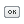
		 [PPButton](PPButton.htm)

		 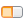
		 [PPButtonGroup](PPButtonGroup.htm)

		 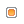
		 [PPCheckBox](PPCheckBox.htm)

		 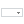
		 [PPComboBox](PPComboBox.htm)

		 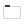
		 [PPGroupBox](PPGroupBox.htm)

		 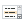
		 [PPListBox](PPListBox.htm)

		 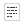
		 [PPMemo](PPMemo.htm)

		 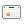
		 [PPMonthCalendar](PPMonthCalendar.htm)

		 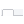
		 [PPPageControl](PPPageControl.htm)

		 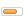
		 [PPProgressBar](PPProgressBar.htm)

		 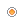
		 [PPRadioButton](PPRadioButton.htm)

		 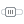
		 [PPTrackBar](PPTrackBar.htm)

См. также:

[Стандартные
 компоненты](../01_Standart_Components/Standart_Components.htm) | [Дополнительные
 компоненты](../02_Additional_components/Additional_components.htm) | [Компоненты
 доступа к данным](../03_Components_of_the_access_to_data/03_components_of_the_access_to_data.htm)

		Справочная
		 система на версию 10.9
		 от 18/08/2025,
		 © ООО «ФОРСАЙТ»,
