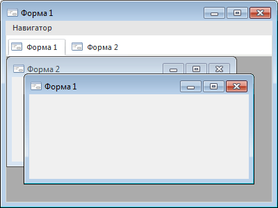

# Форма: Компонент дизайнера форм

Форма: Компонент дизайнера форм
-

# Форма

## Иерархия наследования

           [IComponent](modforms.chm::/Interface/IComponent/IComponent.htm)

           [IControl](ModForms.chm::/Interface/IControl/IControl.htm)

           [IFormControl](ModForms.chm::/Interface/IFormControl/IFormControl.htm)

           [IFormClass](ModForms.chm::/Interface/IFormClass/IFormClass.htm)

           [Form](ModForms.chm::/Class/Form/Form.htm)

## Описание

Форма является основным компонентом, на котором располагаются все остальные
 компоненты дизайнера форм. Класс [Form](ModForms.chm::/Class/Form/Form.htm)
 используется для создания стандартных окон, окон инструментов, необрамленных
 и перемещаемых окон. Класс [Form](ModForms.chm::/Class/Form/Form.htm)
 также используется для создания модальных окон, например, окна. Для определения
 параметров формы используются свойства и методы, реализованные в [IFormControl](ModForms.chm::/Interface/IFormControl/IFormControl.htm).
 Параметры активной формы из языка Fore можно получить используя свойство
 [Active](ModForms.chm::/Interface/IFormClass/IFormClass.Active.htm),
 либо используя зарезервированный идентификатор Self.
 Self вернет параметры формы, в
 рамках которой он был вызван.

## MDI

Особым видом приложений являются приложения с многооконным интерфейсом
 - MDI. MDI приложение представляет собой главную MDI-форму. В области
 главной формы в виде отдельных окон отображаются дочерние MDI-формы.

Для создания главной MDI-формы необходимо свойству [WindowStyle](ModForms.chm::/Interface/IFormControl/IFormControl.WindowStyle.htm)
 установить значения MDIFrame. Дочерние MDI-формы создаются путем установки
 свойству [WindowStyle](ModForms.chm::/Interface/IFormControl/IFormControl.WindowStyle.htm)
 значения MDIChild.

На главной MDI-форме могут использоваться только следующие компоненты:
 [BannerBar](02_Additional_components/BannerBar.htm), [ControlBar](02_Additional_components/ControlBar.htm),
 [MainMenu](01_Standart_Components/MainMenu.htm), [ReportFormulaBar](03_Components_of_the_access_to_data/ReportFormulaBar.htm),
 [Ribbon](02_Additional_components/Ribbon.htm), [Toolbar](02_Additional_components/ToolBar.htm).
 Дочерние MDI-формы могут содержать любые компоненты.

При работе MDI приложения все дочерние MDI-формы отображаются в специальной
 области, выделенной в рамках главной MDI-формы. В верхней части данной
 области отображаются вкладки, соответствующие всем открытым дочерним MDI-формам.
 Для вкладок реализовано контекстное меню, используемое для управления
 открытыми дочерними MDI-формами. Данное меню содержит три пункта:

	- Закрыть окно

	- Закрыть все окна, кроме текущего

	- Закрыть все окна

Для активации MDI-формы необходимо щелкнуть по соответствующей вкладке,
 либо выбрать форму из списка, открываемого при нажатии кнопки .
 Данная кнопка расположена с правой стороны в области вкладок. Для закрытия
 какой-либо дочерней MDI-формы необходимо щелкнуть средней кнопкой мыши
 (роликом мыши) в области соответствующей вкладки. Закрытие активной дочерней
 MDI-формы можно осуществить следующим образом:

	- в области вкладок выполнить пункт контекстного меню
	 «Закрыть окно».

	- с правой стороны в области вкладок нажать кнопку .

В языке Fore управление дочерними MDI-окнами осуществляется с помощью
 соответствующих свойств и методов, реализованных в интерфейсе [IFormControl](ModForms.chm::/Interface/IFormControl/IFormControl.htm).
 При создании дочерних MDI-окон в качестве родительского окна в методе
 [CreateForm](ModForms.chm::/Class/Form/Form.CreateForm.htm)
 должна передаваться главная MDI-форма.

Примечание.
 Форма, открытая модально для какой-либо дочерней MDI-формы, будет существовать
 вне зависимости от данной формы. При закрытии дочерней MDI-формы, формы,
 открытые для нее модально, будут доступны. Закрытие всех модальных форм
 будет производиться при закрытии главной (MDIFrame) MDI-формы.

## Пример

## Свойства формы

		 Имя свойства
		 Краткое описание

		 
		 [Active](ModForms.chm::/Interface/IFormClass/IFormClass.Active.htm)

		 Свойство Active возвращает
		 параметры формы, активной в данный момент.

		 
		 [MakeShortcut](ModForms.chm::/Interface/IFormClass/IFormClass.MakeShortcut.htm)

		 Свойство MakeShortcut
		 возвращает значение, соответствующее сочетание «горячих клавиш»,
		 которое необходимо назначить для какого-либо действия.

## Методы формы

		 Имя метода
		 Краткое описание

		 
		 [CreateForm](ModForms.chm::/Class/Form/Form.CreateForm.htm)

		 Метод CreateForm осуществляет
		 создание новой формы.

## События формы

		 Имя события
		 Краткое описание

		 
		 [OnActivate](ModForms.chm::/Class/Form/Form.OnActivate.htm)

		 Событие OnActivate
		 наступает в момент получения фокуса формой, либо одним из ее дочерних
		 компонентов.

		 
		 [OnBeginDrag](ModForms.chm::/Interface/IControl/IControl.OnBeginDrag.htm)

		 Событие OnBeginDrag
		 для компонента наступает, когда пользователь начинает перетаскивать
		 объект от компонента.

		 
		 [OnClick](ModForms.chm::/Interface/IControl/IControl.OnClick.htm)

		 Событие OnClick наступает,
		 если пользователь щёлкнул в области формы.

		 
		 [OnClose](ModForms.chm::/Class/Form/Form.OnClose.htm)

		 Событие OnClose наступает
		 непосредственно перед закрытием формы.

		 
		 [OnCloseQuery](ModForms.chm::/Class/Form/Form.OnCloseQuery.htm)

		 Событие OnCloseQuery
		 наступает в тот момент, когда форма получает команду на закрытие.

		 
		 [OnCommand](ModForms.chm::/Class/Form/Form.OnCommand.htm)

		 Событие OnCommand наступает
		 во время отправления команды данной форме от другой формы.

		 
		 [OnCreate](ModForms.chm::/Class/Form/Form.OnCreate.htm)

		 Событие OnCreate наступает
		 непосредственно при создании формы.

		 
		 [OnDblClick](ModForms.chm::/Interface/IControl/IControl.OnDblClick.htm)

		 Событие OnDblClick
		 наступает, если пользователь дважды щёлкнул в области формы.

		 
		 [OnDeactivate](ModForms.chm::/Class/Form/Form.OnDeactivate.htm)

		 Событие OnDeactivate
		 наступает в момент потери фокуса формой, либо одним из ее дочерних
		 компонентов.

		 
		 [OnDragDrop](ModForms.chm::/Interface/IControl/IControl.OnDragDrop.htm)

		 Событие OnDragDrop
		 для компонента наступает, когда пользователь отпускает над ним
		 перетаскиваемый объект.

		 
		 [OnDragEnter](ModForms.chm::/Interface/IControl/IControl.OnDragEnter.htm)

		 Событие OnDragEnter
		 наступает, когда перетаскиваемый объект входит в границы данного
		 компонента.

		 
		 [OnDragLeave](ModForms.chm::/Interface/IControl/IControl.OnDragLeave.htm)

		 Событие OnDragLeave
		 наступает, когда перетаскиваемый объект выходит за границы данного
		 компонента.

		 
		 [OnDragOver](ModForms.chm::/Interface/IControl/IControl.OnDragOver.htm)

		 Событие OnDragOver
		 для компонента наступает, когда пользователь протаскивает над
		 ним перетаскиваемый объект.

		 
		 [OnEnter](ModForms.chm::/Interface/IControl/IControl.OnEnter.htm)

		 Событие OnEnter наступает
		 в момент получения фокуса компонентом.

		 
		 [OnExit](ModForms.chm::/Interface/IControl/IControl.OnExit.htm)

		 Событие OnExit наступает
		 в момент потери фокуса компонентом.

		 
		 [OnHelp](ModForms.chm::/Class/Form/Form.OnHelp.htm)

		 Событие OnHelp наступает
		 во время нажатия на компонент при активном режиме отображения
		 справки, либо при нажатии кнопки «F1» для активного компонента.

		 
		 [OnHide](ModForms.chm::/Class/Form/Form.OnHide.htm)

		 Событие OnHide наступает
		 непосредственно перед тем, как форма станет невидимой.

		 
		 [OnMDIActivate](ModForms.chm::/Class/Form/Form.OnMDIActivate.htm)

		 Событие OnMDIActivate
		 возникает во время смены активной дочерней MDI-формы.

		 
		 [OnKeyDown](ModForms.chm::/Interface/IControl/IControl.OnKeyDown.htm)

		 Событие OnKeyDown наступает,
		 если компонент находится в фокусе и производится нажатие на клавиатуру.

		 
		 [OnKeyPress](ModForms.chm::/Interface/IControl/IControl.OnKeyPress.htm)

		 Событие OnKeyPress
		 наступает, если компонент находится в фокусе, при нажатии пользователем
		 символьной клавиши.

		 
		 [OnKeyPreview](ModForms.chm::/Interface/IControl/IControl.OnKeyPreview.htm)

		 Событие OnKeyPreview
		 наступает перед каждым событием, связанным с нажатием клавиш.

		 
		 [OnKeyUp](ModForms.chm::/Interface/IControl/IControl.OnKeyUp.htm)

		 Событие OnKeyUp наступает,
		 если компонент находится в фокусе, при отпускании пользователем
		 любой, ранее нажатой клавиши.

		 
		 [OnMouseDown](ModForms.chm::/Interface/IControl/IControl.OnMouseDown.htm)

		 Событие OnMouseDown
		 наступает, если компонент находится в фокусе, и на компоненте
		 произведено нажатие любой из кнопок мыши.

		 
		 [OnMouseEnter](ModForms.chm::/Interface/IControl/IControl.OnMouseEnter.htm)
		 Событие OnMouseEnter
		 наступает в момент входа курсора мыши в область компонента.

		 
		 [OnMouseHover](ModForms.chm::/Interface/IControl/IControl.OnMouseHover.htm)
		 Событие OnMouseHover
		 наступает при задержке курсора мыши в области компонента.

		 
		 [OnMouseLeave](ModForms.chm::/Interface/IControl/IControl.OnMouseLeave.htm)
		 Событие OnMouseLeave
		 наступает в момент выхода курсора мыши за пределы области компонента.

		 
		 [OnMouseMove](ModForms.chm::/Interface/IControl/IControl.OnMouseMove.htm)

		 Событие OnMouseMove
		 наступает при перемещении пользователем курсора мыши над компонентом.

		 
		 [OnMouseUp](ModForms.chm::/Interface/IControl/IControl.OnMouseUp.htm)

		 Событие OnMouseUp наступает,
		 если компонент находится в фокусе и на компоненте была отпущена
		 любая из ранее нажатых кнопок мыши.

		 
		 [OnMouseWheel](ModForms.chm::/Interface/IControl/IControl.OnMouseWheel.htm)

		 Событие OnMouseWheel
		 наступает, если компонент находится в фокусе при вращении колеса
		 мыши.

		 
		 [OnResize](ModForms.chm::/Class/Form/Form.OnResize.htm)

		 Событие OnResize наступает
		 после изменения размера формы.

		 
		 [OnShow](ModForms.chm::/Class/Form/Form.OnShow.htm)

		 Событие OnShow наступает
		 непосредственно перед выводом формы на экран.

См. также:

[Компоненты
 среды разработки](../01_Development_Environment/Development_environment_components.htm)

		Справочная
		 система на версию 10.9
		 от 18/08/2025,
		 © ООО «ФОРСАЙТ»,
