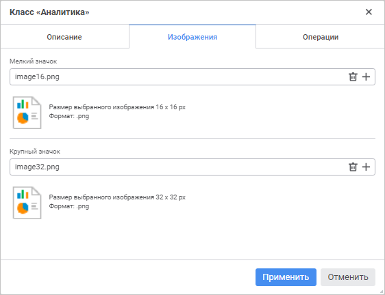

# Добавление изображений пользовательского класса: Пользовательские метаданные

Добавление изображений пользовательского класса: Пользовательские метаданные
-

# Добавление изображений пользовательского класса

Для добавления изображений [пользовательского
 класса](UiNav_Classes_Object.htm) используйте вкладку «Изображение»
 в окне «Класс <наименование
	 класса>».

Примечание.
 В настольном приложении добавление изображений пользовательского класса
 осуществляется на вкладке «[Описание](ObjectsClasses.htm)».

[Для открытия
 окна](javascript:TextPopup(this))

		- Откройте окно «Параметры»:

			- в веб-приложении выполните команду  «Параметры» на боковой панели
			 [навигатора
			 объектов](GetStarted.chm::/Interface/Interface_Navigator.htm);

			- в настольном приложении выполните команду «Сервис
			 > Параметры» в главном меню навигатора объектов;

		- Перейдите на страницу «Пользовательские
		 метаданных».

		- Создайте или измените существующий пользовательский класс
		 на вкладке «Классы объектов».

	Для создания пользовательского класса
	 выполните одно из действий:

			- в веб-приложении нажмите
			 кнопку  «Добавить»;

			- в настольном приложении:

				- нажмите кнопку «Добавить»;

				- выполните команду «Добавить»
				 в контекстном меню списка классов.

	Для редактирования существующего класса
	 выполните одно из действий:

			- в веб-приложении:

				- выделите класс и нажмите кнопку 
				 «Редактировать»;

				- дважды щёлкните по классу;

			- в настольном приложении:

				- выделите класс и нажмите кнопку «Редактировать»;

				- выполните команду «Редактировать»
				 в контекстном меню класса;

				- дважды щёлкните по классу.

Для добавления изображений:

	- Нажмите кнопку  «Добавить»
	 в поле «Мелкий значок» или
	 «Крупный значок». После чего
	 будет открыт диалог выбора файла.

	- Выберите изображения размером 16*16 пикселей для мелкого значка
	 и 32*32 для крупного значка. Доступные форматы изображений: *.svg,
	 *.png, *.jpg, *.jpeg *.bmp, *.gif.

После выполнения действий изображения будут сохранены в ресурсе, который
 задан одним из способов:

	- для настраиваемого пользовательского класса на вкладке «[Описание](ObjectsClasses.htm)»
	 в окне «Класс <наименование
	 класса>»;

	- для всех пользовательских классов на вкладке «[Пользовательские метаданные > Классы
	 объектов](UiNav_Classes_Object.htm)» в окне «Параметры».

Для удаления изображения нажмите кнопку  «Удалить»
 в поле «Мелкий значок» или «Крупный значок».

Далее перейдите к [настройке операций
 пользовательского класса](User_Class_Operation.htm).

См. также:

[Создание
 пользовательских классов](UiNav_Classes_Object.htm)

		Справочная
		 система на версию 10.9
		 от 18/08/2025,
		 © ООО «ФОРСАЙТ»,
