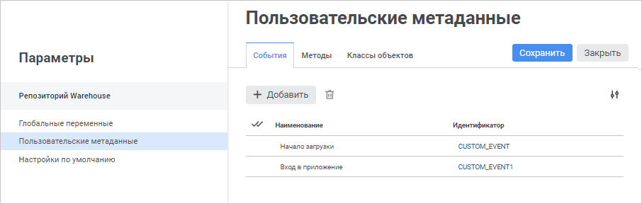
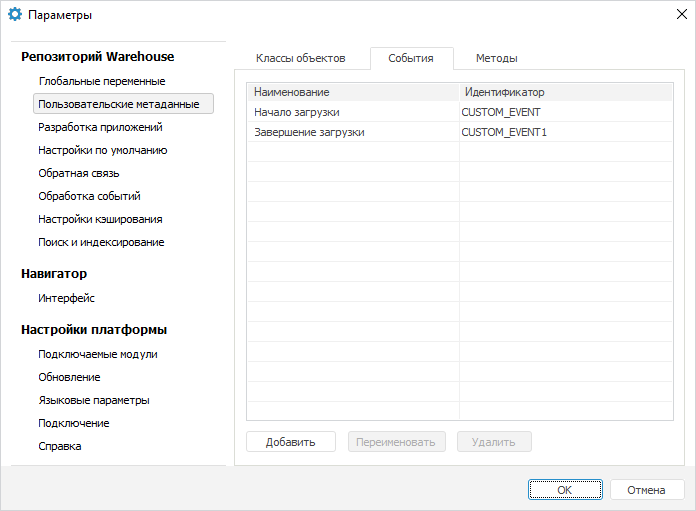

# Настраиваемые события: Пользовательские метаданные

Настраиваемые события: Пользовательские метаданные
-

# Настраиваемые события

Список настраиваемых событий задаётся на вкладке «Пользовательские
 метаданные > События» в окне «Параметры».

Примечание.
 Настройка событий доступна пользователям, состоящим в группе «[Администраторы](admin.chm::/03_Admin/Groups/Admin_Groups.htm)».

[Для открытия окна](javascript:TextPopup(this))

		- в веб-приложении выполните команду 
		 «Параметры» на боковой
		 панели [навигатора
		 объектов](GetStarted.chm::/Interface/Interface_Navigator.htm);

		- в настольном приложении выполните команду «Сервис
		 > Параметры» в главном меню навигатора объектов.

	Веб-приложение Настольное приложение

		

		

На вкладке доступны операции:

[Добавление
 события](javascript:TextPopup(this))

	Для добавления события выполните одно из действий:

		- в веб-приложении нажмите кнопку  «Добавить»;

		- в настольном приложении:

			- нажмите кнопку «Добавить»;

			- выполните команду «Добавить»
			 в контекстном меню списка событий.

	После выполнения одного из действий будет добавлено событие в конец
	 списка событий. Задайте наименование события. Идентификатор события
	 генерируется автоматически и недоступен для изменения.

[Переименование
 события](javascript:TextPopup(this))

	Для переименования события:

		- Переведите наименование события в режим редактирования:

			- в веб-приложении щёлкните по наименованию события;

			- в настольном приложении:

				- выделите событие и нажмите кнопку «Переименовать»;

				- выполните команду «Переименовать»
				 в контекстном меню события;

				- выделите событие и нажмите клавишу F2.

		- Введите новое наименование события и нажмите клавишу ENTER.

	После выполнения действий событие будет переименовано.

[Удаление
 события](javascript:TextPopup(this))

	Для удаления события:

		- Выделите одно или несколько событий с зажатой клавишей CTRL
		 или SHIFT.

		- Выполните одно из действий:

			- в веб-приложении нажмите кнопку 
			 «Удалить»;

			- в настольном приложении:

				- нажмите кнопку «Удалить»;

				- выполните команду «Удалить»
				 в контекстном меню события.

	После выполнения действий будет выдан диалог подтверждения. При
	 положительном ответе выделенные события будут удалены.

## Генерация события

Отслеживанием наступления событий занимается [планировщик задач](UiAppSrv.chm::/UiAppSrv_purpose.htm).
 Для этого в контейнере задач, который указан в его настройках, должны
 быть задачи, запускаемые при наступлении [настраиваемого
 события](UiAppSrv.chm::/3_Work_Tasks/UiAppSrv_Work_Tasks_CreateTask_TimeTable.htm#customevent).

Событие может наступить в результате выполнения какой-либо другой задачи,
 если для неё задана соответствующая [настройка](UiAppSrv.chm::/3_Work_Tasks/UiAppSrv_Work_Tasks_CreateTask_Rezult.htm#event).
 Также событие может быть сгенерировано из прикладного кода. Для работы
 с коллекцией событий предназначен интерфейс [IMetabaseCustomForeEvents](KeSom.chm::/Interface/IMetabaseCustomForeEvents/IMetabaseCustomForeEvents.htm).
 Для генерации события получите его описание, используя свойства или методы
 указанного интерфейса, и выполните метод [IMetabaseCustomForeEvent.Invoke](KeSom.chm::/Interface/IMetabaseCustomForeEvent/IMetabaseCustomForeEvent.Invoke.htm).

Пример генерации события с наименованием «Начало
 загрузки». Если при выполнении примера запущен планировщик задач
 и в контейнере, с которым работает планировщик, имеются задачи, запускаемые
 при выполнении данного события, то они будут выполнены. Для выполнения
 примера добавьте ссылку на системную сборку Metabase.

	Sub InvokeEvent;

	Var

	    MB: IMetabase;

	    CustomClassExtender: IMetabaseCustomExtender;

	    Events: IMetabaseCustomForeEvents;

	    ForeEvent: IMetabaseCustomForeEvent;

	Begin

	    // Получим репозиторий

	    MB := MetabaseClass.Active;

	    // Получим контейнер пользовательских классов

	    CustomClassExtender := Mb.SpecialObject(MetabaseSpecialObject.CustomExtender).Edit As IMetabaseCustomExtender;

	    // Получим список событий

	    Events := CustomClassExtender.Events;

	    ForeEvent := Events.FindByName("Начало загрузки");

	    // Сгенерируем событие

	    ForeEvent.Invoke;

	End Sub InvokeEvent;

См. также:

[Расширение
 функциональности приложения](../../01_Development_Environment/extention_functionality.htm)

		Справочная
		 система на версию 10.9
		 от 18/08/2025,
		 © ООО «ФОРСАЙТ»,
