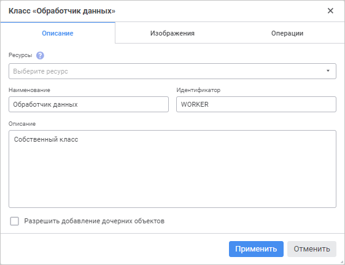
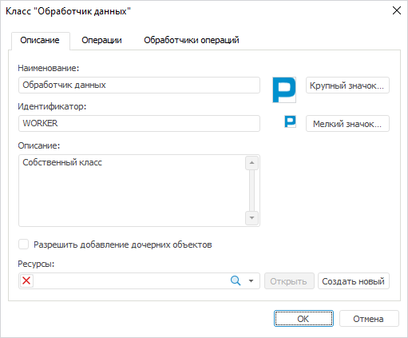

# Описание пользовательского класса: Пользовательские метаданные

Описание пользовательского класса: Пользовательские метаданные
-

# Описание пользовательского класса

Для описания [пользовательского класса](UiNav_Classes_Object.htm)
 используйте вкладку «Описание»
 в окне «Класс <наименование
 класса>».

[Для открытия
 окна](javascript:TextPopup(this))

		- Откройте окно «Параметры»:

			- в веб-приложении выполните команду  «Параметры» на боковой панели
			 [навигатора
			 объектов](GetStarted.chm::/Interface/Interface_Navigator.htm);

			- в настольном приложении выполните команду «Сервис
			 > Параметры» в главном меню навигатора объектов;

		- Перейдите на страницу «Пользовательские
		 метаданных».

		- Создайте или измените существующий пользовательский класс
		 на вкладке «Классы объектов».

	Для создания пользовательского класса
	 выполните одно из действий:

			- в веб-приложении нажмите
			 кнопку  «Добавить»;

			- в настольном приложении:

				- нажмите кнопку «Добавить»;

				- выполните команду «Добавить»
				 в контекстном меню списка классов.

	Для редактирования существующего класса
	 выполните одно из действий:

			- в веб-приложении:

				- выделите класс и нажмите кнопку 
				 «Редактировать»;

				- дважды щёлкните по классу;

			- в настольном приложении:

				- выделите класс и нажмите кнопку «Редактировать»;

				- выполните команду «Редактировать»
				 в контекстном меню класса;

				- дважды щёлкните по классу.

	Веб-приложение Настольное приложение

		

		

Задайте параметры:

	- Ресурсы. Выберите в
	 раскрывающемся списке существующий ресурс, который будет использоваться
	 для хранения изображений и локализации информации о пользовательском
	 классе на различные языки.

Для быстрого поиска объекта «Ресурсы»
 в репозитории используйте строку поиска. В зависимости от настроек отображения
 объектов введите в строку поиска наименование, идентификатор или ключ
 объекта, который необходимо найти. Поиск будет выполняться автоматически
 по мере ввода искомого текста. В списке будут только те объекты, наименования/идентификаторы/ключи
 которых содержат вводимый текст. Для очистки строки нажмите кнопку 
 «Очистить» или используйте клавишу
 BACKSPACE.

Для настройки отображения объектов репозитория
 на боковой панели нажмите кнопку 
 «Отображение объекта» и выберите
 в раскрывающемся меню вариант отображения:

		- Наименование. Объекты
		 отображаются под своими наименованиями. Вариант по умолчанию;

		- Идентификатор. Объекты
		 отображаются под своими идентификаторами;

		- Ключ. Объекты отображаются
		 под своими ключами.

Выбрать можно несколько вариантов. Идентификатор
 и ключ будут указаны в скобках.

Ресурс может задаваться для конкретного класса
 или для всех классов на вкладке «[Пользовательские
 метаданные > Классы объектов](UiNav_Classes_Object.htm)».

Примечание.
 Для добавления изображений пользовательского класса в веб-приложении используйте
 вкладку «[Изображения](Adding_Custom_Class_Images.htm)».

В настольном приложении для добавления изображений
 пользовательского класса используйте кнопки «Крупный
 значок» и «Мелкий значок».
 При нажатии на кнопки будет открыт диалог выбора файлов, в котором выберите
 изображение размером 32*32 или 16*16 соответственно. После чего выбранный
 файл будет разбит на отдельные изображения и сохранён в указанном ресурсе.
 Индексы крупного и мелкого изображений должны быть одинаковыми. Для выбора
 изображений пользовательского класса нажмите на соответствующую белую
 область рядом с кнопками «Крупный значок»
 и «Мелкий значок». Если для всех
 пользовательских классов задан общий ресурс на вкладке «[Пользовательские метаданные > Классы
 объектов](UiNav_Classes_Object.htm)», то при нажатии на белую область можно выбрать изображения,
 содержащиеся в окне «[Редактор
 списка пиктограмм](UiNav_Classes_Object.htm#pictograms)».

При необходимости для открытия ресурса в
 настольном приложении нажмите кнопку «Открыть»,
 для создания нового ресурса нажмите кнопку «Создать
 новый»;

	- Наименование. Введите
	 наименование пользовательского класса. По умолчанию задано наименование
	 «CustomClass»;

	- Идентификатор. Введите
	 последовательность букв латинского алфавита, цифр и знаков подчёркивания,
	 начинающуюся с буквы. Идентификатор пользовательского класса должен
	 быть уникальным. По умолчанию задан идентификатор, сгенерированный
	 автоматически;

	- Описание. Введите краткое
	 описание пользовательского класса;

	- Разрешить добавление дочерних
	 объектов. Установите флажок, если объекты пользовательского
	 класса предполагается использовать в качестве объектов-контейнеров.
	 Внутри объектов-контейнеров можно создавать любые объекты репозитория.
	 Также внутри таких объектов действует собственное пространство идентификаторов.

Далее в веб-приложении перейдите к [добавлению
 изображений пользовательского класса](Adding_Custom_Class_Images.htm), в настольном приложении - к
 [настройке операций](User_Class_Operation.htm).

См. также:

[Создание
 пользовательских классов](UiNav_Classes_Object.htm)

		Справочная
		 система на версию 10.9
		 от 18/08/2025,
		 © ООО «ФОРСАЙТ»,
