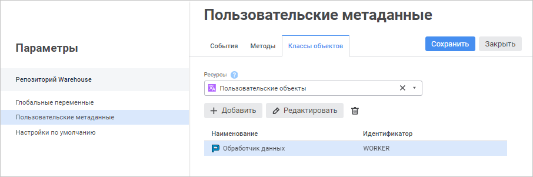
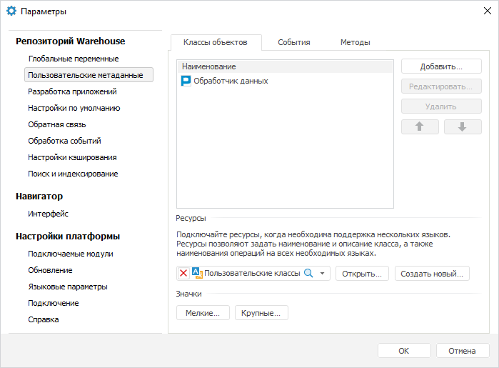

# Создание пользовательских классов

Создание пользовательских классов
-

# Создание пользовательских классов

В [навигаторе
 объектов](getstarted.chm::/Interface/Interface_Navigator.htm) доступна работа со встроенными типами объектов
 и дополнительными объектами пользовательских классов.

Работа с пользовательскими классами осуществляется на вкладке «Пользовательские метаданные > Классы
 объектов» в окне «Параметры».

Примечание.
 Работа с пользовательскими классами доступна пользователям, состоящим
 в группе «[Администраторы](admin.chm::/03_Admin/Groups/Admin_Groups.htm)».

[Для открытия
 окна](javascript:TextPopup(this))

		- в веб-приложении выполните команду 
		 «Параметры» на боковой
		 панели [навигатора
		 объектов](GetStarted.chm::/Interface/Interface_Navigator.htm);

		- в настольном приложении выполните команду «Сервис
		 > Параметры» в главном меню навигатора объектов.

	Веб-приложение Настольное приложение

		

		

На вкладке доступны операции:

[Добавление
 класса](javascript:TextPopup(this))

	Для добавления пользовательского класса выполните одно из действий:

		- в веб-приложении нажмите кнопку  «Добавить»;

		- в настольном приложении:

			- нажмите кнопку «Добавить»;

			- выполните команду «Добавить»
			 в контекстном меню списка классов.

	После выполнения одного из действий будет открыто окно «[Класс <наименование
	 класса>](ObjectsClasses.htm)»:

		- задайте [описание класса](ObjectsClasses.htm);

		- добавьте [изображения](Adding_Custom_Class_Images.htm),
		 которые будут отображаться в навигаторе объектов при создании
		 объектов пользовательского класса;

		- настройте [операции](User_Class_Operation.htm),
		 которые будут доступны для объектов пользовательского класса,
		 и задайте для них [обработчики](User_Class_Operation.htm#eventhandler).

[Редактирование
 класса](javascript:TextPopup(this))

	Для редактирования класса выполните одно из действий:

		- в веб-приложении:

			- выделите класс и нажмите кнопку 
			 «Редактировать»;

			- дважды щёлкните по классу;

		- в настольном приложении:

			- выделите класс и нажмите кнопку «Редактировать»;

			- выполните команду «Редактировать»
			 в контекстном меню класса;

			- дважды щёлкните по классу.

	После выполнения одного из действий будет открыто окно «[Класс <наименование
	 класса>](ObjectsClasses.htm)». Измените параметры класса, заданные
	 при [создании](#create).

[Удаление
 класса](javascript:TextPopup(this))

	Для удаления класса:

		- Выделите один или несколько классов с зажатой клавишей CTRL
		 или SHIFT.

		- Выполните одно из действий:

			- в веб-приложении нажмите кнопку 
			 «Удалить»;

			- в настольном приложении:

				- нажмите кнопку «Удалить»;

				- выполните команду «Удалить»
				 в контекстном меню класса.

	После выполнения действий будет выдан диалог подтверждения. При
	 положительном ответе выделенные классы будут удалены.

[Настройка
 мультиязычности](javascript:TextPopup(this))

	Для хранения изображений и локализации информации о пользовательских
	 классах на различные языки задайте объект «[Ресурсы](UiNav.chm::/Multilanguage/Resources.htm)»:

		- в веб-приложении выберите существующий ресурс в раскрывающемся
		 списке «Ресурсы».

	Для быстрого поиска объекта «Ресурсы»
	 в репозитории используйте строку поиска. В зависимости от настроек
	 отображения объектов введите в строку поиска наименование, идентификатор
	 или ключ объекта, который необходимо найти. Поиск будет выполняться
	 автоматически по мере ввода искомого текста. В списке будут только
	 те объекты, наименования/идентификаторы/ключи которых содержат вводимый
	 текст. Для очистки строки нажмите кнопку  «Очистить» или используйте клавишу
	 BACKSPACE.

	Для настройки отображения объектов репозитория
	 на боковой панели нажмите кнопку  «Отображение
	 объекта» и выберите в раскрывающемся меню вариант отображения:

			- Наименование.
			 Объекты отображаются под своими наименованиями. Вариант по
			 умолчанию;

			- Идентификатор.
			 Объекты отображаются под своими идентификаторами;

			- Ключ. Объекты
			 отображаются под своими ключами.

	Выбрать можно несколько вариантов. Идентификатор
	 и ключ будут указаны в скобках.

		- в настольном приложении:

			- выберите существующий ресурс в раскрывающемся списке
			 «Ресурсы»;

			- создайте новый ресурс помощью кнопки «Создать
			 новый».

	В настольном приложении для открытия выбранного ресурса нажмите
	 кнопку «Открыть».

	В ресурсах сохраняются:

		- наименования классов;

		- описания классов;

		- наименования операций, созданных для классов;

		- две группы изображений: 16*16 и 32*32.

	При необходимости в [настройках](ObjectsClasses.htm)
	 каждого класса могут быть определены собственные ресурсы, в которых
	 будет храниться информация только по этому классу.

	Идентификаторы ресурсов:

		- для наименований классов будут создаваться строковые ресурсы
		 с идентификатором CLSNAME<порядковый
		 номер класса>, например, CLSNAME1;

		- для описаний классов будут создаваться строковые ресурсы
		 с идентификатором CLSDESCR<порядковый
		 номер класса>, например, CLSDESCR1;

		- для операций классов будут создаваться строковые ресурсы
		 с идентификатором CLS<порядковый
		 номер класса>OP<порядковый
		 номер операции>, например, CLS1OP2;

		- коллекции маленьких и больших изображений будут храниться
		 в графических ресурсах с идентификаторами <идентификатор
		 контейнера пользовательских классов>SMALLICON и <идентификатор контейнера пользовательских
		 классов>LARGEICON соответственно.

	Примечание.
	 После указания объекта «Ресурсы»
	 автоматически будут созданы строковые ресурсы и изображения для всех
	 существующих классов. Текущие наименования и описания будут применены
	 для языка по умолчанию.

[Добавление
 изображений класса](javascript:TextPopup(this))

	Примечание.
	 Доступно только в настольном приложении. Для добавления изображений
	 пользовательского класса в веб-приложении используйте вкладку «[Изображение](Adding_Custom_Class_Images.htm)»
	 в окне «Класс <наименование
	 класса>».

	Для добавления изображений списка пользовательского класса:

		- Убедитесь, что в раскрывающемся списке «[Ресурсы](#resources)» выбран ресурс.

		- Нажмите кнопку «Мелкие»
		 или «Крупные» в зависимости
		 от размера изображений.

	После выполнения действий будет открыто окно «Редактор
	 списка пиктограмм». Сформируйте коллекцию мелких и крупных
	 изображений, которые будут доступны для использования при настройке
	 пользовательского класса на вкладке «[Описание](ObjectsClasses.htm)» в окне «Класс
	 <наименование класса>».
	 Индексы крупного и мелкого изображений должны быть одинаковыми. Добавленные
	 изображения хранятся в выбранном ресурсе.

[Перемещение
 класса](javascript:TextPopup(this))

	Примечание.
	 Доступно только в настольном приложении.

	Для перемещения класса в списке выделите его и используйте кнопки
	  «Вверх»,  «Вниз». Порядок классов в списке
	 влияет на порядок, в котором они будут отображаться в [навигаторе](getstarted.chm::/Interface/Interface_Navigator.htm)
	 при [создании
	 объекта](UiNav.chm::/02_Navigator/General_Principles_of_Work.htm#add_object).

[Обновление классов](javascript:TextPopup(this))

	Примечание.
	 Доступно только в настольном приложении.

	Для переноса настроек пользовательских классов из тестового репозитория
	 в промышленный используется [механизм
	 обновления](UpdManager.chm::/CreateUpdate/Admin_CreateUpdate.htm), который применяется и для других объектов
	 репозитория. Для добавления пользовательских классов в обновление
	 выделите их в списке и выполните команду «Добавить
	 в обновление» в контекстном меню классов. Классы будут добавлены
	 как [специальные
	 объекты](UpdManager.chm::/CreateUpdate/Admin_CreateUpdate_SpecialObjects.htm). Дальнейшая работа по сохранению и применению
	 обновления осуществляется в [менеджере обновлений](UpdManager.chm::/Admin_UpdateTitle.htm).

Примечание.
 Настройки пользовательских классов применяются после повторного входа
 в систему.

Для создания объекта пользовательского класса в навигаторе объектов
 обратитесь к разделу «[Создание объектов
 пользовательского класса](object_custom_class.htm)».

Примечание.
 Создание объекта пользовательского класса доступно только в настольном
 приложении.

При необходимости определите список [настраиваемых
 событий](Classes_Events.htm). Генерация событий осуществляется в прикладном коде на Fore.
 Отслеживание событий может производиться в [контейнере запланированных
 задач](UiAppSrv.chm::/Getting_Started.htm).

См. также:

[Расширение
 функциональности приложения](../../01_Development_Environment/extention_functionality.htm)

		Справочная
		 система на версию 10.9
		 от 18/08/2025,
		 © ООО «ФОРСАЙТ»,
