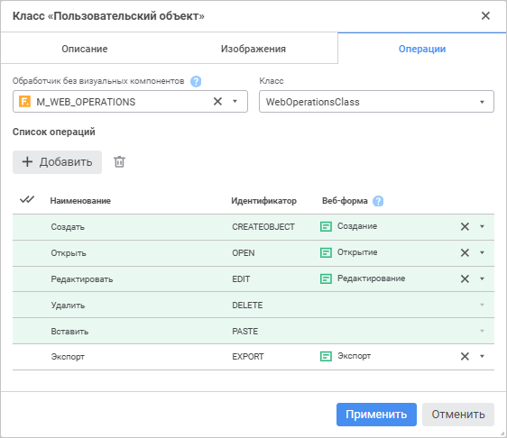
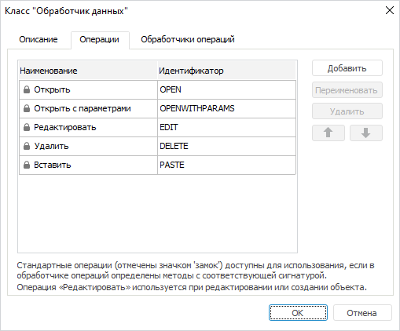
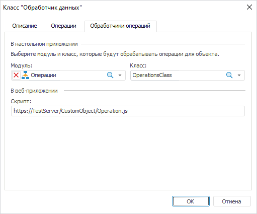

# Настройка операций пользовательского класса: Пользовательские метаданные

Настройка операций пользовательского класса: Пользовательские метаданные
-

# Настройка операций пользовательского
 класса

Для настройки операций, которые будут доступны для [объектов
 пользовательского класса](UiNav_Classes_Object.htm), используйте вкладку «Операции»
 в окне «Класс <наименование
 класса>».

[Для открытия
 окна](javascript:TextPopup(this))

		- Откройте окно «Параметры»:

			- в веб-приложении выполните команду  «Параметры» на боковой панели
			 [навигатора
			 объектов](GetStarted.chm::/Interface/Interface_Navigator.htm);

			- в настольном приложении выполните команду «Сервис
			 > Параметры» в главном меню навигатора объектов;

		- Перейдите на страницу «Пользовательские
		 метаданных».

		- Создайте или измените существующий пользовательский класс
		 на вкладке «Классы объектов».

	Для создания пользовательского класса
	 выполните одно из действий:

			- в веб-приложении нажмите
			 кнопку  «Добавить»;

			- в настольном приложении:

				- нажмите кнопку «Добавить»;

				- выполните команду «Добавить»
				 в контекстном меню списка классов.

	Для редактирования существующего класса
	 выполните одно из действий:

			- в веб-приложении:

				- выделите класс и нажмите кнопку 
				 «Редактировать»;

				- дважды щёлкните по классу;

			- в настольном приложении:

				- выделите класс и нажмите кнопку «Редактировать»;

				- выполните команду «Редактировать»
				 в контекстном меню класса;

				- дважды щёлкните по классу.

	Веб-приложение Настольное приложение

		

		

По умолчанию в таблице отображаются стандартные операции, недоступные
 для изменения и удаления.

[Добавление операции](javascript:TextPopup(this))

	Для добавления операции:

		- Выполните одно из действий:

			- в веб-приложении нажмите кнопку 
			 «Добавить»;

			- в настольном приложении:

				- нажмите кнопку «Добавить»;

				- выполните команду «Добавить»
				 в контекстном меню списка операций.

		- Задайте параметры:

			- Наименование.
			 Введите наименование операции. По умолчанию задано наименование
			 «Операция <порядковый
			 номер>»;

			- Идентификатор.
			 Введите последовательность букв латинского алфавита, цифр
			 и знаков подчёркивания, начинающуюся с буквы. Идентификатор
			 операции должен совпадать с наименованием процедуры, которая
			 будет создана в [обработчике операций](#eventhandler).
			 По умолчанию задан идентификатор в формате: CLS<порядковый
			 номер класса>OP<порядковый
			 номер операции>. Каждая операция должна иметь уникальный
			 идентификатор.

	После выполнения действий будет добавлена операция для пользовательского
	 класса. Операции доступны в контекстном меню объекта пользовательского
	 класса в навигаторе, если для этих операций настроены [обработчики](#eventhandler).

[Редактирование
 операции](javascript:TextPopup(this))

	Для редактирования операции выполните одно из действий:

		- в веб-приложении щёлкните по наименованию или идентификатору
		 операции и измените их;

		- в настольном приложении:

			- Выполните одно из действий:

				- выделите наименование или идентификатор операции
				 и нажмите кнопку «Переименовать»;

				- выполните команду «Переименовать»
				 в контекстном меню наименования или идентификатора операции;

				- дважды щёлкните по наименованию или идентификатору
				 операции.

			- Измените наименование или идентификатор операции.

	После выполнения действий скорректируйте наименование процедуры
	 в [обработчике операций](#eventhandler), если был изменён
	 идентификатор.

[Удаление операции](javascript:TextPopup(this))

	Для удаления операции:

		- Выделите одну или несколько операций.

		- Выполните одно из действий:

			- в веб-приложении нажмите кнопку 
			 «Удалить»;

			- в настольном приложении:

				- нажмите кнопку «Удалить»;

				- выполните команду «Удалить»
				 в контекстном меню операции.

	После выполнения действий будет выдан диалог подтверждения. При
	 положительном ответе выделенные операции будут удалены.

[Перемещение
 операции](javascript:TextPopup(this))

	Примечание.
	 Доступно только в настольном приложении.

	Для перемещения операции в списке выделите её и используйте кнопки
	  «Вверх»,  «Вниз». Порядок операций в списке
	 влияет на порядок, в котором они будут отображаться в контекстном
	 меню объекта пользовательского класса в [навигаторе](getstarted.chm::/Interface/Interface_Navigator.htm).

На пользовательские операции можно раздавать права доступа, как и на
 стандартные операции. Для получения подробной информации обратитесь к
 разделу «[Дополнительные
 параметры безопасности](Admin.chm::/03_Admin/Admin_AdminObjects_Extra.htm)».

Максимальное допустимое количество пользовательских операций, которые
 могут быть созданы - 11.

## Обработчики операций

Для обработки операций используется пользовательский класс, реализованный
 в одном из модулей репозитория. Методы-обработчики операций должны иметь
 следующую сигнатуру:

Sub <ИдентификаторОперации>(<Параметр>: IMetabaseObjectDescriptor);

В веб-приложении модуль и класс выбираются в раскрывающихся списках
 «Обработчик без визуальных компонентов»
 и «Класс».

Для быстрого поиска модуля в репозитории используйте строку поиска в
 раскрывающемся списке «Обработчик без
 визуальных компонентов». В зависимости от настроек отображения
 объектов введите в строку поиска наименование, идентификатор или ключ
 модуля, который необходимо найти. Поиск будет выполняться автоматически
 по мере ввода искомого текста. В списке будут только те модули, наименования/идентификаторы/ключи
 которых содержат вводимый текст. Для очистки строки нажмите кнопку 
 «Очистить» или используйте клавишу
 BACKSPACE.

Для настройки отображения объектов репозитория на боковой панели нажмите
 кнопку  «Отображение
 объекта» и выберите в раскрывающемся меню вариант отображения:

	- Наименование. Объекты
	 отображаются под своими наименованиями. Вариант по умолчанию;

	- Идентификатор. Объекты
	 отображаются под своими идентификаторами;

	- Ключ. Объекты отображаются
	 под своими ключами.

Выбрать можно несколько вариантов. Идентификатор и ключ будут указаны
 в скобках.

Ресурс может задаваться для конкретного класса или для всех классов
 на вкладке «[Пользовательские
 метаданные > Классы объектов](UiNav_Classes_Object.htm)».

В настольном приложении выбор осуществляется на отдельной вкладке «Обработчики операций». Также, в
 зависимости от того, где осуществляется работа, имеется ряд отличий, которые
 представлены ниже.

	 Веб-приложение
	  Настольное приложение

		Список системных операций, доступных в веб-приложении:

			- CREATEOBJECT

			- OPEN

			- EDIT

			- DELETE

			- PASTE

		Для обработки операций могут использоваться веб-формы. Выбор
		 веб-формы осуществляется из раскрывающегося списка «Веб-форма»
		 у требуемой операции.

		Для быстрого поиска веб-формы в репозитории используйте строку
		 поиска в раскрывающемся списке «Веб-форма».
		 В зависимости от настроек отображения объектов введите в строку
		 поиска наименование и/или идентификатор веб-формы, которую необходимо
		 найти. Поиск будет выполняться автоматически по мере ввода искомого
		 текста. В списке будут только те веб-формы, наименования которых
		 содержат вводимый текст. Для очистки строки нажмите кнопку 
		 «Очистить» или используйте
		 клавишу BACKSPACE.

Для настройки отображения объектов репозитория на боковой панели нажмите
 кнопку  «Отображение
 объекта» и выберите в раскрывающемся меню вариант отображения:

	- Наименование. Объекты
	 отображаются под своими наименованиями. Вариант по умолчанию;

	- Идентификатор. Объекты
	 отображаются под своими идентификаторами;

	- Ключ. Объекты отображаются
	 под своими ключами.

Выбрать можно несколько вариантов. Идентификатор и ключ будут указаны
 в скобках.

		События OPEN и EDIT всегда обрабатываются только веб-формой.
		 События DELETE и PASTE всегда обрабатываются только в пользовательском
		 классе. Событие CREATEOBJECT и любые пользовательские события
		 могут быть обработаны как веб-формой, так и в пользовательском
		 классе. Если веб-форма не выбрана, то осуществляется обработка
		 в пользовательском классе. Более подробное описание о настройке
		 веб-форм представлено в подразделе «[Использование
		 веб-форм для обработки операций пользовательских классов](../../Web/features_web_form.htm#customclass)».

		Список системных операций, доступных в настольном приложении:

			- OPEN

			- OPENWITHPARAMS

			- EDIT

			- DELETE

			- PASTE

		Операция Редактировать (EDIT) обрабатывается при создании и
		 редактировании объекта пользовательского класса.

		Для указания пользовательского класса используется отдельная
		 вкладка «Обработчики операций»:

		

		В раскрывающемся списке «Модуль»
		 выберите модуль/форму/сборку, а в раскрывающемся списке «Класс» выберите класс, содержащий
		 реализацию обработчиков операций.

		Если предполагается создание параметрических объектов, то также
		 должны быть определены методы с постфиксом WithParams
		 и следующей сигнатурой:

		Sub <ИдентификаторОперации>WithParams(<Параметр1>: IMetabaseObjectDescriptor; <Параметр2>: IMetabaseObjectParamValues);

		В навигаторе объектов операции для объектов будут доступны,
		 если соблюдены следующие условия:

			- у пользователя имеются права на выполнение операции;

			- в указанном классе имеется процедура для обработки операции.

		Указание скрипта, обрабатывающего операции в веб-приложении,
		 более не поддерживается и оставлено для совместимости с предыдущими
		 версиями платформы.

Примеры классов-обработчиков операций:

	Веб-приложение Настольное приложение

			Class WebOperations: Object

			    Sub Createobject(ObjDesc: IMetabaseObjectDescriptor);

			    Begin

			        // Обработка операции "Создать"

			    End Sub Createobject;

			    Sub Open(ObjDesc: IMetabaseObjectDescriptor);

			    Begin

			        // Обработка операции "Открыть"

			    End Sub Open;

			    Sub Edit(ObjDesc: IMetabaseObjectDescriptor);

			    Begin

			        // Обработка операции "Редактировать"

			    End Sub Edit;

			    Sub Paste(ObjDesc: IMetabaseObjectDescriptor);

			    Begin

			        // Обработка операции "Вставить"

			    End Sub Paste;

			    Sub Delete(ObjDesc: IMetabaseObjectDescriptor);

			    Begin

			        // Обработка операции "Удалить"

			    End Sub Delete;

			    Sub Custom1(ObjDesc: IMetabaseObjectDescriptor);

			    Begin

			        // Обработка пользовательской операции

			    End Sub Custom1;

			    Sub Custom2(ObjDesc: IMetabaseObjectDescriptor);

			    Begin

			        // Обработка пользовательской операции

			    End Sub Custom2;

			End Class WebOperations;

			Class Operations: Object

			    Sub Open(Obj: IMetabaseObjectDescriptor);

			    Begin

			        // Обработка операции "Открыть"

			    End Sub Open;

			    Sub Edit(Obj: IMetabaseObjectDescriptor);

			    Begin

			        // Обработка создания объекта пользовательского класса или операции "Редактировать"

			    End Sub Edit;

			    Sub Delete(Obj: IMetabaseObjectDescriptor);

			    Begin

			        // Обработка операции "Удалить"

			    End Sub Delete;

			    Sub Paste(Obj: IMetabaseObjectDescriptor);

			    Begin

			        // Обработка операции "Вставить"

			    End Sub Paste;

			    Sub CLS1OP1(Obj: IMetabaseObjectDescriptor);

			    Begin

			        // Обработка первой пользовательской операции

			    End Sub CLS1OP1;

			    Sub CLS1OP2(Obj: IMetabaseObjectDescriptor);

			    Begin

			        // Обработка второй пользовательской операции

			    End Sub CLS1OP2;

			End Class Operations;

См. также:

[Создание
 пользовательских классов](UiNav_Classes_Object.htm)

		Справочная
		 система на версию 10.9
		 от 18/08/2025,
		 © ООО «ФОРСАЙТ»,
