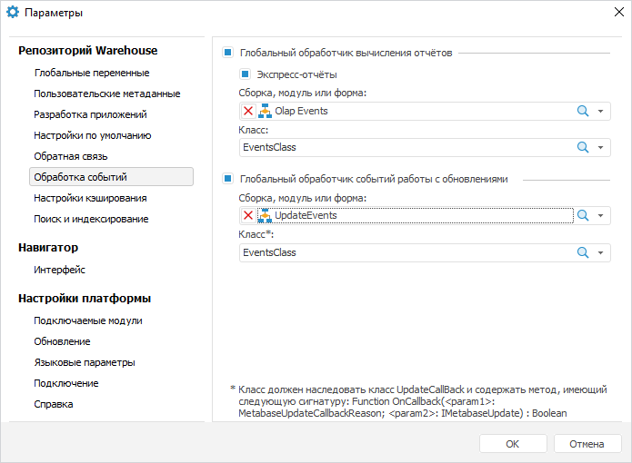

# Глобальные обработчики событий

Глобальные обработчики событий
-

# Глобальные обработчики событий

В параметрах репозитория задается:

	- глобальный обработчик вычисления отчётов;

	- глобальный обработчик событий работы
	 с обновлениями;

	- [глобальный
	 обработчик ошибок](Feedback.htm).

Примечание.
 В качестве обработчика событий используются только модули Fore, кроме
 модулей, расположенных во внутренней структуре [бизнес-приложений](constructor.chm::/Web/Create_Internal_Structure_Business_Application.htm),
 [компонентов](constructor.chm::/Component/Basic_properties_of_component.htm),
 [форм
 ввода](dataentryforms.chm::/DataEntryForms_Purpose.htm) и [контейнеров](UiNavObj.chm::/Container/Container.htm).

Для открытия вкладки «Обработка событий»
 диалога «Параметры»:

	- Перейдите в навигатор объектов.

	- Выполните команду главного меню «Сервис
	 > Параметры».

	- Перейдите на вкладку «Обработка
	 событий» после открытия диалога «Параметры».

Примечание.
 Включить обработку событий можно только в настольном приложении.

	 Обработчик вычисления отчётов Обработчик событий работы с обновлениями

		Обработчик событий передает параметры экспресс-отчёта, с которыми
		 производилось вычисление, и позволяет выполнять заданное с помощью
		 кода действие при каждом возникновении события.

		Для настройки обработки событий экспресс-отчёта:

			- Установите флажки «Глобальный
			 обработчик вычисления отчётов» и «Экспресс-отчёты».

			- Выберите сборку, модуль или форму, в которой описан
			 класс, реализующий события экспресс-отчёта.

			- Выберите класс, содержащий обработчики событий. В раскрывающемся
			 списке «Класс» будут
			 отображены все классы выбранной сборки, модуля или формы.

		Для экспресс-отчётов можно настроить обработку событий, наступающих
		 при работе с отчётом:

			- [OnBeforeExecuteAnalyzer](KeExpress.chm::/Interface/IEaxAnalyzerUserEvents/IEaxAnalyzerUserEvents.OnBeforeExecuteAnalyzer.htm)
			 - реализует событие, наступающее перед вычислением таблицы;

			- [OnAfterExecuteAnalyzer](KeExpress.chm::/Interface/IEaxAnalyzerUserEvents/IEaxAnalyzerUserEvents.OnAfterExecuteAnalyzer.htm)
			 - реализует событие, наступающее после вычисления таблицы;

			- [OnBeforeExportAnalyzer](KeExpress.chm::/Interface/IEaxAnalyzerUserEvents/IEaxAnalyzerUserEvents.OnBeforeExportAnalyzer.htm)
			 - реализует событие, наступающее перед экспортом отчёта;

			- [OnAfterExportAnalyzer](KeExpress.chm::/Interface/IEaxAnalyzerUserEvents/IEaxAnalyzerUserEvents.OnAfterExportAnalyzer.htm)
			 - реализует событие, наступающее после экспорта отчёта;

			- [OnBeforePrintAnalyzer](KeExpress.chm::/Interface/IEaxAnalyzerUserEvents/IEaxAnalyzerUserEvents.OnBeforePrintAnalyzer.htm)
			 - реализует событие, наступающее перед печатью отчёта;

			- [OnAfterPrintAnalyzer](KeExpress.chm::/Interface/IEaxAnalyzerUserEvents/IEaxAnalyzerUserEvents.OnAfterPrintAnalyzer.htm)
			 - реализует событие, наступающее после печати отчёта.

		Для выполнения примера создайте модуль и подключите его как
		 обработчик событий для экспресс-отчётов. В модуле подключите системные
		 сборки: Dimensions, Export, Express, Forms, Metabase. Добавьте
		 обработчики событий:

			Public Class EventsClass: ExpressEvents

			    param_comment: string;

			    Public Sub OnAfterExecuteAnalyzer(Args: IEaxAfterExecuteEventArgs);

			    Var DSSet: IDimSelectionSet;

			    Begin

			        DSSet := args.AnalyzerData.SheetData.Selection;

			        // Получение строки-списка отмеченных элементов в измерениях экспресс-отчёта

			        param_comment := GetEaxReportParams(DSSet);

			        // Добавление записи в протокол доступа с требуемым комментарием

			        args.AnalyzerData.Descriptor.CheckAndAudit(2, "Выполнение отчета." + param_comment);

			    End Sub OnAfterExecuteAnalyzer;

			    Public Sub OnAfterPrintAnalyzer(Args: IEaxAfterPrintEventArgs);

			    Var DSSet: IDimSelectionSet;

			    Begin

			        DSSet := args.AnalyzerData.SheetData.Selection;

			        param_comment := GetEaxReportParams(DSSet);

			        Debug.WriteLine(param_comment);

			    End Sub OnAfterPrintAnalyzer;

			    Public Sub OnAfterExportAnalyzer(Args: IEaxAfterExportEventArgs);

			    Var DSSet: IDimSelectionSet;

			    Begin

			        DSSet := args.AnalyzerData.SheetData.Selection;

			        param_comment := GetEaxReportParams(DSSet);

			        Debug.WriteLine(param_comment);

			    End Sub OnAfterExportAnalyzer;

			End Class EventsClass;

			// Получение строки-списка отмеченных элементов в измерениях экспресс-отчёта

			Public Function GetEaxReportParams(ExArDsset: IDimSelectionSet): string;

			Var ControlStr: string;

			    i, DimCnt: integer;

			    DimName: string;

			    selection: idimselection;

			Begin

			    dimCnt := ExArDsset.Count;

			    ControlStr := "Параметры отчета: ";

			    For i := 0 To dimCnt - 1 Do

			        DimName := ExArDsset.Item(i).Dimension.Name;

			        ControlStr := ControlStr + DimName + ": ";

			        selection := ExArDsset.Item(i);

			        If selection.SelectedCount = 0 Then

			            ControlStr := ControlStr + ": <не выбрано>. ";

			            Else

			            ControlStr := ControlStr + ": " + Selection.ToString;

			        End If;

			    End For;

			    Return ControlStr;

			End Function GetEaxReportParams;

		После выполнения примера, при наступлении
		 события обновления таблицы, в протокол доступа будет занесена
		 информация о выделенных измерениях. При печати и экспорте информация
		 будет выведена в консоль разработчика. Пример строки:

		Примечание: Выполнение отчета. Параметры
		 отчета: Факты: : ФактСтраны: : Албания,Бельгия,Босния и Герцеговина,Хорватия,Кипр,Чешская
		 Республика,Гренландия,Венгрия,Италия,Латвия Показатели: : Прирост
		 ВВП (% в год)Календарь: : 2005,2006,2007,2008,2009,2010

		Обработчик событий для работы с обновлениями формирует информацию
		 о процессе установки обновлений:

			- дата и время;

			- имя пользователя;

			- имя рабочей станции;

			- имя обновления;

			- перечень объектов и их версии
			 (прежняя и новая);

			- сообщения об обновлении каждого
			 объекта;

			- статус обновления.

		Для настройки обработки событий работы с обновлениями:

			- Установите флажок «Глобальный
			 обработчик событий работы с обновлениями».

			- Выберите сборку, модуль или форму, в которой описан
			 класс, реализующий события обновления.

			- Выберите класс, содержащий обработчики событий. В раскрывающемся
			 списке «Класс» будут
			 отображены все классы выбранной сборки, модуля или формы.

		Примечание.
		 Класс должен наследовать класс UpdateCallBack и содержать метод,
		 имеющий следующую сигнатуру:

		Function OnCallBack(<param1>: MetabaseUpdateCallbackReason;
		 <param1>: [IMetabaseUpdate](KeSom.chm::/Interface/IMetabaseUpdate/IMetabaseUpdate.htm))
		 : Boolean.

		Пример обработчика событий работы с обновлениями. В модуле подключите
		 системную сборку Metabase. Добавьте обработчик событий:

			Public Class UpdateHandlerClass: UpdateCallBack

			    Function OnCallback(Reason: MetabaseUpdateCallbackReason; Update: IMetabaseUpdate): Boolean;

			    Begin

			        //
			 Проверка режимов применения обновления

			        Select Case Reason

			            Case MetabaseUpdateCallbackReason.ApplyCoreEnd: // действия при окончании применения обновления из ядра

			            Case MetabaseUpdateCallbackReason.ApplyCoreStart: // действия при вызове применения обновления из ядра

			            Case MetabaseUpdateCallbackReason.ApplyUI: // действия при вызове применения обновления из интерфейса

			            Case MetabaseUpdateCallbackReason.SaveUI: // действия при вызове сохранения обновления из интерфейса

			            Case MetabaseUpdateCallbackReason.SaveCore: // действия при вызове сохранения обновления из ядра

			            Case MetabaseUpdateCallbackReason.LoadCoreEnd: // действия при окончании чтения обновления из ядра

			        End Select;

			        return False; //
			 без прерывания системного действия

			    End Function OnCallback;

			End Class UpdateHandlerClass;

		Результат выполнения примера будет зависеть от заданных действий
		 перечисления MetabaseUpdateCallbackReason.

См. также:

[Расширение
 функциональности приложения](../01_Development_Environment/extention_functionality.htm)

		Справочная
		 система на версию 10.9
		 от 18/08/2025,
		 © ООО «ФОРСАЙТ»,
