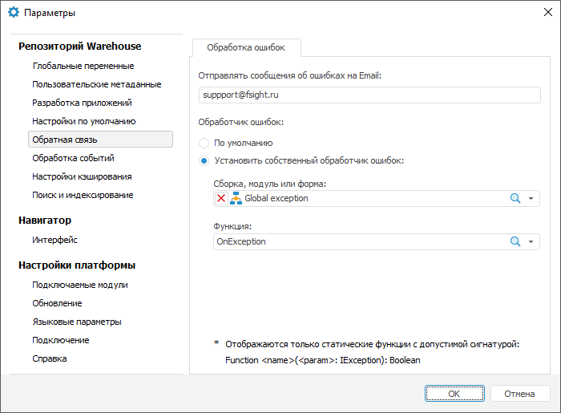

# Обработка ошибок

Обработка ошибок
-

# Обработка ошибок

Для установки параметров обработки ошибок, возникающих в системах, которые
 разработаны с помощью «Форсайт. Аналитическая платформа»,
 используйте вкладку «Обработка ошибок»
 в разделе «Обратная связь» диалога
 «Параметры».

[Для открытия
 диалога](javascript:TextPopup(this))

		- Перейдите в навигатор объектов.

		- Выполните команду главного меню «Сервис
		 > Параметры».

Укажите следующие параметры:

	- Отправлять сообщения об ошибках
	 на Email. Укажите адрес электронной почты, на который будут
	 отправляться сообщения о возникших ошибках. Для отправки сообщений
	 электронной почты будет использоваться программа, установленная в
	 операционной системе в качестве почтового клиента по умолчанию;

	- Обработчик ошибок. Установите
	 один из доступных переключателей:

		- По умолчанию. При
		 работе в «Форсайт. Аналитическая платформа»
		 будет использоваться встроенный механизм обработки ошибок: при
		 возникновении ошибки будет отображено соответствующее окно с информацией
		 об ошибке и возможностью отправить её по указанному в настройках
		 адресу;

		- Установить собственный
		 обработчик ошибок. Возникающие ошибки «Форсайт. Аналитическая платформа»
		 можно обработать в функции со следующей сигнатурой:

		Function <наименование
		 функции>(<наименование параметра>: IException): Boolean;

Выберите сборку, модуль или форму, в которой
 содержатся функции с подходящей сигнатурой, из соответствующего раскрывающегося
 списка. Перечень удовлетворяющих функций будет отображён в раскрывающемся
 списке «Функции». Если функция
 возвращает значение True, то ошибка
 считается обработанной и приложение продолжает работу в обычном режиме.
 При значении False ошибка пробрасывается
 дальше и должна быть обработана в прикладном коде, либо будет отображена
 в соответствующем окне с информацией об ошибке.

Примечание.
 Собственный обработчик ошибок позволяет обработать только те ошибки, которые
 возникли в прикладном коде. Ошибки, которые могут возникнуть в ядре «Форсайт. Аналитическая платформа»,
 будут выводиться в соответствующем окне.

См. также:

[Глобальные
 обработчики событий](EventHandler.htm)

		Справочная
		 система на версию 10.9
		 от 18/08/2025,
		 © ООО «ФОРСАЙТ»,
