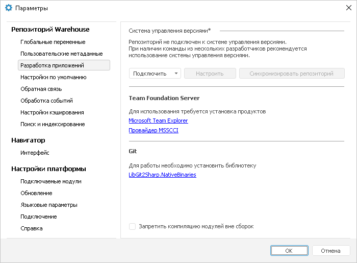
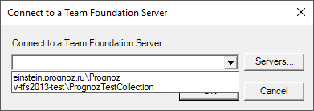
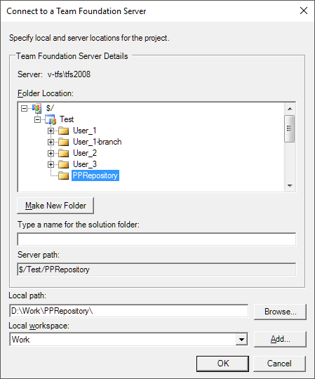
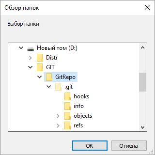
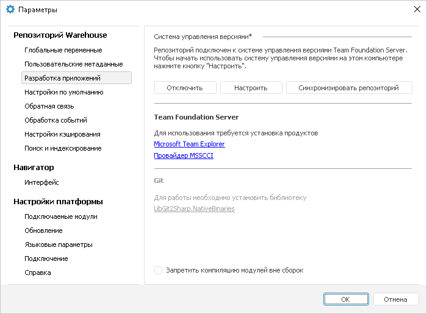

# Подключение к системе управления версиями в ОС Windows

Подключение к системе управления версиями в ОС Windows
-

# Подключение к системе управления
 версиями в ОС Windows

Для подключения репозитория к [системе
 управления версиями](../../01_Development_Environment/06_Version_Control_System/VSC_Introduction.htm):

	- Откройте окно «Параметры»
	 с помощью команды главного меню «Сервис
	 > Параметры» в [навигаторе
	 объектов](GetStarted.chm::/Interface/Interface_Navigator.htm).

	- Перейдите на вкладку «Разработка
	 приложений»:

	- Установите дополнительное программное обеспечение:

		- Team Foundation
		 Server:

			- [Microsoft Team Explorer](https://www.microsoft.com/en-us/download/details.aspx?id=4240);

			- [Провайдер MSSCCI](https://marketplace.visualstudio.com/items?itemName=TFSPowerToolsTeam.MicrosoftVisualStudioTeamFoundationServer20132015M-11387);

Примечание.
 Использование MSSCCI-совместимого ПО в среде разработки продукта «Форсайт. Аналитическая платформа»
 не поддерживается.

		- Git:

			- [libgit2](https://libgit2.org/).
			 Для библиотеки libgit2 дополнительно скачайте [LibGit2Sharp.NativeBinaries](https://www.nuget.org/packages/LibGit2Sharp.NativeBinaries/) и откройте
			 загруженный файл как архив с помощью утилиты jar или unzip.
			 Извлеките библиотеку git2-6777db8.dll (наименование файла
			 после «git2» может быть другим) из папки «native» в папку
			 установки «Форсайт. Аналитическая платформа»
			 и сократите наименование файла до git2.dll. Версия библиотеки
			 git2.dll должна быть 1.7.1. Для просмотра версии библиотеки
			 git2.dll откройте свойства данного файла.

			Папка «native» расположена в папке разрядности по пути «S\runtimes\win-x64\»,
			 где S - путь до места загруженного файла libgit2sharp.nativebinaries.nupkg.

			Не поддерживается авторизация в репозиториях посредством SSH.
			 SSH требует для работы дополнительные библиотеки, которые
			 не входят в состав «Форсайт. Аналитическая платформа».
			 Для решения проблем, связанных с использованием SSH, обращайтесь
			 в техническую поддержку по адресу [support@fsight.ru](mailto:support@fsight.ru)
			 или через [сервисы
			 технической поддержки](https://www.fsight.ru/support/), которые доступны после регистрации
			 на сайте.

Примечание.
 Библиотека libgit2 не поддерживает работу с репозиториями, которые содержат
 неполную историю. Например, репозиторий с неполной историей может получиться
 в результате клонирования с использованием параметра depth.

	- В раскрывающемся меню кнопки «Подключить»
	 выберите тип провайдера, который будет использоваться для подключения
	 к системе управления версиями:

		- Git;

		- Team
		 Foundation Server.

	- После выполнения действия будет
	 открыт диалог для настройки выбранного типа провайдера.

	 Team Foundation Server
	  Git

		При выборе провайдера Team Foundation Server будет выдан диалог
		 для выбора сервера:

		

		Для создания списка серверов используйте кнопку «Servers».
		 После выбора сервера появится окно для установления соответствия
		 папок на сервере TFS и на локальном диске:

		

		В дереве «Folder Location»
		 выберите проект, в рамках которого осуществляется контроль версий,
		 и наименование папки на сервере, в которой будут храниться файлы.
		 Также можно создать необходимую иерархию папок для хранения различных
		 версий проекта. Для создания новой папки в иерархии нажмите кнопку
		 «Make New Folder».

		В поле «Local path»
		 укажите папку на локальном диске, в которой будут храниться локальные
		 версии файлов. Из раскрывающегося списка «Local
		 workspace» выберите рабочую область, к которой будут применены
		 настройки. Для создания новой рабочей области нажмите кнопку «Add».

		Важно.
		 Team Foundation Server накладывает ограничение на длину пути серверной
		 системы управления версиями. Путь серверной системы управления
		 версиями - это полный путь к файлу, который хранится в системе.
		 Для данного пути имеются следующие ограничения:

		    • не более 248 символов юникод для имени
		 каталога;

		    • не более 260 символов юникод для имени
		 каталога с именем файла.

### Возможные проблемы

		В январе 2022 года разработчиками Azure DevOps была отключена
		 поддержка устаревших криптографических протоколов TLS 1.0 и 1.1.
		 Более подробно по этому поводу читайте в [статье
		 разработчика](https://devblogs.microsoft.com/devops/deprecating-weak-cryptographic-standards-tls-1-0-and-1-1-in-azure-devops-services/). При возникновении проблем с подключением к TFS
		 необходимо включить использование протокола TLS 1.2. Различные
		 варианты включения протокола TLS 1.2 также представлены в [статье](https://docs.microsoft.com/en-us/azure/active-directory/hybrid/reference-connect-tls-enforcement#enable-tls-12) на сайте разработчика.

		Для работы с системой управления версиями Git предполагается,
		 что уже создан репозиторий и создан его локальный клон. При выборе
		 провайдера Git будет выдан диалог для выбора локальной папки,
		 в которой расположен клон репозитория:

		

		Выберите папку, в которой будут храниться [файлы](../../01_Development_Environment/06_Version_Control_System/VSC_Add_Object.htm)
		 объектов репозитория, и нажмите кнопку «ОК».

	- Переподключитесь к репозиторию для применения настроек.

После выполнения действий репозиторий будет подключен к системе управления
 версиями. Управление версиями объектов осуществляется в [навигаторе
 объектов](GetStarted.chm::/Interface/Interface_Navigator.htm) и [среде разработки](developer.chm::/Desktop_Title.htm).
 При подключении репозитория к системе управления версиями в навигаторе
 объектов и среде разработке добавляются соответствующие разделы для [управления
 версиями объектов](../../01_Development_Environment/06_Version_Control_System/VSC_Introduction.htm#control).

При возникновении каких-либо ошибок обратитесь к подразделу «[Проблемы при работе с системой
 управления версиями (VCS)](FAQ.chm::/Errors/VcsError.htm)».

## Настройка репозитория при подключении к системе управления версиями

При настройке репозитория, который ранее уже был подключен к системе
 управления версиями на другом компьютере, вкладка «Разработка
 приложений» принимает вид:

Информация о подключении репозитория к системе управления версиями хранится
 непосредственно в репозитории. Подключиться можно только к той системе,
 на которую уже был настроен репозиторий. При необходимости настройки должны
 быть проведены на компьютерах каждого члена команды разработки. После
 подключения репозитория к системе управления версиями на конкретном компьютере
 редактирование объектов будет осуществляться локально. Для предоставления
 доступа к внесённым изменениям другим участникам разработки, [опубликуйте](../../01_Development_Environment/06_Version_Control_System/VSC_CheckIn_Object.htm)
 их на сервер Team Foundation Server или Git. Параллельно с публикацией
 изменения попадут и в репозиторий.

Примечание.
 Пользователи, компьютеры которых не были настроены на работу с системой
 управления версиями, будут использовать версии объектов, хранящихся в
 репозитории. При этом вкладка «Разработка
 приложений» в окне «Параметры»
 будет принимать вид аналогично виду вкладки после подключения репозитория
 к системе управления версиями.

Для изменения настроек подключения нажмите кнопку «Настроить».
 После выполнения действия повторите шаг 5, описанный выше.

Для получения и сохранения в репозитории последней версии объектов с
 сервера нажмите кнопку «Синхронизировать
 репозиторий». Синхронизация репозитория актуальна перед полным
 [отключением](Delete_From_VCS.htm) репозитория от системы управления
 версиями.

Примечание.
 При синхронизации обновляются все неактуальные объекты репозитория. При
 этом для объекта в базе данных будет актуализирована дата изменения -
 в качестве даты изменения будет установлено текущее время сервера СУБД.
 Также данная информация будет обновлена в соответствующих файлах на диске.

Для запрета компиляции модулей и форм, созданных отдельно от [сборок](../../01_Development_Environment/02_Work_in_Development_Environment/DevEnv_Object/DevEnv_Assembly.htm),
 установите флажок «Запретить компиляцию
 модулей вне сборок».

Для отключения репозитория от системы управления версиями обратитесь
 к разделу «[Отключение репозитория от системы
 управления версиями](Delete_From_VCS.htm)».

См. также:

[Разработка
 приложений в команде](../../01_Development_Environment/06_Version_Control_System/VSC_Introduction.htm) | [Отключение репозитория
 от системы управления версиями](Delete_From_VCS.htm)

		Справочная
		 система на версию 10.9
		 от 18/08/2025,
		 © ООО «ФОРСАЙТ»,
