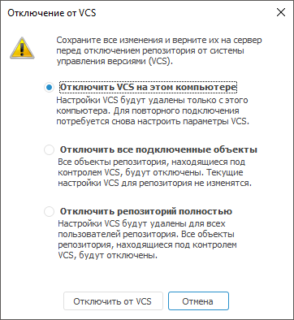

# Отключение репозитория от системы управления версиями

Отключение репозитория от системы управления версиями
-

# Отключение репозитория от системы управления версиями

Для отключения репозитория от [системы
 управления версиями](../../01_Development_Environment/06_Version_Control_System/VSC_Introduction.htm):

	- Откройте окно «Параметры»
	 с помощью команды главного меню «Сервис
	 > Параметры» в [навигаторе
	 объектов](GetStarted.chm::/Interface/Interface_Navigator.htm).

	- Перейдите на вкладку «Разработка
	 приложений»:

	- Нажмите кнопку «Синхронизировать
	 репозиторий» для получения и сохранения в репозитории последней
	 версии объектов с сервера.

	- Нажмите кнопку «Отключить».
	 После выполнения действия будет открыто окно «Отключение
	 от VCS»:

	- Выберите вариант отключения репозитория от VCS:

		- Отключить VCS
		 на этом компьютере. На компьютере будут удалены локальные
		 настройки по подключению текущего репозитория к системе управления
		 версиями. Объекты репозитория, которые были добавлены в систему
		 управления версиями, будут доступны только для просмотра с возможностью
		 сохранить все изменения в новый объект;

		- Отключить все
		 подключенные объекты. Для всех объектов, добавленных в
		 систему управления версиями, будет удален данный признак. Настройки
		 системы управления версиями для репозитория не изменятся. Дальнейшая
		 работа будет осуществляться с теми версиями объектов, которые
		 хранятся в базе репозитория.

Примечание.
 Team Foundation Server ведет полную историю изменения добавляемых в него
 файлов. При отключении объектов в репозитории информация о соответствующих
 им файлах на сервере VCS удалена не будет. Повторно подключить в систему
 управления версиями отключенные объекты будет невозможно, так как на сервере
 уже будет существовать информация о соответствующих файлах. Объект можно
 будет добавить в систему управления версиями после [изменения
 настроек подключения](Add_In_VCS.htm) репозитория к серверу VCS. Не рекомендуется отключать
 объекты в рабочей версии репозитория. Отключение объектов может потребоваться
 при изменении настроек клонированной версии репозитория перед изменением
 настроек подключения к системе управления версиями.

		- Отключить репозиторий
		 полностью. Для репозитория будут удалены все настройки
		 по подключению к системе управления версиями. После отключения
		 работа будет осуществляться с теми версиями объектов, которые
		 хранятся в репозитории.

Важно.
 Полное отключение репозитория от системы управления версиями приведет
 к удалению настроек для всех пользователей, осуществляющих работу в данном
 репозитории.

	- Нажмите кнопку «Отключить от
	 VCS».

После выполнения действий репозиторий будет отключен от системы управления
 версиями.

См. также:

[Разработка
 приложений в команде](../../01_Development_Environment/06_Version_Control_System/VSC_Introduction.htm) | [Подключение репозитория
 к системе управления версиями](Add_In_VCS.htm)

		Справочная
		 система на версию 10.9
		 от 18/08/2025,
		 © ООО «ФОРСАЙТ»,
