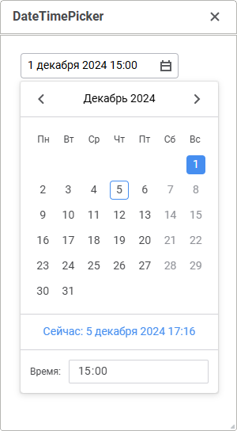

# DateTimePicker: Компонент веб-форм

DateTimePicker: Компонент веб-форм
-

# DateTimePicker

## Иерархия наследования

           [IWebComponent](WebForms.chm::/Interface/IWebComponent/IWebComponent.htm)

           [IWebControl](WebForms.chm::/Interface/IWebControl/IWebControl.htm)

           [IWebDateTimePicker](WebForms.chm::/Interface/IWebDateTimePicker/IWebDateTimePicker.htm)

           [WebDateTimePicker](WebForms.chm::/Class/WebDateTimePicker/WebDateTimePicker.htm)

## Описание

Компонент DateTimePicker предназначен
 для ввода и отображения даты и времени в комбинированном календаре.

## Комментарии

Дата и время могут быть введены в редакторе компонента или выбраны в
 раскрывающемся календаре. Для вызова календаря нажмите кнопку  в области компонента. Наличием
 раскрывающегося календаря управляет свойство dropCalendar.

Календарь поддерживает ввод дат и времени в диапазоне [14.09.1752 00:00:00,
 18.12.3001 23:59:59]. Для ограничения вводимых значений используйте свойства
 minValue и
 maxValue. Текущее значение, которое будет отображаться при запуске
 веб-формы, указывается в свойстве value.
 Для сброса минимального, максимального и текущего значений, установленных
 в компоненте в режиме дизайнера, установите курсор в области указанных
 свойств и нажмите клавишу DEL.

Во время выполнения веб-формы значение в календаре можно определить
 с помощью свойства [Value](WebForms.chm::/Interface/IWebDateTimePicker/IWebDateTimePicker.Value.htm).
 Текст, отображаемый в компоненте и возвращаемый свойством [Text](WebForms.chm::/Interface/IWebControl/IWebControl.Text.htm),
 зависит от формата установленного в свойстве format.
 Формат задаётся в режиме дизайнера, может содержать какой-либо текст и
 специальные коды, вместо которых будут подставляться значения отдельных
 компонент даты и времени.

[Коды
 формата](javascript:TextPopup(this))

	Указанные ниже коды определяют формат формируемого в компоненте значения.
	 Само значение формируется с учётом языка и региональных настроек,
	 которые заданы в операционной системе.

			 Код
			 Описание

			 M
			 Числовое обозначение месяца: 1, 2 - 11, 12.

			 MM
			 Двузначное числовое обозначение месяца: 01, 02 - 11, 12.

			 MMM
			 Сокращённое название месяца: «янв-дек».

			 MMMM
			 Полное название месяца: «январь-декабрь».

			 Q
			 Числовое обозначение квартала: 1, 2, 3, 4.

			 D
			 Числовое обозначение дня в месяце: 1, 2 - 30, 31.

			 Do
			 Числовое обозначение дня в месяце с постфиксом: 1-го, 2-го
			 - 30-го, 31-го.

			 DD
			 Двузначное числовое обозначение дня в месяце: 01, 02 -
			 30, 31.

			 DDD
			 Числовое обозначение дня в году: 1, 2 - 364, 365.

			 DDDD
			 Трёхзначное числовое обозначение дня в году: 001, 002 -
			 364, 365.

			 d
			 Числовое обозначение дня недели: 0, 1 - 5, 6.

			 dd
			 Сокращённое название дня недели: «пн - вс».

			 dddd
			 Полное название дня недели: «понедельник - воскресенье».

			 e
			 Числовое обозначение дня недели с учётом того дня, который
			 выбран в качестве начала недели: по умолчанию 0, 1 - 5, 6,
			 при смене первого дня на среду, 2, 3 - 0, 1.

			 E
			 Числовое обозначение дня недели в соответствии с ISO: 1,
			 2 - 6, 7.

			 w
			 Числовое обозначение недели в году: 1, 2 - 52, 53.

			 ww
			 Двузначное числовое обозначение недели в году: 01, 02 -
			 52, 53.

			 W
			 Числовое обозначение недели в году в соответствии с ISO:
			 1, 2 - 52, 53.

			 WW
			 Двузначное числовое обозначение недели в году в соответствии
			 с ISO: 01, 02 - 52, 53.

			 YY
			 Двузначный номер года без века: 70, 71 - 20, 21.

			 YYYY
			 Четырёхзначный номер года с веком: 1970, 1971 - 2020, 2021.

			 N, NN, NNN
			 Аббревиатура обозначения эры: BC, AD.

			 NNNN
			 Полное обозначение эры: Before Christ, Anno Domini.

			 NNNNN
			 Сокращённое обозначения эры: BC, AD.

			 gg
			 Год без века: 80, 81 - 25, 26.

			 gggg
			 Год с веком: 1980, 1981 - 2025, 2026.

			 GG
			 Год без века в соответствии с ISO: 80, 81 - 25, 26.

			 GGGG
			 Год с веком в соответствии с ISO: 1980, 1981 - 2025, 2026.

			 H
			 Час в 24-часовом формате, ноль не предшествует однозначным
			 числам: 0, 1 - 23, 24.

			 HH
			 Час в 24-часовом формате, однозначным числам предшествует
			 нуль: 00, 01 - 23, 24.

			 h
			 Час в 12-часовом формате, ноль не предшествует однозначным
			 числам: 0, 1 - 11, 12.

			 hh
			 Час в 12-часовом формате, однозначным числам предшествует
			 нуль: 00, 01 - 11, 12.

			 k
			 Час в 24-часовом формате и нумерацией с единицы, ноль не
			 предшествует однозначным числам: 1, 2 - 22, 23.

			 kk
			 Час в 24-часовом формате и нумерацией с единицы, однозначным
			 числам предшествует нуль: 01, 02 - 22, 23.

			 m
			 Минута в часе, ноль не предшествует однозначным числам:
			 0, 1 - 58, 59.

			 mm
			 Минута в часе, ноль предшествует однозначным числам: 00,
			 01 - 58, 59.

			 s
			 Секунда в минуте, ноль не предшествует однозначным числам:
			 0, 1 - 58, 59.

			 ss
			 Секунда в минуте, ноль предшествует однозначным числам:
			 00, 01 - 58, 59.

			 Z
			 Часовой пояс с разделителем: -03:00, -02:00 - +02:00, +03:00.

			 ZZ
			 Часовой пояс без разделителя: -0300, -0200 - +0200, +0300.

			 X
			 Дата и время, представленные в секундах в формате Unix-времени.

			 x
			 Дата и время, представленные в миллисекундах в формате
			 Unix-времени.

Компонент имеет различный набор свойств, доступных в режиме дизайнера
 и режиме выполнения веб-формы.

	 Режим
	 дизайнера

	 Режим
	 выполнения

	 События

			- name. Наименование
			 компонента;

			- borderColor.
			 Цвет границы компонента;

			- color. Цвет
			 фона компонента;

			- coordinate.
			 Координата верхнего левого угла компонента. Координаты могут
			 быть указаны в пикселях или в процентах относительно размеров
			 родительского компонента. Свойство доступно, если свойству
			 position установлено
			 значение absolute;

			- dropCalendar.
			 Признак наличия у компонента раскрывающегося календаря;

			- enabled. Признак
			 доступности компонента пользователю;

			- flexGrow. Свойство
			 определяет, какую пропорцию свободного пространства в контейнере
			 необходимо выделить компоненту. Если для всех компонентов
			 установлено значение 1, то свободное пространство в контейнере
			 равномерно распределяется между компонентами. Если один из
			 компонентов имеет значение 2, то ему выделяется в два раза
			 больше свободного пространства и так далее. Свойство доступно,
			 если свойству position
			 установлено значение relative;

			- firstDayOfWeek.
			 День, являющийся первым днём недели;

			- font. Настройки
			 шрифта, используемого для отображения текста в компоненте.
			 При необходимости можно загрузить [пользовательские
			 шрифты](Setup.chm::/UiWebSetup/03_Setup_Web/General_for_linux/Loading_Custom_Fonts.htm);

			- format. Формат
			 представления значения в компоненте. Описание кодов формата
			 представлено [выше](#codeformat);

			- hint. Текст
			 всплывающей подсказки;

			- maxValue. Максимальное
			 значение даты, которое можно будет указать в компоненте;

			- minValue. Минимальное
			 значение даты, которое можно будет указать в компоненте;

			- padding. Отступ
			 от границ компонента до его содержимого. Отступы могут быть
			 указаны в пикселях или в процентах относительно размеров компонента;

			- popupMenu. Контекстное
			 меню, отображаемое для компонента. В качестве значения укажите
			 один из компонентов [PopupMenu](PopupMenu.htm),
			 размещённых на форме;

			- position. Способ
			 позиционирования компонента на веб-форме или внутри компонента-контейнера.
			 По умолчанию свойство имеет значение absolute,
			 при этом компонент имеет фиксированное расположение и размер,
			 определяемые свойствами coordinate
			 и size. При значении
			 relative положение
			 и размеры компонента будут изменяться вместе с размерами компонента-контейнера.
			 При этом свойство coordinate
			 будет недоступно. Место расположения компонента будет определяться
			 свойствами flexDirection,
			 aligments, justifyContent
			 родительского компонента, а размеры компонента будут изменяться,
			 если свойство size
			 задано в процентах;

			- readOnly. Признак
			 доступности компонента только для чтения.

			- showHint. Признак
			 отображения всплывающей подсказки при наведении курсора мыши
			 на компонент;

			- size. Размеры
			 компонента. Размеры могут быть указаны в пикселях или в процентах
			 относительно размеров родительского компонента;

			- value. Значение,
			 отображаемое в компоненте при запуске веб-формы;

			- visible. Признак
			 видимости компонента на запущенной веб-форме.

			- weekNumbers.
			 Признак отображения номера недели в раскрывающемся календаре.

			- [BorderColor](WebForms.chm::/Interface/IWebControl/IWebControl.BorderColor.htm).
			 Цвет границы компонента;

			- [Color](WebForms.chm::/Interface/IWebControl/IWebControl.Color.htm).
			 Цвет фона компонента;

			- [Enabled](WebForms.chm::/Interface/IWebControl/IWebControl.Enabled.htm).
			 Признак доступности компонента для пользователя;

			- [MaxValue](WebForms.chm::/Interface/IWebDateTimePicker/IWebDateTimePicker.MaxValue.htm).
			 Максимальное значение, которое будет доступно для ввода в
			 компоненте;

			- [MinValue](WebForms.chm::/Interface/IWebDateTimePicker/IWebDateTimePicker.MinValue.htm).
			 Минимальное значение, которое будет доступно для ввода в компоненте;

			- [PopupMenu](WebForms.chm::/Interface/IWebControl/IWebControl.PopupMenu.htm).
			 Контекстное меню, отображаемое для компонента. В качестве
			 значения укажите один из компонентов [PopupMenu](PopupMenu.htm),
			 размещённых на форме;

			- [Text](WebForms.chm::/Interface/IWebControl/IWebControl.Text.htm).
			 Текст, отображаемый в компоненте;

			- [Valid](WebForms.chm::/Interface/IWebDateTimePicker/IWebDateTimePicker.Valid.htm).
			 Признак корректности даты, указанной в компоненте;

			- [Value](WebForms.chm::/Interface/IWebDateTimePicker/IWebDateTimePicker.Value.htm).
			 Значение, отображаемое в компоненте;

			- [Visible](WebForms.chm::/Interface/IWebControl/IWebControl.Visible.htm).
			 Признак видимости компонента для пользователя.

		Компонент имеет событие OnValueChanged,
		 которое наступает при изменении значения в компоненте.

## Пример

См. также:

[Компоненты
 веб-форм](web_components.htm)

		Справочная
		 система на версию 10.9
		 от 18/08/2025,
		 © ООО «ФОРСАЙТ»,
