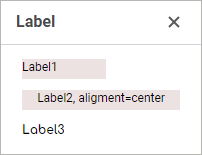

# Label: Компонент веб-форм

Label: Компонент веб-форм
-

# Label

## Иерархия наследования

           [IWebComponent](WebForms.chm::/Interface/IWebComponent/IWebComponent.htm)

           [IWebControl](WebForms.chm::/Interface/IWebControl/IWebControl.htm)

           [IWebLabel](WebForms.chm::/Interface/IWebLabel/IWebLabel.htm)

           [WebLabel](WebForms.chm::/Class/WebLabel/WebLabel.htm)

## Описание

Компонент Label предназначен
 для формирования текстовых меток на веб-форме.

## Комментарии

Компонент имеет различный набор свойств, доступных в режиме дизайнера
 и режиме выполнения веб-формы.

	 Режим
	 дизайнера

	 Режим
	 выполнения

	 События

			- text. Текст,
			 отображаемый в компоненте;

			- name. Наименование
			 компонента;

			- alignment. Выравнивание
			 текста внутри компонента;

			- borderColor.
			 Цвет границы компонента;

			- color. Цвет
			 фона компонента;

			- coordinate.
			 Координата верхнего левого угла компонента. Координаты могут
			 быть указаны в пикселях или в процентах относительно размеров
			 родительского компонента. Свойство доступно, если свойству
			 position установлено
			 значение absolute;

			- enabled. Признак
			 доступности компонента пользователю;

			- flexGrow. Свойство
			 определяет, какую пропорцию свободного пространства в контейнере
			 необходимо выделить компоненту. Если для всех компонентов
			 установлено значение 1, то свободное пространство в контейнере
			 равномерно распределяется между компонентами. Если один из
			 компонентов имеет значение 2, то ему выделяется в два раза
			 больше свободного пространства и так далее. Свойство доступно,
			 если свойству position
			 установлено значение relative;

			- font. Настройки
			 шрифта, используемого для отображения текста в компоненте.
			 При необходимости можно загрузить [пользовательские
			 шрифты](Setup.chm::/UiWebSetup/03_Setup_Web/General_for_linux/Loading_Custom_Fonts.htm);

			- hint. Текст
			 всплывающей подсказки;

			- padding. Отступ
			 от границ компонента до его содержимого. Отступы могут быть
			 указаны в пикселях или в процентах относительно размеров компонента;

			- popupMenu. Контекстное
			 меню, отображаемое для компонента. В качестве значения укажите
			 один из компонентов [PopupMenu](PopupMenu.htm),
			 размещённых на форме;

			- position. Способ
			 позиционирования компонента на веб-форме или внутри компонента-контейнера.
			 По умолчанию свойство имеет значение absolute,
			 при этом компонент имеет фиксированное расположение и размер,
			 определяемые свойствами coordinate
			 и size. При значении
			 relative положение
			 и размеры компонента будут изменяться вместе с размерами компонента-контейнера.
			 При этом свойство coordinate
			 будет недоступно. Место расположения компонента будет определяться
			 свойствами flexDirection,
			 aligments, justifyContent
			 родительского компонента, а размеры компонента будут изменяться,
			 если свойство size
			 задано в процентах;

			- showHint. Признак
			 отображения всплывающей подсказки при наведении курсора мыши
			 на компонент;

			- size. Размеры
			 компонента. Размеры могут быть указаны в пикселях или в процентах
			 относительно размеров родительского компонента;

			- visible. Признак
			 видимости компонента на запущенной веб-форме.

			- [BorderColor](WebForms.chm::/Interface/IWebControl/IWebControl.BorderColor.htm).
			 Цвет границы компонента;

			- [Color](WebForms.chm::/Interface/IWebControl/IWebControl.Color.htm).
			 Цвет фона компонента;

			- [Enabled](WebForms.chm::/Interface/IWebControl/IWebControl.Enabled.htm).
			 Признак доступности компонента для пользователя;

			- [PopupMenu](WebForms.chm::/Interface/IWebControl/IWebControl.PopupMenu.htm).
			 Контекстное меню, отображаемое для компонента. В качестве
			 значения укажите один из компонентов [PopupMenu](PopupMenu.htm),
			 размещённых на форме;

			- [Text](WebForms.chm::/Interface/IWebControl/IWebControl.Text.htm).
			 Текст, отображаемый в компоненте;

			- [Visible](WebForms.chm::/Interface/IWebControl/IWebControl.Visible.htm).
			 Признак видимости компонента для пользователя.

		Компонент не имеет событий.

## Пример

См. также:

[Создание
 веб-формы и размещение компонентов](../01_Development_Environment/02_Work_in_Development_Environment/DevEnv_Object/Web_Form.htm)

		Справочная
		 система на версию 10.9
		 от 18/08/2025,
		 © ООО «ФОРСАЙТ»,
