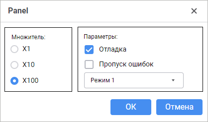

# Panel: Компонент веб-форм

Panel: Компонент веб-форм
-

# Panel

## Иерархия наследования

           [IWebComponent](WebForms.chm::/Interface/IWebComponent/IWebComponent.htm)

           [IWebControl](WebForms.chm::/Interface/IWebControl/IWebControl.htm)

           [IWebPanel](WebForms.chm::/Interface/IWebPanel/IWebPanel.htm)

           [WebPanel](WebForms.chm::/Class/WebPanel/WebPanel.htm)

## Описание

Компонент Panel предоставляет
 панель, которая предназначена для объединения других компонентов в группы.

## Комментарии

Компонент является контейнером для других визуальных компонентов. Все
 компоненты, расположенные на панели, наследуют от неё значения свойств
 enabled и visible.
 Если на панели располагаются компоненты [RadioButton](RadioButton.htm),
 то их выбор не будет зависеть от выбора переключателей, расположенных
 на форме или других панелях.

Компонент имеет различный набор свойств, доступных в режиме дизайнера
 и режиме выполнения веб-формы.

	 Режим
	 дизайнера

	 Режим
	 выполнения

	 События

			- text. Текст,
			 отображаемый в области панели в режиме дизайнера. Не отображается
			 при запуске формы, предназначен для идентификации компонентов
			 во время проектирования веб-формы;

			- name. Наименование
			 компонента;

			- alignItems.
			 Выравнивание flex-компонентов относительно поперечной оси.
			 Доступные значения:

				- flex-start.
				 Компоненты выравниваются в начале поперечной оси;

				- center.
				 Компоненты центрированы по поперечной оси;

				- flex-end.
				 Компоненты выравниваются в конце поперечной оси.

			- borderColor.
			 Цвет границы компонента;

			- borderStyle.
			 Стиль границы компонента;

			- color. Цвет
			 фона компонента;

			- coordinate.
			 Координата верхнего левого угла компонента. Координаты могут
			 быть указаны в пикселях или в процентах относительно размеров
			 родительского компонента. Свойство доступно, если свойству
			 position установлено
			 значение absolute.

			- enabled. Признак
			 доступности компонента пользователю;

			- flexDirection.
			 Главная ось, вдоль которой будут располагаться flex-компоненты.
			 Значение задаётся относительно родительского компонента, в
			 котором располагаются flex-компоненты. Доступные значения:

				- column.
				 Значение по умолчанию. Компоненты располагаются по вертикали;

				- row. Компоненты
				 располагаются по горизонтали.

			- flexGrow. Свойство
			 определяет, какую пропорцию свободного пространства в контейнере
			 необходимо выделить компоненту. Если для всех компонентов
			 установлено значение 1, то свободное пространство в контейнере
			 равномерно распределяется между компонентами. Если один из
			 компонентов имеет значение 2, то ему выделяется в два раза
			 больше свободного пространства и так далее. Свойство доступно,
			 если свойству position
			 установлено значение relative;

			- hint. Текст
			 всплывающей подсказки;

			- justifyContent.
			 Выравнивание flex-компонентов относительно главной оси. Доступные
			 значения:

				- flex-start.
				 Значение по умолчанию. Компоненты сдвинуты в начало главной
				 оси;

				- center.
				 Компоненты центрированы вдоль главной оси;

				- flex-end.
				 Компоненты сдвинуты в конец главной оси;

				- space-around.
				 Компоненты равномерно распределены вдоль главной оси с
				 одинаковым свободным пространством вокруг них. Визуально
				 свободное пространство между крайними компонентами и границами
				 оси будет меньше т.к. свободное пространство между компонентами
				 состоит из двух свободных пространств, принадлежащих каждому
				 из компонентов;

			- padding. Отступы
			 от края панели до её компонентов. Значения свойства влияют
			 на расположение компонентов с позиционированием относительно
			 родительского компонента: position
			 = relative;

			- popupMenu. Контекстное
			 меню, отображаемое для компонента. В качестве значения укажите
			 один из компонентов [PopupMenu](PopupMenu.htm),
			 размещённых на форме;

			- position. Способ
			 позиционирования компонента на веб-форме или внутри компонента-контейнера.
			 По умолчанию свойство имеет значение absolute,
			 при этом компонент имеет фиксированное расположение и размер,
			 определяемые свойствами coordinate
			 и size. При значении
			 relative положение
			 и размеры компонента будут изменяться вместе с размерами компонента-контейнера.
			 При этом свойство coordinate
			 будет недоступно. Место расположения компонента будет определяться
			 свойствами flexDirection,
			 aligments, justifyContent
			 родительского компонента, а размеры компонента будут изменяться,
			 если свойство size
			 задано в процентах;

			- showHint. Признак
			 отображения всплывающей подсказки при наведении курсора мыши
			 на компонент;

			- size. Размеры
			 компонента. Размеры могут быть указаны в пикселях или в процентах
			 относительно размеров родительского компонента;

			- visible. Признак
			 видимости компонента на запущенной веб-форме.

			- [BorderColor](WebForms.chm::/Interface/IWebControl/IWebControl.BorderColor.htm).
			 Цвет границы компонента;

			- [Color](WebForms.chm::/Interface/IWebControl/IWebControl.Color.htm).
			 Цвет фона компонента;

			- [Enabled](WebForms.chm::/Interface/IWebControl/IWebControl.Enabled.htm).
			 Признак доступности компонента для пользователя;

			- [PopupMenu](WebForms.chm::/Interface/IWebControl/IWebControl.PopupMenu.htm).
			 Контекстное меню, отображаемое для компонента. В качестве
			 значения укажите один из компонентов [PopupMenu](PopupMenu.htm),
			 размещённых на форме;

			- [Text](WebForms.chm::/Interface/IWebControl/IWebControl.Text.htm).
			 Текст, отображаемый в компоненте;

			- [Visible](WebForms.chm::/Interface/IWebControl/IWebControl.Visible.htm).
			 Признак видимости компонента для пользователя.

		Компонент не имеет событий.

## Пример

См. также:

[Создание
 веб-формы и размещение компонентов](../01_Development_Environment/02_Work_in_Development_Environment/DevEnv_Object/Web_Form.htm)

		Справочная
		 система на версию 10.9
		 от 18/08/2025,
		 © ООО «ФОРСАЙТ»,
