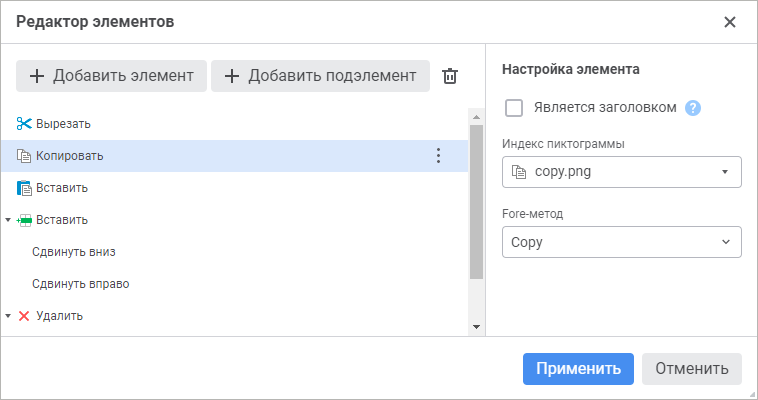
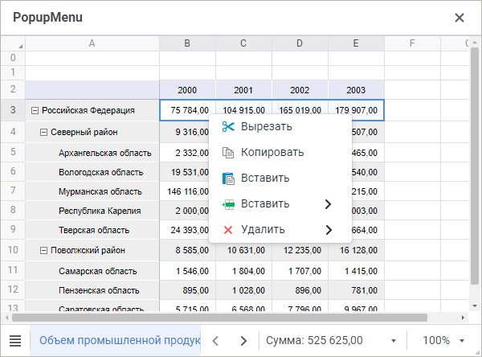

# PopupMenu: Компонент веб-форм

PopupMenu: Компонент веб-форм
-

# PopupMenu

## Иерархия наследования

           [IWebComponent](WebForms.chm::/Interface/IWebComponent/IWebComponent.htm)

           [IWebPopupMenu](WebForms.chm::/Interface/IWebPopupMenu/IWebPopupMenu.htm)

           [WebPopupMenu](WebForms.chm::/Class/WebPopupMenu/WebPopupMenu.htm)

## Описание

Компонент PopupMenu предоставляет
 контекстное меню, которое может быть вызвано поверх визуальных компонентов.

## Комментарии

Компонент является невизуальным. После добавления компонента на форму
 для работы с ним используйте панель «Активные компоненты». Выделите компонент
 и настройте необходимые свойства в [инспекторе
 объектов](../01_Development_Environment/03_Windows_of_Development_Environment/Object_Inspector.htm). Для удаления компонента с формы используйте соответствующую
 команду контекстного меню на панели «Активные компоненты».

Для создания команд в контекстном меню откройте редактор элементов,
 используя команду на панели «Активные компоненты» или свойство items
 в инспекторе объектов. С помощью кнопок «Добавить
 элемент» и «Добавить подэлемент»
 создайте необходимую иерархию меню. Каждый элемент соответствует отдельной
 команде контекстного меню. Для элементов определите текст, пиктограмму
 и Fore-метод, который будет выполняться при выборе команды. Список пиктограмм
 предварительно должен быть загружен в коллекцию imageCollection
 [веб-формы](../01_Development_Environment/02_Work_in_Development_Environment/DevEnv_Object/Web_Form.htm).
 Список Fore-методов формируется на основе методов, реализованных в классе
 формы.

Если для элемента установить флажок «Является
 заголовком», то в контекстном меню он будет отображаться полужирным
 текстом. Заголовки не имеют пиктограммы и Fore-метода, используются для
 визуальной группировки различных наборов команд.

Созданный компонент PopupMenu
 укажите в качестве значения свойства popupMenu
 у визуального компонента, для которого в дальнейшем будет вызываться контекстное
 меню.

Свойства и события, доступные в режиме дизайнера веб-формы.

	 Режим
	 дизайнера

	 События

			- name. Наименование
			 компонента;

			- items. Коллекция
			 элементов, которые реализуют команды контекстного меню.

		Компонент имеет событие onPopup,
		 которое наступает при выборе какой-либо команды контекстного меню.

## Пример

См. также:

[Компоненты
 веб-форм](web_components.htm)

		Справочная
		 система на версию 10.9
		 от 18/08/2025,
		 © ООО «ФОРСАЙТ»,
