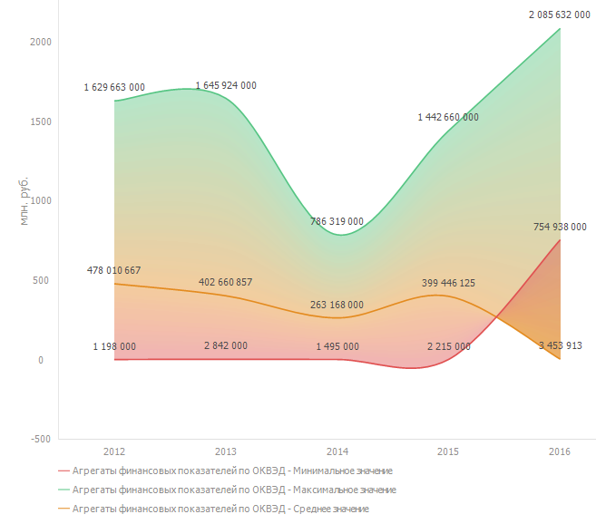
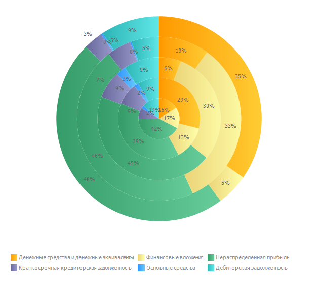

# Диаграмма

Диаграмма
-

# Диаграмма

Диаграмма представляет собой форму графического отображения [табличных данных](UiAnalyticalArea.chm::/Table.htm)
 и предназначена для их наглядного отображения:

## Создание диаграммы

Для создания диаграммы включите соответствующий [визуализатор](DataAnalysis.chm::/Visualizators.htm).
 Для этого нажмите кнопку «Диаграмма»,
 расположенную на вкладке «Вид»
 ленты инструментов.

Для
 ознакомления с примерами диаграмм и настройками для их построения обратитесь
 к разделу «[Примеры
 диаграмм](Examples/Diagram_examples.htm)».

## Работа с диаграммой

При работе с диаграммой доступны следующие операции:

	- [детализация
	 и обобщение данных рядов](Working_with_data/Series_drill_down.htm);

	- [нормализация отображаемых
	 данных](Working_with_data/Normalization.htm);

	- [отображение
	 вычисляемых значений](Working_with_data/Showing_Calculated_Values.htm);

	- [исключение
	 рядов из диаграммы](Working_with_data/Excluding_Series_from_Chart.htm);

	- [поворот источника
	 данных](Working_with_data/Rotate_data_source.htm);

	- [изменение типа
	 диаграммы](Type_diagrams/ChangingChartType.htm);

	- [настройка
	 общих параметров диаграммы](Params_diagram/UiDiagrams_params_diagram.htm);

	- [настройка компонентов
	 диаграммы](UiDiagrams_basic_concept.htm);

	- [настройка линии
	 тренда](look_and_feel/Report/Trend_Lines.htm);

	- [настройка
	 линии уровня](Tuning_format/Format_Axis/UiDiagrams_FormatAxis_Levels.htm);

	- [настройка коридоров диаграммы](UiDiagrams_corridors.htm);

	- [настройка
	 подписей данных](Property_diagramm/UiDiagrams_PropertyDiagramm_Label.htm);

	- [настройка
	 легенды](Property_diagramm/UiDiagrams_PropertyDiagramm_legend.htm);

	- [редактирование данных ряда](Edit_DataSeries.htm).

Для получения полного описания возможностей диаграммы обратитесь к разделу
 «[Настройка компонентов диаграммы](UiDiagrams_basic_concept.htm)».

См. также:

[Настройка
 компонентов диаграммы](UiDiagrams_basic_concept.htm) | [Типы
 диаграмм](Type_diagrams/UiDiagrams_Type_diagrams.htm) | [Примеры диаграмм](Examples/Diagram_examples.htm)

		Справочная
		 система на версию 10.9
		 от 18/08/2025,
		 © ООО «ФОРСАЙТ»,
