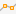
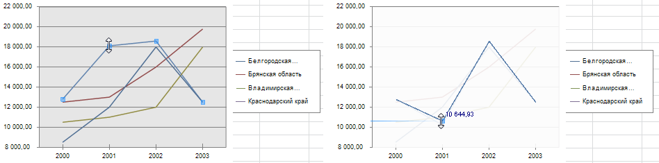
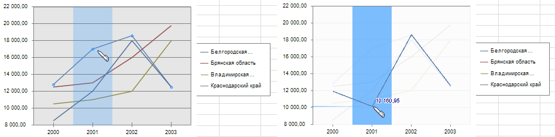

# Редактирование данных ряда

Редактирование данных ряда
-

# Редактирование данных ряда

При работе с различными типами диаграмм доступно редактирование данных
 в ячейках непосредственно из диаграммы, которая на них построена. При
 этом данные, измененные на диаграмме, автоматически будут отредактированы
 в соответствующих ячейках.

Доступно для рядов [линейной](Type_diagrams/UiDiagrams_lenear.htm),
 [ступенчатой](Type_diagrams/Stepped_Chart.htm) и [смешанной](Type_diagrams/UiDiagrams_mixed_diagram.htm)
 диаграмм, [гистограммы](Type_diagrams/UiDiagrams_Bar.htm) и
 [диаграммы с областями](Type_diagrams/UiDiagrams_Area.htm).

Для редактирования данных:

	- Активируйте диаграмму, дважды щелкнув по ней кнопкой мыши.

	- Выполните одно из действий:

		- нажмите кнопку «Разрешить
		 редактирование», расположенную в группе «Данные»
		 на вкладке «Диаграмма»
		 ленты инструментов;

		- выполните команду контекстного
		 меню «Режим редактирования данных».

	- После выполнения одного из действий будет открыт раскрывающийся
	 список. Выберите в нем вариант редактирования данных:

		- . В режиме редактирования «По
		 точкам» можно редактировать каждый ряд данных путем перетаскивания
		 его точки;

		- . В режиме редактирования «Рисованием»
		 можно редактировать несколько точек ряда одним движением.

## Особенности при редактировании ряда данных

	- Редактирование будет невозможным, если был снят флажок «Разрешить редактирование», расположенный
	 на странице «[Общее](Tuning_format/Format_line/Settings_DataSeries.htm)»
	 окна «Формат ряда данных».

	- Редактирование будет невозможным, если при работе с рядами данными
	 в регламентном отчете была настроена [защита листа](uireport.chm::/desktop/Sheets/UiReport_Sheets_defence.htm).

	- При работе с рядами данными в регламентном отчете результат
	 редактирования будет сохранен в источник данных, если был установлен
	 флажок:

		- Разрешить сохранение измененных
		 данных в источник. Флажок расположен на вкладке «[Параметры](uireport.chm::/desktop/AreaData/Param/UiReport_AreaData_Param_Param.htm)»
		 окна «Свойства области
		 данных»;

		- Сохранять данные в источник.
		 Флажок расположен на вкладке «[Параметры](UiAnalyticalArea.chm::/Parameters/Parameters.htm)»
		 боковой панели.

## Редактирование по точкам

После включения данного режима редактирования выберите в легенде или
 на диаграмме редактируемый ряд. После этого на диаграмме у выбранного
 ряда будут выделены точки. При наведении курсора мыши на точки ряда, курсор
 примет вид двойной стрелки. В этот момент зажмите кнопку мыши
 и переместите точку в новое положение. При перетаскивании точки рядом
 с ней будет отображаться новое значение:

## Редактирование рисованием

После включения данного режима редактирования выделите в легенде редактируемый
 ряд, после чего на диаграмме у этого ряда будут выделены точки. Курсор
 мыши, при наведении его на диаграмму принимает вид ручки, а участок, в
 котором расположена точка, будет выделен цветом. Зажмите кнопку
 мыши и, не отпуская кнопки, поэтапно меняйте значения точек ряда. Рядом
 с перетаскиваемой точкой будет отображаться новое значение:

См. также:

[Ряд данных](Series.htm) |
 [Настройка общих
 параметров диаграммы](Params_diagram/UiDiagrams_params_diagram.htm) | [Настройка
 компонентов диаграммы](UiDiagrams_basic_concept.htm)

		Справочная
		 система на версию 10.9
		 от 18/08/2025,
		 © ООО «ФОРСАЙТ»,
