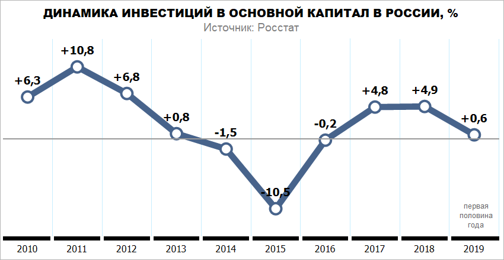
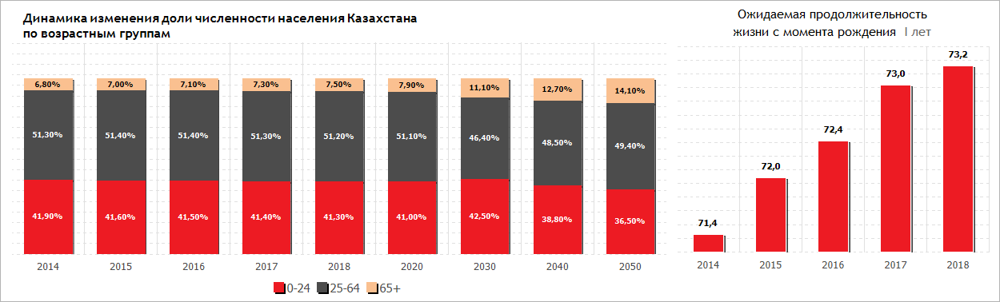
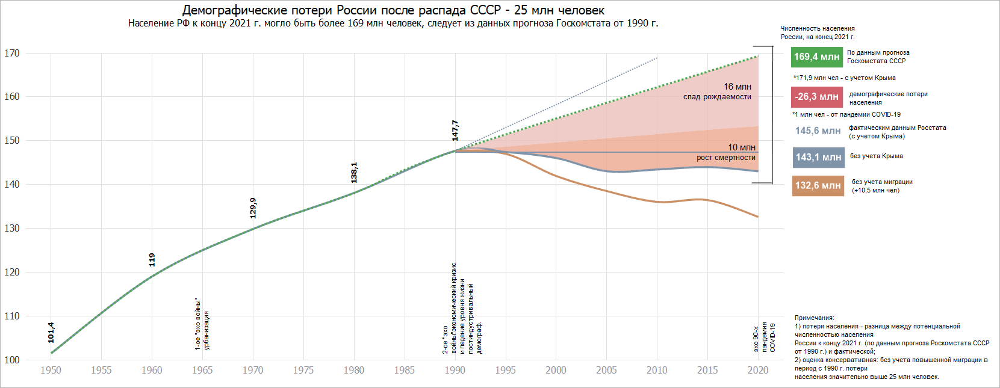
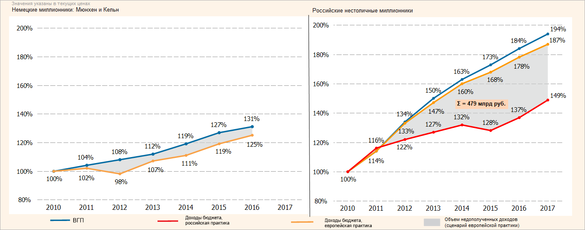
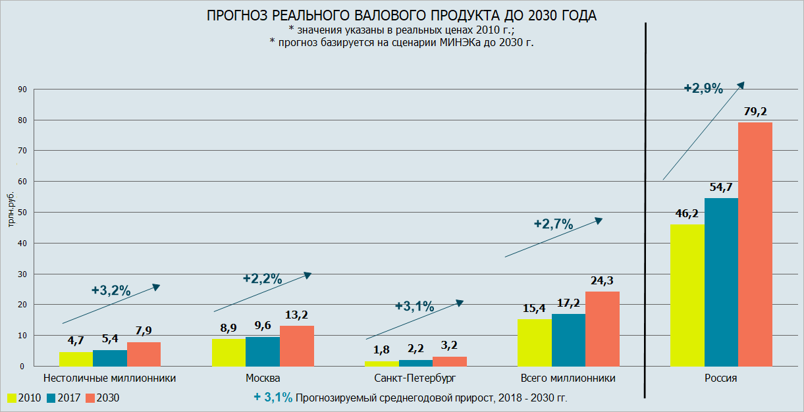
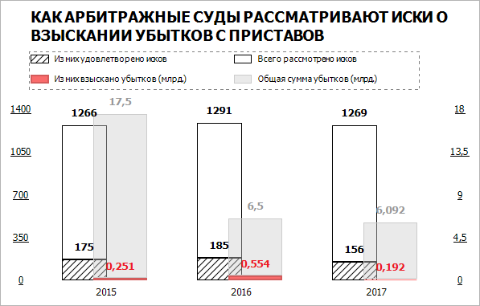
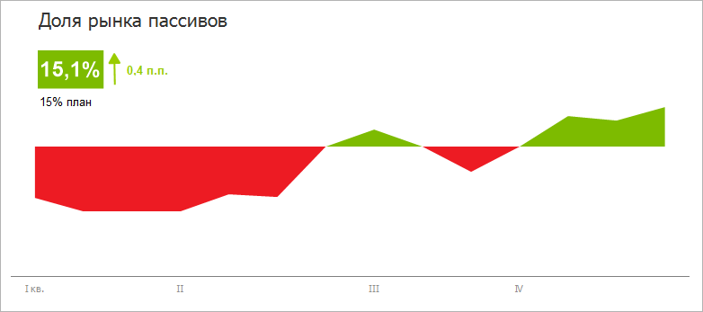
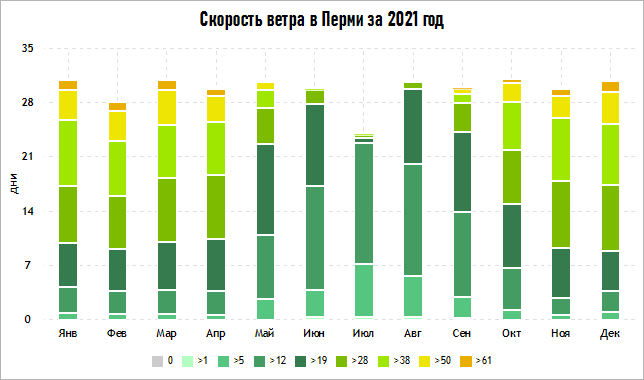

# Примеры диаграмм

Примеры диаграмм
-

# Примеры диаграмм

В данном разделе представлены примеры диаграмм, которые можно построить
 при помощи средств, предоставляемых инструментом «[Отчёты](UIReport.chm::/UiReport_purpose.htm)»:

	- Диаграмма «Динамика инвестиций»:

[

	- Диаграмма «Демографическая
	 ситуация»:

	- Диаграмма «Демографические
	 потери»:

  

	- Диаграмма «Доходы бюджета»:

	- Диаграмма «Прогноз реального
	 валового продукта»:

	- Диаграмма «Эффективность исполнительного
	 производства»:

  

	- Диаграмма «Как арбитражные
	 суды рассматривают иски о взыскании убытков с приставов»:

	- Диаграмма «Взыскание долгов»:

	- Диаграмма «Доля рынка пассивов»:

 

	- Диаграмма «Распределение оценок»:

  

	- Диаграмма «Скорость ветра»:

 

	- Диаграмма «Воронка продаж»:

  

См. также:

Диаграмма](Example_investment_dynamics.htm) |
 [Типы диаграмм](../Type_diagrams/UiDiagrams_Type_diagrams.htm) |
 [Построение отчёта для печати](UIReport.chm::/UiReport_purpose.htm)

		Справочная
		 система на версию 10.9
		 от 18/08/2025,
		 © ООО «ФОРСАЙТ»,
