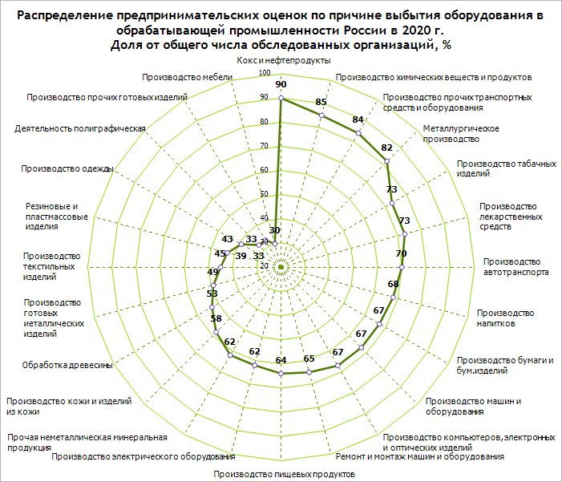
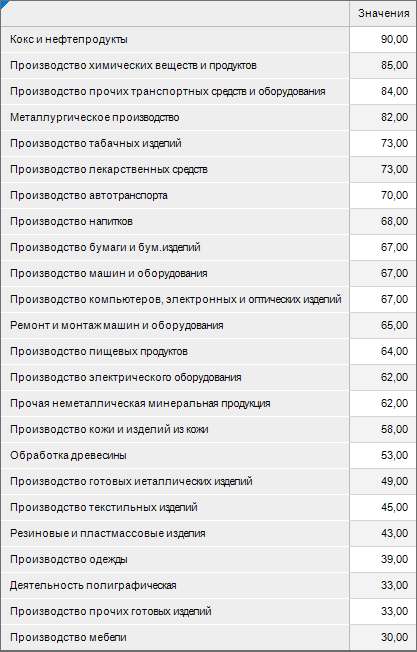
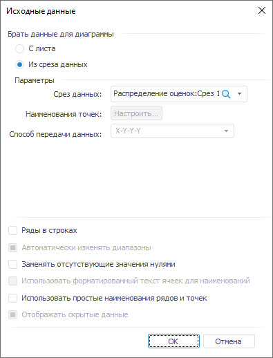
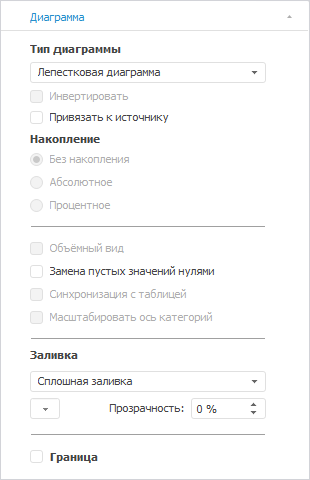
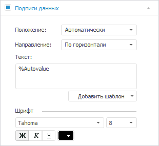
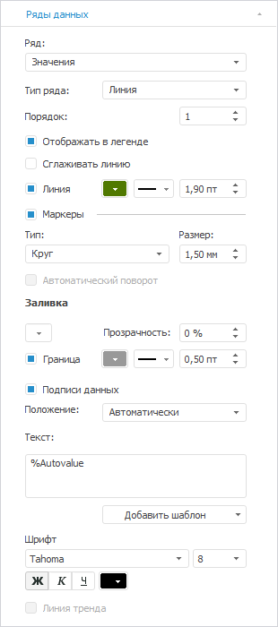
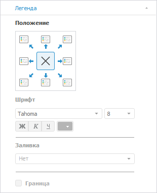
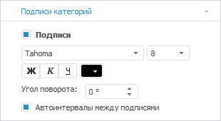
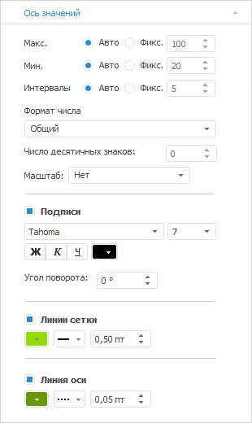

# Диаграмма «Распределение оценок»

Диаграмма «Распределение оценок»
-

# Диаграмма «Распределение оценок»

	Пример диаграммы, отображающей распределение предпринимательских
	 оценок:

	

## Подготовка источников данных

	В качестве [источника
	 данных](../../uireport/Web/Source/UiReport_Source.htm) для построения диаграммы потребуется [стандартный
	 куб](UiNavObj.chm::/Cube/CreateCube/Master_Standart/UiMd_Cube_CreateCube_Master_Standart.htm), содержащий:

		- справочник с перечнем рассматриваемых производств;

		- справочник НСИ с данными о распределении предпринимательских
		 оценок.

	Срез данных куба «Распределение
	 оценок» в виде таблицы имеет вид:

	

## Построение диаграммы

	После добавления источника данных [создайте](../Diagrams.htm)
	 лепестковую диаграмму и задайте следующие настройки:

		- В окне «Исходные данные»
		 задайте настройки:

			- Установите переключатель «Из
			 среза данных».

			- Выберите срез «Распределение
			 оценок: Срез 1» в раскрывающемся списке «Срез
			 данных».

			- Снимите флажок «Ряды
			 в строках».

			- Нажмите кнопку «ОК»:

	

		- На вкладке «[Диагр](../Series.htm)амма» в разделе «Формат»
		 на [боковой
		 панели](GetStarted.chm::/Interface/Interface_Description.htm#side_panel) задайте настройки заливки: тип -
		 сплошная заливка, цвет - 255 255 255 в формате RGB:

	

		- На вкладке «[Подписи данных](../Property_diagramm/UiDiagrams_PropertyDiagramm_Label.htm)»
		 в разделе «Формат» на
		 [боковой
		 панели](GetStarted.chm::/Interface/Interface_Description.htm#side_panel):

			- Установите флажок «Подписи
			 данных».

			- Настройте шрифт подписей данных: цвет - 0 0 0 в
			 формате RGB, начертание - жирный:

	

		- На вкладке «[Ряды
		 данных](../Series.htm)» в разделе «Формат»
		 на [боковой
		 панели](GetStarted.chm::/Interface/Interface_Description.htm#side_panel):

			- Выберите ряд «Значения» в раскрывающемся
			 списке «Ряд» и
			 задайте настройки:

				- настройте линии: цвет - 80 121 0 в формате
				 RGB, толщина - 1.9 пт;

				- настройте маркеры: размер - 1.5 мм, цвет границы
				 - 153 153 153 в формате RGB, толщина границы - 0.5
				 пт:

	

		- На вкладке «[Легенда](../Property_diagramm/UiDiagrams_PropertyDiagramm_legend.htm)»
		 в разделе «Формат» на
		 [боковой
		 панели](GetStarted.chm::/Interface/Interface_Description.htm#side_panel) выберите вариант расположения легенды
		 
		 «Легенда не отображается»:

	

		- На вкладке «Подписи
		 [категорий](../Property_diagramm/UiDiagrams_PropertyDiagramm_Label.htm)»
		 в разделе «Формат» на
		 [боковой
		 панели](GetStarted.chm::/Interface/Interface_Description.htm#side_panel) настройте подписи делений оси: размер
		 шрифта - 8, цвет - 0 0 0 в формате RGB:

	

		- На вкладке «[Ось
		 значений](../Params_diagram/UiDiagrams_Axis.htm)» в разделе «Формат»
		 на [боковой
		 панели](GetStarted.chm::/Interface/Interface_Description.htm#side_panel):

			- настройте подписи делений оси: тразмер шрифта -
			 7, цвет - 0 0 0 в формате RGB;

			- настройте линии сетки: цвет - 146 220 0 в формате RGB;

			- установите флажок «Линия
			 оси» и задайте настройки: тип - пунктирная линия,
			 цвет - 102 153 0 в формате RGB, толщина - 0.05 пт:

	

		- При необходимости настройте всплывающие подсказки на вкладке
		 «[Подсказки](../Params_diagram/Tooltips.htm)»
		 в разделе «Формат» на
		 [боковой
		 панели](GetStarted.chm::/Interface/Interface_Description.htm#side_panel).

		- Выполните настройки по оформлению диаграммы.

## Оформление диаграммы

	После построения диаграммы добавьте [заголовок
	 диаграммы](../Params_diagram/UiDiagrams_titles.htm) «Распределение предпринимательских
	 оценок по причине выбытия оборудования в обрабатывающей промышленности
	 России в 2020 г. Доля от общего числа обследованных организаций, %»
	 и задайте настройки формата: размер шрифта - 12, цвет -
	 0 0 0 в формате RGB, начертание - полужирный.

	Примечание.
	 При настройке оформления диаграммы указаны только изменяемые параметры,
	 к остальным параметрам применяются настройки по умолчанию.

	В результате выполнения действий будет построена представленная
	 диаграмма.

См. также:

[Примеры
 диаграмм](Diagram_examples.htm)

		Справочная
		 система на версию 10.9
		 от 18/08/2025,
		 © ООО «ФОРСАЙТ»,
