# Диаграмма «Доходы бюджета»

Диаграмма «Доходы бюджета»
-

# Диаграмма «Доходы бюджета»

	Пример диаграммы, отображающей доходы бюджета:

	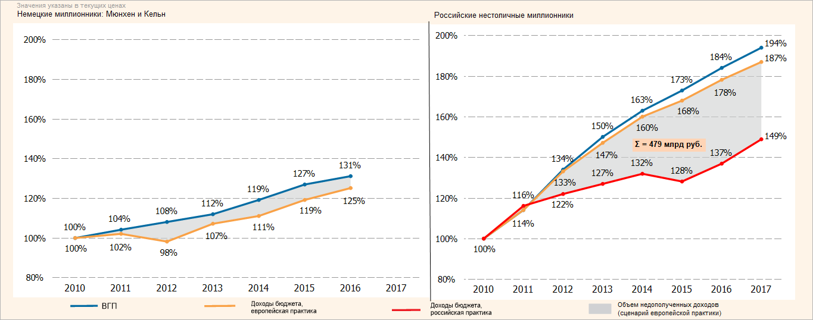

## Подготовка источников данных

	В качестве источников данных потребуются:

		- Для построения диаграммы «Немецкие
		 миллионники» [стандартный
		 куб](UiNavObj.chm::/Cube/CreateCube/Master_Standart/UiMd_Cube_CreateCube_Master_Standart.htm), содержащий:

			- календарный справочник;

			- справочник НСИ с перечнем сравниваемых практик;

			- справочник НСИ с данными ВГП и доходах бюджета, европейская
			 практика.

	Срез данных куба «Немецкие
	 миллионники» в виде таблицы имеет вид:

	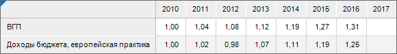

		- Для построения диаграммы «Российские
		 нестоличные миллионники» [стандартный
		 куб](UiNavObj.chm::/Cube/CreateCube/Master_Standart/UiMd_Cube_CreateCube_Master_Standart.htm), содержащий:

			- календарный справочник;

			- справочник НСИ с перечнем сравниваемых практик;

			- справочник НСИ с данными ВГП и доходах бюджетов, европейской
			 и российской практик.

	Срез данных куба «Российские
	 нестоличные миллионники» в виде таблицы имеет вид:

	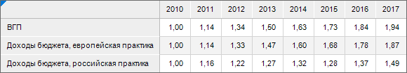

## Построение диаграммы «Немецкие миллионники»

	После добавления источника данных[ создайте](../Diagrams.htm)
	 [линейную диаграмму
	 с абсолютными значениями](../Type_diagrams/UiDiagrams_lenear.htm) и задайте следующие настройки:

	Примечание.
	 При настройке диаграммы указаны только изменяемые параметры, к остальным
	 параметрам применяются настройки по умолчанию.

		- В окне «Исходные данные»
		 задайте настройки:

			- Установите переключатель «Из
			 среза данных».

			- Выберите срез «Динамика
			 доходов1: Срез 1» в раскрывающемся списке «Срез
			 данных».

			- Нажмите кнопку «ОК»:

	

		- На вкладке «[Подписи
		 данных](../Property_diagramm/UiDiagrams_PropertyDiagramm_Label.htm)» в разделе «Формат»
		 на [боковой
		 панели](GetStarted.chm::/Interface/Interface_Description.htm#side_panel):

			- Установите флажок «Подписи
			 данных».

			- Настройте шрифт подписей данных: размер шрифта -
			 11, цвет - 0 0 0 в формате RGB:

	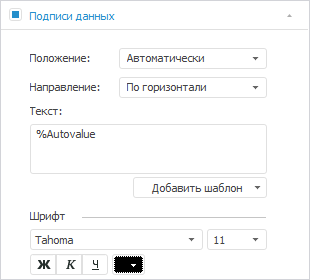

		- На вкладке «[Ряды
		 данных](../Series.htm)» в разделе «Формат»
		 на [боковой
		 панели](GetStarted.chm::/Interface/Interface_Description.htm#side_panel):

			- Выберите ряд «ВГП» в раскрывающемся списке
			 «Ряд» и задайте настройки:

				- настройте линию ряда: цвет - 5 108 163 в формате
				 RGB, толщина - 2.5 пт;

				- маркеры: размер - 1.5 мм, цвет заливки - 5
				 108 163 в формате RGB, цвет границы - 5 108 163 в
				 формате RGB, толщина границы - 0.25 пт:

	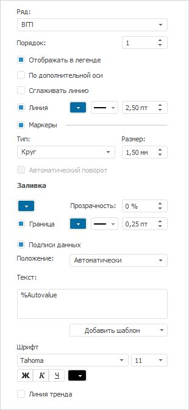

			- Выберите ряд «Доходы
			 бюджета, европейская практика» в раскрывающемся списке
			 «Ряд» и задайте настройки:

				- настройте линию ряда: цвет - 249 161 70 в формате
				 RGB, толщина - 2.5 пт;

				- маркеры: размер - 1.5 мм, цвет заливки - 249
				 161 70 в формате RGB, цвет границы - 249 161 70 в
				 формате RGB, толщина границы - 0.25 пт:

	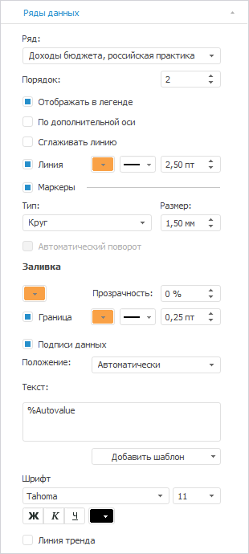

		- На вкладке «[Легенда](../Property_diagramm/UiDiagrams_PropertyDiagramm_legend.htm)»
		 в разделе «Формат» на
		 [боковой
		 панели](GetStarted.chm::/Interface/Interface_Description.htm#side_panel) выберите вариант расположения легенды
		 
		 «Легенда не отображается»:

	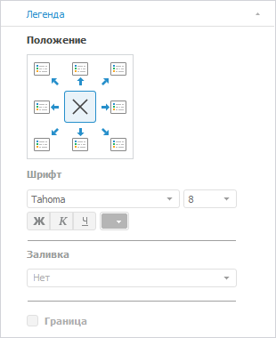

		- На вкладке «[Ось
		 категорий (Х)](../Params_diagram/UiDiagrams_Axis.htm)» в разделе «Формат»
		 на [боковой
		 панели](GetStarted.chm::/Interface/Interface_Description.htm#side_panel) настройте подписи делений оси: размер
		 шрифта - 12, цвет - 0 0 0 в формате RGB:

	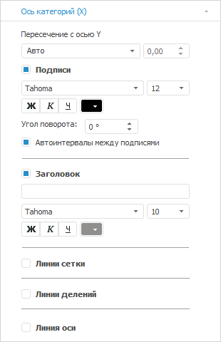

		- На вкладке «[Ось категорий (Y)](../Params_diagram/UiDiagrams_Axis.htm)»
		 в разделе «Формат» на
		 [боковой
		 панели](GetStarted.chm::/Interface/Interface_Description.htm#side_panel):

			- выберите способ расчёта максимального значения, установив
			 переключатель «Фикс.»,
			 и задайте значение «2»;

			- выберите способ расчёта минимального значения, установив
			 переключатель «Фикс.»,
			 и задайте значение «0.8»;

			- выберите способ расчёта интервалов, установив переключатель
			 «Фикс.», и задайте
			 значение «6»;

			- выберите в раскрывающемся списке «Формат
			 числа» значение «Процентный»
			 и задайте в поле «Число
			 десятичных знаков»
			 значение «0»;

			- настройте подписи делений оси: размер шрифта -
			 11, цвет - 0 0 0 в формате RGB;

			- настройте линии сетки: тип - пунктирная линия,
			 цвет - 153 153 153 в формате RGB:

	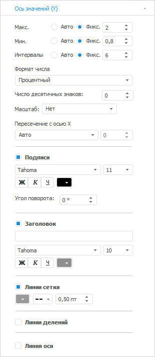

		- Создайте [коридор диаграммы](../UiDiagrams_corridors.htm)
		 и задайте его [настройки](../UiDiagrams_CorridorsProperty.htm):

			- Выберите ряд «ВГП» в раскрывающемся списке
			 «Ряд 1»;

			- Выберите ряд «Доходы бюджета, европейская практика»
			 в раскрывающемся списке «Ряд
			 2»;

			- Задайте настройки заливки
			 коридора: тип - сплошная заливка, цвет - 208 209
			 211 в формате RGB, прозрачность - 62.

			- Задайте наименование
			 коридора «Объем недополученных
			 доходов (сценарий европейской практики)»:

	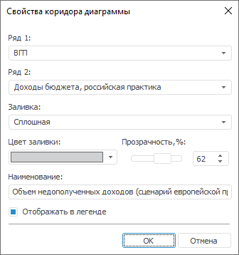

		- При необходимости настройте всплывающие подсказки на вкладке
		 «[Подсказки](../Params_diagram/Tooltips.htm)»
		 в разделе «Формат» на
		 [боковой
		 панели](GetStarted.chm::/Interface/Interface_Description.htm#side_panel).

		- Выполните настройки по [оформлению
		 диаграммы](Example_budget_income.htm#decoration).

## Построение диаграммы «Российские нестоличные миллионники»

	После добавления источника данных[ создайте](../Diagrams.htm)
	 линейную диаграмму с абсолютными значениями и задайте следующие настройки:

	Примечание.
	 При настройке диаграммы указаны только изменяемые параметры, к остальным
	 параметрам применяются настройки по умолчанию.

		- В окне «Исходные данные»
		 задайте настройки:

			- Установите переключатель «Из
			 среза данных».

			- Выберите срез «Динамика
			 доходов2: Срез 2» в раскрывающемся списке «Срез
			 данных».

			- Нажмите кнопку «ОК»:

	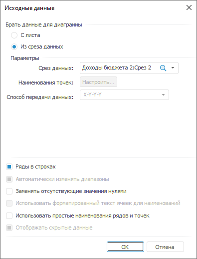

		- На вкладке «[Подписи данных](../Property_diagramm/UiDiagrams_PropertyDiagramm_Label.htm)»
		 в разделе «Формат» на
		 [боковой
		 панели](GetStarted.chm::/Interface/Interface_Description.htm#side_panel):

			- Установите флажок «Подписи
			 данных».

			- Настройте шрифт подписей данных: размер шрифта -
			 11, цвет - 0 0 0 в формате RGB:

	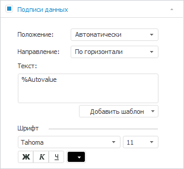

		- На вкладке «[Ряды
		 данных](../Series.htm)» в разделе «Формат»
		 на [боковой
		 панели](GetStarted.chm::/Interface/Interface_Description.htm#side_panel):

			- Выберите ряд «ВГП» в раскрывающемся списке
			 «Ряд» и задайте настройки:

				- настройте линию ряда: цвет - 5 108 163 в формате
				 RGB, толщина - 2.5 пт;

				- маркеры: размер - 1.5 мм, цвет заливки - 5
				 108 163 в формате RGB, цвет границы - 5 108 163 в
				 формате RGB, толщина границы - 0.25 пт:

	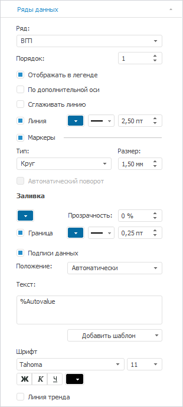

			- Выберите ряд «Доходы
			 бюджета, европейская практика» в раскрывающемся списке
			 «Ряд» и задайте настройки:

				- настройте линию ряда: цвет - 249 161 70 в формате
				 RGB, толщина - 2.5 пт;

				- маркеры: размер - 1.5 мм, цвет заливки - 249
				 161 70 в формате RGB, цвет границы - 249 161 70 в
				 формате RGB, толщина границы - 0.25 пт:

	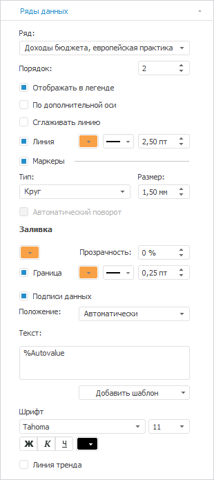

			- Выберите ряд «Доходы
			 бюджета, российская практика» в раскрывающемся списке
			 «Ряд» и задайте настройки:

				- настройте линию ряда: цвет - 255 0 0 в формате
				 RGB, толщина - 2.5 пт;

				- маркеры: размер - 1.5 мм, цвет заливки - 255
				 0 0 в формате RGB, цвет границы - 255 0 0 в формате
				 RGB, толщина границы - 0.25 пт:

	

		- На вкладке «[Легенда](../Property_diagramm/UiDiagrams_PropertyDiagramm_legend.htm)»
		 в разделе «Формат» на
		 [боковой
		 панели](GetStarted.chm::/Interface/Interface_Description.htm#side_panel) выберите вариант расположения легенды
		 
		 «Легенда не отображается»:

	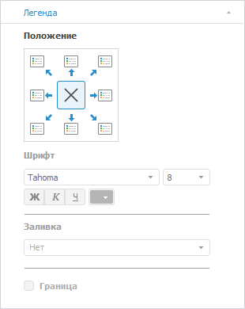

		- На вкладке «[Ось
		 категорий (Х)](../Params_diagram/UiDiagrams_Axis.htm)» в разделе «Формат»
		 на [боковой
		 панели](GetStarted.chm::/Interface/Interface_Description.htm#side_panel) настройте подписи делений оси: размер
		 шрифта - 12, цвет - 0 0 0 в формате RGB:

	

		- На вкладке «[Ось категорий (Y)](../Params_diagram/UiDiagrams_Axis.htm)»
		 в разделе «Формат» на
		 [боковой
		 панели](GetStarted.chm::/Interface/Interface_Description.htm#side_panel):

			- Выберите способ расчёта максимального значения, установив
			 переключатель «Фикс.»,
			 и задайте значение «2».

			- Выберите способ расчёта минимального значения, установив
			 переключатель «Фикс.»,
			 и задайте значение «0.8».

			- Выберите способ расчёта интервалов, установив переключатель
			 «Фикс.», и задайте значение
			 «6».

			- Выберите в раскрывающемся списке «Формат
			 числа» значение «Процентный»
			 и задайте в поле «Десятичных
			 знаков» значение «0»;

			- Настройте подписи делений оси: размер шрифта -
			 11, цвет - 0 0 0 в формате RGB.

			- Настройте линии сетки: тип - пунктирная линия,
			 цвет - 153 153 153 в формате RGB:

	

		- Создайте [коридор диаграммы](../UiDiagrams_corridors.htm)
		 и задайте его [настройки](../UiDiagrams_CorridorsProperty.htm):

			- Выберите ряд «Доходы бюджета, российская практика»
			 в раскрывающемся списке «Ряд
			 1»;

			- Выберите ряд «Доходы бюджета, европейская практика»
			 в раскрывающемся списке «Ряд
			 2»;

			- Задайте настройки заливки
			 коридора: тип - сплошная заливка, цвет - 208 209
			 211 в формате RGB, прозрачность - 62.

			- Задайте наименование
			 коридора «Объем недополученных
			 доходов (сценарий европейской практики)»:

	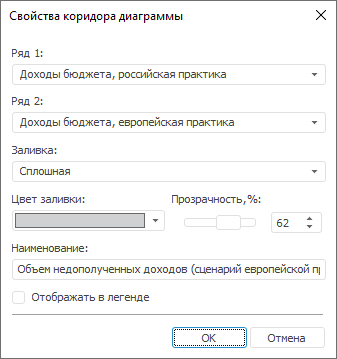

		- При необходимости настройте всплывающие подсказки на вкладке
		 «[Подсказки](../Params_diagram/Tooltips.htm)»
		 в разделе «Формат» на
		 [боковой
		 панели](GetStarted.chm::/Interface/Interface_Description.htm#side_panel).

		- Выполните настройки по [оформлению
		 диаграммы](Example_budget_income.htm#decoration).

## Оформление диаграмм

	После построения диаграмм выполните настройки по оформлению:

	Примечание.
	 При настройке оформления диаграмм указаны только изменяемые параметры,
	 к остальным параметрам применяются настройки по умолчанию.

		- Задайте [настройки
		 формата подписей](../Params_diagram/Label_Format.htm) в процентном формате. Для этого укажите следующие
		 параметры: формат - процентный, количество знаков после запятой
		 - 0.

		- Удалите с диаграммы дублирующиеся подписи данных с помощью
		 команды контекстного меню «Удалить
		 подпись данных».

		- Добавьте [фигуру](uireport.chm::/Desktop/Objects/AutoObjects/UiReport_AutoObject.htm)
		 в качестве подложки и задайте ее настройки:

			- Выполните команду контекстного
			 меню «Формат» фигуры.
			 В окне «Формат объектов»
			 укажите:

				- на вкладке «Заливка»:
				 цвет фона - 254 244 232 в формате RGB;

				- на вкладке «Линии»:
				 толщина - 0.25 пт.

			- Выполните команду контекстного
			 меню «Порядок > На задний
			 план» фигуры.

		- Для подписи диаграмм:

			- Добавьте последовательно [текстовый
			 блок](uireport.chm::/Desktop/Objects/UiReport_Objects_formatted_text.htm) рядом с диаграммами, указав значение «Значения указаны в текущих ценах»,
			 «Немецкие миллионники: Мюнхен и Кёльн», «Российские
			 нестоличные миллионники».

			- Перейдите в режим редактирования текста и выполните
			 команду контекстного меню «Формат»
			 фигуры. В окне «Формат»
			 на вкладке «Шрифт»
			 укажите: шрифт - Arial, цвет шрифта - 0 0 0 в формате
			 RGB, размер - 8.

		- Для оформления общей легенды диаграмм:

			- [Добавьте
			 ](../../uireport/Web/Objects/Shapes/Shapes.htm)[линии](uireport.chm::/Desktop/Objects/AutoObjects/UiReport_AutoObject.htm)
			 и задайте ее настройки, выполнив команду контекстного меню
			 «Формат» фигуры. Для
			 этого в окне «Формат объектов»
			 на вкладке «Линии»
			 укажите:

				- линия «ВГП»:
				 цвет - 5 108 163 в формате RGB, толщина - 2.5
				 пт;

				- линия «Доходы
				 бюджета, европейская практика»: цвет - 249
				 161 70 в формате RGB, толщина - 2.5 пт;

				- линия «Доходы
				 бюджета, российская практика»: цвет - 255
				 0 0 в формате RGB, толщина - 2.5 пт.

			- Для созданных линий задайте для расшифровки наименование,
			 указав значения «ВГП»,
			 «Доходы бюджета, европейская
			 практика», «Доходы
			 бюджета, российская практика» соответственно.

			- Добавьте [фигуру](uireport.chm::/Desktop/Objects/AutoObjects/UiReport_AutoObject.htm)
			 и задайте ее настройки, выполнив команду контекстного меню
			 «Формат» фигуры. Для
			 этого в окне «Формат объектов»:

				- на вкладке «Заливка»:
				 тип - сплошная заливка, цвет - 208 209 211 в формате
				 RGB;

				- на вкладке «Линии»:
				 тип - сплошная линий, цвет - 208 209 211 в формате
				 RGB.

			- Добавьте [текстовый
			 блок](uireport.chm::/Desktop/Objects/UiReport_Objects_formatted_text.htm) рядом фигурой, указав значение «Объем недополученных доходов (сценарий
			 европейской практики)».

		- Для указания суммы, которую нестоличные миллионники недополучили
		 за 7 лет:

			- Добавьте [фигуру](uireport.chm::/Desktop/Objects/AutoObjects/UiReport_AutoObject.htm)
			 в области «Объем недополученных
			 доходов».

			- Щелкните дважды по
			 фигуре и укажите значение «Σ
			 = 479 млрд руб.».

			- Выполните команду контекстного
			 меню «Формат» фигуры.
			 В окне «Формат объектов»
			 укажите:

				- на вкладке «Шрифт»:
				 шрифт - Arial, цвет шрифта - 0 0 0 в формате RGB,
				 размер - 10, начертание - полужирный;

				- на вкладке «Заливка»:
				 цвет фона - 255 212 181 в формате RGB.

				- на вкладке «Линии»: цвет фона
				 - 255 212 181 в формате RGB.

	В результате выполнения действий будет построена представленная
	 диаграмма.

См. также:

[Примеры
 диаграмм](Diagram_examples.htm)

		Справочная
		 система на версию 10.9
		 от 18/08/2025,
		 © ООО «ФОРСАЙТ»,
