# Диаграмма «Взыскание долгов»

Диаграмма «Взыскание долгов»
-

# Диаграмма «Взыскание долгов»

	Пример диаграммы, отображающей взыскание долгов:

	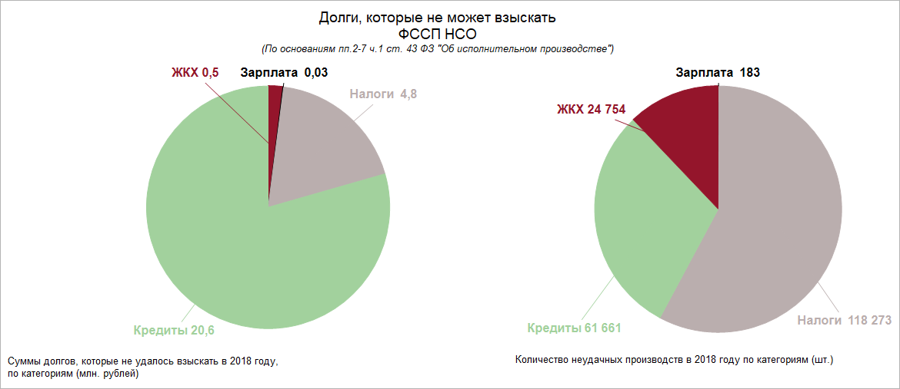

## Подготовка источников данных

	В качестве источника данных для построения диаграммы потребуется
	 [стандартный
	 куб](UiNavObj.chm::/Cube/CreateCube/Master_Standart/UiMd_Cube_CreateCube_Master_Standart.htm), содержащий:

		- календарный справочник;

		- справочник НСИ с перечнем категорий долгов;

		- справочник НСИ с данными о долгах по взысканию.

	Срезы данных куба «Взыскание долгов»
	 в виде таблицы в зависимости от выбранной категории имеют вид:

		- Для диаграммы «Долги по
		 взысканию»:

	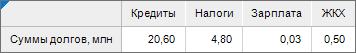

		- Для диаграммы «Неудачные
		 производства»:

	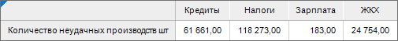

## Построение диаграммы «Долги по взысканию»

	После добавления источника данных[ создайте](../Diagrams.htm)
	 круговую диаграмму с абсолютными значениями и задайте настройки:

	Примечание.
	 При настройке диаграммы указаны только изменяемые параметры, к остальным
	 параметрам применяются настройки по умолчанию.

		- В окне «Исходные данные»
		 задайте настройки:

			- Установите переключатель «Из
			 среза данных».

			- Выберите срез «Взыскание
			 долгов: Срез 1» в раскрывающемся списке «Срез
			 данных».

			- Снимите флажок «Ряды
			 в строках».

			- Нажмите кнопку «ОК»:

	

		- Настройте [порядок
		 рядов](../Params_diagram/Series_Order.htm): ЖКХ, Зарплата, Налоги Кредиты.

		- На вкладке «[Подписи
		 данных](../Property_diagramm/UiDiagrams_PropertyDiagramm_Label.htm)» в разделе «Формат»
		 на [боковой
		 панели](GetStarted.chm::/Interface/Interface_Description.htm#side_panel):

			- Установите флажок «Подписи
			 данных».

			- Выберите положение подписей данных «У
			 вершины снаружи» в раскрывающемся списке «Положение».

			- Введите в поле «Текст»
			 значение «%SerieName %YValue».

			- Настройте шрифт подписей данных: шрифт - Arial, размер
			 шрифта - 12, начертание - жирный:

	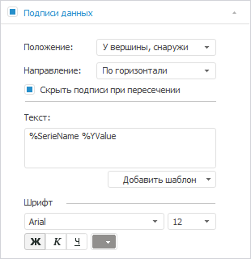

		- На вкладке «[Ряды
		 данных](../Series.htm)» в разделе «Формат»
		 на [боковой
		 панели](GetStarted.chm::/Interface/Interface_Description.htm#side_panel):

			- Выберите ряд «ЖКХ» в раскрывающемся списке
			 «Ряд» и задайте настройки:

				- задайте заливку ряда: тип - сплошная заливка, цвет
				 - 148 21 43 в формате RGB;

				- настройте границу ряда: цвет - 148 21 43 в
				 формате RGB, толщина - 0.25 пт;

				- настройте подписи данных: цвет шрифта - 148
				 21 43 в формате RGB:

	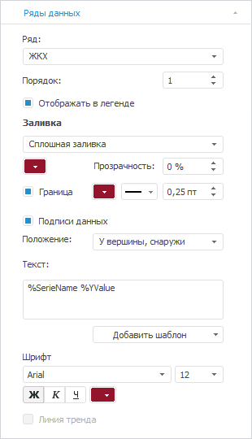

			- Выберите ряд «Зарплата»
			 в раскрывающемся списке «Ряд»
			 и задайте настройки:

				- задайте заливку ряда: тип - сплошная заливка, цвет
				 - 0 0 0 в формате RGB;

				- настройте границу ряда: цвет - 0 0 0 в формате
				 RGB, толщина - 0.25 пт;

				- настройте подписи данных: цвет шрифта - 0 0
				 0 в формате RGB:

	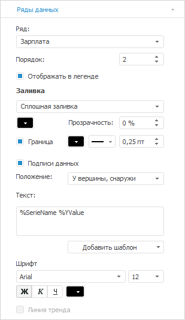

			- Выберите ряд «Налоги»
			 в раскрывающемся списке «Ряд»
			 и задайте настройки:

				- задайте заливку ряда: тип - сплошная заливка, цвет
				 - 186 174 174 в формате RGB;

				- настройте границу ряда: цвет - 186 174 174
				 в формате RGB, толщина - 0.25 пт;

				- настройте подписи данных: цвет шрифта - 186
				 174 174 в формате RGB:

	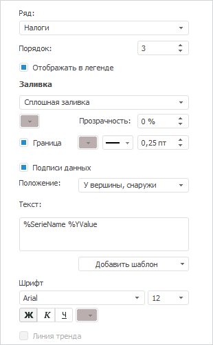

			- Выберите ряд «Кредиты»
			 в раскрывающемся списке «Ряд»
			 и задайте настройки:

				- задайте заливку ряда: тип - сплошная заливка, цвет
				 - 162 209 157 в формате RGB;

				- настройте границу ряда: цвет - 162 209 157
				 в формате RGB, толщина - 0.25 пт;

				- настройте подписи данных: цвет шрифта - 162
				 209 157 в формате RGB:

	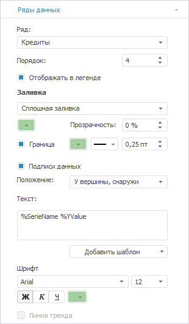

		- На вкладке «[Легенда](../Property_diagramm/UiDiagrams_PropertyDiagramm_legend.htm)»
		 в разделе «Формат» на
		 [боковой
		 панели](GetStarted.chm::/Interface/Interface_Description.htm#side_panel) выберите вариант расположения легенды
		 
		 «Легенда не отображается»:

	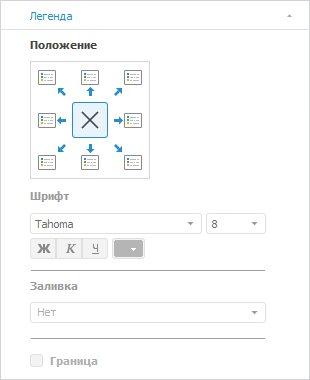

		- При необходимости настройте всплывающие подсказки на вкладке
		 «[Подсказки](../Params_diagram/Tooltips.htm)»
		 в разделе «Формат» на
		 [боковой
		 панели](GetStarted.chm::/Interface/Interface_Description.htm#side_panel).

		- Выполните настройки по [оформлению
		 диаграммы](Example_collection_of_debts.htm#decoration).

## Построение диаграммы «Неудачные производства»

	После добавления источника данных[ создайте](../Diagrams.htm)
	 круговую диаграмму с абсолютными значениями и задайте настройки:

	Примечание.
	 При настройке диаграммы указаны только изменяемые параметры, к остальным
	 параметрам применяются настройки по умолчанию.

		- В окне «Исходные данные»
		 задайте настройки:

			- Установите переключатель «Из
			 среза данных».

			- Выберите срез «Взыскание
			 долгов: Срез 2» в раскрывающемся списке «Срез
			 данных».

			- Снимите флажок «Ряды
			 в строках».

			- Нажмите кнопку «ОК»:

	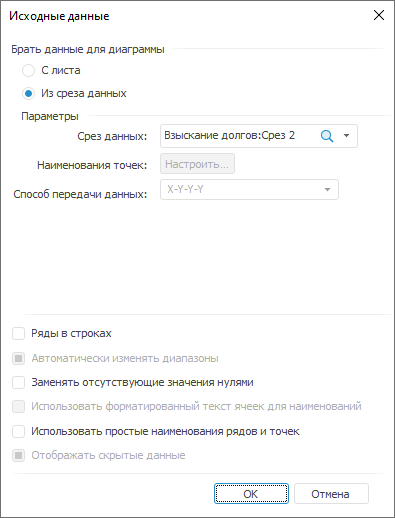

		- Настройте [порядок
		 рядов](../Params_diagram/Series_Order.htm): Зарплата,
		 Налоги, Кредиты,
		 ЖКХ:

	

		- На вкладке «[Подписи
		 данных](../Property_diagramm/UiDiagrams_PropertyDiagramm_Label.htm)» в разделе «Формат»
		 на [боковой
		 панели](GetStarted.chm::/Interface/Interface_Description.htm#side_panel):

			- Установите флажок «Подписи
			 данных».

			- Выберите положение подписей данных «У
			 вершины, снаружи» в раскрывающемся списке «Положение».

			- Введите в поле «Текст»
			 значение «%SerieName %YValue».

			- Настройте шрифт подписей данных: шрифт - Arial, размер
			 шрифта - 12, начертание - жирный:

	

		- На вкладке «[Ряды
		 данных](../Series.htm)» в разделе «Формат»
		 на [боковой
		 панели](GetStarted.chm::/Interface/Interface_Description.htm#side_panel):

			- Выберите ряд «Зарплата»
			 в раскрывающемся списке «Ряд»
			 и задайте настройки:

				- задайте заливку ряда: тип - сплошная заливка, цвет
				 - 0 0 0 в формате RGB;

				- настройте границу ряда: цвет - 0 0 0 в формате
				 RGB, толщина - 0.25 пт;

				- настройте подписи данных: цвет шрифта - 0 0
				 0 в формате RGB:

	

			- Выберите ряд «Налоги»
			 в раскрывающемся списке «Ряд»
			 и задайте настройки:

				- задайте заливку ряда: тип - сплошная заливка, цвет
				 - 186 174 174 в формате RGB;

				- настройте границу ряда: цвет - 186 174 174
				 в формате RGB, толщина - 0.25 пт;

				- настройте подписи данных: цвет шрифта - 186
				 174 174 в формате RGB:

	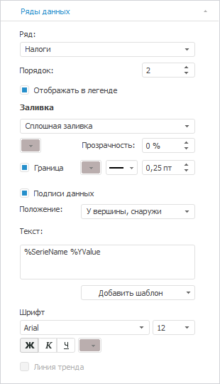

			- Выберите ряд «Кредиты»
			 в раскрывающемся списке «Ряд»
			 и задайте настройки:

				- задайте заливку ряда: тип - сплошная заливка, цвет
				 - 162 209 157 в формате RGB;

				- настройте границу ряда: цвет - 162 209 157
				 в формате RGB, толщина - 0.25 пт;

				- настройте подписи данных: цвет шрифта - 162
				 209 157 в формате RGB:

	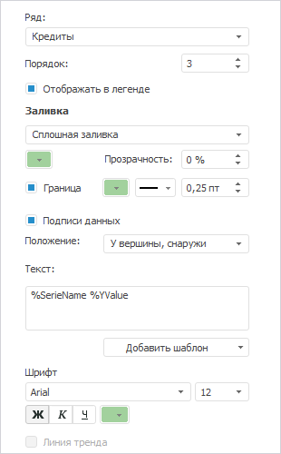

			- Выберите ряд «ЖКХ»
			 в раскрывающемся списке «Ряд»
			 и задайте настройки:

				- задайте заливку ряда: тип - сплошная заливка, цвет
				 - 148 21 43 в формате RGB;

				- настройте границу ряда: цвет - 148 21 43 в
				 формате RGB, толщина - 0.25 пт;

				- настройте подписи данных: цвет шрифта - 148
				 21 43 в формате RGB:

	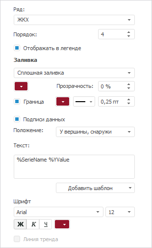

		- На вкладке «[Легенда](../Property_diagramm/UiDiagrams_PropertyDiagramm_legend.htm)»
		 в разделе «Формат» на
		 [боковой
		 панели](GetStarted.chm::/Interface/Interface_Description.htm#side_panel) выберите вариант расположения легенды
		 
		 «Легенда не отображается»:

	

		- При необходимости настройте всплывающие подсказки на вкладке
		 «[Подсказки](../Params_diagram/Tooltips.htm)»
		 в разделе «Формат» на
		 [боковой
		 панели](GetStarted.chm::/Interface/Interface_Description.htm#side_panel).

		- Выполните настройки по [оформлению
		 диаграммы](Example_collection_of_debts.htm#decoration).

## Оформление диаграмм

	После построения диаграмм выполните настройки по оформлению:

	Примечание.
	 При настройке оформления диаграммы указаны только изменяемые параметры,
	 к остальным параметрам применяются настройки по умолчанию.

		- Настройте выноски для подписей данных на диаграммах:

			- На вкладке «[Подписи
			 данных](../Params_diagram/UiDiagrams__DataTitle.htm)» окна «Формат
			 ряда данных»: тип подписи - указатель.

			- Для указателей задайте
			 [настройки
			 формата линии](../Params_diagram/Callout_Pointer_Line_Format.htm):

				- для ряда «ЖКХ»:
				 цвет линии - 148 21 43 в формате RGB;

				- для ряда «Налоги»:
				 цвет линии - 186 174 174 в формате RGB;

				- для ряда «Кредиты»:
				 цвет - 162 209 157 в формате RGB.

		- Измените размер области построения путем перетаскивания
		 ее границ.

		- Добавьте [текстовые
		 блоки](uireport.chm::/Desktop/Objects/UiReport_Objects_formatted_text.htm) на диаграммы:

			- для заголовка введите значение «Долги,
			 которые не может взыскать ФССП НСО (По основаниям пп.2-7 ч.1
			 ст. 43 ФЗ "Об исполнительном производстве")»
			 и задайте настройки формата:

				- для всего текста: размер шрифта - 14;

				- для текста «(По
				 основаниям пп.2-7 ч.1 ст. 43 ФЗ "Об исполнительном
				 производстве")»: размер шрифта - 10,
				 начертание - курсив.

			- для комментариев введите значение «Суммы
			 долгов, которые не удалось взыскать в 2018 году, по категориям
			 (млн. рублей)» и «Количество
			 неудачных производств в 2018 году по категориям (шт.)»
			 и задайте настройки формата: размер шрифта - 10.

	В результате выполнения действий будет построена представленная
	 диаграмма.

См. также:

[Примеры
 диаграмм](Diagram_examples.htm)

		Справочная
		 система на версию 10.9
		 от 18/08/2025,
		 © ООО «ФОРСАЙТ»,
