# Диаграмма «Демографические потери»

Диаграмма «Демографические потери»
-

# Диаграмма «Демографические потери»

	Пример диаграммы, отображающей демографические потери:

	

## Подготовка источников данных

	В качестве источника данных для построения диаграммы потребуется
	 [стандартный
	 куб](UiNavObj.chm::/Cube/CreateCube/Master_Standart/UiMd_Cube_CreateCube_Master_Standart.htm), содержащий:

		- календарный справочник;

		- справочник НСИ, содержащий критерии, влияющие на динамику
		 численности населения;

		- справочник НСИ, содержащий данные о динамике численности
		 населения.

	Срез данных куба «Демографические
	 потери» в виде таблицы имеет вид:

	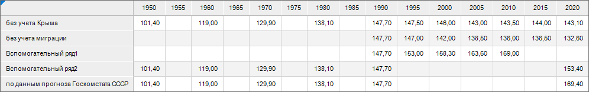

## Построение диаграммы

	После добавления источника данных[ создайте](../Diagrams.htm)
	 [линейную диаграмму
	 с абсолютными значениями](../Type_diagrams/UiDiagrams_lenear.htm) и задайте следующие настройки:

	Примечание.
	 При настройке диаграммы указаны только изменяемые параметры, к остальным
	 параметрам применяются настройки по умолчанию.

		- В окне «Исходные данные»
		 задайте настройки:

			- Установите переключатель «Из
			 среза данных».

			- Выберите срез «Демографические
			 потери: Срез 1» в раскрывающемся списке «Срез
			 данных».

			- Нажмите кнопку «ОК»:

	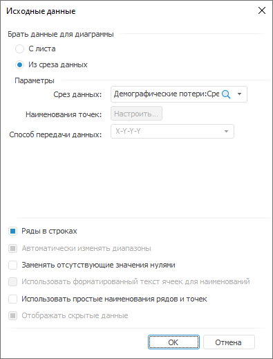

		- На вкладке «[Подписи данных](../Property_diagramm/UiDiagrams_PropertyDiagramm_Label.htm)»
		 в разделе «Формат» на
		 [боковой
		 панели](GetStarted.chm::/Interface/Interface_Description.htm#side_panel):

			- Установите флажок «Подписи
			 данных».

			- Выберите положение подписей данных «Автоматически»
			 в раскрывающемся списке «Положение».

			- Установите направление подписей данных «Повернуть
			 на 270°» в раскрывающемся списке «Направление».

			- Настройте подписи данных: размер шрифта - 10, цвет -
			 0 0 0 в формате RGB, начертание - полужирное:

	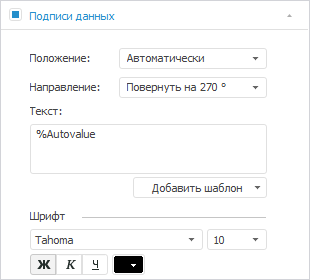

		- На вкладке «[Ряды
		 данных](../Series.htm)» в разделе «Формат»
		 на [боковой
		 панели](GetStarted.chm::/Interface/Interface_Description.htm#side_panel):

			- Выберите ряд «без учета Крыма» в раскрывающемся
			 списке «Ряд» и задайте
			 настройки:

				- убедитесь, что для поля «Порядок»
				 задано значение «1»;

				- установите флажок «Сглаживать
				 линию»;

				- настройте линию ряда: цвет - 127 148 169 в
				 формате RGB, толщина - 2.5 пт;

				- снимите флажок «Маркеры»:

	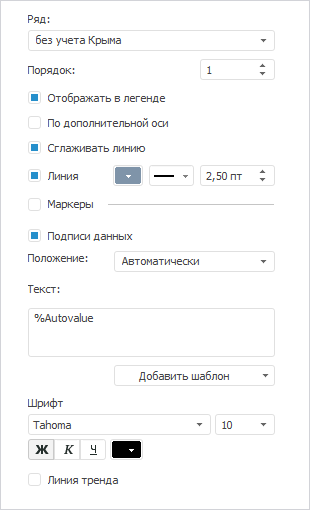

		-

			- Выберите ряд «по данным
			 прогноза Госкомстата СССР» в раскрывающемся списке
			 «Ряд» и задайте настройки:

				- задайте для поля «Порядок»
				 значение «2»;

				- установите флажок «Сглаживать
				 линию»;

				- настройте линию ряда: тип - штриховая линия,
				 цвет - 76 168 79 в формате RGB, толщина - 2.5
				 пт;

				- снимите флажки «Маркеры»
				 и «Подписи данных»:

	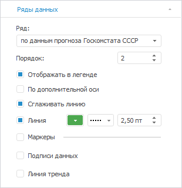

		-

			- Выберите ряд «без
			 учета миграции» в раскрывающемся списке «Ряд»
			 и задайте настройки:

				- убедитесь, что для поля «Порядок»
				 задано значение «3»;

				- установите флажок «Сглаживать
				 линию»;

				- настройте линию ряда: цвет - 203 144 101 в
				 формате RGB, толщина - 2.5 пт;

				- снимите флажки «Маркеры»
				 и «Подписи данных»:

	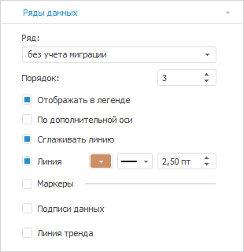

		-

			- Выберите ряд «Вспомогательный
			 ряд2» в раскрывающемся списке «Ряд»
			 и задайте настройки:

				- выберите в раскрывающемся списке «Порядок»
				 значение «4»;

				- установите флажок «Сглаживать
				 линию»;

				- снимите флажки «Отображать
				 в легенде», «Линия»,
				 «Маркеры» и «Подписи данных»:

	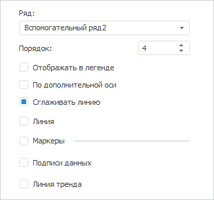

		-

			- Выберите ряд «Вспомогательный
			 ряд1» в раскрывающемся списке «Ряд»
			 и задайте настройки:

				- убедитесь, что для поля «Порядок»
				 задано значение «5»;

				- установите флажок «Сглаживать
				 линию»;

				- настройте линию ряда: тип - штриховая линия,
				 цвет - 127 148 169 в формате RGB;

				- снимите флажки «Маркеры»
				 и «Подписи данных»:

	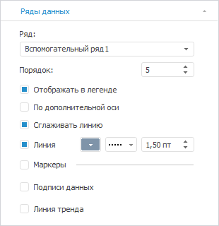

		- На вкладке «[Легенда](../Property_diagramm/UiDiagrams_PropertyDiagramm_legend.htm)»
		 в разделе «Формат» на
		 [боковой
		 панели](GetStarted.chm::/Interface/Interface_Description.htm#side_panel) выберите вариант расположения легенды
		 
		 «Легенда не отображается»:

	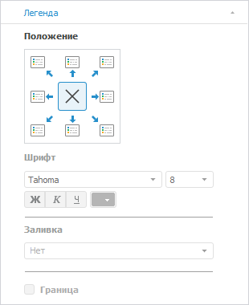

		- На вкладке «[Ось
		 категорий (Х)](../Params_diagram/UiDiagrams_Axis.htm)» в разделе «Формат»
		 на [боковой
		 панели](GetStarted.chm::/Interface/Interface_Description.htm#side_panel):

			- настройте подписи делений оси: размер шрифта -
			 12, цвет - 0 0 0 в формате RGB;

			- установите флажок «Линии
			 сетки» и настройте линии сетки: цвет - 224 224
			 224 в формате RGB:

	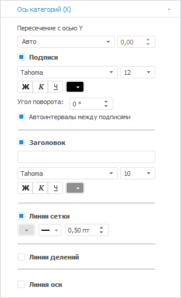

		- На вкладке «[Ось
		 категорий (Y)](../Params_diagram/UiDiagrams_Axis.htm)» в разделе «Формат»
		 на [боковой
		 панели](GetStarted.chm::/Interface/Interface_Description.htm#side_panel):

			- выберите способ расчёта максимального значения, установите
			 переключатель «Фикс.»,
			 и задайте значение «170»;

			- выберите способ расчёта минимального значения, установив
			 переключатель «Фикс.»,
			 и задайте значение «100»;

			- выберите способ расчёта интервалов, установив переключатель
			 «Фикс.», и задайте
			 значение «7»;

			- настройте подписи делений оси: размер шрифта -
			 12, цвет - 0 0 0 в формате RGB;

			- настройте линии сетки: цвет - 224 224 224 в формате
			 RGB:

	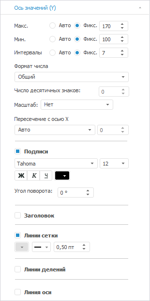

		- На вкладке «[Линии
		 уровня](../Tuning_format/Format_Axis/UiDiagrams_FormatAxis_Levels.htm)» в разделе «Формат»
		 на [боковой
		 панели](GetStarted.chm::/Interface/Interface_Description.htm#side_panel):

			- Нажмите кнопку «Добавить».

			- Убедитесь, что установлен переключатель «Константа»
			 и задано значение «147.5».

			- Настройте линию уровня: цвет - 127 148 169 в формате
			 RGB, толщина - 1.5 пт:

	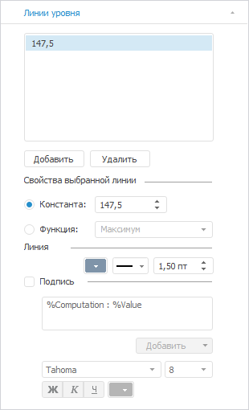

		- При необходимости настройте всплывающие подсказки на вкладке
		 «[Подсказки](../Params_diagram/Tooltips.htm)»
		 в разделе «Формат» на
		 [боковой
		 панели](GetStarted.chm::/Interface/Interface_Description.htm#side_panel).

		- Выполните настройки по оформлению диаграммы.

## Оформление диаграммы

	После построения диаграммы выполните настройки по оформлению:

	Примечание.
	 При настройке оформления диаграммы указаны только изменяемые параметры,
	 к остальным параметрам применяются настройки по умолчанию.

		- Добавьте [заголовок
		 диаграммы](../Params_diagram/UiDiagrams_titles.htm) «Демографические
		 потери России после распада СССР - 25 млн человек» и задайте
		 настройки формата: размер шрифта - 16, цвет - 0 0 0
		 в формате RGB.

		- Добавьте [подзаголовок
		 диаграммы](../Params_diagram/UiDiagrams_titles.htm) и задайте настройки формата:

			- Дважды щелкните по заголовку.

			- Добавьте подзаголовок «Население
			 РФ к концу 2021 г. могло быть более 169 млн человек, следует
			 из данных прогноза Госкомстата от 1990 г.».

			- Выделите текст подзаголовка и выполните команду «Формат» контекстного меню.

			- В окне «Формат»
			 задайте настройки: размер шрифта - 12, цвет - 0
			 0 0 в формате RGB.

		- Создайте [коридоры
		 диаграммы](../UiDiagrams_corridors.htm) для отображения разветвление ряда по разным вариантам
		 оценки численности:

			- [Добавьте
			 первый коридор](../UiDiagrams_corridors.htm#add_coridor) и задайте его [настройки](../UiDiagrams_CorridorsProperty.htm):

				- Выберите ряд «по
				 данным прогноза Госкомстата СССР» в раскрывающемся
				 списке «Ряд 1»;

				- Выберите ряд «Вспомогательный
				 ряд2» в раскрывающемся списке «Ряд
				 2»;

				- Задайте настройки заливки коридора: тип - сплошная
				 заливка, цвет - 237 191 185 в формате RGB, прозрачность -
				 46.

			- [Добавьте
			 второй коридор](../UiDiagrams_corridors.htm#add_coridor) и задайте его [настройки](../UiDiagrams_CorridorsProperty.htm):

				- Выберите ряд «Вспомогательный
				 ряд2» в раскрывающемся списке «Ряд
				 1»;

				- Выберите ряд «без
				 учета Крыма» в раскрывающемся списке «Ряд
				 2»;

				- Задайте настройки заливки коридора: тип - сплошная
				 заливка, цвет - 237 166 140 в формате RGB, прозрачность -
				 46.

		- Выполните [настройку
		 линии уровня](../Tuning_format/Format_Axis/LevelLines_Property.htm#limit_height) для оси Y для ограничения линии уровня смертности.
		 Для этого в группе параметров «Ограничить
		 длину» установите флажки «От»
		 и «До», задав в соответствующих
		 редакторах значения крайних точек линии уровня «1990»
		 и «2020».

		- Удалите с диаграммы подписи данных после значения «147,7» с помощью команды контекстного
		 меню «Удалить подпись данных».

		- Добавьте [текстовый
		 блок](uireport.chm::/Desktop/Objects/UiReport_Objects_formatted_text.htm) для добавления комментариев к историческим
		 вехам. Для этого выполните следующие действия:

			- В текстовом блоке введите текст «1-ое
			 "эхо войны" урбанизация».

			- Выделите текстовый блок и выполните команду «Свойства
			 объекта» контекстного меню.

			- В окне «Свойства объекта»:

				- задайте в поле «Угол
				 поворота» значение «270°»;

				- установите флажок «Прозрачность».

			- Разместите блок на диаграмме.

	Аналогично выполните вставку и настройку
	 для текстовых блоков «2-ое "эхо
	 войны"экономический кризис и падение уровня жизни постиндустривальный
	 демограф. переход, западная культура» и «эхо
	 90-х пандемия COVID-19».

		- Добавьте [текстовые
		 блоки](uireport.chm::/Desktop/Objects/UiReport_Objects_formatted_text.htm) на диаграмму для пояснения. Для этого
		 выполните следующие действия:

			- В текстовом блоке введите текст «16
			 млн спад рождаемости».

			- Выделите часть комментария и выполните команду «Формат» контекстного меню.

			- В окне «Формат»
			 задайте значение размера шрифта «11». На вкладке «Отступы и интервалы» задайте
			 выравнивание «По правому
			 краю».

	Для второй части комментария повторите
	 действия и задайте значение размера шрифта «10».

			- Выделите текстовый блок и выполните команду «Свойства
			 объекта» контекстного меню.

			- В окне «Свойства объекта»
			 установите флажок «Прозрачность».

			- Разместите блок на диаграмме.

	Аналогично выполните вставку и настройку
	 для текстового блока «10 млн рост
	 смертности».

		- Постройте с помощью [линий](uireport.chm::/Desktop/Objects/AutoObjects/UiReport_AutoObject.htm)
		 квадратную скобку.

		- Около скобки расположите:

			- текстовый блок с текстом
			 «Численность населения России,
			 на конец 2021 г.»:

				- Выделите текст и выполните команду «Формат»
				 контекстного меню.

				- В окне «Формат»
				 задайте значение размера шрифта «8».

				- Выделите текстовый блок и выполните команду «Свойства объекта» контекстного
				 меню.

				- В окне «Свойства
				 объекта» установите флажок «Прозрачность».

				- Разместите блок на диаграмме.

	Аналогично выполните вставку и настройку
	 для текстовых блоков «По данным
	 прогноза Госкомстата СССР», «*171,9
	 млн чел - с учетом Крыма», «демографические
	 потери населения», «*1 млн
	 чел - от пандемии COVID-19», «фактическим
	 данным Росстата (с учетом Крыма)», «без
	 учета Крыма», «без учета
	 миграции (+10,5 млн чел)», «Примечания:
	 1) потери населения - разница между потенциальной численностью населения
	 России к концу 2021 г. (по данным прогноза Роскомстата СССР от 1990
	 г.) и фактической; 2) оценка консервативная: без учета повышенной
	 миграции в период с 1990 г. потери населения значительно выше 25 млн
	 человек.»;

			- [фигуру](uireport.chm::/Desktop/Objects/AutoObjects/UiReport_AutoObject.htm)
			 «Прямоугольник» с
			 текстом «169,4 млн»:

				- Выделите фигуру и выполните команду «Формат»
				 контекстного меню.

				- В окне «Формат»
				 задайте настройки: размера шрифта - 12, начертание
				 - жирный, цвет текста - 255 255 255 в формате RGB,
				 цвет заливки фона - 76 168 79 в формате RGB, тип линии
				 - без линии.

				- Разместите блок на диаграмме.

	Аналогично выполните вставку и настройку
	 для блоков с текстом «-26,3 млн»,
	 «143,1 млн», «132,6
	 млн», задав цвет заливки фона - 76 168 79,127 148 169,203 144
	 101 в формате RGB;

			- [фигуру](uireport.chm::/Desktop/Objects/AutoObjects/UiReport_AutoObject.htm)
			 «Прямоугольник» с
			 текстом «145,6 млн»:

				- Выделите фигуру и выполните команду «Формат»
				 контекстного меню.

				- В окне «Формат»
				 задайте настройки: размера шрифта - 12, начертание
				 - жирный, цвет текста -  27 148 169 в формате
				 RGB, цвет заливки фона - 255 255 255 в формате RGB, тип
				 линии - без линии.

				- Разместите блок на диаграмме.

	В результате выполнения действий будет построена представленная
	 диаграмма.

См. также:

[Примеры
 диаграмм](Diagram_examples.htm)

		Справочная
		 система на версию 10.9
		 от 18/08/2025,
		 © ООО «ФОРСАЙТ»,
