# Диаграмма «Эффективность исполнительного производства»

Диаграмма «Эффективность исполнительного производства»
-

# Диаграмма «Эффективность исполнительного производства»

	Пример диаграммы, отображающей эффективность исполнительного производства:

	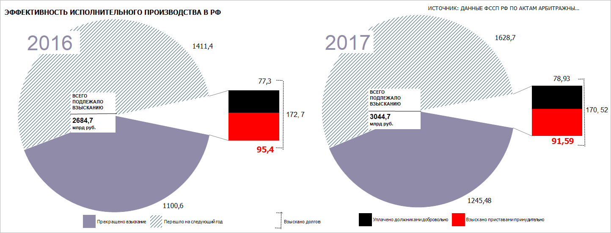

## Подготовка источников данных

	В качестве источника данных для построения диаграммы потребуется
	 [стандартный
	 куб](UiNavObj.chm::/Cube/CreateCube/Master_Standart/UiMd_Cube_CreateCube_Master_Standart.htm), содержащий:

		- календарный справочник;

		- справочник НСИ с перечнем категорий взыскания;

		- справочник НСИ с данными о взыскании долгов.

	Срезы данных куба «Эффективность
	 исполнительного производства» в виде таблицы в зависимости
	 от выбранного года имеют вид:

		- Для диаграммы «2016»:

	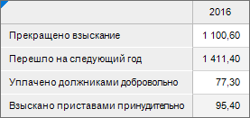

		- Для диаграммы «2017»:

	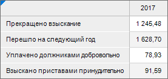

## Построение диаграммы «2016»

	После добавления источника данных [создайте](../Diagrams.htm)
	 [вторичную
	 гистограмму](../Type_diagrams/UiDiagrams_secondary_histogram.htm) и задайте настройки:

	Примечание.
	 При настройке диаграммы указаны только изменяемые параметры, к остальным
	 параметрам применяются настройки по умолчанию.

		- В окне «Исходные данные»
		 задайте настройки:

			- Установите переключатель «Из
			 среза данных».

			- Выберите срез «Эффективность
			 исполнительного производства: Срез 1» в раскрывающемся
			 списке «Срез данных».

			- Нажмите кнопку «ОК»:

	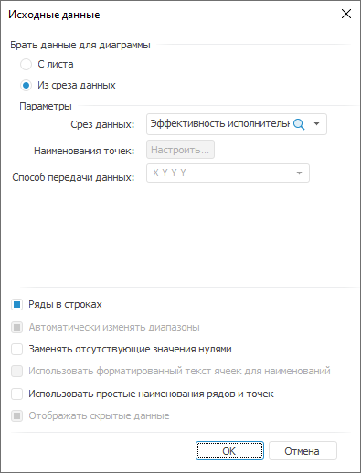

		- [Настройте
		 ](../Params_diagram/UiDiagrams_secondary_diagram.htm)расположение рядов на вторичной гистограмме на вкладке «[Вторичная
		 диаграмма](../Params_diagram/UiDiagrams_secondary_diagram.htm)» окна «Параметры
		 диаграммы»:

			- Задайте способ отображения «Обе
			 диаграммы».

			- Задайте тип разделения «Пользовательский».

			- Нажмите кнопку «Настроить»
			 в настройках разделения диаграмм. Откроется окно «Состав
			 диаграмм», в котором укажите ряды вторичной диаграммы
			 «Уплачено должниками добровольно»
			 и «Взыскано приставами принудительно».

			- Укажите размеры: вторичная диаграмма - 25, ширина зазоров
			 -18:

	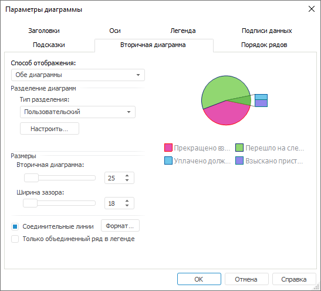

		- На вкладке «[Подписи данных](../Property_diagramm/UiDiagrams_PropertyDiagramm_Label.htm)»
		 в разделе «Формат» на
		 [боковой
		 панели](GetStarted.chm::/Interface/Interface_Description.htm#side_panel):

			- Установите флажок «Подписи
			 данных».

			- Выберите положение подписей данных «У
			 вершины, снаружи» в раскрывающемся списке «Положение».

			- Введите в поле «Текст»
			 значение «%Value».

			- Настройте подписи данных: размер шрифта - 12, цвет -
			 0 0 0 в формате RGB:

	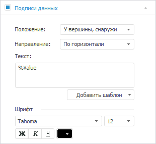

		- На вкладке «[Ряды
		 данных](../Series.htm)» в разделе «Формат»
		 на [боковой
		 панели](GetStarted.chm::/Interface/Interface_Description.htm#side_panel):

		-

			- Выберите ряд «Прекращено
			 взыскание» в раскрывающемся списке «Ряд»
			 и задайте настройки:

				- задайте заливку ряда: тип - сплошная заливка, цвет
				 - 144 139 168 в формате RGB;

				- настройте границу ряда: цвет - 144 139 168
				 в формате RGB, толщина - 0.25 пт:

	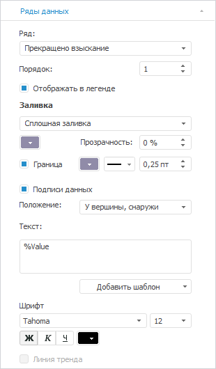

		-

			- Выберите ряд «Перешло
			 на следующий год» в раскрывающемся списке «Ряд»
			 и задайте настройки:

		-

			-

				- настройте границу ряда: цвет - 255 255 255
				 в формате RGB, толщина - 0.25 пт:

	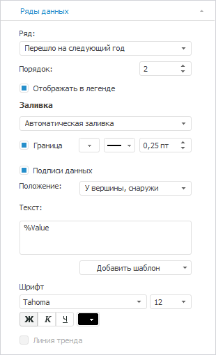

		-

			- Выберите ряд «Уплачено
			 должниками добровольно» в раскрывающемся списке «Ряд» и задайте настройки:

				- снимите флажок «Отображать
				 в легенде»;

				- задайте заливку ряда: тип - сплошная заливка, цвет
				 - 0 0 0 в формате RGB;

				- настройте границу ряда: цвет - 0 0 0 в формате
				 RGB, толщина - 0.25 пт:

	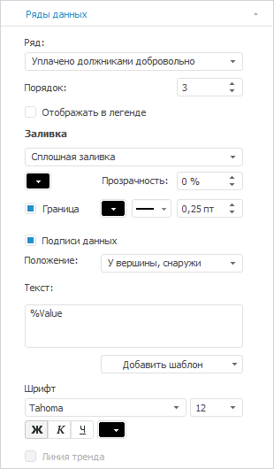

		-

			- Выберите ряд «Взыскано
			 приставами принудительно» в раскрывающемся списке «Ряд» и задайте настройки:

		-

			-

				- снимите флажок «Отображать
				 в легенде»;

				- задайте заливку ряда: тип - сплошная заливка, цвет
				 - 255 0 0 в формате RGB;

				- настройте границу ряда: цвет - 255 0 0 в формате
				 RGB, толщина - 0.25 пт:

				- настройте подписи данных: начертание - полужирный,
				 цвет - 255 0 0 в формате RGB:

	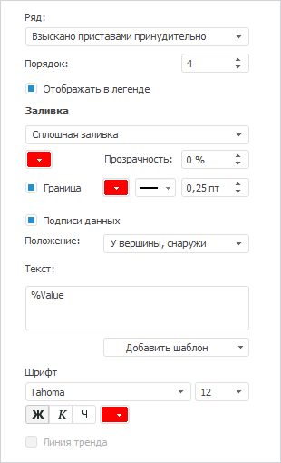

		- На вкладке «[Легенда](../Property_diagramm/UiDiagrams_PropertyDiagramm_legend.htm)»
		 в разделе «Формат» на
		 [боковой
		 панели](GetStarted.chm::/Interface/Interface_Description.htm#side_panel) задайте настройки шрифта легенды: размер -
		 8, цвет - 0 0 0 в формате RGB:

	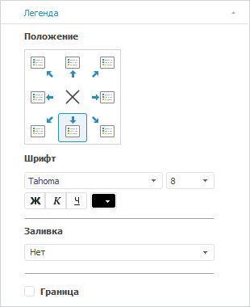

		- При необходимости настройте всплывающие подсказки на вкладке
		 «[Подсказки](../Params_diagram/Tooltips.htm)»
		 в разделе «Формат» на
		 [боковой
		 панели](GetStarted.chm::/Interface/Interface_Description.htm#side_panel).

		- Выполните настройки по [оформлению
		 диаграммы](Example_executory_process_efficiency.htm#decoration).

## Построение диаграммы «2017»

	После добавления источника данных [создайте](../Diagrams.htm)
	 [вторичную
	 гистограмму](../Type_diagrams/UiDiagrams_secondary_histogram.htm) и задайте настройки:

	Примечание.
	 При настройке диаграммы указаны только изменяемые параметры, к остальным
	 параметрам применяются настройки по умолчанию.

		- В окне «Исходные данные»
		 задайте настройки:

			- Установите переключатель «Из
			 среза данных».

			- Выберите срез «Эффективность
			 исполнительного производства: Срез 2» в раскрывающемся
			 списке «Срез данных».

			- Нажмите кнопку «ОК»:

	

		- [Настройте
		 ](../Params_diagram/UiDiagrams_secondary_diagram.htm)расположение рядов на вторичной гистограмме на вкладке «[Вторичная
		 диаграмма](../Params_diagram/UiDiagrams_secondary_diagram.htm)» окна «Параметры
		 диаграммы»:

			- Задайте способ отображения «Обе
			 диаграммы».

			- Нажмите кнопку «Настроить»
			 в настройках разделения диаграмм. Откроется окно «Состав
			 диаграмм», в котором укажите ряды вторичной диаграммы
			 «Уплачено должниками добровольно»
			 и «Взыскано приставами принудительно».

			- Укажите размеры: вторичная диаграмма - 25, ширина зазоров
			 -18:

	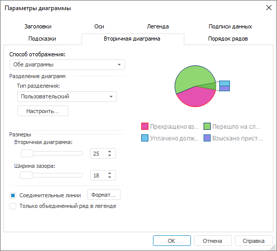

		- На вкладке «[Подписи данных](../Property_diagramm/UiDiagrams_PropertyDiagramm_Label.htm)»
		 в разделе «Формат» на
		 [боковой
		 панели](GetStarted.chm::/Interface/Interface_Description.htm#side_panel):

			- Установите флажок «Подписи
			 данных».

			- Выберите положение подписей данных «У
			 вершины, снаружи» в раскрывающемся списке «Положение».

			- Введите в поле «Текст»
			 значение «%Value».

			- Настройте подписи данных: размер шрифта - 12, цвет -
			 0 0 0 в формате RGB:

	

		- На вкладке «[Ряды
		 данных](../Series.htm)» в разделе «Формат»
		 на [боковой
		 панели](GetStarted.chm::/Interface/Interface_Description.htm#side_panel):

		-

			- Выберите ряд «Прекращено
			 взыскание» в раскрывающемся списке «Ряд»
			 и задайте настройки:

				- снимите флажок «Отображать
				 в легенде»;

				- задайте заливку ряда: тип - сплошная заливка, цвет
				 - 144 139 168 в формате RGB;

				- настройте границу ряда: цвет - 144 139 168
				 в формате RGB, толщина - 0.25 пт:

	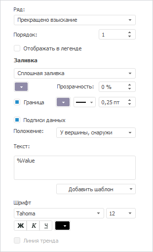

		-

			- Выберите ряд «Перешло
			 на следующий год» в раскрывающемся списке «Ряд»
			 и задайте настройки:

		-

			-

				- снимите флажок «Отображать
				 в легенде»;

				- настройте границу ряда: цвет - 255 255 255
				 в формате RGB, толщина - 0.25 пт:

	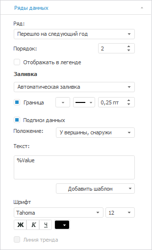

		-

			- Выберите ряд «Уплачено
			 должниками добровольно» в раскрывающемся списке «Ряд» и задайте настройки:

				- задайте заливку ряда: тип - сплошная заливка, цвет
				 - 0 0 0 в формате RGB;

				- настройте границу ряда: цвет - 0 0 0 в формате
				 RGB, толщина - 0.25 пт:

	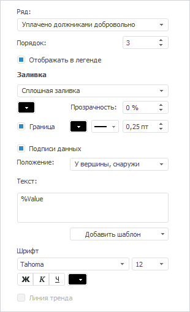

		-

			- Выберите ряд «Взыскано
			 приставами принудительно» в раскрывающемся списке «Ряд» и задайте настройки:

		-

			-

				- задайте заливку ряда: тип - сплошная заливка, цвет
				 - 255 0 0 в формате RGB;

				- настройте границу ряда: цвет - 255 0 0 в формате
				 RGB, толщина - 0.25 пт:

				- настройте подписи данных: начертание - полужирный,
				 цвет - 255 0 0 в формате RGB:

	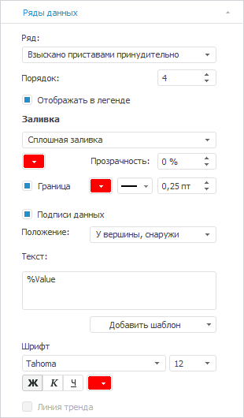

		- На вкладке «[Легенда](../Property_diagramm/UiDiagrams_PropertyDiagramm_legend.htm)»
		 в разделе «Формат» на
		 [боковой
		 панели](GetStarted.chm::/Interface/Interface_Description.htm#side_panel) задайте настройки шрифта легенды: размер -
		 8, цвет - 0 0 0 в формате RGB:

	

		- При необходимости настройте всплывающие подсказки на вкладке
		 «[Подсказки](../Params_diagram/Tooltips.htm)»
		 в разделе «Формат» на
		 [боковой
		 панели](GetStarted.chm::/Interface/Interface_Description.htm#side_panel).

		- Выполните настройки по [оформлению
		 диаграммы](Example_executory_process_efficiency.htm#decoration).

## Оформление диаграмм

	После построения диаграмм выполните настройки по оформлению:

	Примечание.
	 При настройке оформления диаграмм указаны только изменяемые параметры,
	 к остальным параметрам применяются настройки по умолчанию.

		- Настройте [заливку рядов](../Series.htm), выполнив
		 команду контекстного меню «Формат
		 ряда данных». В окне «Формат
		 ряда данных» задайте:

			- для ряда «Перешло на следующий год»: тип заливки - со
			 штриховкой, цвет заливки - 255 255 255 в формате RGB, цвет
			 штриховки - 41 83 104 в формате RGB, штриховка - //////////////.

			- для объединенного ряда: тип заливки - сплошная, цвет
			 заливки - 255 255 255 в формате RGB, цвет линии границы -
			 255 255 255 в формате RGB.

		- Для указания года на диаграмме:

			- Добавьте [текстовый
			 блок](uireport.chm::/Desktop/Objects/UiReport_Objects_formatted_text.htm), указав значение
			 «2016».

			- Перейдите в режим редактирования текста и выполните
			 команду контекстного меню «Формат»
			 фигуры. В окне «Формат»
			 на вкладке «Шрифт»
			 укажите: цвет шрифта - 144 139 168 в формате RGB, размер
			 - 36.

			- Скопируйте и вставьте текстовый блок с настройками,
			 изменив в нём значение на «2017».

		- Для указания суммарных долгов взыскания:

			- Добавьте [текстовый
			 блок](uireport.chm::/Desktop/Objects/UiReport_Objects_formatted_text.htm), указав значение
			 «ВСЕГО ПОДЛЕЖАЛО ВЗЫСКАНИЮ 2684,7 млрд руб.».

			- Перейдите в режим редактирования
			 текста и выполните команду контекстного меню «Формат»
			 фигуры. В окне «Формат»
			 на вкладке «Шрифт»
			 укажите:

				- для всего текста: цвет шрифта - 0 0 0 в формате
				 RGB, начертание - полужирный;

				- для значения «2684,7»:
				 размер - 12.

			- Скопируйте и вставьте
			 текстовый блок с настройками, изменив в нём значение с «2684,7» на «3044,7».

			- Для разделение блоков
			 используйте [линии](uireport.chm::/Desktop/Objects/AutoObjects/UiReport_AutoObject.htm).

		- Для указания суммы взысканных долгов:

			- Добавьте [текстовый
			 блок](uireport.chm::/Desktop/Objects/UiReport_Objects_formatted_text.htm), указав значение
			 «172,7».

			- Перейдите в режим редактирования
			 текста и выполните команду контекстного меню «Формат»
			 фигуры. В окне «Формат»
			 на вкладке «Шрифт»
			 укажите: цвет шрифта - 0 0 0 в формате RGB, размер -
			 12.

			- Скопируйте и вставьте
			 текстовый блок с настройками, изменив в нём значение на «170,52».

			- Для объединения блоков
			 используйте [линии](uireport.chm::/Desktop/Objects/AutoObjects/UiReport_AutoObject.htm),
			 задав ее настройки. Выполните команду контекстного меню «Формат» фигуры. Для этого
			 в окне «Формат объектов»
			 на вкладке «Линии»
			 укажите: стиль - штриховая.

		- Для добавления описания о сумме взысканных долгов в легенду:

			- Добавьте [текстовый
			 блок](uireport.chm::/Desktop/Objects/UiReport_Objects_formatted_text.htm), указав значение
			 «Взыскано долгов».

			- Перейдите в режим редактирования
			 текста и выполните команду контекстного меню «Формат»
			 фигуры. В окне «Формат»
			 на вкладке «Шрифт»
			 укажите: цвет шрифта - 0 0 0 в формате RGB.

			- Укажите схематично
			 расшифровку с помощью [линии](uireport.chm::/Desktop/Objects/AutoObjects/UiReport_AutoObject.htm),
			 задав ее настройки. Выполните команду контекстного меню «Формат» фигуры. Для этого
			 в окне «Формат объектов»
			 на вкладке «Линии»
			 укажите: стиль - штриховая.

		- Добавьте [заголовки
		 диаграммы](../Params_diagram/UiDiagrams_titles.htm):

			- Для диаграммы «2016» укажите «ЭФФЕКТИВНОСТЬ
			 ИСПОЛНИТЕЛЬНОГО ПРОИЗВОДСТВА В РФ» и задайте настройки
			 формата: размер шрифта - 12, цвет - 0 0 0 в формате
			 RGB, начертание - жирный.

			- Для диаграммы «2017» укажите «ИСТОЧНИК:
			 ДАННЫЕ ФССП РФ ПО АКТАМ АРБИТРАЖНЫХ СУДОВ» и задайте
			 настройки формата: цвет - 0 0 0 в формате RGB.

	В результате выполнения действий будет построена представленная
	 диаграмма.

См. также:

[Примеры
 диаграмм](Diagram_examples.htm)

		Справочная
		 система на версию 10.9
		 от 18/08/2025,
		 © ООО «ФОРСАЙТ»,
