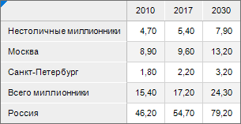
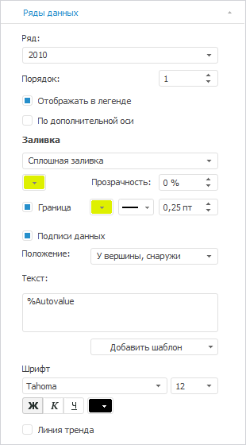
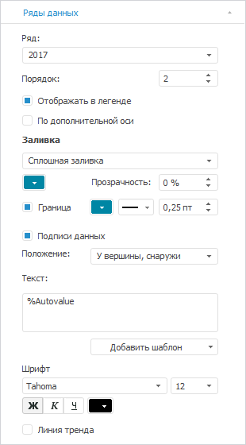
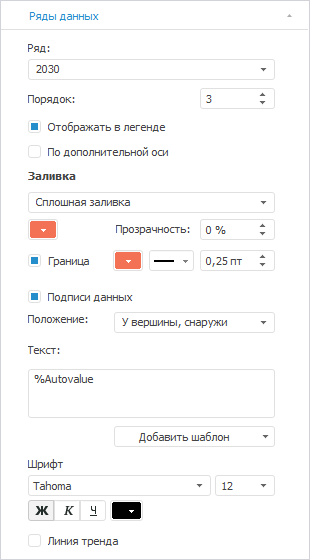
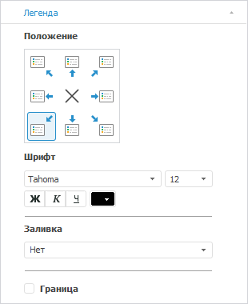
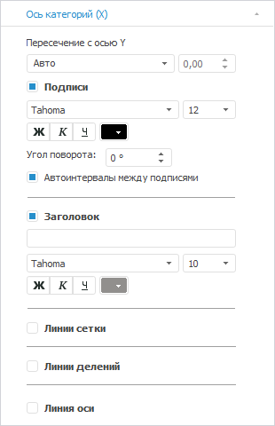
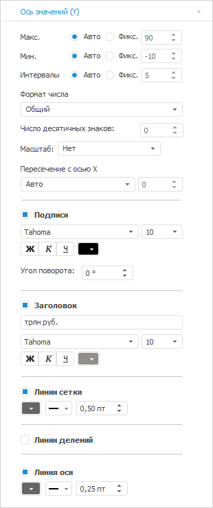
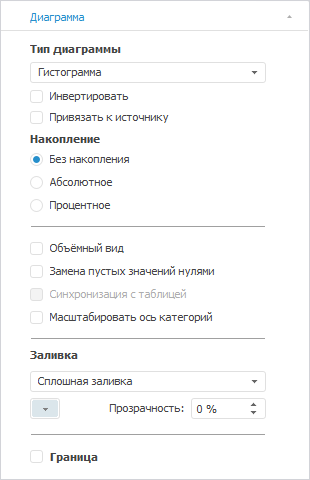

# Диаграмма «Прогноз реального валового продукта»

Диаграмма «Прогноз реального валового продукта»
-

# Диаграмма «Прогноз реального валового продукта»

	Пример диаграммы, отображающей прогноз реального валового продукта:

	

## Подготовка источников данных

	В качестве источника данных для построения диаграммы потребуется
	 [стандартный
	 куб](UiNavObj.chm::/Cube/CreateCube/Master_Standart/UiMd_Cube_CreateCube_Master_Standart.htm), содержащий:

		- календарный справочник;

		- справочник НСИ с перечнем сравниваемых городов-миллионников
		 РФ;

		- справочник НСИ с данными о динамике величины реального валового
		 продукта в разных городах-миллионниках РФ.

	Срез данных куба «Прогноз реального
	 валового продукта» в виде таблицы имеет вид:

	

## Построение диаграммы

	После добавления источника данных[ создайте](../Diagrams.htm)
	 [гистограмму с абсолютными
	 значениями](../Type_diagrams/UiDiagrams_Bar.htm) и задайте следующие настройки:

	Примечание.
	 При настройке диаграммы указаны только изменяемые параметры, к остальным
	 параметрам применяются настройки по умолчанию.

		- В окне «Исходные данные»
		 задайте настройки:

			- Установите переключатель «Из
			 среза данных».

			- Выберите срез «Прогноз
			 реального валового продукта: Срез 1» в раскрывающемся
			 списке «Срез данных».

			- Снимите флажок «Ряды
			 в строках».

			- Нажмите кнопку «ОК»:

	

		- На вкладке «[Подписи данных](../Property_diagramm/UiDiagrams_PropertyDiagramm_Label.htm)»
		 в разделе «Формат» на
		 [боковой
		 панели](GetStarted.chm::/Interface/Interface_Description.htm#side_panel):

			- Установите флажок «Подписи
			 данных».

			- Выберите положение подписей данных «У
			 вершины, снаружи» в раскрывающемся списке «Положение».

			- Настройте подписи данных: размер шрифта - 12, цвет -
			 0 0 0 в формате RGB, начертание - полужирное:

	

		- На вкладке «[Ряды
		 данных](../Series.htm)» в разделе «Формат»
		 на [боковой
		 панели](GetStarted.chm::/Interface/Interface_Description.htm#side_panel):

			- Выберите ряд «2010» в раскрывающемся
			 списке «Ряд» и задайте
			 настройки:

				- настройте заливку ряда: тип - сплошная линия,
				 цвет - 222 240 0 в формате RGB;

				- настройте границы: цвет - 222 240 0 в формате
				 RGB, толщина - 0.25 пт:

	

			- Выберите ряд «2017»
			 в раскрывающемся списке «Ряд»
			 и задайте настройки:

				- настройте заливку ряда: тип - сплошная линия,
				 цвет - 0 134 164 в формате RGB;

				- настройте границы: цвет - 0 134 164 в формате
				 RGB, толщина - 0.25 пт:

	

			- Выберите ряд «2030»
			 в раскрывающемся списке «Ряд»
			 и задайте настройки:

				- настройте заливку ряда: тип - сплошная линия,
				 цвет - 243 114 85 в формате RGB;

				- настройте границы:цвет - 243 114 85 в формате
				 RGB, толщина - 0.25 пт:

	

		- На вкладке «[Легенда](../Property_diagramm/UiDiagrams_PropertyDiagramm_legend.htm)»
		 в разделе «Формат» на
		 [боковой
		 панели](GetStarted.chm::/Interface/Interface_Description.htm#side_panel):

			- выберите вариант расположения легенды 
			 «В левом нижнему углу»;

			- задайте настройки шрифта легенды: размер - 12,
			 цвет - 0 0 0 в формате RGB:

	

		- На вкладке «[Ось
		 категорий (Х)](../Params_diagram/UiDiagrams_Axis.htm)» в разделе «Формат»
		 на [боковой
		 панели](GetStarted.chm::/Interface/Interface_Description.htm#side_panel) настройте подписи делений оси: размер
		 шрифта - 12, цвет - 0 0 0 в формате RGB:

	

		- На вкладке «[Ось
		 категорий (Y)](../Params_diagram/UiDiagrams_Axis.htm)» в разделе «Формат»
		 на [боковой
		 панели](GetStarted.chm::/Interface/Interface_Description.htm#side_panel):

			- настройте подписи делений оси: размер шрифта -
			 10, цвет - 0 0 0 в формате RGB;

			- настройте заголовок: размер шрифта - 10, цвет -
			 145 143 141 в формате RGB. В поле «Заголовок»
			 укажите «трлн руб.»;

			- настройте линии сетки: цвет - 102 102 102 в формате
			 RGB;

			- установите флажок «Линия
			 оси» и задайте настройки: цвет - 102 102 102 в
			 формате RGB:

	

		- На вкладке «[Диаграмма](../Params_diagram/UiDiagrams_params_diagram.htm)»
		 в разделе «Формат» на
		 [боковой
		 панели](GetStarted.chm::/Interface/Interface_Description.htm#side_panel) задайте настройки оформления [области
		 диаграммы](../Tuning_format/UiDiagrams_tuning_area_digramm.htm): цвет заливки - 219 230 235 в формате RGB:

	

		- При необходимости настройте всплывающие подсказки на вкладке
		 «[Подсказки](../Params_diagram/Tooltips.htm)»
		 в разделе «Формат» на
		 [боковой
		 панели](GetStarted.chm::/Interface/Interface_Description.htm#side_panel).

		- Выполните настройки по оформлению диаграммы.

## Оформление диаграммы

	После построения диаграммы выполните настройки по оформлению:

	Примечание.
	 При настройке оформления диаграммы указаны только изменяемые параметры,
	 к остальным параметрам применяются настройки по умолчанию.

		- Добавьте [заголовок
		 диаграммы](../Params_diagram/UiDiagrams_titles.htm) «ПРОГНОЗ РЕАЛЬНОГО
		 ВАЛОВОГО ПРОДУКТА ДО 2030 ГОДА» и задайте настройки формата:
		 размер шрифта - 16, цвет - 0 0 0 в формате RGB, .

		- Добавьте [подзаголовок
		 диаграммы](../Params_diagram/UiDiagrams_titles.htm) и задайте настройки формата:

			- Дважды щелкните по заголовку.

			- Добавьте подзаголовок «*
			 значения указаны в реальных ценах 2010 г.;», «* прогноз базируется на сценарии
			 МИНЭКа до 2030 г.».

			- Выделите текст подзаголовка и выполните команду «Формат» контекстного меню.

			- В открывшемся окне задайте настройки: размер шрифта -
			 12, цвет - 0 0 0 в формате RGB.

		- Добавьте [фигуру](uireport.chm::/Desktop/Objects/AutoObjects/UiReport_AutoObject.htm)
		 «Линия» тип «Стрелка»
		 для отображения прогнозируемого прироста:

			-  Задайте настройки
			 в окне «Формат объектов»:

				- на вкладке «Линии»:
				 цвет - 1 71 92 в формате RGB, толщина - 0.25
				 пт;

				- на вкладке «Шрифт»:
				 размер шрифта - 16, начертание - жирный, цвет шрифта -
				 1 71 92 в формате RGB;

				- на вкладке «Текстовый
				 блок»: выравнивание по вертикали - по верхнему
				 краю;

			- В текстовом блоке стрелки укажите значения прироста
			 «+3,2%», «+2,2%»,
			 «+3,1%», «+2,7%»
			 и «+2,9%» соответственно.

		- Добавьте [фигуру](uireport.chm::/Desktop/Objects/AutoObjects/UiReport_AutoObject.htm)
		 «Линия» тип «Прямая
		 линиия» для разделения агрегированного показателя от частных.
		 Задайте настройки в окне «Формат
		 объектов» на вкладке «Линии»:
		 толщина - 2 пт;

		- Добавьте [текстовый
		 блок](uireport.chm::/Desktop/Objects/UiReport_Objects_formatted_text.htm) рядом под диаграммой и блоком для отображения
		 среднего прогнозируемого прироста:

			- Укажите значение «+
			 3,1% Прогнозируемый среднегодовой прирост, 2018 - 2030 гг.»
			 и задайте настройки формата текста: размер шрифта - 12.

			- Для текста «+3,1%»
			 задайте настройки формата: размер шрифта - 14, цвет -
			 0 134 164 в формате RGB, начертание - полужирный.

	В результате выполнения действий будет построена представленная
	 диаграмма.

См. также:

[Примеры
 диаграмм](Diagram_examples.htm)

		Справочная
		 система на версию 10.9
		 от 18/08/2025,
		 © ООО «ФОРСАЙТ»,
