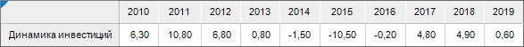
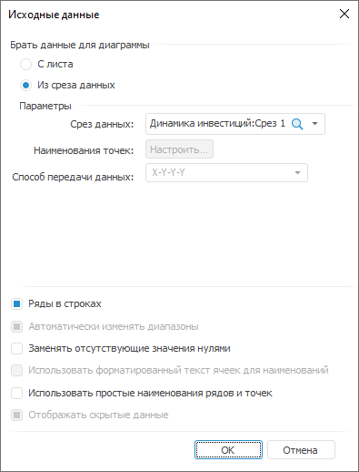
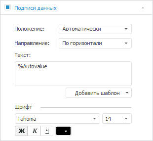
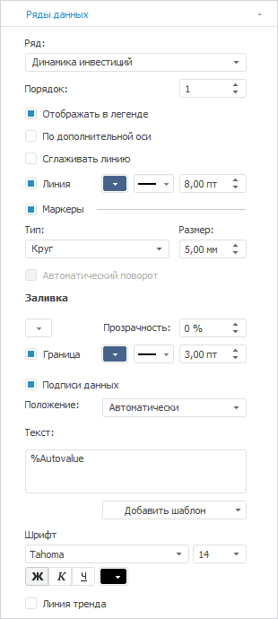
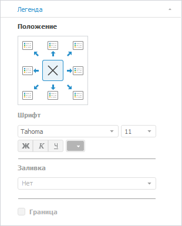
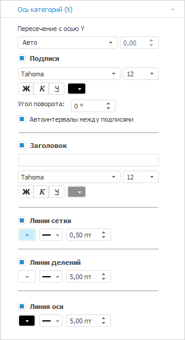
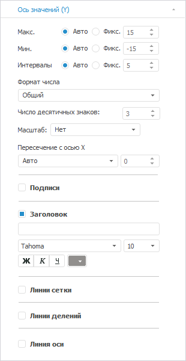
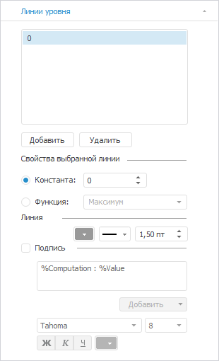

# Диаграмма «Динамика инвестиций»

Диаграмма «Динамика инвестиций»
-

# Диаграмма «Динамика инвестиций»

	Пример диаграммы, отображающей динамику инвестиций:

	

## Подготовка источников данных

	В качестве источника данных для построения диаграммы потребуется
	 [стандартный
	 куб](UiNavObj.chm::/Cube/CreateCube/Master_Standart/UiMd_Cube_CreateCube_Master_Standart.htm), содержащий:

		- календарный справочник;

		- справочник НСИ с данными об инвестициях.

	Срез данных куба «Динамика инвестиций»
	 в виде таблицы имеет вид:

	

## Построение диаграммы

	После добавления источника данных[ создайте](../Diagrams.htm)
	 [линейную диаграмму
	 с абсолютными значениями](../Type_diagrams/UiDiagrams_lenear.htm) и задайте следующие настройки:

	Примечание.
	 При настройке диаграммы указаны только изменяемые параметры, к остальным
	 параметрам применяются настройки по умолчанию.

		- В окне «Исходные данные»
		 задайте настройки:

			- Установите переключатель «Из
			 среза данных».

			- Выберите срез «Динамика
			 инвестиций: Срез 1» в раскрывающемся списке «Срез данных».

			- Нажмите кнопку «ОК»:

	

		- На вкладке «[Подписи данных](../Property_diagramm/UiDiagrams_PropertyDiagramm_Label.htm)»
		 в разделе «Формат» на
		 [боковой
		 панели](GetStarted.chm::/Interface/Interface_Description.htm#side_panel):

			- Установите флажок «Подписи
			 данных».

			- Настройте шрифт подписей данных: размер шрифта -
			 14, начертание - полужирное, цвет - 0 0 0 в формате
			 RGB:

	

		- На вкладке «[Ряды
		 данных](../Series.htm)» в разделе «Формат»
		 на [боковой
		 панели](GetStarted.chm::/Interface/Interface_Description.htm#side_panel):

			- Выберите ряд «Динамика
			 инвестиций» в раскрывающемся списке «Ряд».

			- Задайте следующие настройки:

				- линия ряда: цвет - 71 99 139 в формате RGB,
				 толщина - 8 пт;

				- маркеры: размер - 5 мм, цвет границы - 71 99
				 139 в формате RGB, толщина границы - 3 пт:

	

		- На вкладке «[Легенда](../Property_diagramm/UiDiagrams_PropertyDiagramm_legend.htm)»
		 в разделе «Формат» на
		 [боковой
		 панели](GetStarted.chm::/Interface/Interface_Description.htm#side_panel) выберите вариант расположения легенды
		 
		 «Легенда не отображается»:

	

		- На вкладке «[Ось
		 категорий (Х)](../Params_diagram/UiDiagrams_Axis.htm)» в разделе «Формат»
		 на [боковой
		 панели](GetStarted.chm::/Interface/Interface_Description.htm#side_panel):

			- настройте подписи делений оси: размер шрифта -
			 12, цвет - 0 0 0 в формате RGB;

			- установите флажок «Линии
			 сетки» и настройте линии сетки: цвет - 199 238
			 255 в формате RGB;

			- установите флажок «Линии
			 делений» и настройте линии делений: цвет - 255
			 255 255 в формате RGB, толщина - 5 пт;

			- установите флажок «Линия
			 оси» и настройте линию оси: цвет - 0 0 0 в формате
			 RGB, толщина - 5 пт:

	

		- На вкладке «[Ось
		 категорий (Y)](../Params_diagram/UiDiagrams_Axis.htm)» в разделе «Формат»
		 на [боковой
		 панели](GetStarted.chm::/Interface/Interface_Description.htm#side_panel) снимите флажки «Подписи»
		 и «Линии сетки»:

	

		- На вкладке «[Линии
		 уровня](../Tuning_format/Format_Axis/UiDiagrams_FormatAxis_Levels.htm)» в разделе «Формат»
		 на [боковой
		 панели](GetStarted.chm::/Interface/Interface_Description.htm#side_panel):

			- Нажмите кнопку «Добавить».

			- Убедитесь, что установлен переключатель «Константа»
			 и задано значение «0».

			- Настройте линию уровня: тип - сплошная линия, цвет -
			 153 153 153 в формате RGB, толщина - 1.5 пт:

	

## Оформление диаграммы

	После построения диаграммы выполните настройки по оформлению:

	Примечание.
	 При настройке оформления диаграммы указаны только изменяемые параметры,
	 к остальным параметрам применяются настройки по умолчанию.

		- Добавьте [заголовок
		 диаграммы](../Params_diagram/UiDiagrams_titles.htm) «ДИНАМИКА ИНВЕСТИЦИЙ
		 В ОСНОВНОЙ КАПИТАЛ В РОССИИ, %» и задайте настройки формата:
		 тип шрифта - Arial Black, цвет - 0 0 0 в формате RGB.

		- Добавьте [подзаголовок
		 диаграммы](../Params_diagram/UiDiagrams_titles.htm) и задайте настройки формата:

			- Дважды щелкните по заголовку.

			- Добавьте подзаголовок «Источник:
			 Росстат».

			- Выделите текст подзаголовка и выполните команду «Формат» контекстного меню.

			- В открывшемся окне «Формат»
			 задайте настройки: тип шрифта - Arial, цвет - 128 128
			 128 в формате RGB.

		- Задайте [настройки
		 формата подписей](../Params_diagram/Label_Format.htm) в виде изменения значения (с указанием динамики
		 «+» или «-»). Для этого укажите следующие параметры: формат -
		 пользовательский, образец - +# ##0,0;-# ##0,0.

		- Задайте [настройки
		 положения делений](../Tuning_format/Format_Axis/FormatAxis_scale.htm#tick_marks_position) для оси Х для разделения оси по годовым
		 интервалам. Для этого выберите вариант положения делений «Между категориями».

		- Добавьте [текстовый
		 блок](uireport.chm::/Desktop/Objects/UiReport_Objects_formatted_text.htm) для добавления подписи в прогнозном периоде.
		 Для этого выполните следующие действия:

			- В текстовом блоке введите «первая
			 половина года».

			- Выделите текст и выполните команду «Формат»
			 контексного меню.

			- В окне «Формат»
			 задайте настройки: размер шрифта - 10, цвет - 102
			 102 102 в формате RGB. На вкладке «Отступы
			 и интервалы» задайте выравнивание «По
			 центру».

			- Разместите блок на диаграмме.

	В результате выполнения действий будет построена представленная
	 диаграмма.

См. также:

[Примеры
 диаграмм](Diagram_examples.htm)

		Справочная
		 система на версию 10.9
		 от 18/08/2025,
		 © ООО «ФОРСАЙТ»,
