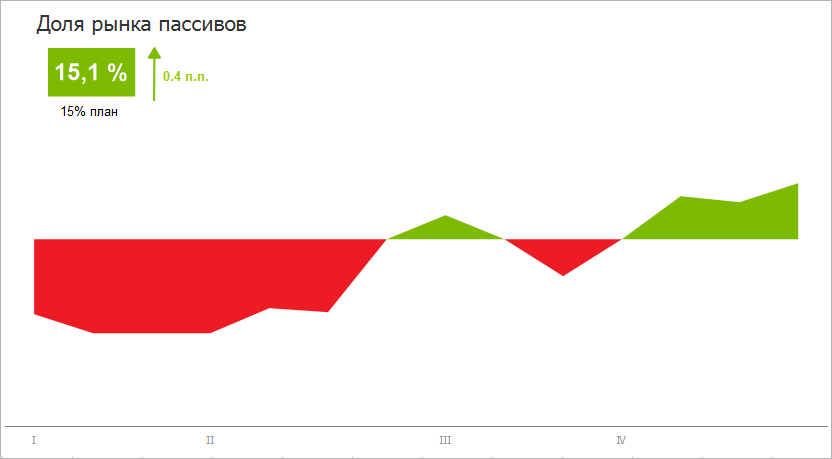
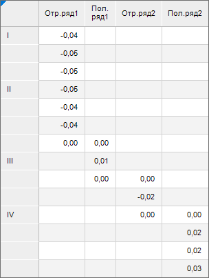
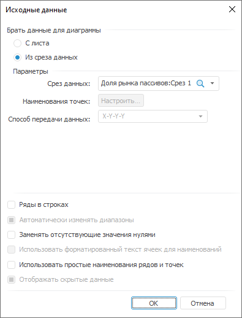
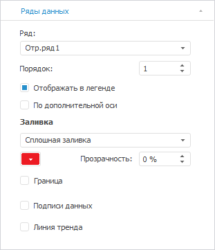
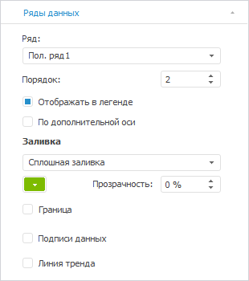
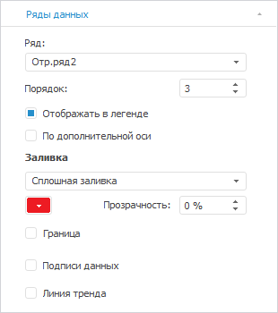
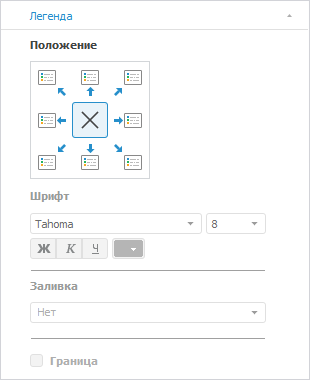
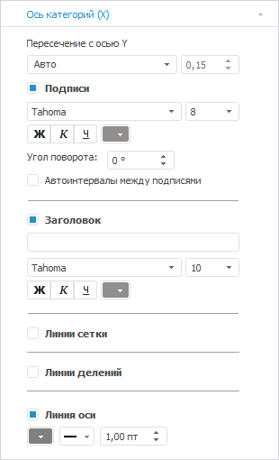
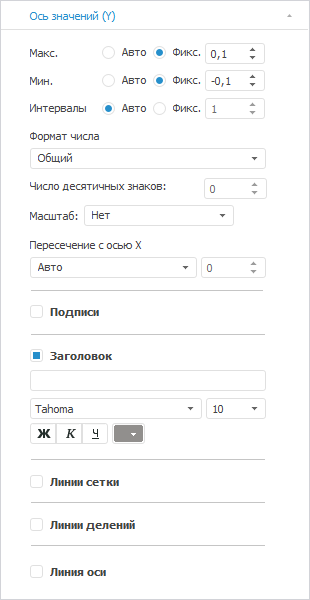

# Диаграмма «Доля рынка пассивов»

Диаграмма «Доля рынка пассивов»
-

# Диаграмма «Доля рынка пассивов»

	Пример диаграммы, отображающей долю рынка:

	

## Подготовка источников данных

	В качестве [источника
	 данных](../../uireport/Web/Source/UiReport_Source.htm) для построения диаграммы потребуется [стандартный
	 куб](UiNavObj.chm::/Cube/CreateCube/Master_Standart/UiMd_Cube_CreateCube_Master_Standart.htm), содержащий:

		- справочник НСИ с перечнем кварталов;

		- справочник НСИ с данными о доле рынка пассивов.

	Срез данных куба «Доля рынка пассивов»
	 в виде таблицы имеет вид:

	

## Построение диаграммы

	После добавления источника данных [создайте](../Diagrams.htm)
	 [диаграмму с областями](../Type_diagrams/UiDiagrams_Area.htm)
	 и задайте следующие настройки:

	Примечание.
	 При настройке диаграммы указаны только изменяемые параметры, к остальным
	 параметрам применяются настройки по умолчанию.

		- В окне «Исходные данные»
		 задайте настройки:

			- Установите переключатель «Из
			 среза данных».

			- Выберите срез «Доля
			 рынка пассивов: Срез 1» в раскрывающемся списке «Срез данных».

			- Снимите флажок «Ряды
			 в строках»..

			- Нажмите кнопку «ОК»:

	

		- На вкладке «[Ряды
		 данных](../Series.htm)» в разделе «Формат»
		 на [боковой
		 панели](GetStarted.chm::/Interface/Interface_Description.htm#side_panel):

			- Выберите ряд «Отр.ряд1» в раскрывающемся
			 списке «Ряд» и задайте
			 настройки:

				- настройте заливку ряда: тип - сплошная линия,
				 цвет - 237 27 35 в формате RGB;

				- снимите флажок «Граница»:

	

			- Выберите ряд «Пол.ряд1»
			 в раскрывающемся списке «Ряд»
			 и задайте настройки:

				- настройте заливку ряда: тип - сплошная линия,
				 цвет - 125 187 0 в формате RGB;

				- снимите флажок «Граница»:

	

			- Выберите ряд «Отр.ряд2»
			 в раскрывающемся списке «Ряд»
			 и задайте настройки:

				- настройте заливку ряда: тип - сплошная линия,
				 цвет - 237 27 35 в формате RGB;

				- снимите флажок «Граница»:

	

			- Выберите ряд «Пол.ряд2»
			 в раскрывающемся списке «Ряд»
			 и задайте настройки:

				- настройте заливку ряда: тип - сплошная линия,
				 цвет - 125 187 0 в формате RGB;

				- снимите флажок «Граница»:

	

		- На вкладке «[Легенда](../Property_diagramm/UiDiagrams_PropertyDiagramm_legend.htm)»
		 в разделе «Формат» на
		 [боковой
		 панели](GetStarted.chm::/Interface/Interface_Description.htm#side_panel) выберите вариант расположения легенды
		 
		 «Легенда не отображается»:

	

		- На вкладке «[Ось
		 категорий (Х)](../Params_diagram/UiDiagrams_Axis.htm)» в разделе «Формат»
		 на [боковой
		 панели](GetStarted.chm::/Interface/Interface_Description.htm#side_panel):

			- настройте подписи делений оси: размер шрифта -
			 8, цвет - 145 143 141 в формате RGB;

			- снимите флажок «Автоинтервалы
			 между подписями»;

			- установите флажок «Линия
			 оси» и настройте линию оси: цвет - 128 128 128
			 в формате RGB, толщина - 1 пт:

	

		- На вкладке «[Ось
		 категорий (Y)](../Params_diagram/UiDiagrams_Axis.htm)» в разделе «Формат»
		 на [боковой
		 панели](GetStarted.chm::/Interface/Interface_Description.htm#side_panel):

			- выберите способ расчёта максимального значения, установив
			 переключатель «Фикс.»,
			 и задайте значение «0.1»;

			- выберите способ расчёта минимального значения, установив
			 переключатель «Фикс.»,
			 и задайте значение «-0.1»;

			- снимите флажки «Подписи»,
			 «Заголовок» и «Линии сетки»:

	

		- При необходимости настройте всплывающие подсказки на вкладке
		 «[Подсказки](../Params_diagram/Tooltips.htm)»
		 в разделе «Формат» на
		 [боковой
		 панели](GetStarted.chm::/Interface/Interface_Description.htm#side_panel).

		- Выполните настройки по оформлению диаграммы.

## Оформление диаграмм

	После построения диаграммы выполните настройки по оформлению:

	Примечание.
	 При настройке оформления диаграммы указаны только изменяемые параметры,
	 к остальным параметрам применяются настройки по умолчанию.

		- Добавьте [заголовок
		 диаграммы](../Params_diagram/UiDiagrams_titles.htm) «Доля рынка пассивов»
		 и задайте настройки формата: цвет - 51 51 51 в формате RGB,
		 размер - 16.

		- Для отображения прироста на диаграмме:

			- [Добавьте
			 ](../../uireport/Web/Objects/Shapes/Shapes.htm)[фигуру](uireport.chm::/Desktop/Objects/AutoObjects/UiReport_AutoObject.htm)
			 «Линия» тип «Стрелка» и задайте настройки
			 в окне «Формат объектов»
			 на вкладке «Линии»:
			 цвет - 125 187 0 в формате RGB, толщина - 1.5
			 пт.

			- Добавьте [фигуру](uireport.chm::/Desktop/Objects/AutoObjects/UiReport_AutoObject.htm)
			 «Прямоуголик» и задайте
			 ее настройки, выполнив команду контекстного меню «Формат»
			 фигуры. Для этого в окне «Формат
			 объектов»:

				- На вкладке «Заливка»
				 укажите: тип - сплошная заливка, цвет - 125 187 0 в
				 формате RGB.

				- На вкладке «Линии»
				 укажите: стиль - нет.

	В текстовом блоке фигуры укажите значения
	 прироста «15,1%» и задайте
	 настройки формата: цвет - 255 255 255 в формате RGB, начертание
	 - полужирный, размер - 18.

			- Добавьте [текстовые
			 блоки](uireport.chm::/Desktop/Objects/UiReport_Objects_formatted_text.htm) рядом с линией и блоком для расшифровки:

				- укажите значение «0,4
				 п.п.» и задайте настройки формата: цвет -
				 125 187 0 в формате RGB, начертание - полужирный, размер
				 - 10.

				- укажите значение «15%»
				 и задайте настройки формата: цвет - 0 0 0 в формате
				 RGB, размер - 10.

	В результате выполнения действий будет построена представленная
	 диаграмма.

См. также:

[Примеры
 диаграмм](Diagram_examples.htm)

		Справочная
		 система на версию 10.9
		 от 18/08/2025,
		 © ООО «ФОРСАЙТ»,
