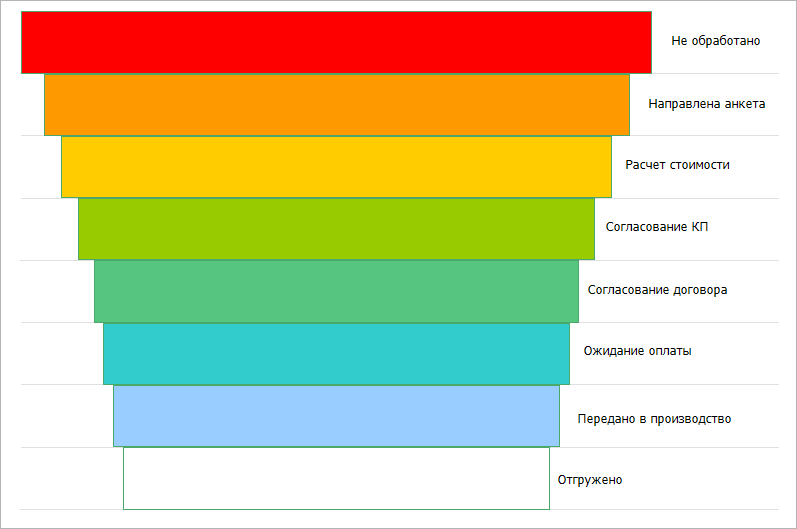
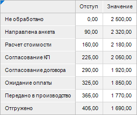
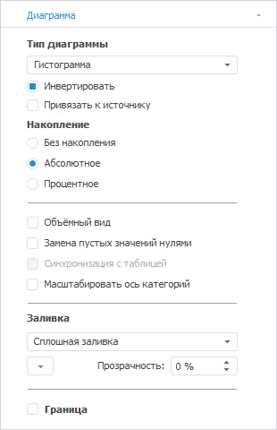
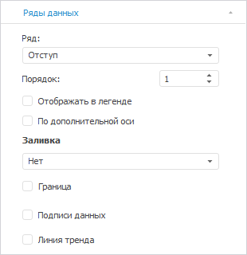
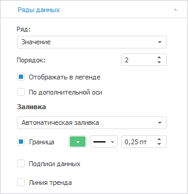
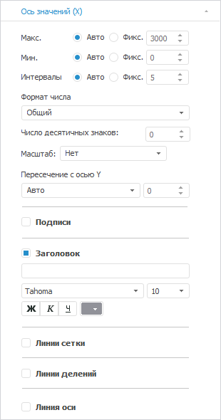
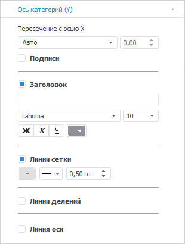

# Диаграмма «Воронка продаж»

Диаграмма «Воронка продаж»
-

# Диаграмма «Воронка продаж»

	Пример диаграммы, отображающей воронку продаж:

	

## Подготовка источников данных

	В качестве источника данных для построения диаграммы потребуется
	 [стандартный
	 куб](UiNavObj.chm::/Cube/CreateCube/Master_Standart/UiMd_Cube_CreateCube_Master_Standart.htm), содержащий:

		- справочник НСИ с перечнем этапов воронки продаж;

		- справочник НСИ с данными об инвестициях;

		- вспомогательный справочник НСИ для создания конверсии.

	Срез данных куба «Воронка продаж»
	 в виде таблицы имеет вид:

	

## Построение диаграммы

	После добавления источника данных [создайте](../Diagrams.htm)
	 накопительную гистограмму и задайте настройки на [панели
	 параметров](../../uireport/Web/organizational_management/Starting.htm#structure_window):

		- В окне «Исходные данные»
		 задайте настройки:

			- Установите переключатель «Из
			 среза данных».

			- Выберите срез «Скорость
			 ветра: Срез 1» в раскрывающемся списке «Срез
			 данных».

			- Снимите флажок «Ряды
			 в строках».

			- Нажмите кнопку «ОК»:

	

		- На вкладке «[Диагр](../Series.htm)амма» в разделе «Формат»
		 на [боковой
		 панели](GetStarted.chm::/Interface/Interface_Description.htm#side_panel) установите флажок «Инвертировать»:

	

		- На вкладке «[Ряды данных](../Series.htm)» в разделе «Формат» на [боковой
		 панели](GetStarted.chm::/Interface/Interface_Description.htm#side_panel):

			- Выберите ряд «Отступ»
			 в раскрывающемся списке «Ряд»
			 и задайте настройки:

				- снимите флажок «Не
				 отображать в легенде»;

				- задайте заливку ряда: тип - нет;

				- снимите флажок «Граница»:

	

			- Выберите ряд «Значение»
			 в раскрывающемся списке «Ряд»
			 и настройте границу ряда: тип - сплошная линия, цвет -
			 74 168 107 в формате RGB, толщина - 0.25 пт;

	

		- На вкладке «[Ось
		 категорий (Х)](../Params_diagram/UiDiagrams_Axis.htm)» в разделе «Формат»
		 на [боковой
		 панели](GetStarted.chm::/Interface/Interface_Description.htm#side_panel) снимите флажки «Подписи»
		 и «Линии сетки»:

	

		- Расположите значения оси Y
		 в обратном порядке, установив флажок «[Обратный
		 порядок значений](../Tuning_format/Format_Axis/FormatAxis_scale.htm#order_of_categories_or_values)».

		- На вкладке «[Ось категорий (Y)](../Params_diagram/UiDiagrams_Axis.htm)»
		 в разделе «Формат» на
		 [боковой
		 панели](GetStarted.chm::/Interface/Interface_Description.htm#side_panel):

			- снимите флажок «Подписи»;

			- настройте линии сетки: цвет - 224 224 224 в формате
			 RGB:

	

		- При необходимости настройте всплывающие подсказки на вкладке
		 «[Подсказки](../Params_diagram/Tooltips.htm)»
		 в разделе «Формат» на
		 [боковой
		 панели](GetStarted.chm::/Interface/Interface_Description.htm#side_panel).

		- Выполните настройки по оформлению диаграммы.

## Оформление диаграммы

	После построения диаграммы выполните настройки по оформлению этапов:

	Примечание.
	 При настройке оформления диаграммы указаны только изменяемые параметры,
	 к остальным параметрам применяются настройки по умолчанию.

		- Настройте [зазоры
		 между рядами](../Params_diagram/UiDiagrams_extra.htm#additionally_histo) на вкладке «Дополнительно»
		 окна «[Параметры
		 диаграммы](../Params_diagram/UiDiagrams_legend.htm)»: Основные
		 ряды: перекрытие - 0%, боковой зазор - 0%;

		- Настройте горизонтальные линии сетки диаграммы на вкладке
		 «Шкала» окна «[Формат
		 оси](../Tuning_format/Format_Axis/UiDiagrams_FormatAxis_scale_Hierarchical.htm)»: положения делений - между категориями.

		- Настройте оформление этапов. Для этого задайте настройки
		 в окне «[Формат
		 точки ряда данных](../Tuning_format/Format_line/Data_Series_Point.htm)»:

			- для этапа «Отгружено»:

				- На вкладке «Граница
				 и заливка» задайте заливку ряда: тип - сплошная
				 заливка, цвет - 255 255 255 в формате RGB;

				- На вкладке «Подписи
				 данных» установите флажок «Отображать
				 подписи данных» на вкладке «Подписи
				 данных» и задайте настройки:

					- в поле «Текст»
					 значение «Отгружено»;

					- формат: размер шрифта - 10, цвет шрифта -
					 0 0 0 в формате RGB.

			- для этапа «Передано
			 в производство»:

				- На вкладке «Граница
				 и заливка» задайте заливку ряда: тип - сплошная
				 заливка, цвет - 153 204 255 в формате RGB;

				- На вкладке «Подписи
				 данных» установите флажок «Отображать
				 подписи данных» на вкладке «Подписи
				 данных» и задайте настройки:

					- в поле «Текст»
					 значение «Передано
					 в производство»;

					- формат: размер шрифта - 10, цвет шрифта -
					 0 0 0 в формате RGB.

			- для этапа «Ожидание
			 оплаты»:

				- На вкладке «Граница
				 и заливка» задайте заливку ряда: тип - сплошная
				 заливка, цвет - 51 204 204 в формате RGB;

				- На вкладке «Подписи
				 данных» установите флажок «Отображать
				 подписи данных» на вкладке «Подписи
				 данных» и задайте настройки:

					- в поле «Текст»
					 значение «Ожидание
					 оплаты»;

					- формат: размер шрифта - 10, цвет шрифта -
					 0 0 0 в формате RGB.

			- для этапа «Согласование
			 договора»:

				- На вкладке «Граница
				 и заливка» задайте заливку ряда: тип - сплошная
				 заливка, цвет - 86 197 127 в формате RGB;

				- На вкладке «Подписи
				 данных» установите флажок «Отображать
				 подписи данных» на вкладке «Подписи
				 данных» и задайте настройки:

					- в поле «Текст»
					 значение «Согласование
					 договора»;

					- формат: размер шрифта - 10, цвет шрифта -
					 0 0 0 в формате RGB.

			- для этапа «Согласованиек
			 КП»:

				- На вкладке «Граница
				 и заливка» задайте заливку ряда: тип - сплошная
				 заливка, цвет - 153 204 0 в формате RGB;

				- На вкладке «Подписи
				 данных» установите флажок «Отображать
				 подписи данных» на вкладке «Подписи
				 данных» и задайте настройки:

					- в поле «Текст»
					 значение «Согласованиек
					 КП»;

					- формат: размер шрифта - 10, цвет шрифта -
					 0 0 0 в формате RGB.

			- для этапа «Расчёт
			 стоимости»:

				- На вкладке «Граница
				 и заливка» задайте заливку ряда: тип - сплошная
				 заливка, цвет - 255 204 0 в формате RGB;

				- На вкладке «Подписи
				 данных» установите флажок «Отображать
				 подписи данных» на вкладке «Подписи
				 данных» и задайте настройки:

					- в поле «Текст»
					 значение «Расчёт
					 стоимости»;

					- формат: размер шрифта - 10, цвет шрифта -
					 0 0 0 в формате RGB.

			- для этапа «Направлена
			 анкета»:

				- На вкладке «Граница
				 и заливка» задайте заливку ряда: тип - сплошная
				 заливка, цвет - 255 153 0 в формате RGB;

				- На вкладке «Подписи
				 данных» установите флажок «Отображать
				 подписи данных» на вкладке «Подписи
				 данных» и задайте настройки:

					- в поле «Текст»
					 значение «Направлена
					 анкета»;

					- формат: размер шрифта - 10, цвет шрифта -
					 0 0 0 в формате RGB.

			- для этапа «Не
			 обработано»:

				- На вкладке «Граница
				 и заливка» задайте заливку ряда: тип - сплошная
				 заливка, цвет - 255 0 0 в формате RGB;

				- На вкладке «Подписи
				 данных» установите флажок «Отображать
				 подписи данных» на вкладке «Подписи
				 данных» и задайте настройки:

					- в поле «Текст»
					 значение «Не обработано»;

					- формат: размер шрифта - 10, цвет шрифта -
					 0 0 0 в формате RGB.

		- Переместите подписи данных с помощью мыши за пределы этапов.

	В результате выполнения действий будет построена представленная
	 диаграмма.

См. также:

[Примеры
 диаграмм](Diagram_examples.htm)

		Справочная
		 система на версию 10.9
		 от 18/08/2025,
		 © ООО «ФОРСАЙТ»,
