# Диаграмма «Демографическая ситуация»

Диаграмма «Демографическая ситуация»
-

# Диаграмма «Демографическая ситуация»

	Пример диаграммы, отображающей демографическую ситуацию в Казахстане:

	

## Подготовка источников данных

	В качестве источников данных потребуются:

		- Для построения диаграммы «Динамика
		 изменения доли численности населения» [стандартный
		 куб](UiNavObj.chm::/Cube/CreateCube/Master_Standart/UiMd_Cube_CreateCube_Master_Standart.htm), содержащий:

			- календарный справочник;

			- справочник НСИ, содержащий возрастные группы населения;

			- справочник НСИ, содержащий данные о доле численности;

	Срез данных куба «Динамика
	 изменения доли численности населения» в виде таблицы имеет
	 вид:

	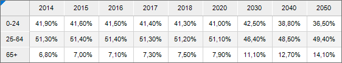

		- Для построения диаграммы «Ожидаемая
		 продолжительность жизни населения» потребуется [стандартный
		 куб](UiNavObj.chm::/Cube/CreateCube/Master_Standart/UiMd_Cube_CreateCube_Master_Standart.htm), содержащий:

			- календарный справочник;

			- справочник НСИ с данными о продолжительности жизни.

	Срез данных куба «Ожидаемая
	 продолжительность жизни населения» в виде таблицы имеет вид:

	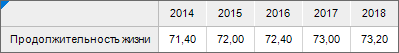

## Построение диаграммы «Динамика изменения доли численности населения»

	После добавления источника данных[ создайте](../Diagrams.htm)
	 [гистограмму с накоплением](../Type_diagrams/UiDiagrams_Bar.htm)
	 и задайте следующие настройки:

	Примечание.
	 При настройке диаграммы указаны только изменяемые параметры, к остальным
	 параметрам применяются настройки по умолчанию.

		- В окне «Исходные данные» задайте
		 настройки:

			- Установите переключатель «Из
			 среза данных».

			- Выберите срез «Динамика
			 изменения доли численности населения: Срез 1» в раскрывающемся
			 списке «Срез данных».

			- Нажмите кнопку «ОК»:

	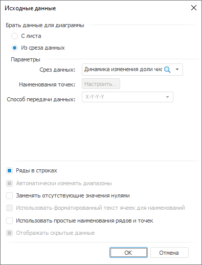

		- На вкладке «[Подписи данных](../Property_diagramm/UiDiagrams_PropertyDiagramm_Label.htm)»
		 в разделе «Формат» на
		 [боковой
		 панели](GetStarted.chm::/Interface/Interface_Description.htm#side_panel):

			- Установите флажок «Подписи
			 данных».

			- Выберите положение подписей данных «В
			 центре» в раскрывающемся списке «Положение».

			- Настройте подписи данных: размер шрифта - 7, цвет -
			 255 255 255 в формате RGB, начертание - полужирное:

	

		- На вкладке «[Ряды
		 данных](../Series.htm)» в разделе «Формат»
		 на [боковой
		 панели](GetStarted.chm::/Interface/Interface_Description.htm#side_panel):

		-

			- Выберите ряд «0-24»
			 в раскрывающемся списке «Ряд»
			 и задайте настройки:

				- задайте заливку ряда: тип - сплошная заливка, цвет
				 - 237 37 25 в формате RGB;

				- настройте границу ряда: цвет - 237 37 25 в
				 формате RGB, толщина - 0.25 пт:

	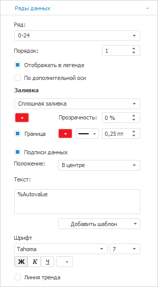

		-

			- Выберите ряд «25-64»
			 в раскрывающемся списке «Ряд»
			 и задайте настройки:

		-

			-

				- задайте заливку ряда: тип - сплошная заливка, цвет
				 - 76 76 76 в формате RGB;

				- настройте границу ряда: цвет - 76 76 76 в формате
				 RGB, толщина - 0.25 пт:

	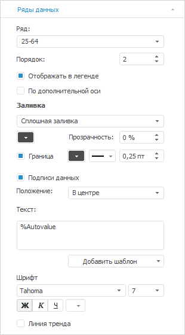

		-

			- Выберите ряд «65+»
			 в раскрывающемся списке «Ряд»
			 и задайте настройки:

		-

			-

				- задайте заливку ряда: тип - сплошная заливка, цвет
				 - 250 192 144 в формате RGB;

				- настройте границу ряда: цвет - 250 192 144
				 в формате RGB, толщина - 0.25 пт;

				- настройте подписи данных: цвет шрифта - 0 0
				 0 в формате RGB:

	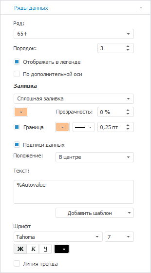

		- На вкладке «[Легенда](../Property_diagramm/UiDiagrams_PropertyDiagramm_legend.htm)»
		 в разделе «Формат» на
		 [боковой
		 панели](GetStarted.chm::/Interface/Interface_Description.htm#side_panel) задайте настройки шрифта легенды: размер -
		 11, цвет - 76 76 76 в формате RGB:

	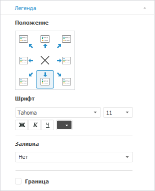

		- На вкладке «[Ось
		 категорий (Х)](../Params_diagram/UiDiagrams_Axis.htm)» в разделе «Формат»
		 на [боковой
		 панели](GetStarted.chm::/Interface/Interface_Description.htm#side_panel):

			- настройте подписи делений оси: размер шрифта -
			 10, цвет - 76 76 76 в формате RGB;

			- установите флажок «Линии
			 сетки» и настройте линии сетки: цвет - 224 224
			 224 в формате RGB:

	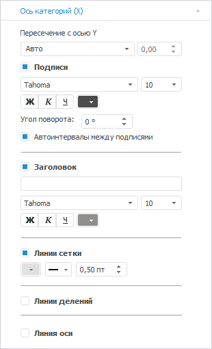

		- На вкладке «[Ось
		 категорий (Y)](../Params_diagram/UiDiagrams_Axis.htm)» в разделе «Формат»
		 на [боковой
		 панели](GetStarted.chm::/Interface/Interface_Description.htm#side_panel):

			- выберите способ расчёта интервалов, установив переключатель
			 «Фикс.», и задайте
			 значение «20»;

			- выберите формат значений оси «Процентный»
			 в раскрывающемся списке «Формат
			 числа» и задайте в поле «Число
			 десятичных знаков»
			 значение «3»;

			- снимите флажок «Подписи»;

			- настройте линии сетки: тип - пунктирная линия,
			 цвет - 224 224 224 в формате RGB:

	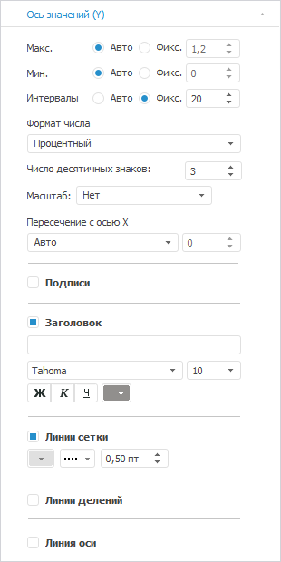

		- При необходимости настройте всплывающие подсказки на вкладке
		 «[Подсказки](../Params_diagram/Tooltips.htm)»
		 в разделе «Формат» на
		 [боковой
		 панели](GetStarted.chm::/Interface/Interface_Description.htm#side_panel).

		- Выполните настройки по [оформлению
		 диаграммы](Example_population_dynamics.htm#decoration).

## Построение диаграммы «Ожидаемая продолжительность жизни населения»

	После добавления источника данных[ создайте](../Diagrams.htm)
	 [гистограмму с абсолютными
	 значениями](../Type_diagrams/UiDiagrams_Bar.htm) и задайте следующие настройки:

	Примечание.
	 При настройке диаграммы указаны только изменяемые параметры, к остальным
	 параметрам применяются настройки по умолчанию.

		- В окне «Исходные данные»
		 задайте настройки:

			- Установите переключатель «Из
			 среза данных».

			- Выберите срез «Ожидаемая
			 продолжительность жизни населения: Срез 1» в раскрывающемся
			 списке «Срез данных».

			- Нажмите кнопку «ОК»:

	

		- На вкладке «[Подписи данных](../Property_diagramm/UiDiagrams_PropertyDiagramm_Label.htm)»
		 в разделе «Формат» на
		 [боковой
		 панели](GetStarted.chm::/Interface/Interface_Description.htm#side_panel):

			- Установите флажок «Подписи
			 данных».

			- Выберите положение подписей данных «У
			 вершины, снаружи» в раскрывающемся списке «Положение».

			- Настройте подписи данных: цвет - 0 0 0 в формате
			 RGB, начертание - полужирное:

	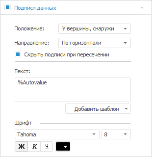

		- На вкладке «[Ряды
		 данных](../Series.htm)» в разделе «Формат»
		 на [боковой
		 панели](GetStarted.chm::/Interface/Interface_Description.htm#side_panel) выберите ряд «Продолжительность
		 жизни» в раскрывающемся списке «Ряд»
		 и задайте настройки:

			- настройте заливку ряда: тип - сплошная заливка, цвет
			 - 237 27 35 в формате RGB;

			- настройте границу ряда: тип - сплошная линия, цвет -
			 255 255 255 в формате RGB, толщина - 0.25 пт:

	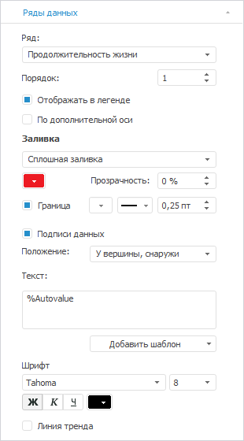

		- На вкладке «[Легенда](../Property_diagramm/UiDiagrams_PropertyDiagramm_legend.htm)»
		 в разделе «Формат» на
		 [боковой
		 панели](GetStarted.chm::/Interface/Interface_Description.htm#side_panel) выберите вариант расположения легенды
		 
		 «Легенда не отображается»:

	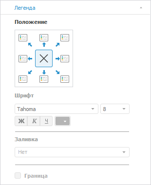

		- На вкладке «[Ось
		 категорий (Х)](../Params_diagram/UiDiagrams_Axis.htm)» в разделе «Формат»
		 на [боковой
		 панели](GetStarted.chm::/Interface/Interface_Description.htm#side_panel):

			- настройте подписи делений оси: размер шрифта -
			 10, цвет - 76 76 76 в формате RGB;

			- установите флажок «Линии
			 сетки» и настройте линии сетки: цвет - 224 224
			 224 в формате RGB:

	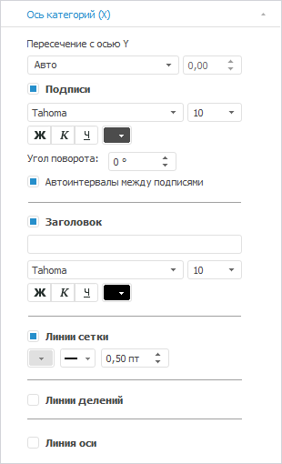

		- На вкладке «[Ось
		 категорий (Y)](../Params_diagram/UiDiagrams_Axis.htm)» в разделе «Формат»
		 на [боковой
		 панели](GetStarted.chm::/Interface/Interface_Description.htm#side_panel):

			- выберите способ расчёта интервалов, установив переключатель
			 «Фикс.», и задайте
			 значение «15»;

			- снимите флажки «Подписи»:

			- настройте линии сетки: тип - пунктирная линия,
			 цвет - 224 224 224 в формате RGB:

	

		- При необходимости настройте всплывающие подсказки на вкладке
		 «[Подсказки](../Params_diagram/Tooltips.htm)»
		 в разделе «Формат» на
		 [боковой
		 панели](GetStarted.chm::/Interface/Interface_Description.htm#side_panel).

		- Выполните настройки по [оформлению
		 диаграммы](Example_population_dynamics.htm#decoration).

## Оформление диаграмм

	После построения диаграмм выполните настройки по оформлению:

	Примечание.
	 При настройке оформления диаграмм указаны только изменяемые параметры,
	 к остальным параметрам применяются настройки по умолчанию.

		- Задайте [настройки
		 формата рядов](../Tuning_format/Format_line/Settings_DataSeries.htm) данных для отображения тени ряда. Для этого
		 установите флажок «Отображать
		 тень» и задайте настройки: dX - 0.5, dY - 0.5.

		- Задайте [настройки
		 положения делений](../Tuning_format/Format_Axis/FormatAxis_scale.htm#tick_marks_position) для оси Х для разделения оси по годовым
		 интервалам. Для этого выберите вариант положения делений «Между категориями».

		- Для диаграммы «Динамика
		 изменения доли численности населения Казахстана по возрастным
		 группам»:

			- Добавьте [заголовок
			 диаграмм](../Params_diagram/UiDiagrams_titles.htm)ы «Динамика
			 изменения доли численности населения Казахстана по возрастным
			 группам» и задайте настройки формата: размер шрифта -
			 12, цвет - 0 0 0 в формате RGB, начертание - жирный,
			 выравнивание по горизонтали - по левому краю.

			- Задайте [настройки
			 формата подписей](../Params_diagram/Label_Format.htm) в процентном формате. Для этого укажите
			 следующие параметры: формат - процентный, количество знаков
			 после запятой - 2.

		- Для диаграммы «Ожидаемая
		 продолжительность жизни с момента рождения I лет»:

			- Добавьте [заголовок
			 диаграммы](../Params_diagram/UiDiagrams_titles.htm) «Ожидаемая
			 продолжительность жизни с момента рождения I лет» и
			 задайте настройки формата: размер шрифта - 12, цвет -
			 0 0 0 в формате RGB.

			- Выполните настройку
			 оформления части [заголовка
			 диаграммы](../Params_diagram/UiDiagrams_titles.htm):

				- Дважды щелкните по заголовку.

				- Выделите часть заголовка и выполните команду «Формат» контекстного
				 меню.

				- В окне «Формат»
				 задайте настройки: цвет - 102 102 102 в формате RGB.

			- Задайте [настройки
			 формата подписей](../Params_diagram/Label_Format.htm) для отображения значений продолжительности
			 жизни с десятичными знаками. Для этого укажите: формат - числовой,
			 число десятичных знаков - 1.

	В результате выполнения действий будет построена представленная
	 диаграмма.

См. также:

[Примеры
 диаграмм](Diagram_examples.htm)

		Справочная
		 система на версию 10.9
		 от 18/08/2025,
		 © ООО «ФОРСАЙТ»,
