# Диаграмма «Как арбитражные суды рассматривают иски о взыскании убытков с приставов»

Диаграмма «Как арбитражные суды рассматривают иски о взыскании убытков с приставов»
-

# Диаграмма «Как арбитражные суды рассматривают иски о взыскании
	 убытков с приставов»

	Пример диаграммы, отображающей как арбитражные суды рассматривают
	 иски о взыскании убытков с приставов:

	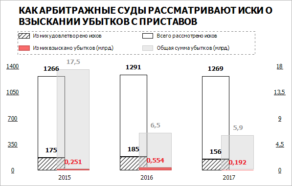

## Подготовка источников данных

	В качестве источника данных для построения диаграммы потребуется
	 [стандартный
	 куб](UiNavObj.chm::/Cube/CreateCube/Master_Standart/UiMd_Cube_CreateCube_Master_Standart.htm), содержащий:

		- календарный справочник;

		- справочник НСИ с перечнем категорий взыскания;

		- справочник НСИ с данными о взыскании долгов.

	Срез данных куба «Как арбитражные
	 суды рассматривают иски о взыскании убытков с приставов» в
	 виде таблицы имеет вид:

	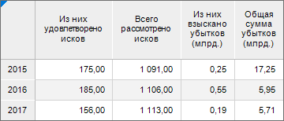

## Построение диаграммы

	После добавления источника данных [создайте](../Diagrams.htm)
	 [накопительную гистограмму
	 с группами](../Type_diagrams/UiDiagrams_Bar.htm) и задайте настройки:

	Примечание.
	 При настройке диаграммы указаны только изменяемые параметры, к остальным
	 параметрам применяются настройки по умолчанию.

		- В окне «Исходные данные»
		 задайте настройки:

			- Установите переключатель «Из
			 среза данных».

			- Выберите срез «Как
			 арбитражные суды рассматривают иски о взыскании убытков с
			 приставов: Срез 1» в раскрывающемся списке «Срез
			 данных».

			- Снимите флажок «Ряды
			 в строках».

			- Нажмите кнопку «ОК»:

	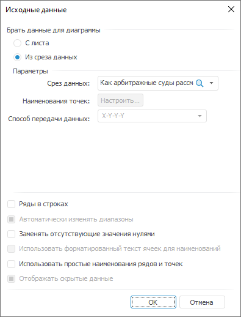

		- Задайте [группы
		 рядов](../Params_diagram/Series_Group.htm):

			- Группа 0 включает ряды «Из
			 них удовлетворено исков» и «Всего
			 рассмотрено исков».

			- Группа 1 включает ряды «Из
			 них взыскано убытков (млрд.)» и «Общая
			 сумма убытков (млрд.)»:

	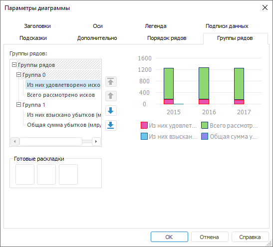

		- На вкладке «[Подписи данных](../Property_diagramm/UiDiagrams_PropertyDiagramm_Label.htm)»
		 в разделе «Формат» на
		 [боковой
		 панели](GetStarted.chm::/Interface/Interface_Description.htm#side_panel):

			- Установите флажок «Подписи
			 данных».

			- Выберите положение подписей данных «У
			 вершины, снаружи» в раскрывающемся списке «Положение».

			- Введите в поле «Текст»
			 значение «%Part».

			- Настройте подписи данных: размер шрифта - 10, цвет -
			 0 0 0 в формате RGB, начертание - полужирное:

	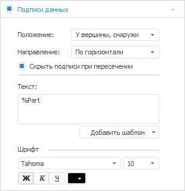

		- На вкладке «[Ряды
		 данных](../Series.htm)» в разделе «Формат»
		 на [боковой
		 панели](GetStarted.chm::/Interface/Interface_Description.htm#side_panel):

		-

			- Выберите ряд «Из них
			 удовлетворено исков» в раскрывающемся списке «Ряд» и настройте границу
			 ряда: цвет - 0 0 0 в формате RGB, толщина - 0.25
			 пт;

	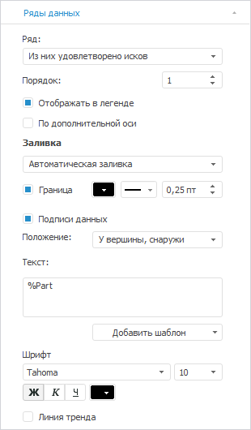

		-

			- Выберите ряд «Всего
			 рассмотрено исков» в раскрывающемся списке «Ряд»
			 и задайте настройки:

		-

			-

				- задайте заливку ряда: тип - нет;

				- настройте границу ряда: , цвет - 0 0 0 в формате
				 RGB, толщина - 0.25 пт:

	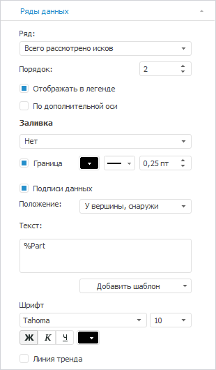

		-

			- Выберите ряд «Из них
			 взыскано убытков (млрд.)» в раскрывающемся списке «Ряд» и задайте настройки:

		-

			-

				- установите флажок «По
				 дополнительной оси»;

				- задайте заливку ряда: тип - сплошная заливка, цвет
				 - 228 153 153 в формате RGB;

				- настройте границу ряда: цвет - 212 91 91 в
				 формате RGB, толщина - 1.5 пт;

				- настройте подписи данных: цвет шрифта - 237
				 27 35 в формате RGB:

	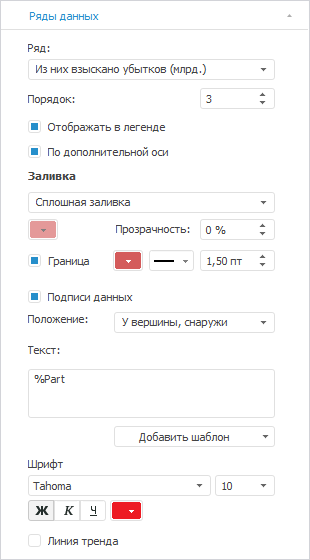

		-

			- Выберите ряд «Общая
			 сумма убытков (млрд.)» в раскрывающемся списке «Ряд» и задайте настройки:

			-

				-

					- задайте заливку ряда: тип - сплошная заливка,
					 цвет - 204 204 204 в формате RGB, прозрачность - 58%;

					- настройте границу ряда: цвет - 204 204
					 204 в формате RGB, толщина - 0.25 пт;

					- настройте подписи данных: цвет шрифта -
					 153 153 153 в формате RGB:

	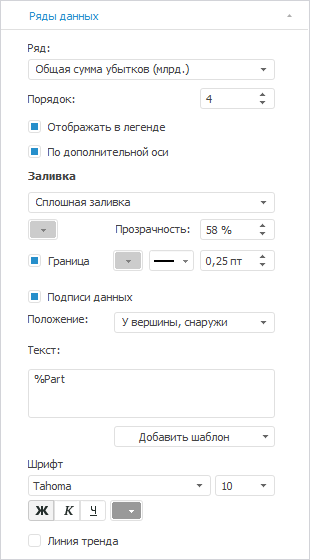

		- На вкладке «[Легенда](../Property_diagramm/UiDiagrams_PropertyDiagramm_legend.htm)»
		 в разделе «Формат» на
		 [боковой
		 панели](GetStarted.chm::/Interface/Interface_Description.htm#side_panel):

			- задайте настройки шрифта легенды: размер - 8, цвет -
			 0 0 0 в формате RGB;

			- настройте границу легенды: тип - пунктирная линия,
			 цвет - 128 128 128 в формате RGB, толщина - 0.25
			 пт:

	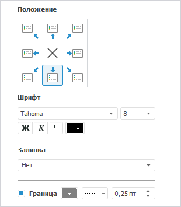

		- На вкладке «[Ось
		 категорий (Х)](../Params_diagram/UiDiagrams_Axis.htm)» в разделе «Формат»
		 на [боковой
		 панели](GetStarted.chm::/Interface/Interface_Description.htm#side_panel) настройте подписи делений оси: цвет -
		 0 0 0 в формате RGB:

	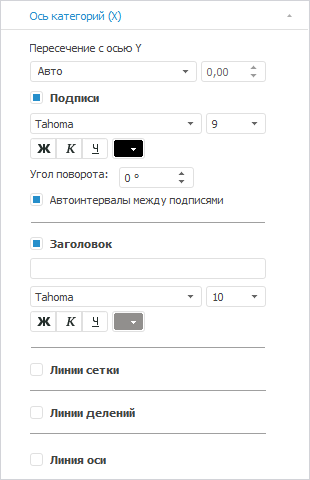

		- На вкладке «[Ось
		 категорий (Y)](../Params_diagram/UiDiagrams_Axis.htm)» в разделе «Формат»
		 на [боковой
		 панели](GetStarted.chm::/Interface/Interface_Description.htm#side_panel):

			- выберите способ расчёта максимального значения, установив
			 переключатель «Фикс.»,
			 и задайте значение «1400»;

			- выберите способ расчёта интервалов, установив переключатель
			 «Фикс.», и задайте
			 значение «4»;

			- настройте подписи делений оси: размер шрифта -
			 9, цвет - 0 0 0 в формате RGB, начертание - подчеркнутый;

			- флажок «Линии сетки»
			 снят:

	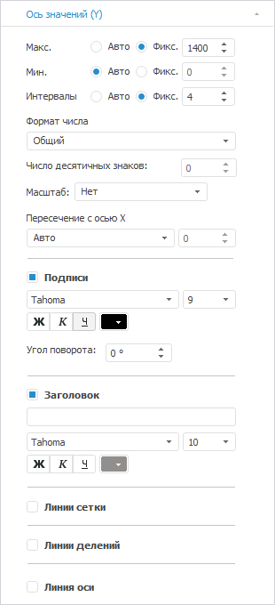

		- На вкладке «[Ось
		 значений (дополнительная)](../Params_diagram/UiDiagrams_Axis.htm)» в разделе «Формат»
		 на [боковой
		 панели](GetStarted.chm::/Interface/Interface_Description.htm#side_panel):

			- выберите способ расчёта максимального значения, установив
			 переключатель «Фикс.»,
			 и задайте значение «18»;

			- выберите способ расчёта интервалов, установив переключатель
			 «Фикс.», и задайте
			 значение «4»;

			- настройте подписи делений оси: цвет - 0 0 0 в формате
			 RGB, начертание - подчеркнутый;

			- снимите флажок «Линии
			 сетки»:

	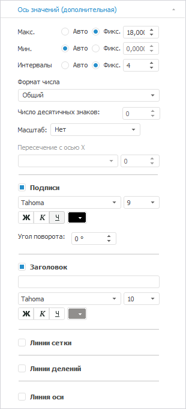

		- На вкладке «[Подсказки](../Params_diagram/Tooltips.htm)»
		 в разделе «Формат» на
		 [боковой
		 панели](GetStarted.chm::/Interface/Interface_Description.htm#side_panel) снимите флажок «Подсказки».

		- Выполните настройки по оформлению диаграммы.

## Оформление диаграммы

	После построения диаграммы выполните настройки по оформлению:

	Примечание.
	 При настройке оформления диаграммы указаны только изменяемые параметры,
	 к остальным параметрам применяются настройки по умолчанию.

		- Добавьте [заголовок
		 диаграммы](../Params_diagram/UiDiagrams_titles.htm) «Как арбитражные
		 суды рассматривают иски о взыскании убытков с приставов»
		 и задайте настройки формата: цвет - 0 0 0 в формате RGB,
		 начертание - жирный.

		- Задайте з[азоры
		 между рядами](../Params_diagram/UiDiagrams_extra.htm#additionally_histo) на вкладке «Дополнительно»
		 окна «[Параметры
		 диаграммы](../Params_diagram/UiDiagrams_legend.htm)»:

			- Основные ряды:
			 перекрытие - 0%, боковой зазор -100%;

			- Ряды дополнительной
			 оси: перекрытие - 50%, боковой зазор -100%.

		- Настройте [заливку ряд](../Series.htm)а «Из них удовлетворено исков»,
		 выполнив команду контекстного меню «Формат
		 ряда данных». В окне «Формат
		 ряда данных» задайте: тип заливки - со штриховкой, цвет
		 заливки - 255 255 255 в формате RGB, цвет штриховки - 0 0 0 в
		 формате RGB, штриховка - //////////////.

		- Измените размер области построения путем перетаскивания
		 её границ.

		- Расположите легенду в произвольном месте над областью построения.
		 Для этого предварительно на вкладке «Общее»
		 окна «[Формат
		 легенды](../Params_diagram/UiDiagrams_legend.htm)»:

			- снимите флажок «Автоматическо
			 размещение» для произвольного расположения легенды
			 на диаграмме.

			- задайте значения для настройки размеров пиктограммы:
			 ширина значка - 6 мм, высота значка 3 мм.

	В результате выполнения действий будет построена представленная
	 диаграмма.

См. также:

[Примеры
 диаграмм](Diagram_examples.htm)

		Справочная
		 система на версию 10.9
		 от 18/08/2025,
		 © ООО «ФОРСАЙТ»,
