# Диаграмма «Скорость ветра»

Диаграмма «Скорость ветра»
-

# Диаграмма «Скорость ветра»

	Пример диаграммы, отображающей скорость ветра в Перми за 2021 год:

	

## Подготовка источников данных

	В качестве [источника
	 данных](../../uireport/Web/Source/UiReport_Source.htm) для построения диаграммы потребуется [стандартный
	 куб](UiNavObj.chm::/Cube/CreateCube/Master_Standart/UiMd_Cube_CreateCube_Master_Standart.htm), содержащий:

		- календарный справочник;

		- справочник НСИ с перечнем групп скорости ветра;

		- справочник НСИ с данными о скорости ветра.

	Срез данных куба «Скорость ветра»
	 в виде таблицы имеет вид:

	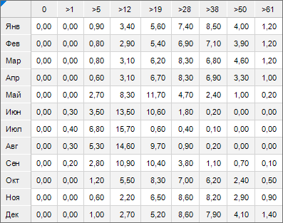

## Построение диаграммы

	После добавления источника данных [создайте](../Diagrams.htm)
	 [накопительную гистограмму](../Type_diagrams/UiDiagrams_Bar.htm)
	 и задайте следующие настройки:

	Примечание.
	 При настройке диаграммы указаны только изменяемые параметры, к остальным
	 параметрам применяются настройки по умолчанию.

		- В окне «Исходные данные»
		 задайте настройки:

			- Установите переключатель «Из
			 среза данных».

			- Выберите срез «Скорость
			 ветра: Срез 1» в раскрывающемся списке «Срез
			 данных».

			- Снимите флажок «Ряды
			 в строках».

			- Нажмите кнопку «ОК»:

	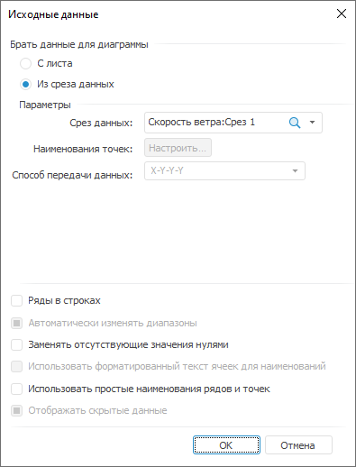

		- На вкладке «[Ряды данных](../Series.htm)» в разделе «Формат» на [боковой
		 панели](GetStarted.chm::/Interface/Interface_Description.htm#side_panel):

			- Выберите ряд «По умолчанию»
			 в раскрывающемся списке «Ряд»
			 и задайте настройки:

				- Настройте границу ряда: цвет - 255 255 255
				 в формате RGB, толщина - 0.25 пт.

				- Нажмите кнопку «Для
				 всех»:

	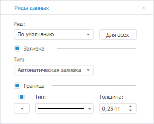

			- Выберите ряд «0»
			 в раскрывающемся списке «Ряд»
			 и задайте настройки:

				- задайте заливку ряда: тип - сплошная заливка, цвет
				 - 204 204 204 в формате RGB:

	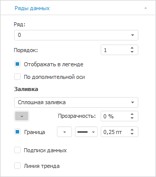

			- Выберите ряд «>1»
			 в раскрывающемся списке «Ряд»
			 и задайте настройки:

				- задайте заливку ряда: тип - сплошная заливка, цвет
				 - 181 254 194 в формате RGB;

	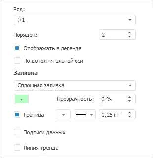

			- Выберите ряд «>5»
			 в раскрывающемся списке «Ряд»
			 и задайте настройки:

				- задайте заливку ряда: тип - сплошная заливка, цвет
				 - 86 197 127 в формате RGB:

	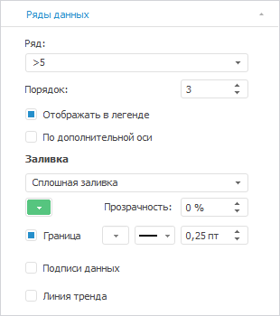

			- Выберите ряд «>12»
			 в раскрывающемся списке «Ряд»
			 и задайте настройки:

				- задайте заливку ряда: тип - сплошная заливка, цвет
				 - 69 156 99 в формате RGB:

	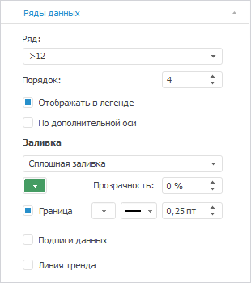

			- Выберите ряд «>19»
			 в раскрывающемся списке «Ряд»
			 и задайте настройки:

				- задайте заливку ряда: тип - сплошная заливка, цвет
				 - 54 123 78 в формате RGB:

	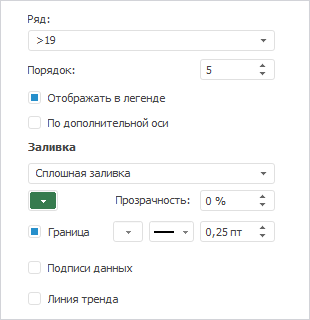

			- Выберите ряд «>28»
			 в раскрывающемся списке «Ряд»
			 и задайте настройки:

				- задайте заливку ряда: тип - сплошная заливка, цвет
				 - 125 187 0 в формате RGB:

	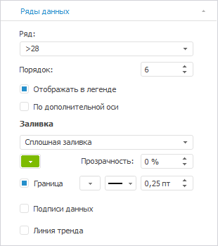

			- Выберите ряд «>38»
			 в раскрывающемся списке «Ряд»
			 и задайте настройки:

				- задайте заливку ряда: тип - сплошная заливка, цвет
				 - 159 231 0 в формате RGB:

	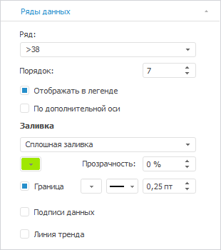

			- Выберите ряд «>50»
			 в раскрывающемся списке «Ряд»
			 и задайте настройки:

				- задайте заливку ряда: тип - сплошная заливка, цвет
				 - 239 229 5 в формате RGB:

	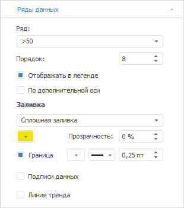

			- Выберите ряд «>61»
			 в раскрывающемся списке «Ряд»
			 и задайте настройки:

				- задайте заливку ряда: тип - сплошная заливка, цвет
				 - 233 174 0 в формате RGB:

	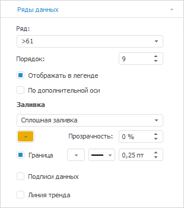

		- На вкладке «[Легенда](../Property_diagramm/UiDiagrams_PropertyDiagramm_legend.htm)»
		 в разделе «Формат» на
		 [боковой
		 панели](GetStarted.chm::/Interface/Interface_Description.htm#side_panel) задайте настройки шрифта легенды: тип
		 шрифта - Trebuchet MS, размер - 8, цвет - 0 0 0
		 в формате RGB:

	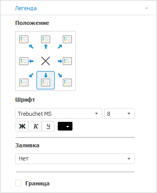

		- На вкладке «[Ось
		 категорий (Х)](../Params_diagram/UiDiagrams_Axis.htm)» в разделе «Формат»
		 на [боковой
		 панели](GetStarted.chm::/Interface/Interface_Description.htm#side_panel):

			- настройте подписи делений оси: тип шрифта - Trebuchet
			 MS, размер шрифта - 8, цвет - 0 0 0 в формате RGB,
			 начертание - жирный;

			- установите флажок «Линии
			 сетки» и настройте линии сетки: тип - пунктирная
			 линия, цвет - 224 224 224 в формате RGB:

	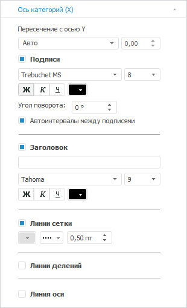

		- На вкладке «[Ось категорий (Y)](../Params_diagram/UiDiagrams_Axis.htm)»
		 в разделе «Формат» на
		 [боковой
		 панели](GetStarted.chm::/Interface/Interface_Description.htm#side_panel):

			- выберите способ расчёта интервалов, установив переключатель
			 «Фиксировано», и
			 задайте величину интервалов - 5;

			- выберите в раскрывающемся списке «Формат
			 числа» значение «Числовой»
			 и задайте количество знаков после запятой в поле «Десятичных
			 знаков» - 0;

			- настройте подписи делений оси: тип шрифта - Trebuchet
			 MS, размер шрифта - 8, цвет - 0 0 0 в формате RGB,
			 начертание - жирный;

			- настройте заголовок: тип шрифта - Trebuchet MS,
			 размер шрифта - 9, цвет - 0 0 0 в формате RGB. В
			 поле «Загловок» укажите
			 «дни»;

			- настройте линии сетки: тип - пунктирная линия,
			 цвет - 224 224 224 в формате RGB:

	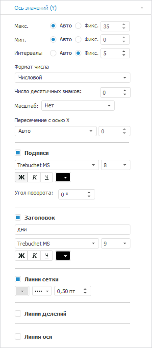

		- На вкладке «[Подсказки](../Params_diagram/Tooltips.htm)»
		 в разделе «Формат» на
		 [боковой
		 панели](GetStarted.chm::/Interface/Interface_Description.htm#side_panel):

			- в поле «Текст»
			 укажите «%PointName. %Value»;

			- настройте шрифт всплывающих подсказок: размер шрифта -
			 8, цвет - 145 143 141 в формате RGB;

			- настройте заливку всплывающих подсказок: цвет - 255
			 255 255 в формате RGB;

			- установите флажок «Граница»:

	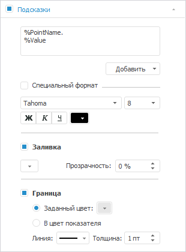

		- Выполните настройки по оформлению диаграммы.

## Оформление диаграммы

	После построения диаграммы добавьте [заголовок
	 диаграммы](../Params_diagram/UiDiagrams_titles.htm) «Скорость ветра в
	 Перми за 2021 год» и задайте настройки формата: тип шрифта -
	 Bahnschrift Condensed, размер шрифта - 16, цвет - 0 0 0
	 в формате RGB, начертание - полужирный.

	Примечание.
	 При настройке оформления диаграммы указаны только изменяемые параметры,
	 к остальным параметрам применяются настройки по умолчанию.

	В результате выполнения действий будет построена представленная
	 диаграмма.

См. также:

[Примеры
 диаграмм](Diagram_examples.htm)

		Справочная
		 система на версию 10.9
		 от 18/08/2025,
		 © ООО «ФОРСАЙТ»,
