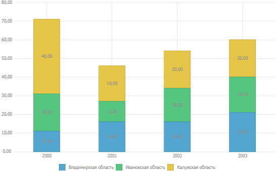
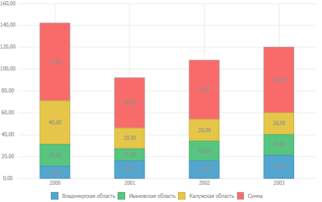
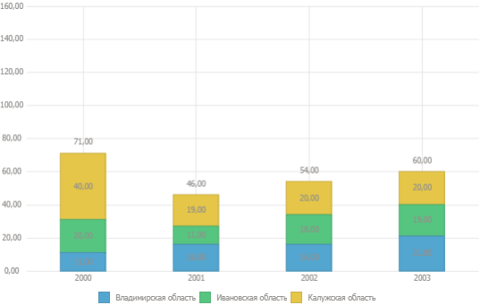

# Как настроить отображение итоговых значений по столбцам диаграммы

Как настроить отображение итоговых значений по столбцам диаграммы
-

# Как настроить отображение итоговых значений по столбцам диаграммы?

При построении [гистограммы
 с накоплением](../Type_diagrams/UiDiagrams_Bar.htm) можно использовать итоговые значения по столбцам в качестве
 подписей данных.

Примечание.
 Настройка доступна в инструментах «[Аналитические
 панели](UiAdhoc.chm::/UiAdhoc_Purpose.htm)», «[Аналитические
 запросы (OLAP)](UiExpress.chm::/purpose/UiExpress_Purpose.htm)», а также в инструменте «[Отчёты](UiReport.chm::/UiReport_purpose.htm)»,
 если отчёт был создан в настольном приложении.

## Исходные данные

Исходная диаграмма выглядит следующим образом:

Необходимо над верхней частью столбцов вывести итоговые значения в виде
 подписей данных.

## Решение

	- В группе «[Отметка](UiSelection.chm::/Selection/Dimension.htm)»
	 на боковой панели перейдите на вкладку, где расположены ряды данных
	 для диаграммы.

	- Добавьте [новый
	 элемент](UiSelection.chm::/Selection/Dimension_edit.htm#add_elem) и введите формулу в [редакторе
	 выражения](UiNav.chm::/GUI/ExpressionEditor.htm), используя ряды данных диаграммы. В диаграмме
	 отобразится добавленный элемент с итоговыми значениями:

	- Перейдите на вкладку «Формат»
	 боковой панели. В разделе «[Ряды
	 данных](../Series.htm)» выберите ряд данных, построенный на добавленном элементе,
	 и задайте следующие настройки:

		- снимите флажок «Отображать
		 в легенде»;

		- отключите заливку ряда с помощью раскрывающегося списка;

		- снимите флажок «Граница»;

		- установите флажок «Подписи
		 данных» и выберите положение подписи данных «У
		 основания, внутри».

В результате будут отображаться итоговые значения в качестве подписей
 данных над верхней частью столбцов гистрограммы с накоплением:

См. также:

[Вопросы
 и ответы](UiDiagrams_FAQ.htm) | [Диаграмма](../Diagrams.htm) | [Типы
 диаграмм](../Type_diagrams/UiDiagrams_Type_diagrams.htm) | [Настройка
 компонентов диаграммы](../UiDiagrams_basic_concept.htm) | [Настройка
 общих параметров диаграммы](../Params_diagram/UiDiagrams_params_diagram.htm)

		Справочная
		 система на версию 10.9
		 от 18/08/2025,
		 © ООО «ФОРСАЙТ»,
