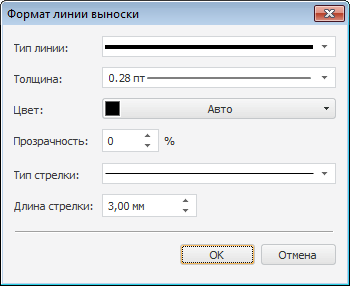

# Настройка формата линии выноски/указателя

Настройка формата линии выноски/указателя
-

# Настройка формата линии выноски/указателя

Для настройки [формата линии](UiDiagrams__DataTitle.htm#tip_type),
 соединяющей ряд с подписью данных, используйте окно «Формат линии выноски»:

Для настройки формата линии выноски/указателя выполните последовательность
 действий:

	- В раскрывающемся списке «Тип линии»
 выберите тип линии.

	- В раскрывающемся списке «Толщина линии»
 выберите необходимую толщину линии. При выборе пункта «Пользовательский»
 будет открыто окно «Толщина линии»,
 в котором можно с помощью редактора чисел или вручную задать требуемую
 толщину линий.

Примечание.
 Доступен ввод значения [в разных единицах измерения](UiNav.Chm::/GUI/format/different_units.htm), однако значение в строке
 ввода будет всегда отображаться в единицах point (1/72 дюйма).

	- В раскрывающейся палитре выберите цвет линии либо выберите новый цвет в
 расширенной палитре цветов, вызываемой при нажатии на кнопку «Другой».

	- При необходимости [настройте
	 прозрачность](../Tuning_format/UiDiagrams_tuning_border_and_filling.htm#transparency) линии выноски/указателя.

	- В списке «Тип стрелки»
	 выберите внешний вид окончания линии.

	- В редакторе чисел «Длина стрелки»
	 задайте длину стрелки в пикселях.

См. также:

[Подписи
 данных](../Property_diagramm/UiDiagrams_PropertyDiagramm_Label.htm) | [Настройка общих параметров
 диаграммы](UiDiagrams_params_diagram.htm) | [Настройка компонентов
 диаграммы](../UiDiagrams_basic_concept.htm)

		Справочная
		 система на версию 10.9
		 от 18/08/2025,
		 © ООО «ФОРСАЙТ»,
