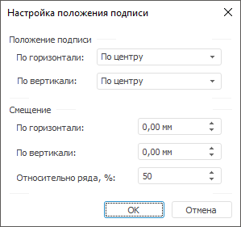
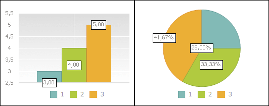

# Настройка положения подписи

Настройка положения подписи
-

# Настройка положения подписи

Для настройки положения [подписи](UiDiagrams__DataTitle.htm)
 используйте окно «Настройка
 положения подписи»:

Для настройки положения подписей выполните следующие шаги:

	- В группе «Положение подписи»
	 в раскрывающихся списках «По горизонтали»
	 и «По вертикали» выберите
	 необходимые варианты расположения подписи.

	- В группе «Смещение»
	 с помощью клавиатуры или редакторов чисел задайте длину смещения подписи
	 относительно ряда по горизонтали, по вертикали и процент смещения
	 подписи относительно длины столбика.

Для круговой диаграммы настройка смещения
 «По горизонтали» отвечает за смещение
 подписи от/к центру диаграммы, а настройка смещения «По
 вертикали» за поворот положения подписи по/против часовой стрелки.
 Смещение подписи происходит от соответствующего края маркера (слева или
 справа, сверху или снизу).

Для круговой диаграммы настройка смещения
 «Относительно ряда, %» отвечает
 за смещение подписи относительно сектора.

Настройка «Относительно
 ряда, %» применяется только для рядов, представленных в виде столбиков
 или секторов. По умолчанию данный параметр равен 50%. Максимальное значение
 для данного параметра 100%, что соответствует краю столбика или сектора.
 При задании 0% подпись будет размещена у основания столбика/сектора, при
 100% - у края столбика/сектора.

Примечание.
 Доступен ввод значения [в
 разных единицах измерения](UiNav.Chm::/GUI/format/different_units.htm). В поле ввода редактора отображаются значения
 в единицах измерения, соответствующих текущим региональным настройкам
 операционной системы.

На приведенном примере для рядов диаграмм задан разный процент смещения:
 первый ряд - 0%; второй ряд - 50%; третий ряд - 100%.

См. также:

[Подписи
 данных](../Property_diagramm/UiDiagrams_PropertyDiagramm_Label.htm) | [Настройка общих параметров
 диаграммы](UiDiagrams_params_diagram.htm) | [Настройка компонентов
 диаграммы](../UiDiagrams_basic_concept.htm)

		Справочная
		 система на версию 10.9
		 от 18/08/2025,
		 © ООО «ФОРСАЙТ»,
