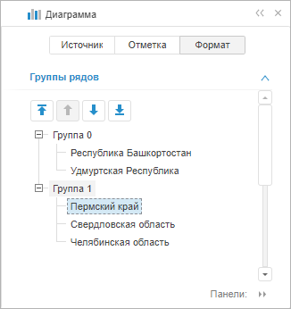
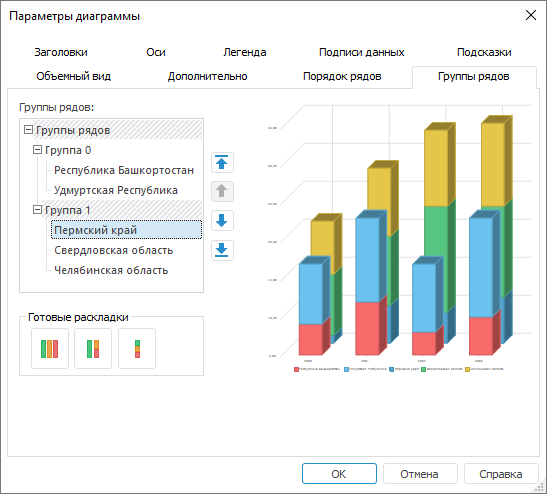
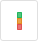

# Настройка группы рядов

Настройка группы рядов
-

# Настройка группы рядов

Для настройки группы рядов:

	- в [экспресс-отчётах](uiexpress.chm::/purpose/UiExpress_Purpose.htm)
	 и [аналитических панелях](uiadhoc.chm::/UiAdhoc_Purpose.htm)
	 в веб-приложении используйте группу параметров «Группы
	 рядов» на вкладке «Формат»
	 боковой панели:

	- в настольном приложении перейдите на вкладку «Группы
	 рядов» окна «[Параметры
	 диаграммы](UiDiagrams_params_diagram.htm)». Настройка доступна только для рядов [гистограммы
	 с группировкой и объемной гистограммы с группировкой](../Type_diagrams/ChangingChartType.htm).

[Для
 вызова окна «Параметры диаграммы»](javascript:TextPopup(this))

	Выполните команду «Параметры
	 диаграммы» в контекстном меню [выделенной
	 диаграммы](../UiDiagrams_basic_concept.htm#select_component).

	Примечание.
	 В инструменте «Аналитические панели»
	 выполните команду «Диаграмма >
	 Параметры диаграммы» в контекстном меню диаграммы.

Задайте следующие настройки группировки рядов:

[Распределение
 рядов по группам](javascript:TextPopup(this))

	В поле «Группы рядов» распределите
	 ряды данных по группам одним из способов:

		- перетащите выбранный компонент в необходимую позицию, используя
		 механизм Drag&Drop. Доступно только в настольном приложении;

		- используйте кнопки:

		-

			-  «Переместить
			 в предыдущую группу». Перемещает выделенный ряд в предыдущую
			 группу, при этом ставя его в конец списка рядов группы. Кнопка
			 недоступна, если ряд находится в первой группе с наименованием
			 «Группа 0»;

			-  «Переместить
			 в следующую группу». Перемещает выделенный ряд в следующую
			 группу, при этом ставя его в начало списка рядов группы. Если
			 ряд находится в последней группе, то при нажатии кнопки создастся
			 новая группа с наименованием «Группа N», где N - порядковый
			 номер группы, начиная с нуля, и ряд переместится в эту группу.
			 Кнопка недоступна, если ряд находится в последней группе и
			 является единственным рядом этой группы;

			-  «Переместить
			 выше». Перемещает выделенный ряд на одну позицию выше
			 в рамках группы. Кнопка недоступна, если ряд находится выше
			 всех остальных рядов в группе;

			-  «Переместить
			 ниже». Перемещает выделенный ряд на одну позицию ниже
			 в рамках группы. Кнопка недоступна, если ряд находится ниже
			 всех остальных рядов в группе.

	При перемещении ряда на один уровень с элементом «Группы
	 рядов» будет создана новая группа, в нее будет помещен данный
	 ряд.

[Использование
 шаблонов распределения рядов](javascript:TextPopup(this))

	Для выбора готового шаблона распределения рядов данных в настольном
	 приложении выберите одну из стандартных раскладок в группе кнопок
	 «Готовые раскладки»:

		-  «Расположить
		 ряды отдельно». Все ряды будут расположены отдельно;

		-  «Расположить
		 первый ряд отдельно». Первый ряд будет расположен отдельно,
		 а остальные - в одну группу;

		-  «Расположить
		 ряды вместе». Все ряды будут расположены в одной группе.

См. также:

[Ряд данных](../Series.htm) | [Настройка параметров диаграммы](UiDiagrams_params_diagram.htm) |
 [Настройка
 компонентов диаграммы](../UiDiagrams_basic_concept.htm)

		Справочная
		 система на версию 10.9
		 от 18/08/2025,
		 © ООО «ФОРСАЙТ»,
