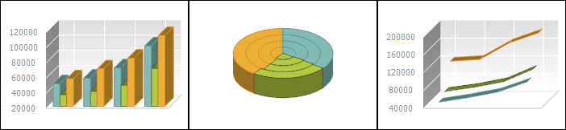
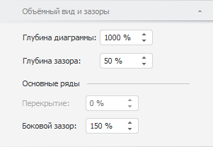
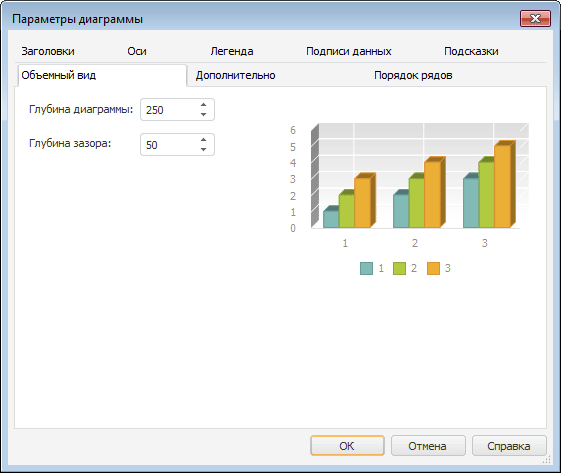
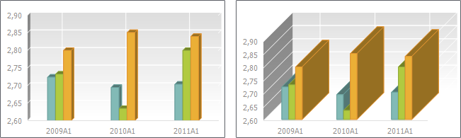
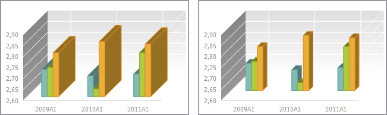

# Настройка объёмного вида диаграммы

Настройка объёмного вида диаграммы
-

# Настройка объёмного вида диаграммы

Для отображения диаграммы в объёмном виде установите флажок «Объёмный
 вид» на вкладке «[Диаграмма](UiDiagrams_params_diagram.htm)»
 боковой панели.

Примечание.
 Настройка объёмного вида доступна только для [гистограммы](../Type_diagrams/UiDiagrams_Bar.htm),
 [объёмной гистограммы
 с группами](../Type_diagrams/3DHistogram_with_Groups.htm), [линейной
 диаграммы](../Type_diagrams/UiDiagrams_lenear.htm), [диаграммы
 с областями](../Type_diagrams/UiDiagrams_Area.htm), [смешанной
 диаграммы](../Type_diagrams/UiDiagrams_mixed_diagram.htm) и [круговой
 диаграммы](../Type_diagrams/UiDiagrams_round.htm).

Пример отображения объёмных диаграмм:

Для настройки объёмного вида предусмотрены следующие подходы:

	- [Быстрая
	 настройка](Setup_3DView.htm#fast). Используйте вкладку «Объёмный
	 вид и зазоры» на боковой панели;

	- [Расширенная
	 настройка](Setup_3DView.htm#adv). Используйте вкладку «Объёмный
	 вид» в диалоге «Параметры
	 диаграммы».

Внешний вид диаграмм с различными настройками объёма приведен в разделе
 «[Примеры различных настроек объёмного
 вида диаграммы](Setup_3DView.htm#example)».

## Быстрая настройка объёмного вида диаграммы

Для настройки объёмного вида диаграммы используйте вкладку «Объёмный
 вид и зазоры» на боковой панели.

Примечание.
 Вкладка «Объёмный вид и зазоры»
 доступна только для объёмных [гистограмм](../Type_diagrams/UiDiagrams_Bar.htm),
 [объёмных гистограмм
 с группами](../Type_diagrams/3DHistogram_with_Groups.htm), объёмных [линейных](../Type_diagrams/UiDiagrams_lenear.htm)
 и [смешанных](../Type_diagrams/UiDiagrams_mixed_diagram.htm)
 диаграмм.

[Для отображения
 вкладки](javascript:TextPopup(this))

		- Убедитесь, что боковая панель [отображается](GetStarted.chm::/Interface/Interface_Description.htm#side_panel).

		- В рабочей области выделите диаграмму, отображаемую в объёмном
		 виде.

		- Установите на боковой панели переключатель «Формат»
		 и перейдите на вкладку «Объёмный
		 вид и зазоры».

Задайте следующие параметры:

	- Глубина диаграммы. Определяет
	 размер диаграммы в глубину. Диапазон допустимых значений: [20, 2000];

	- Глубина зазора. Определяет
	 расстояние от переднего и заднего краёв диаграммы до рядов. Диапазон
	 допустимых значений: [0, 500].

## Расширенная настройка объёмного вида диаграммы

Расширенная настройка позволяет задать параметры объёмного вида для
 большего числа типов диаграмм.

Для расширенной настройки параметров объёмного вида диаграммы перейдите
 на вкладку «Объёмный вид» в
 диалоге «Параметры диаграммы».
 Вкладка отображается, если включено отображение диаграммы в объёмном виде.

Примечание.
 Настройка объёмного вида диаграммы с помощью окна «Параметры
 диаграммы» доступна только в настольном приложении для [гистограммы](../Type_diagrams/UiDiagrams_Bar.htm),
 [объёмной гистограммы
 с группами](../Type_diagrams/3DHistogram_with_Groups.htm), [линейной
 диаграммы](../Type_diagrams/UiDiagrams_lenear.htm), [диаграммы
 с областями](../Type_diagrams/UiDiagrams_Area.htm), [смешанной
 диаграммы](../Type_diagrams/UiDiagrams_mixed_diagram.htm) и [круговой
 диаграммы](../Type_diagrams/UiDiagrams_round.htm).

[Для
 вызова окна «Параметры диаграммы»](javascript:TextPopup(this))

	Выполните команду «Параметры
	 диаграммы» в контекстном меню [выделенной
	 диаграммы](../UiDiagrams_basic_concept.htm#select_component).

	Примечание.
	 В инструменте «Аналитические панели»
	 выполните команду «Диаграмма >
	 Параметры диаграммы» в контекстном меню диаграммы.

Задайте следующие параметры:

	- Глубина диаграммы. Определяет
	 размер диаграммы в глубину. Диапазон допустимых значений: [20, 2000];

	- Глубина зазора. Определяет
	 расстояние от переднего и заднего краёв диаграммы до рядов. Диапазон
	 допустимых значений: [0, 500].

## Примеры различных настроек объёмного вида диаграммы

Пример гистограммы с глубиной диаграммы 100 (слева) и 1000 (справа):

Пример гистограммы с глубиной зазора 10 (слева) и 500 (справа):

См. также:

[Настройка
 объёмного вида и зазоров](../Property_diagramm/UiDiagrams_PropertyDiagramm_Volume.htm) | [Типы диаграмм](../Type_diagrams/UiDiagrams_Type_diagrams.htm)
 | [Настройка общих параметров диаграммы](UiDiagrams_params_diagram.htm)

		Справочная
		 система на версию 10.9
		 от 18/08/2025,
		 © ООО «ФОРСАЙТ»,
