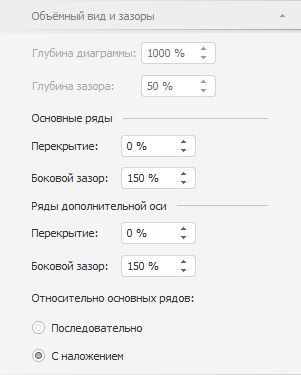
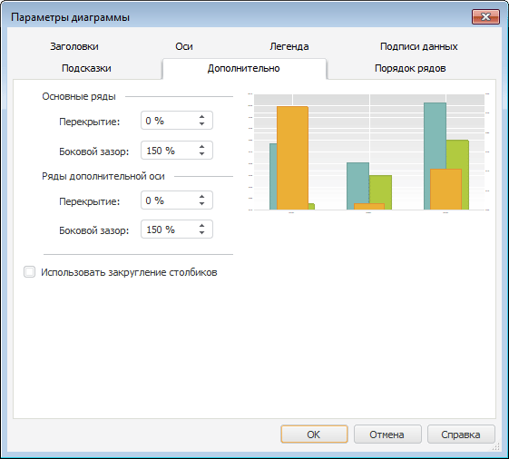
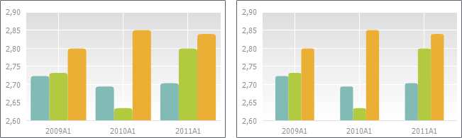
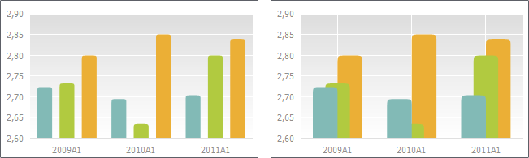
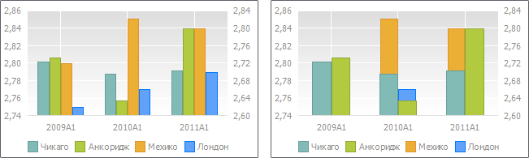
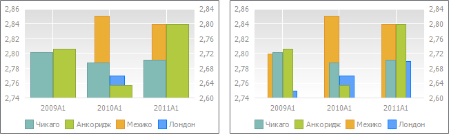

# Настройка зазоров между рядами

Настройка зазоров между рядами
-

# Настройка зазоров между рядами

Настройка зазоров помогает отрегулировать расстояние между рядами и
 их положение относительно друг друга на диаграмме.

Примечание.
 Настройка зазоров между рядами доступна только для [гистограммы](../Type_diagrams/UiDiagrams_Bar.htm),
 [объёмной гистограммы
 с группами](../Type_diagrams/3DHistogram_with_Groups.htm), [каскадной
 диаграммы](../Type_diagrams/WaterFall_chart.htm) и [смешанной
 диаграммы](../Type_diagrams/UiDiagrams_mixed_diagram.htm), содержащей ряды типа «Столбик».

Для настройки зазоров между рядами предусмотрены следующие подходы:

	- [Быстрая настройка](Setup_Gaps.htm#fast). Используйте вкладку
	 «Объёмный вид и зазоры» на
	 боковой панели;

	- [Расширенная
	 настройка](Setup_Gaps.htm#adv). Используйте вкладку «Дополнительно»
	 в диалоге «Параметры диаграммы».

Внешний вид диаграмм с различными настройками зазоров между рядами приведен
 в разделе «[Примеры различных настроек
 зазоров между рядами](Setup_Gaps.htm#example)».

## Быстрая настройка зазоров между рядами

Для быстрой настройки зазоров между рядами используйте вкладку «Объёмный вид и зазоры» на боковой
 панели.

[Для отображения
 вкладки](javascript:TextPopup(this))

		- Убедитесь, что боковая панель [отображается](GetStarted.chm::/Interface/Interface_Description.htm#side_panel).

		- В рабочей области выделите гистограмму.

		- Установите на боковой панели переключатель «Формат»
		 и перейдите на вкладку «Объемный
		 вид и зазоры».

Настройки разделены на следующие группы «Основные
 ряды», «Ряды по дополнительной
 оси» и предназначены для настройки основных рядов и рядов по дополнительной
 оси соответственно.

Примечание.
 Группа настроек «Ряды по дополнительной
 оси» отображается, если в диаграмме присутствуют ряды, построенные
 по дополнительной оси. Для построения рядов по дополнительной оси используйте
 вкладку «[Ряды
 данных](../Series.htm#secondary_axis)» на боковой панели.

Задайте следующие параметры:

[Величину перекрытия
 рядов](javascript:TextPopup(this))

	Перекрытие определяет положение рядов относительно друг друга. Для
	 задания величины перекрытия используйте параметр «Перекрытие».

	Если значение положительное, то ряды накладываются друг на друга,
	 если отрицательное - между рядами будет зазор. Диапазон допустимых
	 значений: [-100; 100].

	Примечание.
	 Настройка перекрытия доступна, если диаграмма отображается в плоском
	 виде.

[Размер бокового
 зазора между рядами](javascript:TextPopup(this))

	Боковой зазор определяет расстояние между рядами в соседних точках
	 диаграммы.

	Для задания размера бокового зазора используйте параметр «Боковой зазор».

	Диапазон допустимых значений: [0, 500].

[Положение рядов
 по дополнительной оси относительно основных рядов](javascript:TextPopup(this))

	В настольном приложении для рядов дополнительной оси дополнительно
	 доступна настройка их положения относительно основных рядов. Выберите
	 вариант положения рядов дополнительной оси в группе «Относительно
	 основных рядов»:

		- Последовательно.
		 Основные ряды и ряды дополнительно оси располагаются последовательно;

		- С наложением. Ряды
		 дополнительной оси будут накладываться на основные ряды.

Примечание.
 Настройки перекрытия и бокового зазора для рядов по дополнительной оси
 применяются, если ряды расположены с наложением на основные ряды.

## Расширенная настройка зазоров между рядами

Для расширенной настройки зазоров между рядами используйте вкладку «Дополнительно» в диалоге «Параметры диаграммы».

[Для
 вызова окна «Параметры диаграммы»](javascript:TextPopup(this))

	Выполните команду «Параметры
	 диаграммы» в контекстном меню [выделенной
	 диаграммы](../UiDiagrams_basic_concept.htm#select_component).

	Примечание.
	 В инструменте «Аналитические панели»
	 выполните команду «Диаграмма >
	 Параметры диаграммы» в контекстном меню диаграммы.

Настройки разделены на следующие группы «Основные
 ряды», «Ряды по дополнительной
 оси» и предназначены для настройки основных рядов и рядов по дополнительной
 оси соответственно.

Задайте следующие параметры:

	- величину перекрытия рядов;

	- размер бокового зазора между рядами;

Примечание.
 Настройка величины перекрытия рядов и размера бокового зазора между рядами
 выполняется аналогично настройке данных параметров с помощью вкладки «[Объёмный вид
 и зазоры](Setup_Gaps.htm#fast)» на боковой панели.

	- использование закругленных столбиков.
	 Для отображения рядов диаграммы в виде закругленных столбиков установите
	 флажок «Использовать закругление
	 столбиков».

Примечание.
 Флажок недоступен, если диаграмма отображается в объёмном виде.

## Примеры различных настроек зазоров между рядами

Пример гистограммы с боковым зазором для основных рядов 50 (слева) и
 200 (справа):

Пример гистограммы с перекрытием для основных рядов -50 (слева) и 50
 (справа):

Пример гистограммы последовательным расположением основных рядов и рядов
 дополнительной оси (слева) и с наложением рядов дополнительной оси на
 основные ряды (справа). Ряды «Мехико»
 и «Лондон» основные ряды, а «Чикаго» и «Анкоридж»
 ряды дополнительной оси:

Пример гистограммы с боковым зазором для рядов дополнительной оси 50
 (слева) и 350 (справа). Ряды «Мехико»
 и «Лондон» основные ряды, а «Чикаго» и «Анкоридж»
 ряды дополнительной оси:

Пример гистограммы с перекрытием для рядов дополнительной оси -70 (слева)
 и 70 (справа). Ряды «Мехико»
 и «Лондон» основные ряды, а «Чикаго» и «Анкоридж»
 ряды дополнительной оси:

См. также:

[Настройка
 объёмного вида и зазоров](../Property_diagramm/UiDiagrams_PropertyDiagramm_Volume.htm) | [Типы диаграмм](../Type_diagrams/UiDiagrams_Type_diagrams.htm)
 | [Настройка общих параметров диаграммы](UiDiagrams_params_diagram.htm)

		Справочная
		 система на версию 10.9
		 от 18/08/2025,
		 © ООО «ФОРСАЙТ»,
